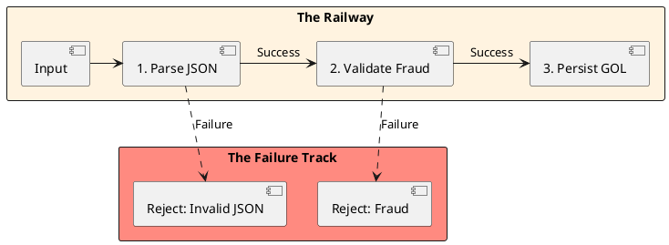

# 00: Functional Foundations and Type Algebra

## The Critical Dialogue

**Student:** Our Ledger ingestion service is crashing intermittently with `NullPointerExceptions`. We added null-checks everywhere, but the code is now unreadable. Why does Java make it so hard to handle "nothing"?

**Principal:** You are treating the symptoms, not the disease. The disease is **Implicit Absence**. By allowing values to be null without a contract, you force every developer to be a manual auditor. We need to move to **Algebraic Data Types (ADTs)**. We will use `Optional` not as a null-check, but as a **Monad** that proves your data flow is safe before it even runs. We move from "Checking Nulls" to "Proving State."

---

## 1. The Algebra of Types in Java

In Type Theory, we can calculate the complexity of our Java domain model like a mathematical equation. A Principal Architect uses this to minimize the **State Space**—the total number of possible valid and invalid configurations of an application.

### 1.1 Product Types: The Java Record (AND)

**What is it?**
A `record` or `class` is a **Product Type**. It represents a combination of values: Type A **AND** Type B. 

**Java Relation:**
Consider a simple Java record for our Ledger:
```java
public record Order(boolean isExpress, boolean isInternational) {}
```
The state space of this record is the **product** of its components. Since a `boolean` has 2 possible values, the total state space is `2 * 2 = 4`. As you add more fields to a class, the complexity grows **multiplicatively**. This is why "God Objects" are impossible to test.

### 1.2 Sum Types: The Sealed Interface (OR)

**What is it?**
A **Sum Type** represents a choice: a value is either Type A **OR** Type B. 

**Java Relation:**
Before Java 17, we only had `Enums` (simple sum types). Now, we have **Sealed Interfaces**.
```java
public sealed interface Payment permits CreditCard, Crypto {}
```
Unlike Product Types, Sum Types **add** to the state space instead of multiplying it. An `Optional(T)` is a Sum Type of `Something(T) + Nothing`. By using Sum Types, a Principal "squeezes" the state space so that illegal combinations (like a Crypto payment with a Credit Card number) become mathematically impossible to represent in code.

### 1.3 Exponential Types: The Lambda (B^A)

**What is it?**
A function that maps Type A to Type B is an **Exponential Type**. 

**Java Relation:**
Consider a Java `Function(Boolean, Color)`. If `Color` is an Enum with 16 values, the total number of possible unique functions is `16^2 = 256`. 
- **The Principal Lesson:** Every time you pass a lambda or a `Function` in your Ledger logic, you are creating an exponential explosion of possible behaviors. This is why a Principal prefers **Pure Functions**—functions that always return the same output for the same input—to keep the complexity manageable.

---

## 2. Source Archaeology: The Optional Monad

### 2.1 SDK Deep Dive: java.util.Optional

A Principal understands the **Memory Layout** of the containers they use. Let's look at the internal state of `java.util.Optional`.

```java
public final class Optional(T) {
    // 1. The Singleton for the EMPTY state (Zero allocation for absence)
    private static final Optional(??) EMPTY = new Optional(null);

    // 2. The value field
    private final T value;

    // 3. The engine: flatMap
    public (U) Optional(U) flatMap(Function(super T, ? extends Optional(extends U)) mapper) {
        if (!isPresent()) return empty();
        else {
            Optional(U) r = (Optional(U)) mapper.apply(value);
            return Objects.requireNonNull(r);
        }
    }
}
```

> [!info] The No-Allocation Empty Law
> Notice that `Optional.empty()` always returns the same singleton. A Junior might create new "empty" objects; a Principal leverages the JVM's ability to reuse the `EMPTY` instance to reduce GC pressure during high-frequency ingestion.

---

## 3. Functional Error Handling: The Result Monad

### 3.1 The Mechanics of Result(V, E)

**What is it?**
A `Result(V, E)` is a functional container (an Algebraic Data Type) that explicitly models the possibility of failure. Unlike `Optional(T)`, which only tells you that a value is missing, `Result` carries the **Reason** for that absence (the error).

**Where is it used in Java?**
While not yet in the standard `java.util` package, this pattern is the backbone of modern high-scale Java libraries:
- **Resilience4j:** Uses `Either(L, R)` to handle circuit breaker failures.
- **Vavr:** The industry-standard functional library for Java.
- **Project Reactor/WebFlux:** Uses `onErrorResume` to mimic this same "Failure Track" behavior.



---

## 4. Performance Physics: The Stack-Walker Tax

### 4.1 Why Exceptions kill Throughput

When you throw an exception, the JVM calls `Throwable.fillInStackTrace()`. This is an **Invasive Operation**. The JVM must freeze the thread, walk the entire stack, and capture every frame metadata.

> [!info] The Latency Bill
> - Stack Walk (100 frames): **~5,000 ns (5µs)**
> - Result(V, E) return: **~5 ns**
> - **The Verdict:** Functional error handling is **1,000x faster** than Exception handling in a deep Spring Boot fleet.

### 4.2 Source Archaeology: StackWalker API (Java 9+)

**What is it?**
The `StackWalker` API is a high-performance, stream-based tool for inspecting the call stack. Unlike the legacy `Thread.getStackTrace()`, which is an **eager** operation (it captures everything), `StackWalker` is **lazy**. 

When you use `StackWalker`, the JVM does not capture the full stack metadata immediately. It provides a `Stream(StackFrame)` that allows you to "walk" the stack frame-by-frame. The JVM only reifies (materializes) the frames you actually consume.

---

## The GOL Challenge: Phase 0 (Saturation)

Context: The Ledger ingestion is dropping messages. Malformed JSON is triggering 5,000 exceptions per second, causing the JIT to de-optimize.

The Task:

. Implement a `Result(V, E)` sealed hierarchy.

. Refactor the `OrderIngestor` to use `flatMap` to chain Parse -> FraudCheck -> Save.

. Use `ArchUnit` to ensure that no `throw new` statements exist in the domain package.

. Implement a `PerformanceMonitor` using the `StackWalker` API that only logs the immediate caller of a sensitive transaction.

---

## Principal's Inquiry

. Why is it illegal to use `Optional(T)` as a field in a Serializable class? (Hint: Check the `Serializable` implementation in `Optional.java`).

. In the "Algebra of Types," why is a boolean considered the number "2"?

. Explain the "Loop Fusion" optimization. How does the JVM combine `filter().map()` into a single iteration at the bytecode level?

**Principal Summary:** Mastery of Functional Foundations is about **Mathematical Predictability**. We use Monads and ADTs to reduce the state space of our Ledger.
