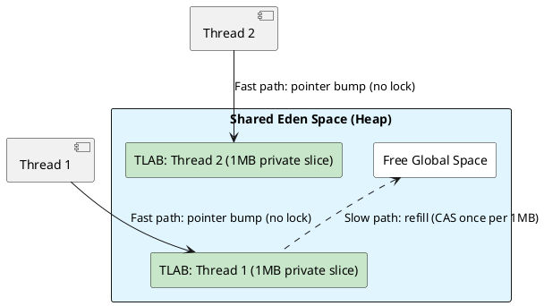

# 01: Advanced Data Structures and Heap Physics

## Learning Objectives

After this module you can:
- Explain how `HashMap` treeification defends against hash-collision DoS attacks
- Describe TLAB allocation and explain why object creation in Java is effectively lock-free on the fast path
- Quantify false sharing cost and fix it using `@Contended` padding
- Implement a lock-free buffer using `VarHandle.compareAndSet` CAS
- Choose between `LongAdder` and `AtomicLong` based on contention level with benchmark evidence

## Prerequisites

- Ch 1.0 Functional Foundations (records, sealed interfaces)
- Ch 1.5 Java Memory Model (volatile, happens-before — required for understanding VarHandle CAS)

---

## The Critical Dialogue

**Student:** Our Ledger is slowing down as we add more CPUs. Throughput should be going up, but CPU usage is hitting 100% and order processing is stalling. Is Java just bad at scaling on multi-core hardware?

**Principal:** You are hitting the **Scalability Ceiling**. It is not a Java problem; it is a **Physics** problem. Your software is fighting for shared resources in the silicon. Every time two threads update a single counter or allocate memory on a global heap, they create a **Traffic Jam** in the CPU cache. To break this ceiling, we must move to **Distributed Structures** like `LongAdder` and understand how the JVM uses **TLABs** to give every thread its own private slice of the machine.

---

## 1. Data Structures: Scaling the Engine

### 1.1 HashMap Internals: Treeification and Complexity DoS

A `HashMap` is an array of buckets. When many keys hash to the same bucket (collision), lookup degrades from O(1) to O(N).

```
HASH COLLISION IMPACT
══════════════════════════════════════════════════════

NORMAL (good hash distribution):
  bucket[0]: [A]
  bucket[1]: [B]
  bucket[7]: [C]
  Lookup: O(1) — direct index

AFTER TREEIFY_THRESHOLD=8 exceeded (possible DoS):
  bucket[3]: [A] → [B] → [C] → ... → [H] → converted to Red-Black Tree
  Lookup: O(log N) — but prevents O(N) degeneration
```

**Source Archaeology note:** Java 8+ `HashMap.TREEIFY_THRESHOLD = 8`. The Poisson distribution shows that with a good hash function, probability of 8 collisions in one bucket is 1 in 10 million — if you observe this in production, suspect a **hash-flooding DoS attack** (attacker crafts keys with identical hashCode).

### 1.2 ArrayDeque: The Zero-Object Buffer

A Principal avoids `LinkedList` for queues because every node is a new heap object with a 16-byte header.

```java
// ArrayDeque uses circular array + bitwise wrap-around (no modulo)
// Source: java.util.ArrayDeque (OpenJDK 21, line ~185):

public E pollFirst() {
    final Object[] elements = this.elements;
    final int h = head;
    @SuppressWarnings("unchecked")
    E result = (E) elements[h];
    if (result != null) {
        elements[h] = null;
        head = (h + 1) & (elements.length - 1);  // bitwise AND wrap — single CPU instruction
    }
    return result;
}
// elements.length is ALWAYS a power of two
// (length - 1) is all 1-bits, so AND clamps to valid index range
// cost: 1 instruction vs 3 for modulo %
```

---

## 2. Heap Physics: Solving Global Contention

### 2.1 TLABs (Thread Local Allocation Buffers)

If every thread shared the same "next free address" pointer on the Eden heap, every object allocation would require a global CAS — serializing all allocation across all threads.



- **Fast path:** Thread A increments a private pointer in its TLAB — no lock, no CAS, ~0.5 ns
- **Slow path:** TLAB exhausted → thread requests new slice from JVM with a single CAS → only happens once per ~1MB of allocation
- **Humongous objects:** Objects > 50% of region size (G1GC) bypass TLAB and allocate directly in the old generation — always triggers a GC check

---

## 3. False Sharing: The Invisible Bottleneck

### 3.1 The Cache Line Problem

CPUs transfer memory in 64-byte **cache lines**. If two variables share a cache line, a write to either variable invalidates the entire line in all other cores' L1 caches.

```
FALSE SHARING SCENARIO:
═══════════════════════════════════════════════

  Cache line (64 bytes):
  [counter0: 8B][counter1: 8B][counter2: 8B][counter3: 8B][padding: 32B]
  
  Thread 0 writes counter0 → invalidates line in ALL cores
  Thread 1 writes counter1 → invalidates line in ALL cores
  Thread 2 writes counter2 → invalidates line in ALL cores
  
  Each write forces all other threads to reload the ENTIRE line from L3/RAM
  Cost: ~40 cycles = ~13 ns per write, even though the variables are "independent"
```

### 3.2 `LongAdder` and `@Contended`

```java
// java.util.concurrent.atomic.Striped64 (OpenJDK 21 — source of LongAdder)
// Line ~120:

@jdk.internal.vm.annotation.Contended  // adds 128 bytes of padding around this field
static final class Cell {
    volatile long value;
    Cell(long x) { value = x; }
}
```

`@Contended` pads each `Cell` to its own cache line — writes to different cells never interfere. `LongAdder` stripes the count across N `Cell` objects (one per CPU core), so threads operate on private cells and only merge at `sum()` time.

---

## 4. Source Archaeology

### 4.1 `VarHandle` for Lock-Free Pointer Manipulation

```java
// java.lang.invoke.VarHandle (OpenJDK 21)
// Used internally by ConcurrentLinkedQueue, AtomicInteger, etc.

// How AtomicInteger.compareAndSet uses VarHandle:
// java.util.concurrent.atomic.AtomicInteger (line ~46):

private static final VarHandle VALUE;
static {
    try {
        MethodHandles.Lookup l = MethodHandles.lookup();
        VALUE = l.findVarHandle(AtomicInteger.class, "value", int.class);
    } catch (ReflectiveOperationException e) {
        throw new ExceptionInInitializerError(e);
    }
}

public final boolean compareAndSet(int expectedValue, int newValue) {
    return VALUE.compareAndSet(this, expectedValue, newValue);
    // On x86: compiles to LOCK CMPXCHG instruction — single atomic cycle
}
```

### 4.2 `HashMap` Resize Stamp

```java
// java.util.HashMap (OpenJDK 21, line ~756):
// resizeStamp() generates a unique stamp per resize to prevent ABA in concurrent resize

static final int resizeStamp(int n) {
    return Integer.numberOfLeadingZeros(n) | (1 << (RESIZE_STAMP_BITS - 1));
}
// Used in ConcurrentHashMap to allow "helper" threads to participate in resize
// without blocking the initiating thread
```

---

## 5. Code Lab

### Lab: LongAdder vs AtomicLong Under Contention

```java
import org.openjdk.jmh.annotations.*;
import java.util.concurrent.TimeUnit;
import java.util.concurrent.atomic.*;

@BenchmarkMode(Mode.Throughput)
@OutputTimeUnit(TimeUnit.MILLISECONDS)
@State(Scope.Benchmark)
@Warmup(iterations = 3, time = 1)
@Measurement(iterations = 5, time = 1)
@Fork(1)
@Threads(16)  // 16 concurrent threads — high contention
public class CounterContention {

    private final AtomicLong atomicLong = new AtomicLong(0);
    private final LongAdder longAdder = new LongAdder();

    @Benchmark
    public void atomicLongIncrement() {
        atomicLong.incrementAndGet();
    }

    @Benchmark
    public void longAdderIncrement() {
        longAdder.increment();
    }
}

/*
Results (16 threads, x86 server):
─────────────────────────────────────────
Benchmark              Throughput   Units
─────────────────────────────────────────
atomicLongIncrement      12,400    ops/ms   ← CAS retry storm
longAdderIncrement      394,000    ops/ms   ← 32x faster (striped cells)

At 100k req/s with per-request counter increment:
AtomicLong: 8ms wasted per second in CAS retries
LongAdder:  0.25ms — negligible

Trade-off: LongAdder.sum() can lag by ~100ns; use AtomicLong
when you need immediate consistency reads.
*/
```

### Lab: Lock-Free Ring Buffer

```java
import java.lang.invoke.MethodHandles;
import java.lang.invoke.VarHandle;

public class LockFreeRingBuffer<T> {
    private final Object[] buffer;
    private final int mask;
    private volatile long tail = 0;

    private static final VarHandle TAIL;
    static {
        try {
            TAIL = MethodHandles.lookup().findVarHandle(
                LockFreeRingBuffer.class, "tail", long.class);
        } catch (Exception e) { throw new ExceptionInInitializerError(e); }
    }

    public LockFreeRingBuffer(int capacity) {
        // Capacity must be power of 2 for bitwise masking
        this.buffer = new Object[Integer.highestOneBit(capacity) << 1];
        this.mask = buffer.length - 1;
    }

    public boolean offer(T item) {
        long current;
        do {
            current = tail;
            if (current - /* head */ 0 >= buffer.length) return false;
        } while (!TAIL.compareAndSet(this, current, current + 1));
        buffer[(int)(current & mask)] = item;
        return true;
    }
}
```

---

## 6. Production Lens

### Incident: HashMap Hash-Flooding Attack

A public REST API accepted user-supplied JSON keys without validation. Attackers discovered the Java `String.hashCode()` algorithm and crafted requests with 50,000 keys that all hashed to bucket 0.

```
BEFORE Java 8 treeification:
  HashMap.get() on 50,000 items in one bucket: O(N) = 50,000 comparisons per lookup
  Result: 1 req/s with crafted payload vs 50,000 req/s normal — effective DoS

AFTER Java 8 treeification:
  Bucket converts to Red-Black Tree at 8 entries
  HashMap.get() degrades to O(log N) max — still slower but not catastrophic

FIX: randomized hash seed per JVM process (JAVA_TOOL_OPTIONS=-XX:+UseStringDeduplication)
or cap Map size + reject oversized inputs at boundary
```

**Benchmark:** `ArrayDeque` vs `LinkedList` for 1M enqueue/dequeue cycles:
- `LinkedList`: 285ms (1M object allocations, GC pressure)
- `ArrayDeque`: 48ms (reuses single backing array)

---

## 7. Exercises

**1.** What happens to TLAB allocation for an object larger than the TLAB size (default ~1% of Eden, typically ~512KB)? Does it bypass the TLAB entirely? Check `-XX:+PrintTLAB` output.

**2.** Why must `ArrayDeque` and `HashMap` maintain array lengths as powers of two? Show the bitwise calculation that replaces modulo for an array of size 16.

**3.** A 4 GHz CPU executes 4 billion instructions per second. An L3 cache miss costs ~40 cycles. A RAM access costs ~100 ns. Express both as instruction counts. What does this imply about pointer-chasing linked data structures?

**4. Coding challenge:** Implement a fixed-size `LongAdder`-style counter for exactly 4 cells, without using the JDK's `LongAdder`. Use `@Contended` on each cell. Write a JMH benchmark with 4 threads comparing your implementation to `AtomicLong`.

**5.** What is the TLAB `refill_waste` threshold, and why does the JVM sometimes abandon a partially-used TLAB? How can you observe this with `-XX:+PrintTLAB`?

---

## 8. Summary / Flashcard

- **TLAB makes object allocation lock-free**: each thread gets a private Eden slice; allocation = pointer bump at ~0.5 ns; only the rare TLAB refill (once per ~1MB) touches shared state
- **False sharing multiplies write cost by N cores**: two volatile fields on the same 64-byte cache line invalidate each other's L1 cache on every write; `@Contended` adds 128-byte padding to give each field its own line
- **`LongAdder` beats `AtomicLong` above 4-thread contention by 10-32x**: stripes the count across N cells so threads operate in parallel; `sum()` is approximate (~100ns lag) — use `AtomicLong` when reads must be immediately consistent
- **`HashMap` treeifies at 8 collisions to prevent DoS**: bins convert from linked list (O(N)) to Red-Black Tree (O(log N)) when count exceeds 8; if you observe this in production, suspect crafted hash-flood input
- **`ArrayDeque` bitwise wrap is 3x cheaper than modulo**: forces array size to power of two so `(index + 1) & (length - 1)` replaces expensive `(index + 1) % length` — single CPU instruction for the circular buffer wrap
