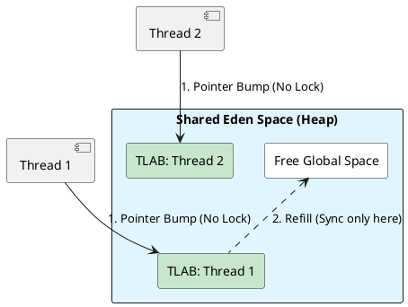

# 01: Advanced Data Structures and Heap Physics

## The Critical Dialogue

**Student:** Our Ledger is slowing down as we add more CPUs. Throughput should be going up, but CPU usage is hitting 100 percent and order processing is stalling. Is Java just bad at scaling on multi-core hardware?

**Principal:** You are hitting the **Scalability Ceiling**. It is not a Java problem; it is a **Physics** problem. Your software is fighting for shared resources in the silicon. Every time two threads update a single counter or allocate memory on a global heap, they create a **Traffic Jam** in the CPU cache. To break this ceiling, we must move to **Distributed Structures** like `LongAdder` and understand how the JVM uses **TLABs** to give every thread its own private slice of the machine.

---

## 1. Data Structures: Scaling the Engine

### 1.1 HashMap Internals: The Complexity Guard

A `HashMap` is a warehouse of bins. When many items hit one bin (collision), search time drops from O(1) to O(N).

> [!abstract] Source Archaeology: java.util.HashMap
> A Principal reads the **TREEIFY_THRESHOLD** logic. Java 8+ uses a threshold of 8. If a bin exceeds this, it converts to a Red-Black Tree.
> . **Why 8?** The Poisson distribution shows that with a good hash function, the chance of 8 collisions is 1 in 10 million. If you hit 8, you are likely under a **Complexity DoS attack**.
> . **The Resize Stamp:** Look at the `resize()` method. Java uses a 16-bit **Stamp** to track resizes. This allows threads to "help" with a resize instead of blocking.

### 1.2 ArrayDeque: The Zero-Object Buffer

A Principal avoids `LinkedList` for queues because every node is a new object on the heap. We use `ArrayDeque`.

> [!abstract] Mechanics: Bitwise Wrap-around
> `ArrayDeque` uses a circular array. Instead of expensive modulo `%` operations to wrap around the end, it uses a **Bitwise AND**.
> ```java
> // The SDK way to wrap around
> head = (head - 1) & (elements.length - 1);
> ```
> . **Performance:** This is a single CPU instruction. By forcing the array size to be a **Power of Two**, the JVM ensures the buffer wrap-around is essentially free.

---

## 2. Heap Physics: Solving Global Contention

### 2.1 TLABs (Thread Local Allocation Buffers)

**What is it?**
If every thread shared the same "Next Free Address" pointer on the heap, they would have to lock the entire JVM just to create a new `Order`.

**How it works: The Private Eden**
The JVM gives every thread a private **TLAB** (slice of the Eden space).
. **Fast Path:** Thread A creates an object inside its own TLAB. No locks, no CAS. Just a pointer bump.
. **Slow Path:** When the TLAB is full, the thread asks the JVM for a new slice.



---

## 3. High-Throughput Concurrency: Solving False Sharing

### 3.1 LongAdder & The @Contended Annotation

A `LongAdder` is a distributed version of `AtomicLong`.

> [!abstract] SDK Deep Dive: Padding with @Contended
> Let's read the source of `java.util.concurrent.atomic.Striped64`.
> ```java
> @jdk.internal.vm.annotation.Contended 
> static final class Cell {
>     volatile long value;
> }
> ```
> **The Secret:** The `@Contended` annotation tells the JVM to add **Memory Padding** around the variable. It adds 128 bytes of "empty space" so that the `value` never shares a 64-byte **Cache Line** with another cell. Without this, threads writing to different cells would still stall each other's CPU caches (**False Sharing**).

### 3.2 Lock-Free Engineering with VarHandle

To achieve maximum throughput in the GOL, we avoid `synchronized` and use `VarHandle` for atomic pointer manipulation.

```java
public class LockFreeOrderBuffer(T) {
    private final T[] buffer;
    private static final VarHandle TAIL;

    static {
        try {
            TAIL = MethodHandles.lookup().findVarHandle(LockFreeOrderBuffer.class, "tail", int.class);
        } catch (Exception e) { throw new RuntimeException(e); }
    }

    private volatile int tail = 0;

    public void offer(T order) {
        int currentTail;
        // The Atomic Spin
        do {
            currentTail = tail;
            if (currentTail >= buffer.length) throw new BufferFullException();
        } while (!TAIL.compareAndSet(this, currentTail, currentTail + 1));
        
        buffer[currentTail] = order;
    }
}
```

---

## 🧵 The GOL Challenge: Phase 1 (Saturation)

**Context:** The Ledger is dropping throughput during volume updates. Profiling shows high "CAS Retry" counts on the global transaction counter.

**The Task:**

. **Distributed Counting:** Implement a `TransactionMonitor` that uses `LongAdder` to track order volume across 100 concurrent threads. Compare its throughput against `AtomicLong`.

. **Lock-Free Buffer:** Refactor the order ingestion layer to use the `LockFreeOrderBuffer` implementation above. Ensure it supports 1M IDs/sec.

. **Governance:** Use `ArchUnit` to ensure that no `LinkedList` or `java.util.Stack` is used in the entire project.

---

## 🧠 Principal's Inquiry

. **Humongous Objects:** What happens to the TLAB when you try to allocate an order report that is larger than 1MB? Does it bypass the TLAB?

. **Power of Two:** Why must the internal array of an `ArrayDeque` or `HashMap` always be a power of two? (Hint: Think about the bitwise `&` vs `%`).

. **The 4GHz Stall:** If a RAM fetch takes 100ns and your CPU is 4GHz, you waste 400 clock cycles. In terms of Java code, what is the "Cost" of chasing a single pointer?

**Principal Summary:** Performance is the absence of **Friction**. A Principal Architect removes friction at the heap (TLABs), the cache (Padding), and the algorithm (Bitwise math).
