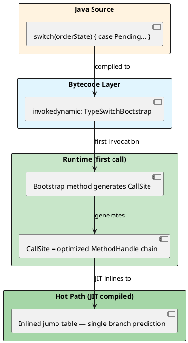

# 02: Domain Modeling and Bytecode Power

## Learning Objectives

After this module you can:
- Use `sealed` interfaces with `record` subtypes to make illegal domain states unrepresentable at compile time
- Explain how the JVM uses `invokedynamic` (indy) to compile pattern-matching `switch` into an optimized jump table
- Quantify the Java object header tax (12–16 bytes per object) and explain why Project Valhalla eliminates it
- Implement stateful stream processing using Java 22+ Gatherers
- Use JOL (Java Object Layout) to measure actual object memory layout

## Prerequisites

- Ch 1.0 Functional Foundations (sealed interfaces, records, pattern matching basics)
- Ch 1.1 Advanced Data Structures (heap and object header concepts)

---

## The Critical Dialogue

**Student:** I've implemented our `Order` class with records and sealed interfaces. The code is clean, but I'm worried about the performance of large `switch` statements and the memory overhead of millions of objects. Is DOP (Data-Oriented Programming) just a trade-off between clean code and speed?

**Principal:** You are thinking in **Identity**, not in **Value**. In traditional Java, every object has an identity — a unique fingerprint that costs **16 bytes** of metadata. In a Ledger with 1 billion orders, that is **16GB of "Garbage" RAM** just for fingerprints. Records are clean AND fast — because of how the JVM compiles `switch` with `invokedynamic`. And with **Project Valhalla** on the horizon, records are the direct bridge to zero-overhead value types. We move from "Worrying About Switch Overhead" to "Designing for Silicon."

---

## 1. Algebraic Data Types: The Closed Domain Model

### 1.1 Sealed Hierarchies in Bytecode

```java
// Principal-level closed domain model
public sealed interface OrderState permits Pending, Settled, Rejected, Cancelled {}

public record Pending(Instant receivedAt)                    implements OrderState {}
public record Settled(Instant settledAt, String txId)        implements OrderState {}
public record Rejected(String reason)                        implements OrderState {}
public record Cancelled(Instant time, String reason)         implements OrderState {}
```

When compiled, the JVM adds a `PermittedSubclasses` attribute to the `.class` file. This prevents anyone from implementing `OrderState` via reflection, dynamic proxy, or a separate module — the sealed contract is enforced at **class-loading time**, not just at compile time.

### 1.2 Pattern Matching Exhaustiveness

```java
// ❌ COMPILE ERROR if you add Cancelled without handling it here
String describe(OrderState state) {
    return switch (state) {
        case Pending p    -> "waiting since " + p.receivedAt();
        case Settled s    -> "settled: " + s.txId();
        case Rejected r   -> "rejected: " + r.reason();
        // case Cancelled c  ← compiler error: non-exhaustive switch
    };
}

// ✅ Compiler enforces: if you add a new subtype, every switch must handle it
// This eliminates the "forgot to update the if-else chain" bug class entirely
```

---

## 2. Pattern Matching Internals: The `invokedynamic` Engine

### 2.1 How the JVM Compiles a `switch` on Sealed Types

Java 21 does NOT compile sealed-interface switch into `if-instanceof` bytecode. It uses `invokedynamic` (indy).



**Why this beats `if-instanceof`:**
- `if-instanceof` chain: N comparisons for N cases — O(N) per dispatch
- `invokedynamic` + JIT: generated jump table — O(1) per dispatch, JIT inlines target logic
- At 1M switches/second: 20-case `if-instanceof` = 20M comparisons vs indy = 1M jumps

### 2.2 Record Deconstruction Patterns

```java
// Record patterns deconstruct fields directly — no accessor call overhead after JIT inlining
double calculateFee(OrderState state) {
    return switch (state) {
        case Settled(Instant _, String txId) when txId.startsWith("INT") -> 0.02;
        case Settled(Instant settledAt, String _)
            when settledAt.isBefore(Instant.now().minusHours(1))         -> 0.01;
        case Settled s                                                    -> 0.005;
        case Pending p                                                    -> 0.0;
        case Rejected r, Cancelled r                                      -> 0.0;
    };
}
```

---

## 3. Object Header Tax

### 3.1 The 12-Byte Minimum Per Object

Every Java object has a non-negotiable header:

```
OBJECT MEMORY LAYOUT (64-bit JVM, compressed oops -XX:+UseCompressedOops):
════════════════════════════════════════════════════════════════════════════

  Offset  Size  Description
  ──────  ────  ────────────────────────────────────────────────────────
  0       8     Mark Word: identity hashCode, GC age bits, lock state
  8       4     Klass Pointer: compressed pointer to class metadata
  12      4     (alignment padding for 8-byte field alignment)
  ──────  ────
  Total:  16    minimum per object (even for a record with zero fields!)

For record Order(long id, double amount):
  16 bytes header + 8 bytes long + 8 bytes double = 32 bytes per Order
  At 1 billion orders: 32GB RAM
  
Without compressed oops (heap > 32GB):
  Klass Pointer = 8 bytes → 24 bytes minimum header
```

### 3.2 Project Valhalla: Value Objects

Project Valhalla (in preview, JEP draft) introduces **value objects** — classes without identity. They can be flattened into arrays with zero header overhead:

```java
// Future Java (Valhalla):
value record Order(long id, double amount) {}

// Order[] array in memory — no headers, no pointers, just raw data:
// [id0: 8B][amount0: 8B][id1: 8B][amount1: 8B]...
// 16 bytes per Order vs 32 bytes today — 50% reduction
// 1 billion orders: 16GB vs 32GB
// Also: CPU cache locality improves — no pointer chasing
```

---

## 4. Stateful Streams: Custom Gatherers (Java 22+)

```java
import java.util.stream.Gatherer;
import java.util.ArrayList;
import java.math.BigDecimal;

// Sliding window average — impossible cleanly with old Stream API
public static Gatherer<Order, ArrayList<BigDecimal>, BigDecimal>
        slidingWindowAvg(int windowSize) {
    return Gatherer.of(
        ArrayList::new,  // initializer: empty window state
        (state, element, downstream) -> {
            state.add(element.amount());
            if (state.size() > windowSize) state.removeFirst();
            if (state.size() == windowSize) {
                BigDecimal avg = state.stream()
                    .reduce(BigDecimal.ZERO, BigDecimal::add)
                    .divide(BigDecimal.valueOf(windowSize));
                downstream.push(avg);
            }
            return true;  // continue streaming
        }
    );
}

// Usage:
List<Order> orders = List.of(/* ... */);
List<BigDecimal> movingAvgs = orders.stream()
    .gather(slidingWindowAvg(10))
    .toList();
```

---

## 5. Source Archaeology

### 5.1 `invokedynamic` Bootstrap for Pattern Switch

```java
// When you compile: switch (state) { case Pending p -> ... }
// The compiler generates bytecode equivalent to:
//   invokedynamic TypeSwitchBootstrap.bootstrap(...)

// The bootstrap method (java.lang.runtime.SwitchBootstraps, OpenJDK 21):
public static CallSite typeSwitch(MethodHandles.Lookup lookup,
                                   String invocationName,
                                   MethodType invocationType,
                                   Object... labels) {
    // labels = [Pending.class, Settled.class, Rejected.class, Cancelled.class]
    // Returns a CallSite that dispatches based on instanceof checks
    // JIT then compiles this into a branch-predicted jump table
}

// Key: the CallSite is generated ONCE per call site, then cached
// Subsequent calls go through the cached CallSite — no bootstrap overhead
```

### 5.2 Sealed Class Bytecode Attribute

```bash
# Verify PermittedSubclasses in bytecode:
javap -verbose OrderState.class | grep -A 4 PermittedSubclasses

# Output:
# PermittedSubclasses:
#   Pending
#   Settled
#   Rejected
#   Cancelled
```

---

## 6. Code Lab

### Lab: JOL Memory Layout Analysis

```java
// Add to pom.xml: org.openjdk.jol:jol-core:0.17
import org.openjdk.jol.info.ClassLayout;

public record Order(long id, double amount, boolean urgent) {}

public class LayoutInspector {
    public static void main(String[] args) {
        System.out.println(ClassLayout.parseInstance(new Order(1L, 99.99, false)).toPrintable());
    }
}

/*
Output (64-bit JVM, -XX:+UseCompressedOops):
─────────────────────────────────────────────────────────────────────────────
Order object internals:
 OFFSET  SIZE     TYPE DESCRIPTION                               VALUE
      0     4          (object header: mark)                     ...
      4     4          (object header: class)                    ...
      8     8     long Order.id                                  1
     16     8   double Order.amount                              99.99
     24     1  boolean Order.urgent                              false
     25     7          (object alignment padding)
─────────────────────────────────────────────────────────────────────────────
Instance size: 32 bytes
→ Header: 12 bytes (mark=8 + klass=4)
→ Data: 17 bytes (long=8, double=8, boolean=1)
→ Padding: 3 bytes (alignment to 8-byte boundary)
→ Total: 32 bytes

At 1 billion orders: 32GB RAM. With Project Valhalla flattening: 17GB.
*/
```

---

## 7. Production Lens

### Incident: Unsealed Interface Allowed Unauthorized Implementation

A financial system defined `PaymentStrategy` as a regular interface. A third-party plugin (loaded via ServiceLoader) provided an unauthorized implementation that bypassed fraud checks. Sealing the interface would have prevented this at class-load time.

```java
// ❌ Before: anyone can implement PaymentStrategy
public interface PaymentStrategy { void execute(Order order); }

// ✅ After: only known implementations allowed
public sealed interface PaymentStrategy
    permits CreditCardStrategy, CryptoStrategy, WireTransferStrategy {}
// Third-party class implementing PaymentStrategy → ClassLoadingException at startup
```

### Object Header Scale Tax

```
PRODUCTION NUMBERS: Order management system, 500M orders in memory (cache tier)
────────────────────────────────────────────────────────────────────────────────
Object header overhead:       500M × 12 bytes = 6 GB just for headers
Alignment padding overhead:   ~2 GB
Total wasted RAM:             ~8 GB
Monthly AWS RAM cost (r6g):   ~$800/month wasted
After record field reordering: saved 1.5GB alignment padding = ~$150/month
```

---

## 8. Exercises

**1.** Why is a runtime-generated `invokedynamic` jump table superior to a compile-time `if-else` chain for a microservice fleet that loads hot-swappable plugins? (Hint: consider what happens when a new `OrderState` subtype is deployed without recompiling the switch logic.)

**2.** What happens to the **Mark Word** in Project Valhalla's value objects? Specifically, why can value objects NOT support `==` identity comparison, and how does this relate to the Mark Word?

**3.** Use JOL to measure the layout of a class with fields in order: `byte, long, byte`. Compare it to the same class with fields in order: `long, byte, byte`. Explain the difference in total size.

**4. Coding challenge:** Implement a `Gatherer<Order, ?, Order>` that deduplicates consecutive orders with the same `customerId` — if two adjacent orders have the same customer, only emit the first. Write a stream test that verifies the behavior.

**5.** How do Record Patterns (`case Settled(Instant t, String id)`) achieve faster field access than traditional `case Settled s -> s.settledAt()`? Examine the bytecode with `javap -c`.

---

## 9. Summary / Flashcard

- **`sealed` + `record` makes illegal states a compile error**: `PermittedSubclasses` bytecode attribute enforces closed hierarchy at class-load time; adding a new subtype forces every `switch` to handle it or fail compilation
- **Pattern-matching `switch` compiles to `invokedynamic` — not `if-instanceof`**: JVM generates a cached `CallSite` jump table on first dispatch; JIT inlines to O(1) branch vs O(N) `if-instanceof` chain
- **Every Java object pays a 12-16 byte header tax**: 8 bytes Mark Word (hashCode, GC bits, lock) + 4 bytes Klass Pointer; 1 billion records = 12-16GB of unavoidable overhead
- **Project Valhalla value objects eliminate the header**: `value record` instances flatten into arrays with zero header — dense, cache-friendly, pointer-chase-free; records today are the migration path
- **JOL reveals hidden alignment padding**: fields reordered by compiler, 8-byte alignment forces padding; measuring with JOL before caching large datasets can reveal GB-scale savings from field reordering
