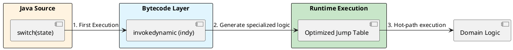
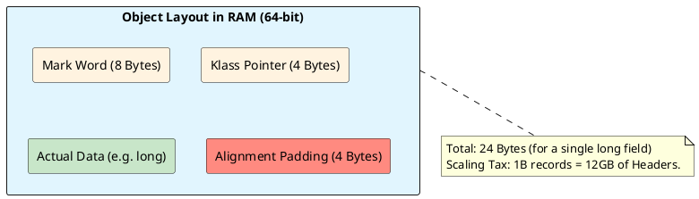

# 02: Domain Modeling and Bytecode Power


## The Critical Dialogue


**Student:** I've implemented our `Order` class with records and sealed interfaces. The code is clean, but I'm worried about the performance of large `switch` statements and the memory overhead of millions of objects. Is DOP just a trade-off between clean code and speed?


**Principal:** You are thinking in **Identity**, not in **Value**. In traditional Java, every object has an identity—a unique fingerprint that costs **16 bytes** of metadata. In a Ledger with 1 billion orders, that is **16GB of "Garbage"** RAM just for fingerprints. To reach Principal level, we model with Records today because they are the bridge to **Project Valhalla**. We also use **Bytecode Power** (indy) to ensure our domain logic is faster than a manually tuned `if-else` chain.


---


## 1. Algebraic Data Types: Modeling the "What"


### 1.1 Sealed Hierarchies: The Closed World


A Principal uses `sealed` interfaces to make the domain model a "Closed Set."


> [!abstract] Source Archaeology: Class File Metadata
> The JVM enforces domain rules at the class-loading layer.
> . **The Constant Pool:** When you compile a sealed interface, the compiler adds a `PermittedSubclasses` attribute to the bytecode. 
> . **Security:** This prevents "Illegal Extensions" via reflection or dynamic proxies. The JVM effectively says: "I know exactly who is allowed to be an OrderState. Anyone else is an impostor."


```java
// Principal Level: The Closed Domain Model
public sealed interface OrderState permits Pending, Settled, Rejected {}

public record Pending(Instant receivedAt) implements OrderState {}

public record Settled(Instant settledAt, String txId) implements OrderState {}

public record Rejected(String reason) implements OrderState {}
```


---


## 2. Pattern Matching Internals: The indy Engine


### 2.1 invokedynamic (indy) for Switch


Java 21 does not compile a `switch` on a record into a series of `if-instanceof` bytecode instructions. It uses **`invokedynamic` (indy)**.


**How it works: The Bootstrap**
The first time your Ledger runs a switch, the JVM calls a **Bootstrap Method**.
. **Runtime Generation:** The JVM inspects the actual records loaded and generates a specialized **Jump Table** in memory.
. **De-virtualization:** The JIT can then inline the target logic directly, removing the overhead of method calls. This is why a Principal-level switch is faster than a Junior-level `if-else`.





---


## 3. Stateful Streams: Custom Gatherers (Java 22+)


### 3.1 The Mechanics of a Gatherer


Stream Gatherers allow for stateful intermediate operations previously impossible without custom hacks.


```java
// Principal Implementation: Sliding Window Average
public static Gatherer(Order, List(BigDecimal), BigDecimal) slidingWindowAvg(int windowSize) {
    return Gatherer.of(
        ArrayList::new, // Initializer: Current window state
        (state, element, downstream) -> {
            state.add(element.amount());
            if (state.size() > windowSize) state.remove(0);
            if (state.size() == windowSize) {
                BigDecimal sum = state.stream().reduce(BigDecimal.ZERO, BigDecimal::add);
                downstream.push(sum.divide(BigDecimal.valueOf(windowSize)));
            }
            return true;
        }
    );
}
```


---


## 4. Memory Physics: Header Tax and Valhalla


### 4.1 The 12-Byte Header (Mark Word)


**What is it?**
Every Java object has an "Object Header" which contains the **Mark Word** and the **Klass Pointer**. This is the non-negotiable metadata the JVM uses for thread locking, hash codes, and garbage collection.


**How it works: The Physical Layout**
In a 64-bit JVM with compressed references:
. **Mark Word (8 bytes):** Stores identity hash code, locking bits, and aging bits (for GC).
. **Klass Pointer (4 bytes):** Points to the class metadata.
. **The Result:** Even a Record with zero fields consumes 12 bytes. 





**Why do we care? (The Scaling Tax)**
In a Ledger storing 1 billion records, you are paying for **12GB of RAM** just for these headers. **Project Valhalla** (Value Objects) is critical because it allows us to define "Identity-less" objects that can be flattened into arrays, removing this header tax entirely.


---


## 🧵 The GOL Challenge: Phase 2 (Saturation)


**Context:** The Ledger is experiencing high memory usage. Analysis shows object overhead is consuming 60 percent of the heap.


**The Task:**


. **Memory Archaeology:** Use the **JOL** (Java Object Layout) tool to print the layout of your `Order` record. Quantify the exact number of bytes lost to **Header Tax** and **Alignment Padding**.


. **Exhaustive Modeling:** Add a `Cancelled(Instant time, String reason)` state to your ADT. Ensure all logic switches fail to compile until the new state is handled.


. **Analytics:** Implement the `slidingWindowAvg` gatherer above to calculate real-time average order value for the last 100 transactions.


---


## 🧠 Principal's Inquiry


. **The indy Advantage:** Why is a runtime Jump Table superior to a build-time `if-else` chain for a global microservice fleet?


. **Identity vs Value:** What happens to the **Mark Word** in Project Valhalla? How can we have "Header-less" objects that still support GC?


. **Record Deconstruction:** Why are **Record Patterns** `case Settled(Instant t)` faster than traditional `case Settled s -> s.t()`?


**Principal Summary:** A Principal models for **Invariants** but designs for **Silicon**. We use ADTs to guarantee business logic and layout-optimization to guarantee cloud-profitability.
