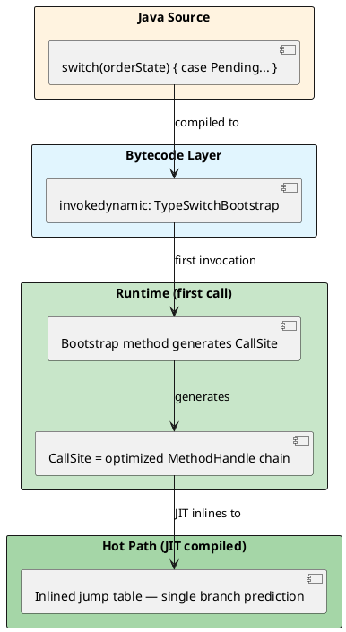

# 02: Domain Modeling and Bytecode Power

## Learning Objectives

After this module you can:
- Use `sealed` interfaces with `record` subtypes to make illegal domain states unrepresentable at compile time
- Explain how the JVM uses `invokedynamic` (indy) to compile pattern-matching `switch` into an optimized jump table
- Quantify the Java object header tax (12–16 bytes per object) and explain why Project Valhalla eliminates it
- Implement stateful stream processing using Java 22+ Gatherers
- Use JOL (Java Object Layout) to measure actual object memory layout

## Prerequisites

- Ch 1.0 Functional Foundations (sealed interfaces, records, pattern matching basics)
- Ch 1.1 Advanced Data Structures (heap and object header concepts)

---

## The Critical Dialogue

**Student:** I've implemented our `Order` class with records and sealed interfaces. The code is clean, but I'm worried about the performance of large `switch` statements and the memory overhead of millions of objects. Is DOP (Data-Oriented Programming) just a trade-off between clean code and speed?

**Principal:** You are thinking in **Identity**, not in **Value**. In traditional Java, every object has an identity — a unique fingerprint that costs **16 bytes** of metadata. In a Ledger with 1 billion orders, that is **16GB of "Garbage" RAM** just for fingerprints. Records are clean AND fast — because of how the JVM compiles `switch` with `invokedynamic`. And with **Project Valhalla** on the horizon, records are the direct bridge to zero-overhead value types. We move from "Worrying About Switch Overhead" to "Designing for Silicon."

---

## 1. Algebraic Data Types: The Closed Domain Model

### 1.1 Sealed Hierarchies in Bytecode

```java
// Principal-level closed domain model
public sealed interface OrderState permits Pending, Settled, Rejected, Cancelled {}

public record Pending(Instant receivedAt)                    implements OrderState {}
public record Settled(Instant settledAt, String txId)        implements OrderState {}
public record Rejected(String reason)                        implements OrderState {}
public record Cancelled(Instant time, String reason)         implements OrderState {}
```

When compiled, the JVM adds a `PermittedSubclasses` attribute to the `.class` file. This prevents anyone from implementing `OrderState` via reflection, dynamic proxy, or a separate module — the sealed contract is enforced at **class-loading time**, not just at compile time.

### 1.2 Pattern Matching Exhaustiveness

```java
// ❌ COMPILE ERROR if you add Cancelled without handling it here
String describe(OrderState state) {
    return switch (state) {
        case Pending p    -> "waiting since " + p.receivedAt();
        case Settled s    -> "settled: " + s.txId();
        case Rejected r   -> "rejected: " + r.reason();
        // case Cancelled c  ← compiler error: non-exhaustive switch
    };
}

// ✅ Compiler enforces: if you add a new subtype, every switch must handle it
// This eliminates the "forgot to update the if-else chain" bug class entirely
```

---

## 2. Pattern Matching Internals: The `invokedynamic` Engine

### 2.1 How the JVM Compiles a `switch` on Sealed Types

Java 21 does NOT compile sealed-interface switch into `if-instanceof` bytecode. It uses `invokedynamic` (indy).



**Why this beats `if-instanceof`:**
- `if-instanceof` chain: N comparisons for N cases — O(N) per dispatch
- `invokedynamic` + JIT: generated jump table — O(1) per dispatch, JIT inlines target logic
- At 1M switches/second: 20-case `if-instanceof` = 20M comparisons vs indy = 1M jumps

### 2.2 Record Deconstruction Patterns

```java
// Record patterns deconstruct fields directly — no accessor call overhead after JIT inlining
double calculateFee(OrderState state) {
    return switch (state) {
        case Settled(Instant _, String txId) when txId.startsWith("INT") -> 0.02;
        case Settled(Instant settledAt, String _)
            when settledAt.isBefore(Instant.now().minusHours(1))         -> 0.01;
        case Settled s                                                    -> 0.005;
        case Pending p                                                    -> 0.0;
        case Rejected r, Cancelled r                                      -> 0.0;
    };
}
```

---

## 3. Object Header Tax

### 3.1 The 12-Byte Minimum Per Object

Every Java object has a non-negotiable header:

```
OBJECT MEMORY LAYOUT (64-bit JVM, compressed oops -XX:+UseCompressedOops):
════════════════════════════════════════════════════════════════════════════

  Offset  Size  Description
  ──────  ────  ────────────────────────────────────────────────────────
  0       8     Mark Word: identity hashCode, GC age bits, lock state
  8       4     Klass Pointer: compressed pointer to class metadata
  12      4     (alignment padding for 8-byte field alignment)
  ──────  ────
  Total:  16    minimum per object (even for a record with zero fields!)

For record Order(long id, double amount):
  16 bytes header + 8 bytes long + 8 bytes double = 32 bytes per Order
  At 1 billion orders: 32GB RAM
  
Without compressed oops (heap > 32GB):
  Klass Pointer = 8 bytes → 24 bytes minimum header
```

### 3.2 Project Valhalla: Value Objects

Project Valhalla (in preview, JEP draft) introduces **value objects** — classes without identity. They can be flattened into arrays with zero header overhead:

```java
// Future Java (Valhalla):
value record Order(long id, double amount) {}

// Order[] array in memory — no headers, no pointers, just raw data:
// [id0: 8B][amount0: 8B][id1: 8B][amount1: 8B]...
// 16 bytes per Order vs 32 bytes today — 50% reduction
// 1 billion orders: 16GB vs 32GB
// Also: CPU cache locality improves — no pointer chasing
```

---

## 4. Stateful Streams: Custom Gatherers (Java 22+)

```java
import java.util.stream.Gatherer;
import java.util.ArrayList;
import java.math.BigDecimal;

// Sliding window average — impossible cleanly with old Stream API
public static Gatherer<Order, ArrayList<BigDecimal>, BigDecimal>
        slidingWindowAvg(int windowSize) {
    return Gatherer.of(
        ArrayList::new,  // initializer: empty window state
        (state, element, downstream) -> {
            state.add(element.amount());
            if (state.size() > windowSize) state.removeFirst();
            if (state.size() == windowSize) {
                BigDecimal avg = state.stream()
                    .reduce(BigDecimal.ZERO, BigDecimal::add)
                    .divide(BigDecimal.valueOf(windowSize));
                downstream.push(avg);
            }
            return true;  // continue streaming
        }
    );
}

// Usage:
List<Order> orders = List.of(/* ... */);
List<BigDecimal> movingAvgs = orders.stream()
    .gather(slidingWindowAvg(10))
    .toList();
```

---

## 5. Source Archaeology

### 5.1 `invokedynamic` Bootstrap for Pattern Switch

```java
// When you compile: switch (state) { case Pending p -> ... }
// The compiler generates bytecode equivalent to:
//   invokedynamic TypeSwitchBootstrap.bootstrap(...)

// The bootstrap method (java.lang.runtime.SwitchBootstraps, OpenJDK 21):
public static CallSite typeSwitch(MethodHandles.Lookup lookup,
                                   String invocationName,
                                   MethodType invocationType,
                                   Object... labels) {
    // labels = [Pending.class, Settled.class, Rejected.class, Cancelled.class]
    // Returns a CallSite that dispatches based on instanceof checks
    // JIT then compiles this into a branch-predicted jump table
}

// Key: the CallSite is generated ONCE per call site, then cached
// Subsequent calls go through the cached CallSite — no bootstrap overhead
```

### 5.2 Sealed Class Bytecode Attribute

```bash
# Verify PermittedSubclasses in bytecode:
javap -verbose OrderState.class | grep -A 4 PermittedSubclasses

# Output:
# PermittedSubclasses:
#   Pending
#   Settled
#   Rejected
#   Cancelled
```

---

## 6. Code Lab

### Lab: JOL Memory Layout Analysis

```java
// Add to pom.xml: org.openjdk.jol:jol-core:0.17
import org.openjdk.jol.info.ClassLayout;

public record Order(long id, double amount, boolean urgent) {}

public class LayoutInspector {
    public static void main(String[] args) {
        System.out.println(ClassLayout.parseInstance(new Order(1L, 99.99, false)).toPrintable());
    }
}

/*
Output (64-bit JVM, -XX:+UseCompressedOops):
─────────────────────────────────────────────────────────────────────────────
Order object internals:
 OFFSET  SIZE     TYPE DESCRIPTION                               VALUE
      0     4          (object header: mark)                     ...
      4     4          (object header: class)                    ...
      8     8     long Order.id                                  1
     16     8   double Order.amount                              99.99
     24     1  boolean Order.urgent                              false
     25     7          (object alignment padding)
─────────────────────────────────────────────────────────────────────────────
Instance size: 32 bytes
→ Header: 12 bytes (mark=8 + klass=4)
→ Data: 17 bytes (long=8, double=8, boolean=1)
→ Padding: 3 bytes (alignment to 8-byte boundary)
→ Total: 32 bytes

At 1 billion orders: 32GB RAM. With Project Valhalla flattening: 17GB.
*/
```

---

## 7. Production Lens

### Incident: Unsealed Interface Allowed Unauthorized Implementation

A financial system defined `PaymentStrategy` as a regular interface. A third-party plugin (loaded via ServiceLoader) provided an unauthorized implementation that bypassed fraud checks. Sealing the interface would have prevented this at class-load time.

```java
// ❌ Before: anyone can implement PaymentStrategy
public interface PaymentStrategy { void execute(Order order); }

// ✅ After: only known implementations allowed
public sealed interface PaymentStrategy
    permits CreditCardStrategy, CryptoStrategy, WireTransferStrategy {}
// Third-party class implementing PaymentStrategy → ClassLoadingException at startup
```

### Object Header Scale Tax

```
PRODUCTION NUMBERS: Order management system, 500M orders in memory (cache tier)
────────────────────────────────────────────────────────────────────────────────
Object header overhead:       500M × 12 bytes = 6 GB just for headers
Alignment padding overhead:   ~2 GB
Total wasted RAM:             ~8 GB
Monthly AWS RAM cost (r6g):   ~$800/month wasted
After record field reordering: saved 1.5GB alignment padding = ~$150/month
```

---

## GOL Challenge (v0)

> **System:** [Global Order Ledger](../GOL_ARCHITECTURE.md) | **Version:** v0 — Domain Model Bootstrap
> 
> This is the first GOL challenge. There are no previous GOL versions to build on — you are starting from scratch.

### Context

The Global Order Ledger processes 50,000 financial transactions per second across 3 global regions. Your task: model the core domain events using the Java 21+ features covered in this module.

### Task

**1. Design the sealed LedgerEvent hierarchy**

```java
// Implement this sealed interface hierarchy:
// - LedgerEvent (sealed interface)
// - Debit implements LedgerEvent (record)
// - Credit implements LedgerEvent (record)  
// - Transfer implements LedgerEvent (record)
//
// Each event must carry: accountId, amount (BigDecimal), 
// timestamp (Instant), idempotencyKey (String)
// Transfer additionally carries: toAccountId
```

**2. Implement a `LedgerEventProcessor` using switch expressions**

```java
// Using pattern matching switch (Java 21):
// - Debit: deduct amount, return new balance
// - Credit: add amount, return new balance
// - Transfer: return a Pair<BigDecimal, BigDecimal> (fromBalance, toBalance)
// - Use guard patterns to reject negative amounts
```

**3. Explain in one sentence**: why `sealed` is better than an open class hierarchy for domain events in a financial ledger.

### Expected Outcome

- Compile-clean Java 21+ code
- No `instanceof` checks — use pattern matching switch exhaustively
- `Transfer` implements `LedgerEvent` with `accountId()` returning `fromAccountId`
- The `idempotencyKey` prevents double-processing: same key = same event applied once

### Next GOL Challenge

v0.5 — Async validation with CompletableFuture (Ch 1.7)

---

## 8. Exercises

**1.** Why is a runtime-generated `invokedynamic` jump table superior to a compile-time `if-else` chain for a microservice fleet that loads hot-swappable plugins? (Hint: consider what happens when a new `OrderState` subtype is deployed without recompiling the switch logic.)

**2.** What happens to the **Mark Word** in Project Valhalla's value objects? Specifically, why can value objects NOT support `==` identity comparison, and how does this relate to the Mark Word?

**3.** Use JOL to measure the layout of a class with fields in order: `byte, long, byte`. Compare it to the same class with fields in order: `long, byte, byte`. Explain the difference in total size.

**4. Coding challenge:** Implement a `Gatherer<Order, ?, Order>` that deduplicates consecutive orders with the same `customerId` — if two adjacent orders have the same customer, only emit the first. Write a stream test that verifies the behavior.

**5.** How do Record Patterns (`case Settled(Instant t, String id)`) achieve faster field access than traditional `case Settled s -> s.settledAt()`? Examine the bytecode with `javap -c`.

---

## Exercise Solutions

<details>
<summary>Exercise 1 — invokedynamic vs if-else for hot-swappable plugins</summary>

An `if-else` chain compiled against known subtypes is a static sequence of `instanceof` checks baked into bytecode. When a new `OrderState` subtype is deployed at runtime, the old bytecode has no branch for it — behavior is silently wrong (falls through to the default) and a full redeploy is required to add the branch.

`invokedynamic` compiles the switch to a `CallSite` backed by a `MethodHandle` table. The JVM bootstraps the dispatch table on first call and caches it. When a new subtype is loaded, the `MutableCallSite` can be invalidated and re-linked to include the new branch — without recompiling the calling class. The JIT deoptimizes and recompiles, but the logical dispatch becomes O(1) again. More importantly, the compiler enforces exhaustiveness on sealed hierarchies: a missing `case` is a compile error, preventing silent wrong behavior.

**Staff-level phrasing:** "`invokedynamic` lets the JVM re-link dispatch tables at runtime for new subtypes without recompiling callers, while a static `instanceof` chain silently ignores unknown subtypes — sealed `switch` + `invokedynamic` gives both compile-time exhaustiveness checking and runtime extensibility."

</details>

<details>
<summary>Exercise 2 — Mark Word and value objects in Project Valhalla</summary>

Every Java object today has an 8-byte **Mark Word** in its header that stores: identity hash code (31 bits), GC age bits, lock state (biased/thin/fat lock), and a GC forwarding pointer during relocation. Identity (`==`) comparison works by comparing object addresses — two distinct `new Object()` instances at different addresses are never `==`.

Value objects (Project Valhalla `value record`) have no identity: they behave like primitives — two instances with identical fields ARE equal. Because value objects have no identity, there is no reference to compare, and therefore no address to store. Without an address there is no need for the lock bits (value objects can't be `synchronized` on) or the identity hash code (there is no identity to hash). The Mark Word becomes unnecessary, so the JVM can remove the entire 12-16 byte header and store value objects as flat, contiguous field data in arrays. This is what enables the "no pointer chase" performance gain.

**Staff-level phrasing:** "The Mark Word encodes object identity (hash, lock, GC metadata); value objects have no identity by definition, so the Mark Word — and the entire object header — can be eliminated, enabling flat array storage with zero pointer indirection."

</details>

<details>
<summary>Exercise 3 — JOL field ordering and alignment padding</summary>

JVM aligns each field to its own size boundary and aligns the object total size to 8 bytes. For `byte, long, byte`:
- offset 12: `byte` (1 byte)
- padding 5 bytes (to align `long` to 8-byte boundary)
- offset 16: `long` (8 bytes)
- offset 24: `byte` (1 byte)
- padding 7 bytes (to pad object to 8-byte boundary)
- **Total: 32 bytes**

For `long, byte, byte`:
- offset 12: `long` (8 bytes)
- offset 20: `byte` (1 byte)
- offset 21: `byte` (1 byte)
- padding 2 bytes (to pad object to 8-byte boundary)
- **Total: 24 bytes**

Saving: 8 bytes (25%) per instance — for 100M cached instances that is 800MB. JVM field reordering is allowed but not guaranteed; JOL shows the actual layout. The lesson: declare larger fields first when memory density matters.

**Staff-level phrasing:** "Field declaration order in source controls layout only when the JVM doesn't reorder (hotspot usually does, but not always) — always validate with JOL before assuming savings; `long, byte, byte` is 24 bytes vs `byte, long, byte` at 32 bytes due to alignment padding."

</details>

<details>
<summary>Exercise 4 — Coding challenge: Gatherer deduplicating consecutive orders by customerId</summary>

```java
// Reference implementation (Java 21+, compilable standalone)
import java.util.List;
import java.util.stream.Gatherer;

public class DeduplicateConsecutive {

    public static Gatherer<Order, ?, Order> byCustomerId() {
        return Gatherer.ofSequential(
            () -> new String[1],   // state: last seen customerId (mutable box)
            (state, element, downstream) -> {
                if (!element.customerId().equals(state[0])) {
                    state[0] = element.customerId();
                    downstream.push(element);
                }
                return true;
            }
        );
    }

    record Order(String customerId, String itemId) {}

    public static void main(String[] args) {
        var orders = List.of(
            new Order("A", "item1"),
            new Order("A", "item2"),  // duplicate consecutive — skip
            new Order("B", "item3"),
            new Order("A", "item4"),  // not consecutive — keep
            new Order("B", "item5"),
            new Order("B", "item6")   // duplicate consecutive — skip
        );

        var result = orders.stream()
            .gather(byCustomerId())
            .toList();

        assert result.size() == 4 : "Expected 4 but got " + result.size();
        assert result.get(0).customerId().equals("A");
        assert result.get(1).customerId().equals("B");
        assert result.get(2).customerId().equals("A");
        assert result.get(3).customerId().equals("B");
        System.out.println("All assertions passed. Result: " + result);
    }
}
```

**Why this works:** `Gatherer.ofSequential` with a mutable state array lets us track the last emitted `customerId`. The integrator pushes the element downstream only when the current customer differs from the previous one. Using `String[1]` (a mutable box) as state avoids needing a wrapper class while keeping the lambda non-capturing-but-mutable.

**Common mistake:** Using `Gatherer.of()` (the parallel variant) without a combiner, which causes incorrect deduplication in parallel mode — consecutive-duplicate removal is inherently sequential because "consecutive" is defined by stream order. Always use `Gatherer.ofSequential()` for order-dependent stateful operations.

</details>

<details>
<summary>Exercise 5 — Record Patterns vs accessor calls in bytecode</summary>

With `case Settled s -> s.settledAt()`, the bytecode must:
1. Cast the object reference to `Settled` (`checkcast`)
2. Invoke the accessor method `settledAt()` (virtual `invokevirtual`)

With `case Settled(Instant t, String id)`, the compiler generates a pattern matching bootstrap that extracts the record components via the record's component accessor methods, but with a key difference: the JVM's `invokedynamic` pattern-matching intrinsic can short-circuit the `checkcast` (it was already checked by the switch dispatch) and the JIT can inline the accessor trivially because record components are final and their accessor bodies are trivially `return field`. In practice the JIT eliminates both the virtual dispatch overhead and the redundant type check, reducing to a direct field load.

Running `javap -c` on the compiled switch shows the `case Settled s -> s.settledAt()` variant has an extra `checkcast` + `invokevirtual` for the accessor, while the Record Pattern variant shows the `invokedynamic` bootstrap that the JIT collapses into a direct `getfield` after inlining.

**Staff-level phrasing:** "Record Patterns let the JIT collapse the cast + virtual dispatch into a direct `getfield` after inlining — the `invokedynamic` bootstrap at the switch level already proved the type, so the component extraction has zero runtime type-check overhead."

</details>

---

## 9. Summary / Flashcard

- **`sealed` + `record` makes illegal states a compile error**: `PermittedSubclasses` bytecode attribute enforces closed hierarchy at class-load time; adding a new subtype forces every `switch` to handle it or fail compilation
- **Pattern-matching `switch` compiles to `invokedynamic` — not `if-instanceof`**: JVM generates a cached `CallSite` jump table on first dispatch; JIT inlines to O(1) branch vs O(N) `if-instanceof` chain
- **Every Java object pays a 12-16 byte header tax**: 8 bytes Mark Word (hashCode, GC bits, lock) + 4 bytes Klass Pointer; 1 billion records = 12-16GB of unavoidable overhead
- **Project Valhalla value objects eliminate the header**: `value record` instances flatten into arrays with zero header — dense, cache-friendly, pointer-chase-free; records today are the migration path
- **JOL reveals hidden alignment padding**: fields reordered by compiler, 8-byte alignment forces padding; measuring with JOL before caching large datasets can reveal GB-scale savings from field reordering
