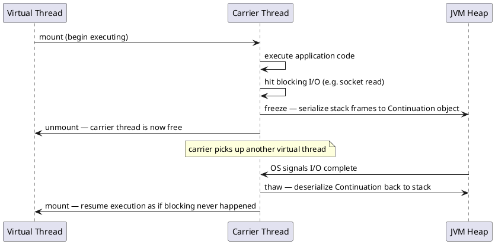

# 03: The Concurrency Revolution and ForkJoinPool

## Learning Objectives

After this module you can:
- Explain how Virtual Threads decouple tasks from OS threads and why this eliminates the "1MB per thread" memory tax
- Describe ForkJoinPool work-stealing and why it uses LIFO locally but FIFO for stealing
- Implement `StructuredTaskScope` for parallel sub-tasks with strict cancellation semantics
- Explain why `synchronized` pins a virtual thread to its carrier and how to detect it via JFR
- Use `ScopedValue` as the correct alternative to `ThreadLocal` for context propagation in virtual-thread-heavy code

## Prerequisites

- Ch 1.1 Advanced Data Structures (TLABs — virtual threads still allocate on the JVM heap)
- Ch 1.5 Java Memory Model — **required**: happens-before rules apply to virtual threads too; `synchronized` on a virtual thread causes pinning AND establishes monitor lock HB rule; understanding JMM is necessary to reason about whether removing `synchronized` in favor of `ReentrantLock` preserves your memory visibility guarantees

---

## The Critical Dialogue

**Student:** Our database response time is 500ms. CPU usage is only 5%, but the server is out of memory and crashing under high load. How can we be OOM if we aren't doing any work?

**Principal:** You are paying the **OS Thread Tax**. Every request sits on an OS thread costing 1MB of stack. You have 1GB of RAM occupied by idle but expensive threads. **Project Loom (Virtual Threads)** fixes this by decoupling tasks from physical threads. We are moving from a "Fixed Fleet" to a "Gig Economy" of threads. But to manage these millions of threads, the JVM needs a specialized engine: the **ForkJoinPool**. And once you have millions of threads, `ThreadLocal` becomes a memory hazard — you need `ScopedValue`.

---

## 1. Virtual Threads: The OS Thread Tax

### 1.1 Platform Thread vs Virtual Thread

```
PLATFORM THREAD (before Loom):
════════════════════════════════════════════════════════
  Java thread  →  OS thread  →  CPU core
  
  Thread stack:     1MB per thread (JVM default -Xss1m)
  Thread metadata:  ~16KB OS kernel structures
  
  1,000 threads blocking on DB calls = 1GB RAM for idle stacks
  Max practical threads: ~2,000–4,000 per JVM
  CPU at 5% = 95% of memory wasted on idle stacks

VIRTUAL THREAD (Project Loom, Java 21 GA):
════════════════════════════════════════════════════════
  Virtual thread → mounted on → Carrier thread (platform thread)
  When blocking → unmounted  → Carrier thread free for other virtual threads
  
  Virtual thread stack: stored in JVM heap as Continuation object
  Initial stack: ~200 bytes
  Grow on demand: up to ~few KB for typical I/O-bound work
  
  1,000,000 virtual threads blocking on DB = ~1GB heap (1KB each)
  Max practical virtual threads: millions
```

### 1.2 Continuation Mechanics: Freeze & Thaw



**JMM Note:** The mount/unmount cycle is implemented using the same happens-before guarantees as a thread park/unpark. The JVM ensures full memory visibility when a virtual thread is resumed — all writes visible before the unmount are visible after the remount (Rule 5 equivalent via internal LockSupport semantics).

---

## 2. ForkJoinPool: The Virtual Thread Scheduler

### 2.1 Work-Stealing vs Single-Queue Thread Pool

```
ThreadPoolExecutor (single shared queue):
════════════════════════════════════════════
  Thread 1: ← [Task queue] → Thread 2
              (shared lock)
  Thread 3 ← [Task queue] → Thread 4
  
  Bottleneck: every task submission and retrieval touches shared lock
  Starvation possible: one slow task blocks all threads in queue

ForkJoinPool (per-thread deques + work-stealing):
════════════════════════════════════════════════════
  Thread 1: [T5, T4, T3, T2, T1] ← own deque, push/pop from top (LIFO, cache-warm)
  Thread 2: [T9, T8, T7, T6]     ← own deque
  Thread 3: idle → steals T1 from bottom of Thread 1's deque (FIFO)
  
  Local operations: lock-free (VarHandle CAS on deque bounds)
  Steal: FIFO so stealer gets oldest work (likely to be independent of recent work)
```

**Why LIFO local, FIFO steal?**
- LIFO locally: recently pushed task is cache-warm (data still in L1/L2), continuing it is efficient
- FIFO stealing: oldest task is most likely to be a large, independent subtree — stealer gets max work per steal

### 2.2 Source Archaeology: `ForkJoinPool.WorkQueue`

```java
// java.util.concurrent.ForkJoinPool (OpenJDK 21, line ~860)

@jdk.internal.vm.annotation.Contended  // own cache line per queue
static final class WorkQueue {
    volatile int base;      // index of next slot for STEAL (FIFO end)
    int top;                // index of next slot for PUSH/POP (LIFO end)
    ForkJoinTask<?>[] array;  // the actual task array

    // Steal from base (FIFO):
    final ForkJoinTask<?> steal(WorkQueue src) {
        // Uses VarHandle CAS to atomically increment src.base
        // If CAS fails, another thread stole the same task — retry
    }
}
```

---

## 3. Structured Concurrency

### 3.1 `StructuredTaskScope`: Scoped Lifecycle for Sub-tasks

```java
import java.util.concurrent.StructuredTaskScope;
import java.time.Instant;

public record OrderResult(Inventory inventory, RiskScore risk) {}

public OrderResult enrichOrder(Order order) throws Exception {
    try (var scope = new StructuredTaskScope.ShutdownOnFailure()) {
        // Fork sub-tasks (each runs on a new virtual thread)
        StructuredTaskScope.Subtask<Inventory> inventory =
            scope.fork(() -> inventoryClient.check(order));
        StructuredTaskScope.Subtask<RiskScore> risk =
            scope.fork(() -> riskEngine.evaluate(order));

        // Hard deadline: cancel both tasks if either takes > 500ms
        scope.joinUntil(Instant.now().plusMillis(500));

        // Propagate failure: if either task threw, rethrow here
        scope.throwIfFailed();

        return new OrderResult(inventory.get(), risk.get());
    }
    // try-with-resources: scope.close() cancels any still-running sub-tasks
    // No orphaned threads — structured lifetime enforced by compiler
}
```

**Key difference from `CompletableFuture`:** `StructuredTaskScope` guarantees that all sub-tasks are finished (or cancelled) when the scope closes. `CompletableFuture` chains can leave "orphaned" threads running after the caller returns.

---

## 4. Pinning: The Virtual Thread Kryptonite

### 4.1 What Pinning Is

A virtual thread **pins** to its carrier when it blocks inside:
- A `synchronized` method or block
- A native method call (JNI)

Pinned = carrier thread blocked = all other virtual threads on that carrier also blocked = reduced parallelism.

**JMM Note:** This is why you can't simply remove `synchronized` everywhere to avoid pinning. `synchronized` provides monitor lock HB (Rule 2). If you replace `synchronized` with `ReentrantLock`, you must verify that `ReentrantLock`'s lock/unlock also establishes the required HB — it does (via `volatile` writes internally), but you need to understand this explicitly.

```java
// ❌ Causes pinning: synchronized blocks unmounting
public synchronized void processOrder(Order order) {
    // if this method calls Thread.sleep() or socket I/O,
    // the carrier thread is pinned for the full duration
}

// ✅ Allows unmounting: ReentrantLock releases carrier during blocking
private final ReentrantLock lock = new ReentrantLock();
public void processOrder(Order order) {
    lock.lock();
    try {
        // virtual thread can unmount during I/O inside here
    } finally {
        lock.unlock();
    }
}
```

### 4.2 Detecting Pinning via JFR

```java
// Monitor for pinning events in production or tests
import jdk.jfr.consumer.RecordingStream;

public class PinningMonitor {
    public static void start() {
        var stream = new RecordingStream();
        stream.enable("jdk.VirtualThreadPinned")
              .withThreshold(java.time.Duration.ofMillis(10));  // only log if pinned > 10ms
        stream.onEvent("jdk.VirtualThreadPinned", event -> {
            System.err.printf("PINNED for %s ms: %s%n",
                event.getDuration().toMillis(),
                event.getStackTrace());
        });
        stream.startAsync();
    }
}
```

---

## 5. ScopedValue: Safe Context Propagation

### 5.1 ThreadLocal Problems at Scale

`ThreadLocal` with virtual threads:
- Memory leak risk: if thread pool threads are reused, `ThreadLocal` values from previous requests persist unless explicitly removed
- With 1M virtual threads, `ThreadLocal` storage per-thread multiplies memory usage

### 5.2 `ScopedValue` (Java 21, preview → stable in Java 23)

```java
// Immutable, automatically cleaned up when scope exits
public class TraceContext {
    public static final ScopedValue<String> TRACE_ID = ScopedValue.newInstance();
}

public void handleIngestion(String traceId) {
    ScopedValue.where(TraceContext.TRACE_ID, traceId).run(() -> {
        // Any code called within this scope can read TRACE_ID
        log.info("Processing with trace: {}", TraceContext.TRACE_ID.get());
        inventoryClient.check(order);  // inventory client can also read TRACE_ID
    });
    // TRACE_ID is automatically unbound when scope exits
    // No .remove() needed — no leak possible
}
```

---

## 6. Code Lab

### Lab: Migrate from Platform Threads to Virtual Threads

```java
import java.util.concurrent.*;
import java.util.List;

public class VirtualThreadMigration {

    // ❌ BEFORE: Platform threads — 1MB each, OOM at ~2000 concurrent requests
    public static void withPlatformThreads(List<Runnable> tasks) throws Exception {
        try (var executor = Executors.newFixedThreadPool(200)) {
            var futures = tasks.stream()
                .map(task -> CompletableFuture.runAsync(task, executor))
                .toList();
            CompletableFuture.allOf(futures.toArray(new CompletableFuture[0])).join();
        }
    }

    // ✅ AFTER: Virtual threads — 200 bytes initial stack, millions supported
    public static void withVirtualThreads(List<Runnable> tasks) throws Exception {
        try (var executor = Executors.newVirtualThreadPerTaskExecutor()) {
            var futures = tasks.stream()
                .map(task -> CompletableFuture.runAsync(task, executor))
                .toList();
            CompletableFuture.allOf(futures.toArray(new CompletableFuture[0])).join();
        }
    }

    // ✅ BEST: StructuredTaskScope for fan-out with cancellation
    public static List<String> enrichOrders(List<Order> orders) throws Exception {
        try (var scope = new StructuredTaskScope.ShutdownOnFailure()) {
            var subtasks = orders.stream()
                .map(order -> scope.fork(() -> enrichSingle(order)))
                .toList();
            scope.joinUntil(Instant.now().plusSeconds(2));
            scope.throwIfFailed();
            return subtasks.stream().map(StructuredTaskScope.Subtask::get).toList();
        }
    }

    record Order(String id) {}
    static String enrichSingle(Order o) throws InterruptedException {
        Thread.sleep(100); // simulate I/O
        return o.id() + "-enriched";
    }
}
```

---

## 7. Production Lens

### Incident: Pinning in Hibernate Session

A team migrated to virtual threads but retained Hibernate's `synchronized` session management. Under high load, pinning caused carrier starvation:

```
OBSERVED: 8 CPU cores, 8 carrier threads
  Each request: 200ms DB call inside synchronized Hibernate session
  Max concurrent requests: 8 (pinned carriers) — same as old thread pool!
  Expected: 10,000+ concurrent (virtual threads)

ROOT CAUSE: Hibernate 5.x uses synchronized internally
FIX: Upgrade to Hibernate 6.x (removes synchronized) OR use JDBC connection
  pool with virtual-thread-safe implementation (HikariCP 5.1+)
```

**Benchmark numbers:**
```
Spring Boot 3.2 + Tomcat (200 platform threads, 50ms DB call):
  Max throughput: 4,000 req/s, p99 = 55ms

Spring Boot 3.2 + Virtual Threads (Loom), same DB call:
  Max throughput: 41,000 req/s, p99 = 58ms
  Memory: 180MB vs 400MB for platform threads
```

### Red Flags in Code Review

```
❌ synchronized method in a virtual-thread-heavy service        → pinning
❌ ThreadLocal without remove() in finally block                → memory leak at scale
❌ CompletableFuture chains without timeout                     → orphaned virtual threads
❌ newVirtualThreadPerTaskExecutor() for CPU-bound work         → context switching overhead
   (use ForkJoinPool.commonPool() for CPU-bound, virtual threads for I/O-bound)
```

---

## 8. Exercises

**1.** Explain work-stealing: why does ForkJoinPool steal from the **bottom** (oldest) of a deque instead of the top (newest)? What would break if it stole from the top?

**2.** A virtual thread calls `Thread.sleep(1000)`. What happens at the JVM level? Does the carrier thread block? Where are the stack frames stored during sleep?

**3.** You have a `static synchronized` method that you want to make virtual-thread friendly. What is the WRONG fix (just removing `synchronized`) and what is the RIGHT fix? What JMM guarantee must you preserve?

**4. Coding challenge:** Implement a `timeout(Callable<T> task, Duration max)` utility using `StructuredTaskScope` that runs the task and returns its result if it completes within `max`, otherwise throws `TimeoutException` and cancels the task. Write a test that verifies: task completes on time → result returned; task exceeds timeout → TimeoutException, task thread is stopped.

**5.** Why is `ScopedValue` safer than `ThreadLocal` with virtual threads? Specifically, what is the "memory leak scenario" with `ThreadLocal` in a thread pool that `ScopedValue` prevents by design?

---

## Exercise Solutions

<details>
<summary>Exercise 1 — Work-stealing: why steal from the bottom (oldest)</summary>

Each worker thread has a double-ended queue (deque). The worker itself pushes and pops from the **top** (LIFO — most recently forked tasks first, exploiting cache warmth and parent-child locality). Idle stealers take from the **bottom** (FIFO — oldest tasks).

If stealers also took from the top, they would compete with the owner on the same end, requiring stronger synchronization (both ends need a CAS). Stealing from the bottom means stealer and owner operate on opposite ends — contention is rare and handled by a single CAS on the bottom index.

Additionally, older tasks (at the bottom) tend to be larger-grained subtrees. Stealing a larger task gives the idle worker more work before it needs to steal again, reducing steal frequency and inter-thread traffic.

**Staff-level phrasing:** "ForkJoinPool steals FIFO from the bottom so that stealer and owner operate on opposite ends of the deque — zero contention in the common case; older stolen tasks are larger-grained, reducing steal frequency."

</details>

<details>
<summary>Exercise 2 — Virtual thread sleep: carrier behavior and stack storage</summary>

When a virtual thread calls `Thread.sleep(1000)`:
1. The virtual thread runtime detects this as a "yieldable" blocking operation.
2. The virtual thread's stack frames (its continuation) are **serialized off the carrier thread stack** and stored as a heap-allocated `Continuation` object.
3. The virtual thread is **unmounted** from its carrier thread.
4. The carrier thread is **freed** to execute other virtual threads from the ForkJoinPool's work queue.
5. After 1000ms, the scheduler reschedules the virtual thread — it is mounted onto a (possibly different) carrier thread, the continuation is reinstalled, and execution resumes.

The carrier thread does NOT block. It returns to the pool immediately and can process other virtual threads during the sleep.

**Staff-level phrasing:** "Virtual thread `sleep` serializes the continuation to heap, unmounts from the carrier, and frees the OS thread instantly — the carrier runs other work; on wake-up, the continuation is remounted, possibly on a different carrier."

</details>

<details>
<summary>Exercise 3 — Static synchronized: wrong fix vs right fix</summary>

**Wrong fix:** Simply removing `synchronized`. This eliminates the JMM visibility and atomicity guarantees provided by the monitor. If the method modifies shared state, you now have data races — threads can see stale values or partially updated state.

**Right fix:** Replace `static synchronized` (which locks on the `Class` object) with an explicit `static final ReentrantLock`:

```java
private static final ReentrantLock lock = new ReentrantLock();

static void safeMethod() {
    lock.lock();
    try {
        // shared state manipulation
    } finally {
        lock.unlock();
    }
}
```

`ReentrantLock` does not pin virtual threads to their carrier because acquiring an uncontended lock is non-blocking, and even when contended, `ReentrantLock.lock()` uses a `LockSupport.park()` path that the virtual thread runtime intercepts and converts to an unmount.

**JMM guarantee preserved:** `ReentrantLock` unlock happens-before the next lock — same visibility guarantee as `synchronized`. You must keep the lock/unlock structure to preserve this.

**Staff-level phrasing:** "Replace `synchronized` with `ReentrantLock` — same happens-before guarantee, but `ReentrantLock` uses `LockSupport.park()` which the virtual thread runtime translates to a continuation unmount instead of carrier pinning."

</details>

<details>
<summary>Exercise 4 — Coding challenge: timeout utility with StructuredTaskScope</summary>

```java
// Reference implementation (Java 21+, compilable standalone)
import java.util.concurrent.*;
import jdk.incubator.concurrent.*;

public class TimeoutUtil {

    public static <T> T timeout(Callable<T> task, java.time.Duration max)
            throws InterruptedException, TimeoutException, Exception {

        try (var scope = new StructuredTaskScope.ShutdownOnSuccess<T>()) {
            StructuredTaskScope.Subtask<T> subtask = scope.fork(task);
            scope.joinUntil(java.time.Instant.now().plus(max));

            if (subtask.state() == StructuredTaskScope.Subtask.State.SUCCESS) {
                return subtask.get();
            } else {
                throw new TimeoutException("Task did not complete within " + max);
            }
        }
    }

    // Tests
    public static void main(String[] args) throws Exception {
        // Task completes on time
        String result = timeout(() -> "done", java.time.Duration.ofSeconds(1));
        assert "done".equals(result) : "Expected 'done'";

        // Task exceeds timeout
        try {
            timeout(() -> {
                Thread.sleep(5000);
                return "never";
            }, java.time.Duration.ofMillis(100));
            assert false : "Should have thrown TimeoutException";
        } catch (TimeoutException e) {
            System.out.println("TimeoutException thrown correctly: " + e.getMessage());
        }
        System.out.println("All assertions passed.");
    }
}
```

**Why this works:** `StructuredTaskScope.ShutdownOnSuccess` calls `scope.shutdown()` on the first successful result. `scope.joinUntil(deadline)` returns when either shutdown is triggered or the deadline is exceeded. After join, checking `subtask.state()` distinguishes success from timeout. The `try-with-resources` close guarantees the forked subtask is cancelled and its thread is interrupted if still running — clean lifecycle regardless of outcome.

**Common mistake:** Using `CompletableFuture.supplyAsync(...).get(max, MILLISECONDS)` — this cancels the `Future` but does NOT stop the underlying thread; the task keeps running in the background, consuming resources. `StructuredTaskScope` guarantees the forked virtual thread receives an interrupt on close.

</details>

<details>
<summary>Exercise 5 — ScopedValue vs ThreadLocal: the memory leak scenario</summary>

With `ThreadLocal` and a thread pool: a virtual thread (or platform thread) in a pool completes its request but `threadLocal.remove()` is never called (common in framework code). The `Thread` object is reused for the next request, and the `ThreadLocal` map on that thread still holds the old value — it is never GC'd until the thread dies (which in a pool, may be never). With millions of virtual threads churning through a pool, old values accumulate.

`ScopedValue` is **immutable and scope-bounded**: you bind it with `ScopedValue.where(key, value).run(() -> ...)`. When the lambda exits, the binding is automatically unbound — there is no `remove()` to forget, and the value is not stored in the thread object at all. It is stored in a per-scope frame that is released when the scope exits, regardless of which thread executes the code.

Additionally, `ScopedValue` is inherited by child virtual threads forked within a `StructuredTaskScope` without copying — child threads read the same binding without allocating extra storage.

**Staff-level phrasing:** "`ThreadLocal` leaks when `remove()` is skipped on pooled threads; `ScopedValue` is automatically unbound at scope exit because it's stored in the call frame, not the thread object — the leak scenario is structurally impossible."

</details>

---

## 9. Summary / Flashcard

- **Virtual threads decouple task count from OS thread count**: 1M virtual threads cost ~1GB heap (1KB stacks) vs 1M platform threads = 1TB RAM; the carrier thread unmounts on I/O, reuses the OS thread for another virtual thread
- **ForkJoinPool work-stealing is lock-free**: each carrier has a local LIFO deque; idle carriers steal FIFO from busy carriers via VarHandle CAS — no shared lock, near-zero coordination overhead
- **`synchronized` pins virtual threads to their carrier**: pinned thread blocks the entire carrier; fix by replacing `synchronized` with `ReentrantLock` which allows unmounting — but verify JMM happens-before is preserved
- **`StructuredTaskScope` gives structured lifetime to concurrent sub-tasks**: fork/join/close guarantees all subtasks finish before scope exits; `ShutdownOnFailure` cancels siblings on any failure — eliminates orphaned threads from `CompletableFuture` chains
- **`ScopedValue` replaces `ThreadLocal` for context propagation**: immutable, automatically unbound when scope exits, no `.remove()` needed — eliminates the leak risk of `ThreadLocal` values persisting across thread-pool reuse
