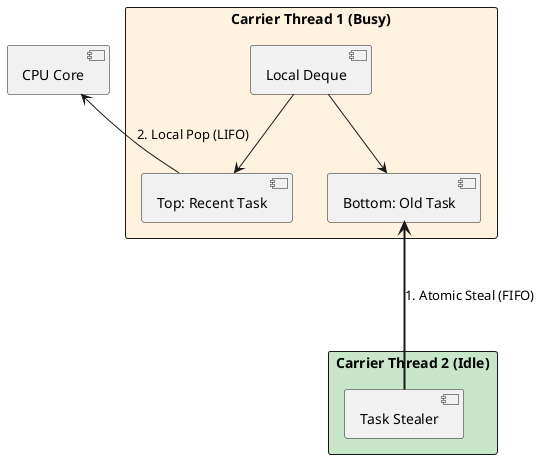

# 03: The Concurrency Revolution and ForkJoinPool


## The Critical Dialogue


**Student:** Our database response time is 500ms. CPU usage is only 5 percent, but the server is out of memory and crashing under high load. How can we be OOM if we aren't doing any work?


**Principal:** You are paying the **OS Thread Tax**. Every request sits on an OS thread costing 1MB. You have 1GB of RAM occupied by idle but expensive threads. **Project Loom (Virtual Threads)** fixes this by decoupling tasks from physical threads. We are moving from a "Fixed Fleet" to a "Gig Economy" of threads. But to manage these millions of threads, the JVM needs a specialized engine: the **ForkJoinPool**.


---


## 1. The Engine of Loom: ForkJoinPool Internals


### 1.1 Beyond Standard Thread Pools


The `ForkJoinPool` (FJP) is the scheduler for Virtual Threads. Unlike standard `ThreadPoolExecutor` which has a single shared queue (a bottleneck), the FJP uses **Work-Stealing**.


**How it works: Atomic Deque Mechanics**
Every Carrier Thread has its own local double-ended queue (**deque**).
. **LIFO (Local):** A thread always works on its own most recent tasks first to maintain CPU cache warmth.
. **FIFO (Stealing):** When a thread is idle, it steals a task from the **bottom** of another busy thread's deque. 


> [!abstract] Source Archaeology: ForkJoinPool.java
> Inside the OpenJDK, the `WorkQueue` uses a `volatile` array. The "steal" operation is performed using `VarHandle.compareAndSet`.
> . **The Physics:** This ensures that two idle threads don't steal the same task from a victim thread. 
> . **Zero Locks:** The FJP is almost entirely lock-free, using atomic hardware instructions to move tasks between threads.





---


## 2. Structured Concurrency: Fleet-Wide Reliability


### 2.1 Coordinated Tasks with StructuredTaskScope


A Principal never uses "Fire and Forget" threads. We use **Structured Concurrency** to ensure that sub-tasks are cleaned up if the parent fails.


**Principal Implementation: The Enrichment Pipeline**
```java
public OrderResult enrichOrder(Order order) throws Exception {
    // Treat sub-tasks as a single unit of work
    try (var scope = new StructuredTaskScope.ShutdownOnFailure()) {
        Subtask(Inventory) inventory = scope.fork(() -> inventoryClient.check(order));
        Subtask(RiskScore) risk = scope.fork(() -> riskEngine.evaluate(order));

        // Hard Deadline for the entire fleet-wide request
        scope.joinUntil(Instant.now().plusMillis(500));
        scope.throwIfFailed(); // Atomic failure propagation

        return new OrderResult(inventory.get(), risk.get());
    }
}
```


---


## 3. Context Propagation: ScopedValues


### 3.1 Lightweight Metadata for Millions of Threads


In a distributed system, you must propagate **Trace IDs**. `ThreadLocal` is dangerous with millions of threads because it is mutable and leaks memory. `ScopedValue` is immutable and strictly bounded.


```java
private static final ScopedValue(String) TRACE_ID = ScopedValue.newInstance();

public void handleIngestion() {
    ScopedValue.where(TRACE_ID, "TX-99").run(() -> {
        // Any sub-task in the fleet can now see the TraceID
        logger.info("Ingesting Order " + TRACE_ID.get());
        ledger.save();
    });
}
```


---


## 4. Observability: Detecting Pinned Threads


### 4.1 Programmatic Diagnosis via JFR


If a Virtual Thread enters a `synchronized` block, it becomes **Pinned**. A Principal automates detection using the **JFR Streaming API**.


```java
// Principal Implementation: Build-Pipeline Governance
public class PinningMonitor {
    public static void start() {
        try (var stream = new RecordingStream()) {
            stream.onEvent("jdk.VirtualThreadPinned", event -> {
                Duration duration = event.getDuration();
                String trace = event.getStackTrace().toString();
                System.err.printf("WARNING: Thread Pinned for %s! \nTrace: %s", 
                                  duration, trace);
            });
            stream.startAsync();
        }
    }
}
```


---


## 🧵 The GOL Challenge: Phase 3 (Saturation)


**Context:** The Ledger enrichment calls 3 external APIs. One is slow. We must maintain fleet visibility and ensure the FJP is not starved.


**The Task:**


. **Migration:** Refactor the order ingestion layer to use a Virtual Thread Executor.


. **Resilience:** Implement the `enrichOrder` method using `StructuredTaskScope`. Ensure that if any API call takes > 500ms, the entire request is rejected and all sub-tasks are cancelled.


. **Observability:** Integrate the `PinningMonitor` class into your stress tests. Refactor any `synchronized` blocks into `ReentrantLock` to enable unmounting.


---


## 🧠 Principal's Inquiry


. **Work-Stealing:** Why does stealing from the **bottom** of the deque minimize lock contention compared to stealing from the top?


. **Freeze & Thaw:** Explain the **Continuation** mechanics. Where are the stack frames stored when a Virtual Thread is unmounted?


. **Carrier Starvation:** What happens if your Kubernetes pod is restricted to 1 CPU core? How does the FJP handle `parallelism=1`?


**Principal Summary:** Concurrency is about **Resource Multiplexing**. A Principal understands the atomic mechanics of the scheduler to prevent bottlenecks at millions of threads.
