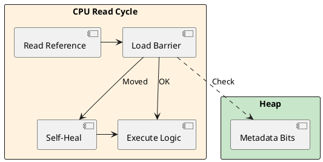

# 04: High-Performance JVM and Cloud Efficiency


## The Critical Dialogue


**Student:** Our Ledger startup time is 15 seconds. In Kubernetes, our Horizontal Pod Autoscaler is too slow. When they are running, our P99 latency spikes during GC. Is Java just bad for the cloud?


**Principal:** You are using a Runtime designed for 24/7 Monoliths. We need a **Cloud-Native** mindset. We will use **Generational ZGC** to kill GC pauses and **GraalVM Native Images** to achieve "Instant-On" performance. We are moving from a long-distance runner to a fleet of sprinters. But a Principal knows that "Native" isn't always better—you trade **Peak Throughput** for **Startup Speed**.


---


## 1. Modern Garbage Collection: Generational ZGC


### 1.1 Achieving Sub-Millisecond Pauses


**What is it?**
A scalable, low-latency collector that performs work concurrently with the application.


**How it works: Load Barriers and Assembly**
ZGC uses **Colored Pointers**. When your code reads a reference, the JIT compiler injects a **Load Barrier**—a small piece of assembly code.


> [!abstract] Machine Layer: The Assembly Barrier
> For a ZGC read, the JIT might inject:
> ```assembly
> test rax, [r15 + 0x10]  ; Check the 'color' bits in the address metadata
> jnz  resolve_pointer    ; If color is wrong (object moved), jump to healing
> ```
> **The Physics:** This happens in **~1-2 CPU cycles**. The barrier "fixes" the pointer if the GC moved the object, allowing the GC to work while the city stays moving.





---


## 2. GraalVM & Native Images: The JIT vs. AOT Trade-off


### 2.1 The Speculative Optimization Gap


**Why do we care? (The Netflix Lesson)**
Standard Java (JIT) uses **Speculative Optimization**. It monitors the code and says "99 percent of the time, this is an `ArrayList`," and it generates assembly that skips the class-checks. If the assumption fails, it "de-optimizes."


**GraalVM (AOT)** cannot do this. It must be conservative because of the **Closed World Assumption**.


| Feature | standard JIT JVM | GraalVM Native Image |
| :--- | :--- | :--- |
| **Startup** | Seconds (Slow) | Milliseconds (Instant) |
| **Peak Throughput** | **Higher** (Speculative JIT) | High (Static AOT) |
| **Warm-up Tax** | High CPU during JIT | **Zero** |


---


## 3. Java Flight Recorder: Programmatic Telemetry


### 3.1 Custom Events for Fleet Observability


A Principal at Netflix or Google writes custom JFR events to track domain-specific SLOs with near-zero overhead.


```java
// Principal Implementation: Custom SLO Tracking
@Label("Ledger Transaction")
@Name("com.gol.Transaction")
@StackTrace(false) // Reduce overhead further
public class TransactionEvent extends jdk.jfr.Event {
    @Label("Order ID") String orderId;
    @Label("Amount") long amount;
    @Label("Is Fraud") boolean isFraud;
}

public void process(Order o) {
    var event = new TransactionEvent();
    event.orderId = o.id();
    event.begin();
    try {
        doProcess(o);
    } finally {
        event.commit();
    }
}
```


---


## 🧵 The GOL Challenge: Phase 4 (Saturation)


**Context:** The Ledger is moving to a serverless function. We must optimize for both startup and peak load.


**The Task:**


. **Speculative Audit:** Use JFR to track "De-optimization" events. Identify if a specific interface in your Ledger has too many implementations, breaking the JIT's speculative inlining.


. **Custom Telemetry:** Implement the `TransactionEvent` code above. Record a 60-second trace and verify that the event overhead is < 0.1 percent.


. **Go Native:** Compile into a Native Image. Use **PGO (Profile Guided Optimization)** to bridge the throughput gap by providing a sample "Load Profile" to the AOT compiler.


---


## 🧠 Principal's Inquiry


. **Throughput Decay:** Why does a "warm" JIT compiler eventually outperform a static AOT binary in a 24/7 high-load scenario?


. **The ZGC Tax:** If every object read costs 2 extra CPU cycles for the Load Barrier, what is the impact on a service that performs 1 billion reads per second?


. **AOT Limitations:** How does the **Closed World Assumption** prevent the use of libraries that use runtime bytecode generation (like standard Spring CGLIB)?


**Principal Summary:** We engineer for the **Economic Model**. We choose the GC and the compilation strategy based on whether our system is a "Sprinting Courier" or a "Long-Distance Runner."
