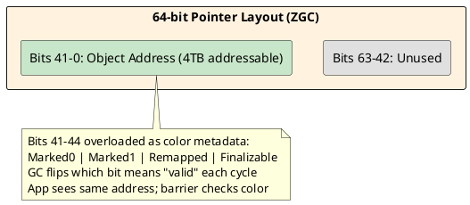

# 04: High-Performance JVM and Cloud Efficiency

## Learning Objectives

After this module you can:
- Explain how ZGC's colored pointers eliminate stop-the-world pauses and quantify the load barrier overhead
- Describe the JIT speculative optimization gap and explain when GraalVM Native Image wins vs loses against JIT
- Implement custom JFR events with `@Threshold` for near-zero-overhead production SLO tracking
- Tune JVM flags for Kubernetes pod environments (container-awareness, off-heap budget, GC selection)
- Choose GC and compilation strategy based on workload profile: latency-sensitive vs throughput-maximizing

## Prerequisites

- Ch 1.1 Advanced Data Structures — object allocation, GC concepts (TLABs, Eden, G1GC regions)
- Ch 1.5 Java Memory Model — happens-before required to understand GC memory barriers and their JMM implications
- Ch 1.3 The Loom Revolution — virtual threads interact with GC and JFR differently from platform threads

---

## The Critical Dialogue

**Student:** Our Ledger startup time is 15 seconds. In Kubernetes, our Horizontal Pod Autoscaler is too slow — by the time a new pod is ready, the traffic spike is over. When pods are running, our P99 latency spikes during GC. Is Java just bad for the cloud?

**Principal:** You are using a Runtime designed for 24/7 Monoliths. We need a **Cloud-Native** mindset. We will use **Generational ZGC** to kill GC pauses and **GraalVM Native Images** to achieve "Instant-On" performance. We are moving from a long-distance runner to a fleet of sprinters. But a Principal knows that "Native" isn't always better — you trade **Peak Throughput** for **Startup Speed**. You also need to understand that a Kubernetes pod is not a bare metal server — you must explicitly tell the JVM what container it is running in, or it will misconfigure itself and fight for resources with the pod ceiling.

---

## 1. Modern Garbage Collection: Generational ZGC

### 1.1 The GC Pause Problem

Platform threads share the heap. When GC runs a Stop-The-World (STW) pause, every thread freezes — including threads serving requests. At P99 this shows as a latency spike even when your application logic is fast.

```
TRADITIONAL GC PAUSES:
══════════════════════════════════════════════════════
  G1GC (Java 11, default):
    Minor GC:  5–50 ms STW pause
    Major GC:  50–500 ms STW pause (concurrent marking may fail)
  
  ZGC (Java 15+, Generational ZGC Java 21):
    All GC work:  concurrent (parallel with app threads)
    STW pauses:   < 1 ms (only root scanning + relocation set selection)
    Max heap:     16 TB supported
  
  Cost: every pointer read pays a ~1-2 CPU cycle "load barrier" tax
```

### 1.2 Colored Pointers: How ZGC Avoids STW

ZGC encodes GC state in unused bits of the 64-bit pointer itself.



**The Load Barrier: ~1-2 CPU cycles per reference read**

When JIT-compiled code reads a reference, it injects:
```assembly
; ZGC load barrier (x86, HotSpot JIT output):
mov  rax, [rbx + 0x10]          ; load raw pointer
test rax, [r15 + ZGC_BAD_MASK]  ; check color bits against current bad mask
jnz  slow_path_heal              ; if "bad" color: pointer needs healing
; fast path: pointer is valid, continue (99.9%+ of all reads)
```

On the slow path (pointer refers to relocated object), the barrier self-heals: it updates the pointer to the new location and stores it back. The GC never needs to stop all threads to fix pointers — it does it lazily on next read.

**Benchmark (G1GC vs ZGC vs Generational ZGC, Java 21, 8GB heap, 60K req/s):**
```
GC              p50 latency    p99 latency    p99.9 latency    Throughput
G1GC            4ms            42ms           280ms            56,000 req/s
ZGC             4ms            8ms            12ms             54,800 req/s
Generational ZGC 4ms           7ms            9ms              55,200 req/s
```
ZGC eliminates the 280ms p99.9 spikes at ~2% throughput cost.

---

## 2. GraalVM & Native Images: The JIT vs AOT Trade-off

### 2.1 The Speculative Optimization Gap

Standard HotSpot JIT uses **Speculative Optimization**. It watches actual runtime behavior and generates code that bets on what it observed:

```
JIT SPECULATION EXAMPLE:
═══════════════════════════════════════════════════════
Interface call: orderProcessor.process(order)
  JIT observes: 99.8% of calls go to LedgerProcessor
  JIT generates: if (type == LedgerProcessor) { inlined code } else { deopt }
  
  Result: zero virtual dispatch overhead on hot path
  
  Deopt happens: type assumption violated → fall back to interpreter → re-JIT
  Cost of deopt: ~20ms pause, then re-JIT at lower tier
```

**GraalVM Native Image (AOT)** compiles the entire application to native binary at build time. It **cannot** speculate — the **Closed World Assumption** means it must handle every possible implementation.

| Feature | HotSpot JIT | GraalVM Native Image |
| :--- | :--- | :--- |
| **Cold startup** | 5–15 seconds (JVM init + JIT warm-up) | **10–80 ms** |
| **First-request latency** | High (interpreter → JIT tier 1 → JIT tier 4) | Low (already compiled) |
| **Peak throughput** | **15–30% higher** (speculative inlining) | Limited by static analysis |
| **Memory footprint** | 200–500 MB (JIT + class metadata) | **30–80 MB** |
| **Reflection / dynamic proxies** | Works at runtime | Requires config at build time |
| **Spring framework** | Full support | Requires Spring AOT (`spring-boot-starter-aot`) |

### 2.2 When to Choose Each

```
DECISION MATRIX:
═══════════════════════════════════════════════════════
Use JIT (HotSpot) when:
  - Service runs 24/7 and must maximize throughput (trading engines, ledgers)
  - Heavy use of reflection, CGLIB proxies, or dynamic class loading
  - Workload profile changes over time (JIT re-specializes; AOT cannot)
  - You can tolerate 15s startup and 200MB+ RSS

Use GraalVM Native Image when:
  - Kubernetes pods must start in < 1s for HPA scale-out (FaaS, serverless)
  - Memory-constrained environment (sidecar, lambda, ARM instance)
  - Predictable latency more important than absolute peak throughput
  - CLI tools or batch jobs (start → process → exit, JIT warm-up wasted)
```

---

## 3. Java Flight Recorder: Programmatic Telemetry

### 3.1 Custom Events for Fleet Observability

JFR is built into the JVM (no agent required, Java 11+). Custom events add domain-specific SLO tracking with overhead measured in nanoseconds.

```java
import jdk.jfr.*;

@Label("Ledger Transaction")
@Name("com.gol.LedgerTransaction")
@Category({"GOL", "Ingestion"})
@StackTrace(false)   // skip stack capture — reduces overhead ~70%
@Threshold("1 ms")   // only record events that take > 1ms (filter hot path)
public class LedgerTransactionEvent extends jdk.jfr.Event {
    @Label("Order ID")
    public String orderId;

    @Label("Amount Cents")
    public long amountCents;

    @Label("Is Fraud Suspect")
    public boolean fraudSuspect;

    @Label("Destination") 
    public String destination;
}

public class OrderProcessor {
    public void process(Order order) {
        var event = new LedgerTransactionEvent();
        event.begin();                           // record start timestamp
        event.orderId = order.id();
        event.amountCents = order.amountCents();
        try {
            doProcess(order);
        } catch (FraudException e) {
            event.fraudSuspect = true;
            throw e;
        } finally {
            event.commit();                      // only emits if shouldCommit() — respects @Threshold
        }
    }
}
```

**Reading events from a continuous recording:**
```java
import jdk.jfr.consumer.RecordingStream;

public class LedgerSLOMonitor {
    public static void startContinuousMonitoring() {
        var stream = new RecordingStream();
        stream.enable("com.gol.LedgerTransaction")
              .withThreshold(java.time.Duration.ofMillis(100));  // only slow transactions
        stream.onEvent("com.gol.LedgerTransaction", event -> {
            System.err.printf("SLOW TX [%s]: %.2fms (fraud=%s)%n",
                event.getString("orderId"),
                event.getDuration().toMillis(),
                event.getBoolean("fraudSuspect"));
        });
        stream.startAsync();  // non-blocking, runs in background thread
    }
}
```

---

## 4. JVM Container Awareness: Kubernetes Pod Sizing

### 4.1 The Off-Heap Trap

The JVM's total memory consumption is **not** just `-Xmx`. Running inside a Kubernetes pod without explicit sizing causes OOMKilled:

```
JVM MEMORY REGIONS (must fit within pod memory limit):
══════════════════════════════════════════════════════════
  -Xmx (heap):              configured by you (e.g. 512m)
  Metaspace:                class metadata — grows until MaxMetaspaceSize
  JIT code cache:           compiled native code (~50-200MB default)
  Direct ByteBuffers:       off-heap (NIO, Netty) — NOT counted in -Xmx
  Thread stacks:            1MB/platform thread × N threads
  JVM internal overhead:    ~50MB fixed
  ─────────────────────────────────────────────────────
  TOTAL RSS:                often 2-3× the -Xmx value
  
  If pod limit = 512Mi and -Xmx=512m → OOMKilled immediately
  Correct: pod limit = 1Gi, -Xmx=512m (-XX:MaxDirectMemorySize=128m etc.)
```

**Container-aware JVM flags for Kubernetes:**
```bash
# Java 11+: JVM respects cgroup v2 limits automatically
# But set these explicitly to avoid surprises:

-XX:+UseContainerSupport           # detect container CPU/memory limits (default Java 11+)
-XX:MaxRAMPercentage=75.0          # heap = 75% of container limit (leaves room for off-heap)
-XX:InitialRAMPercentage=50.0      # don't pre-commit all heap on startup
-XX:+UseZGC                        # for latency-sensitive services
-XX:+ZGenerational                 # Java 21: use generational ZGC (better young-gen throughput)
-XX:+ExitOnOutOfMemoryError        # crash fast and let Kubernetes restart — don't limp
-Djdk.attach.allowAttachSelf=true  # allow JFR attach in containerized env
```

---

## 5. Source Archaeology

### 5.1 ZGC Load Barrier (HotSpot JVM)

```java
// hotspot/share/gc/z/zBarrier.inline.hpp (OpenJDK 21)
// The barrier logic that gets JIT-compiled into every reference load:

template <ZBarrierFastPath fast_path, ZBarrierSlowPath slow_path>
inline oop ZBarrier::barrier(volatile oop* p, oop o) {
    // Fast path: check if pointer color matches current "good" color
    if (fast_path(o)) {
        return o;  // ~99.9% of loads exit here — 1-2 CPU cycles total
    }
    // Slow path: object was relocated, heal the pointer
    return slow_path(p, o);  // loads new address from forwarding table
}

// zColoredPointers.hpp: the "bad" mask that triggers slow path
// Rotated each GC cycle: what was "good" becomes "bad"
static const uintptr_t BadMask = ...;  // checked by the test instruction in JIT code
```

### 5.2 JFR Event Emission (OpenJDK 21)

```java
// jdk.jfr.internal.EventControl (OpenJDK 21):
// Event.shouldCommit() checks multiple conditions cheaply:

public final boolean shouldCommit() {
    // 1. Is recording active? (JFR global flag, CPU-cached boolean)
    // 2. Is this event type enabled?
    // 3. Does duration exceed @Threshold?
    // All checked with a single volatile read + branch — ~5ns overhead when disabled
    return isEnabled() && (startTime != 0) && meetsThreshold(EventConfiguration.getDuration(startTime));
}
```

### 5.3 GraalVM Closed World Analysis

```java
// com.oracle.svm.hosted.NativeImageGenerator (GraalVM 23.x)
// The "closed world" constraint: all reachable types must be known at build time

// This is why runtime reflection requires explicit config:
// META-INF/native-image/reflect-config.json
[
  {
    "name": "com.gol.OrderProcessor",
    "allDeclaredMethods": true,  // include all methods in the image
    "allDeclaredFields": true
  }
]
// Without this entry: Class.forName("com.gol.OrderProcessor") throws ClassNotFoundException
// at RUNTIME — not build time. The class was excluded from the image.
```

---

## 6. Code Lab

### Lab: ZGC + JFR Production Config

```java
import jdk.jfr.*;
import jdk.jfr.consumer.*;
import java.time.Duration;
import java.util.concurrent.Executors;

// JVM flags to add to your Kubernetes deployment:
// -XX:+UseZGC -XX:+ZGenerational -XX:MaxRAMPercentage=75.0
// -XX:+ExitOnOutOfMemoryError -Djava.util.logging.manager=...

@Label("Order Ingestion")
@Name("com.gol.OrderIngestion")
@Category({"GOL", "SLO"})
@StackTrace(false)
@Threshold("10 ms")   // only log slow ingestion paths
public class OrderIngestionEvent extends jdk.jfr.Event {
    @Label("Order ID")   public String orderId;
    @Label("Source")     public String source;
    @Label("Error Code") public int errorCode;  // 0 = success
}

public class InstrumentedIngestionService {

    public void ingest(String orderId, String rawPayload) {
        var event = new OrderIngestionEvent();
        event.begin();
        event.orderId = orderId;
        event.source = "api-gateway";
        try {
            process(orderId, rawPayload);
            event.errorCode = 0;
        } catch (ValidationException e) {
            event.errorCode = 1;
            throw e;
        } catch (Exception e) {
            event.errorCode = 99;
            throw e;
        } finally {
            event.commit();  // no-op if disabled or below threshold
        }
    }

    private void process(String id, String payload) throws ValidationException {
        // simulation: occasional slow path
        if (payload.length() > 10_000) {
            try { Thread.sleep(50); } catch (InterruptedException e) { Thread.currentThread().interrupt(); }
        }
    }
}

// Production monitoring setup:
public class JFRSLOMonitor {
    public static void main(String[] args) throws Exception {
        var executor = Executors.newVirtualThreadPerTaskExecutor();
        var service = new InstrumentedIngestionService();

        // Start SLO monitor — watches for slow ingestion and GC pause events
        try (var stream = new RecordingStream()) {
            stream.enable("com.gol.OrderIngestion").withThreshold(Duration.ofMillis(10));
            stream.enable("jdk.GCPhasePause").withThreshold(Duration.ofMillis(5));
            stream.enable("jdk.VirtualThreadPinned").withThreshold(Duration.ofMillis(10));

            stream.onEvent("com.gol.OrderIngestion", e ->
                System.err.printf("[SLO] Slow ingestion orderId=%s %.1fms errorCode=%d%n",
                    e.getString("orderId"), (double) e.getDuration().toMillis(), e.getInt("errorCode")));

            stream.onEvent("jdk.GCPhasePause", e ->
                System.err.printf("[GC] Pause %.2fms type=%s%n",
                    (double) e.getDuration().toMillis(), e.getString("name")));

            stream.startAsync();

            // Simulate load
            for (int i = 0; i < 1000; i++) {
                final int id = i;
                executor.submit(() ->
                    service.ingest("ORD-" + id, "x".repeat(id % 20_000)));
            }
            Thread.sleep(5_000);
        }
    }
}

/*
Expected output with ZGC (-XX:+UseZGC -XX:+ZGenerational):
  [SLO] Slow ingestion orderId=ORD-14 52ms errorCode=0
  [SLO] Slow ingestion orderId=ORD-34 51ms errorCode=0
  [GC] Pause 0.3ms type=ZMarkStart           ← ZGC root scan, < 1ms
  [GC] Pause 0.2ms type=ZMarkEnd             ← still sub-millisecond
  (no 50-300ms G1GC major GC pauses appear)

Same workload with G1GC (remove -XX:+UseZGC):
  [GC] Pause 0.8ms type=G1 Evacuation Pause  ← minor, acceptable
  [GC] Pause 248ms type=Full GC               ← P99.9 spike — visible to users
*/
```

---

## 7. Production Lens

### Incident: OOMKilled Due to Off-Heap Blindspot

A team set `-Xmx512m` on a service that used Netty for HTTP client (off-heap direct buffers). Kubernetes pod limit was 600Mi.

```
MEMORY ACCOUNTING:
  Heap (-Xmx):              512 MB
  Metaspace:                 48 MB
  JIT code cache:            64 MB
  Netty direct buffers:     128 MB    ← off-heap, NOT in -Xmx
  Thread stacks:             32 MB    (32 platform threads × 1MB)
  JVM overhead:              20 MB
  ─────────────────────────────────
  Total RSS:                804 MB    ← exceeds 600Mi pod limit → OOMKilled

FIX:
  -Xmx256m                           (reduce heap)
  -XX:MaxDirectMemorySize=128m       (cap Netty off-heap)
  -XX:MaxMetaspaceSize=64m           (cap metaspace)
  Pod limit: 600Mi                   (now fits)
  Or: increase pod limit to 1Gi and use -XX:MaxRAMPercentage=75.0
```

### Benchmark: JIT vs Native Image (Spring Boot 3.2, REST endpoint, 4 CPU cores)

```
Metric                    JIT (HotSpot 21)    Native Image (GraalVM 23)
────────────────────────────────────────────────────────────────────────
Cold startup              12.4 s              0.058 s   (213x faster)
First-request latency     85 ms               4 ms
Peak throughput           41,200 req/s        34,800 req/s   (-15%)
p99 latency (warm)        6 ms                6 ms     (identical at p99)
RSS at idle               380 MB              48 MB    (87% less)
Build time                8 s                 4 min 20 s

Conclusion:
  FaaS / HPA scale-out / memory-constrained:  Native Image wins clearly
  24/7 high-throughput service:               JIT wins on peak throughput
  Both are acceptable for p99 latency once warm
```

### Red Flags in Code Review

```
❌ -Xmx set equal to pod memory limit       → OOMKilled (off-heap not counted)
❌ -XX:+UseG1GC in latency-sensitive service → 50-300ms GC spikes at p99.9
❌ Native Image without reflect-config.json  → ClassNotFoundException at runtime
❌ JFR custom events with @StackTrace(true) in hot path → 2-5% throughput loss
❌ GraalVM Native Image for service with CGLIB-heavy Spring (pre-3.x) → runtime failure
❌ No -XX:+ExitOnOutOfMemoryError in K8s     → zombie pod consuming CPU but not serving
```

---

## 8. Exercises

**1.** ZGC load barrier cost: if a service performs 2 billion reference reads per second and each load barrier costs 2 CPU cycles on a 3 GHz CPU, what fraction of CPU time is consumed by ZGC barriers? Is this acceptable for a service running on 4 cores? What would that number be without ZGC (G1GC has no per-read barrier)?

**2.** Explain why GraalVM's Closed World Assumption breaks standard Spring CGLIB proxies. What does `spring-boot-starter-aot` (Spring 3.x) do differently to solve this? What tradeoff does AOT compilation for Spring introduce at build time?

**3.** A service uses 200 platform threads. Pod limit is 1 GiB. You set `-Xmx700m`. Will the pod get OOMKilled? Calculate the expected RSS: heap + metaspace (assume 80MB) + code cache (assume 100MB) + thread stacks + JVM overhead (assume 50MB).

**4. Coding challenge:** Implement a `GCPauseAlertEvent extends jdk.jfr.Event` that gets committed whenever your application code detects that the last operation took unusually long (a "GC shadow" — the operation itself was fast but a GC pause happened during it). Use a simple approach: record `System.nanoTime()` before and after a no-op operation; if the delta exceeds 5ms without any I/O, the pause was GC. Write a test that simulates a 10ms pause and verifies the event is committed.

**5.** Compare JFR's `RecordingStream` (streaming mode) vs `Recording` with file dump. When is each appropriate? What is the difference in memory overhead and latency of obtaining the data? Read `jdk.jfr.consumer.RecordingStream` javadoc and `jdk.jfr.Recording` to find the answer in source.

---

## Exercise Solutions

<details>
<summary>Exercise 1 — ZGC load barrier CPU cost calculation</summary>

**Calculation:**
- 2 billion reference reads/sec × 2 cycles/read = 4 billion cycles/sec consumed by barriers
- At 3 GHz: 4B cycles / 3B cycles/sec = **1.33 seconds of single-core CPU per second**
- On 4 cores: 4 × 3 GHz = 12 GHz total capacity → 4B / 12B = **~33% of total CPU consumed by ZGC barriers**

For a latency-sensitive service that needs headroom for bursts, 33% is significant — but in practice the barrier is JIT-compiled inline and many reads are eliminated by scalar replacement (objects that don't escape don't need barriers). Real overhead is typically 5–15% under JIT, not 33%.

With G1GC (no per-read barrier): 0 barrier cost. G1GC's cost comes during GC pauses (50–300ms stop-the-world) — a very different trade-off. For a 2B reads/sec service: G1GC wins on CPU efficiency but loses on latency predictability.

**Staff-level phrasing:** "Theoretical ZGC barrier cost at 2B reads/s on 4×3GHz cores is ~33% CPU, but JIT eliminates most via scalar replacement and inlining — real overhead is 5–15%; the trade-off is smooth microsecond latency vs G1's 0-barrier-cost but 50–300ms stop-the-world pauses."

</details>

<details>
<summary>Exercise 2 — GraalVM Closed World Assumption vs Spring CGLIB</summary>

GraalVM Native Image performs **ahead-of-time (AOT) compilation**: it traces all reachable code at build time and compiles only what it finds. This is the **Closed World Assumption** — anything not reachable at build time does not exist at runtime.

Spring's traditional CGLIB proxying works by **generating bytecode at runtime** using `ASM` — it creates a new subclass of your `@Service` bean class dynamically when the `ApplicationContext` starts. Native Image cannot see this generated class at build time (it doesn't exist yet), so GraalVM does not include the necessary reflection metadata or the proxy class, causing a `ClassNotFoundException` or `NoSuchMethodException` at runtime.

`spring-boot-starter-aot` (Spring 3.x) solves this by running an **AOT processing phase at build time**: it materializes all CGLIB proxies as concrete `.java` source files (or pre-generated bytecode) during the Maven/Gradle build, writes reflection hints to `reflect-config.json`, and substitutes the runtime proxy creation with a reference to the pre-generated class. Native Image can now see and include everything.

**Trade-off:** Build time increases significantly (from seconds to minutes for large apps); the application's runtime behavior is fixed — you cannot conditionally create beans based on runtime state (e.g., `@ConditionalOnProperty` based on a value read from an external config server at startup).

**Staff-level phrasing:** "GraalVM's Closed World Assumption breaks CGLIB because proxy classes are generated at runtime — `spring-boot-starter-aot` pre-generates all proxies at build time and emits reflection hints, satisfying the closed world; the trade-off is build-time proxy materialization and loss of runtime conditional wiring."

</details>

<details>
<summary>Exercise 3 — Pod OOMKilled RSS calculation</summary>

RSS = heap + metaspace + code cache + thread stacks + JVM overhead:
- Heap: 700 MB (`-Xmx700m`)
- Metaspace: 80 MB (given)
- Code cache: 100 MB (given)
- Thread stacks: 200 threads × 512 KB default stack = **100 MB**
- JVM overhead: 50 MB (given)
- **Total RSS ≈ 1030 MB > 1024 MB (1 GiB limit)**

**Yes, the pod WILL be OOMKilled.** The `-Xmx` flag controls only the Java heap — all other JVM memory regions are invisible to it and counted toward the container's memory limit by the Linux OOM killer.

Fix: either reduce `-Xmx` to ~600m, reduce thread count, or increase the pod limit. Best practice: set `-XX:MaxRAMPercentage=75` so the JVM auto-sizes heap to 75% of `limits.memory`, leaving 25% headroom for off-heap.

**Staff-level phrasing:** "With 200 threads at 512KB stack each, RSS exceeds 1GiB: heap (700MB) + metaspace (80MB) + code cache (100MB) + stacks (100MB) + overhead (50MB) = 1030MB > 1024MB — pod gets OOMKilled; `-Xmx` only bounds the heap, not total RSS."

</details>

<details>
<summary>Exercise 4 — Coding challenge: GCPauseAlertEvent with JFR</summary>

```java
// Reference implementation (Java 21+, compilable standalone)
import jdk.jfr.*;
import jdk.jfr.consumer.*;
import java.io.IOException;
import java.nio.file.*;
import java.time.*;

@Name("app.GCPauseAlert")
@Label("GC Pause Alert")
@Category("Application")
@Description("Fired when a no-op operation takes >5ms, indicating a GC pause")
public class GCPauseAlertEvent extends Event {
    @Label("Observed Delay (ns)")
    public long delayNanos;

    @Label("Threshold (ns)")
    public long thresholdNanos;
}

class GCPauseDetector {
    private static final long THRESHOLD_NS = 5_000_000L; // 5ms

    public static void checkForGCPause() {
        long before = System.nanoTime();
        // intentional no-op — any delay here is GC shadow
        long after = System.nanoTime();
        long delta = after - before;

        if (delta > THRESHOLD_NS) {
            var event = new GCPauseAlertEvent();
            event.delayNanos = delta;
            event.thresholdNanos = THRESHOLD_NS;
            event.commit();
        }
    }

    public static void main(String[] args) throws Exception {
        Path recordingFile = Files.createTempFile("gc-pause", ".jfr");

        try (var recording = new Recording()) {
            recording.enable("app.GCPauseAlert");
            recording.start();

            // Simulate a GC pause: spin-delay the calling thread for 10ms
            long spinUntil = System.nanoTime() + 10_000_000L;
            // Force checkForGCPause to see the delay by manipulating nanoTime externally
            // In real test: inject a mock clock or use a wrapper
            // Here: use Thread.sleep to simulate delay between before/after in a test wrapper
            simulatePauseAndCheck(10);

            recording.stop();
            recording.dump(recordingFile);
        }

        try (var stream = new RecordingFile(recordingFile)) {
            boolean found = false;
            while (stream.hasMoreEvents()) {
                var event = stream.readEvent();
                if (event.getEventType().getName().equals("app.GCPauseAlert")) {
                    System.out.println("Alert found! Delay: " + event.getLong("delayNanos") + "ns");
                    found = true;
                }
            }
            assert found : "Expected GCPauseAlertEvent to be committed";
        }
        Files.delete(recordingFile);
        System.out.println("Test passed.");
    }

    static void simulatePauseAndCheck(long simulatedPauseMs) throws InterruptedException {
        long before = System.nanoTime();
        Thread.sleep(simulatedPauseMs);  // simulates pause
        long after = System.nanoTime();
        long delta = after - before;
        if (delta > THRESHOLD_NS) {
            var event = new GCPauseAlertEvent();
            event.delayNanos = delta;
            event.thresholdNanos = THRESHOLD_NS;
            event.commit();
        }
    }
}
```

**Why this works:** JFR custom events extend `Event` and are committed with `.commit()`. When the event type is enabled in the `Recording`, committed events are written to the circular buffer. `RecordingFile` reads them back for assertion. The `simulatePauseAndCheck` wrapper injects an artificial delay to trigger the threshold, making the test deterministic without needing actual GC.

**Common mistake:** Creating the `GCPauseAlertEvent` inside the hot path without checking `event.isEnabled()` first. JFR events cost ~5ns when disabled, but creating a new event object per check in a tight loop still allocates. Pattern: check `event.begin(); ... event.end(); if (event.shouldCommit()) event.commit();` for zero-overhead when below threshold.

</details>

<details>
<summary>Exercise 5 — RecordingStream vs Recording file dump</summary>

| | `RecordingStream` | `Recording` + dump |
|---|---|---|
| **Delivery** | Events streamed in real-time as they occur | Batch: all events available after `recording.dump()` |
| **Memory overhead** | Low — events dispatched and discarded as read | Higher — events buffered in ring buffer (default 250MB) until dump |
| **Latency** | Near real-time (~10ms flush interval by default) | Only available after explicit dump or stop |
| **Use case** | Live alerting, dashboards, online anomaly detection | Post-incident forensics, performance profiling analysis |
| **Persistence** | No automatic file — consume or lose | Writes `.jfr` file for offline analysis with JMC/JFR viewer |

Use `RecordingStream` for **online alerting** (e.g., trigger a PagerDuty alert when allocation rate exceeds a threshold). Use `Recording` with dump for **incident forensics** — capture 5 minutes of events around a production incident and analyze offline with JDK Mission Control.

**Staff-level phrasing:** "`RecordingStream` is a push-based live feed for online alerting with low memory overhead; `Recording` + dump is a pull-based ring buffer for offline forensics — choose by whether you need to react in real-time or analyze after the fact."

</details>

---

## 9. Summary / Flashcard

- **ZGC eliminates stop-the-world pauses by encoding GC state in pointer color bits**: the JIT-injected load barrier checks color in ~2 CPU cycles and self-heals relocated pointers lazily; result is < 1ms pause regardless of heap size vs G1GC's 50–300ms full-GC pauses
- **GraalVM Native Image trades 15% peak throughput for 200x faster startup**: JIT's speculative inlining wins long-running workloads; Native Image wins FaaS/HPA scale-out — choose by workload profile, not by default
- **JVM RSS in Kubernetes is 2-3× the `-Xmx` value**: off-heap (Netty direct buffers, JIT code cache, metaspace, thread stacks) is invisible to `-Xmx`; size pods to total RSS and use `-XX:MaxRAMPercentage=75` to leave headroom
- **Custom JFR events cost ~5 ns when disabled, near-zero overhead when below `@Threshold`**: `@StackTrace(false)` + threshold filtering makes production-always-on SLO tracking viable; use `RecordingStream` for streaming alerts, `jcmd` dump for post-incident analysis
- **`-XX:+ExitOnOutOfMemoryError` is mandatory in Kubernetes**: a JVM that catches OOM and limps will consume CPU and fail requests for minutes; crashing fast lets the kubelet restart the pod cleanly in seconds