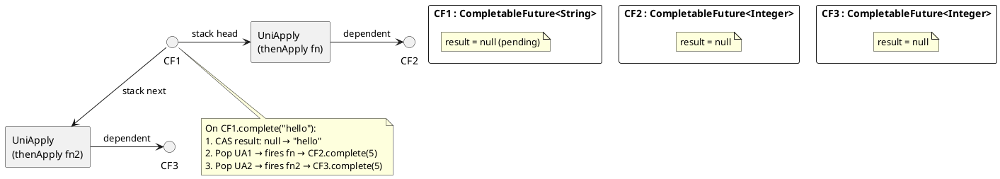

# 07: CompletableFuture Internals & Async Composition

## Learning Objectives

After this module you can:
- Explain how `CompletableFuture` stores completion stages as a tree of `UniCompletion` nodes
- Choose correctly between `thenApply`/`thenApplyAsync`, `thenCompose`, and `thenCombine` for a given composition problem
- Diagnose which thread executes each stage and why — including the "completing thread" trap
- Handle exceptions using `handle()`, `exceptionally()`, and `whenComplete()` and explain the difference between all three
- Identify performance pitfalls: blocking on CF in virtual threads, using `ForkJoinPool.commonPool()` for I/O

## Prerequisites

- Ch 1.3 Project Loom Revolution (virtual threads, ForkJoinPool — CF uses commonPool by default)
- Ch 1.5 Java Memory Model (happens-before: each `thenApply` registration creates an HB edge)
- Basic familiarity with `Runnable`, `Callable`, `ExecutorService`

---

## The Critical Dialogue

**Student:** I have a service that calls three external APIs. I used `CompletableFuture.allOf()` to run them in parallel, but under load response time gets worse, not better. And sometimes I lose exceptions — the future completes but I never see the error.

**Principal:** Two separate bugs. First: you are likely using `.thenApplyAsync()` without specifying an executor, which defaults to `ForkJoinPool.commonPool()`. That pool is shared with every `parallelStream()` call in the JVM — your three I/O calls compete with batch jobs for the same 7 threads. Second: exception loss is the classic `allOf()` trap. `allOf()` only completes exceptionally based on timing — if two futures succeed and one fails, the exception can be silently swallowed unless you explicitly collect it. Let me show you the internal mechanics that explain both.

---

## 1. Internal Model: Completion Tree

`CompletableFuture<T>` is a state machine with a linked stack of completion nodes.

```
INTERNAL STATE:
  result == null           → incomplete
  result == AltResult(ex)  → completed exceptionally
  result == value T        → completed normally

COMPLETION CHAIN (the 'stack' field):
  CF1 ─→ [UniApply node] ─→ CF2    (thenApply dependent)
      └→ [UniApply node] ─→ CF3    (second dependent, same CF1)

  When CF1.complete(v) is called:
    1. CAS result field from null → v
    2. Pop and fire each UniCompletion node
    3. Each node applies its function and completes its dependent CF
```



---

## 2. Thread Execution Model: Which Thread Runs My Stage?

This is the most misunderstood part of `CompletableFuture`.

### 2.1 The Three Cases

```
Case 1: CF already complete when thenApply() is called
  → The calling thread executes the function immediately (synchronously)

Case 2: CF not yet complete; completes later
  → The COMPLETING thread executes the function

Case 3: thenApplyAsync(fn, executor) used
  → Function is submitted to the given executor when CF completes
  → If no executor given: ForkJoinPool.commonPool()
```

```java
CompletableFuture<String> cf = new CompletableFuture<>();

// Thread A registers a stage BEFORE cf completes
cf.thenApply(s -> {
    System.out.println("Running on: " + Thread.currentThread().getName());
    return s.length();
});

// Thread B completes cf → Thread B also executes the thenApply function!
cf.complete("hello"); // Thread B prints: "Running on: pool-1-thread-2"
```

**Why this matters:** If Thread B is your Netty event loop or HTTP server thread, your business logic now runs on that critical thread. Use `thenApplyAsync(fn, executor)` to offload.

### 2.2 The `ForkJoinPool.commonPool()` Problem

```java
// ❌ I/O inside thenApplyAsync without explicit executor
CompletableFuture.supplyAsync(() -> httpClient.get(url))   // uses commonPool
    .thenApplyAsync(body -> parseJson(body));               // uses commonPool

// Problem: commonPool size = Runtime.availableProcessors() - 1
// On 8-core server: 7 threads shared between ALL:
//   - your thenApplyAsync I/O calls (block carrier threads)
//   - every parallelStream() in the JVM
//   - recursive ForkJoinTasks
// I/O blocks these 7 threads → all parallel work stalls

// ✅ Dedicated executor for I/O stages
ExecutorService ioExecutor = Executors.newVirtualThreadPerTaskExecutor(); // Java 21
CompletableFuture.supplyAsync(() -> httpClient.get(url), ioExecutor)
    .thenApplyAsync(body -> parseJson(body), ioExecutor);
```

---

## 3. Stage Operators: When to Use Which

### 3.1 `thenApply` vs `thenCompose`

```java
// thenApply: transform T → U synchronously (not async inside)
CompletableFuture<String> nameF = getUserIdAsync()
    .thenApply(id -> "User#" + id);          // id is a long, not a CF

// thenCompose: flatMap — next step is ALSO async (returns a CF)
CompletableFuture<User> userF = getUserIdAsync()
    .thenCompose(id -> fetchUserByIdAsync(id));  // fetchUserByIdAsync returns CF<User>

// ❌ WRONG: thenApply with CF-returning function → CF<CF<User>>
CompletableFuture<CompletableFuture<User>> nested = getUserIdAsync()
    .thenApply(id -> fetchUserByIdAsync(id)); // double-wrapped, cannot join cleanly
```

**Rule:** If your mapping function returns a `CompletableFuture<U>`, use `thenCompose`. Always.

### 3.2 `thenCombine` vs sequential `thenCompose`

```java
// thenCombine: PARALLEL — two independent CFs, combine results when both done
CompletableFuture<Inventory> inventory = fetchInventoryAsync(orderId);
CompletableFuture<RiskScore>  risk      = fetchRiskAsync(orderId);
// Both fetches start IMMEDIATELY and run concurrently

CompletableFuture<EnrichedOrder> enriched =
    inventory.thenCombine(risk, (inv, r) -> new EnrichedOrder(inv, r));

// thenCompose: SEQUENTIAL — second starts only after first finishes
CompletableFuture<User> user = fetchUserIdAsync()
    .thenCompose(id -> fetchUserProfileAsync(id)); // profile waits for id
```

---

## 4. Exception Handling: Three Operators

```java
CompletableFuture<String> cf = someFailingOperation();

// exceptionally(Function<Throwable, T>):
//   Only called on FAILURE. Recovers to a value. Returns CF<T>.
CompletableFuture<String> recovered = cf.exceptionally(ex -> "default-value");

// handle(BiFunction<T, Throwable, U>):
//   Always called (success OR failure). Can change type. Returns CF<U>.
CompletableFuture<String> handled = cf.handle((result, ex) -> {
    if (ex != null) return "error: " + ex.getMessage();
    return result.toUpperCase();
});

// whenComplete(BiConsumer<T, Throwable>):
//   Always called. SIDE-EFFECTS ONLY. Returns CF<T> with the SAME result/exception.
//   Does NOT recover — exception still propagates downstream.
CompletableFuture<String> observed = cf.whenComplete((result, ex) -> {
    if (ex != null) log.error("Failed", ex);
    else metrics.record(result);
});
// observed is exceptional if cf was exceptional — whenComplete didn't catch it
```

### 4.1 The `allOf()` Exception Trap

```java
// ❌ WRONG: exceptions silently lost
CompletableFuture<Void> all = CompletableFuture.allOf(cf1, cf2, cf3);
all.join();
// If cf2 failed but cf1 and cf3 succeeded:
//   allOf() completes normally (all three are done)
//   cf2's exception is trapped inside cf2 — nobody sees it

// ✅ CORRECT: check each future explicitly
CompletableFuture.allOf(cf1, cf2, cf3).thenRun(() -> {
    for (CompletableFuture<?> cf : List.of(cf1, cf2, cf3)) {
        if (cf.isCompletedExceptionally()) {
            cf.exceptionally(ex -> { log.error("Sub-task failed", ex); return null; });
        }
    }
});

// ✅ BEST for fan-out in Java 21+: StructuredTaskScope (see Ch 1.3)
// ShutdownOnFailure cancels siblings on first failure — no lost exceptions possible
try (var scope = new StructuredTaskScope.ShutdownOnFailure()) {
    var t1 = scope.fork(() -> api1.call());
    var t2 = scope.fork(() -> api2.call());
    scope.join().throwIfFailed(); // rethrows first exception, cancels the other
    return new Result(t1.get(), t2.get());
}
```

---

## 5. Source Archaeology

### 5.1 `CompletableFuture#thenApply` — the completion node chain

```java
// java.util.concurrent.CompletableFuture (OpenJDK 21, ~line 870)

public <U> CompletableFuture<U> thenApply(Function<? super T, ? extends U> fn) {
    return uniApplyStage(null, fn);  // null executor = run on completing thread
}

public <U> CompletableFuture<U> thenApplyAsync(Function<? super T, ? extends U> fn) {
    return uniApplyStage(defaultExecutor(), fn); // defaultExecutor = ForkJoinPool.commonPool()
}

private <V> CompletableFuture<V> uniApplyStage(Executor e, Function<?,?> f) {
    CompletableFuture<V> d = new CompletableFuture<>();
    Object r;
    if ((r = result) != null) {
        // CF already complete: apply immediately (or submit to executor)
        d.uniApply(r, f, null);
    } else {
        // CF not yet complete: push a UniApply node onto the stack
        unipush(new UniApply<T,V>(e, d, this, f));
        // unipush() uses a CAS loop — multiple threads can register
        // dependents simultaneously without blocking
    }
    return d;
}

// UniApply: a node in the completion tree
static final class UniApply<T,V> extends UniCompletion<T,V> {
    Function<? super T, ? extends V> fn;

    // Called by the completing thread (or submitted to executor)
    final CompletableFuture<V> tryFire(int mode) {
        CompletableFuture<V> d; CompletableFuture<T> a;
        Object r; Throwable x; Function<? super T,? extends V> f;
        // ... applies fn to source result, calls d.completeValue()
    }
}
```

**Key insight from source:** The `stack` field is a linked list of `UniCompletion` nodes. `unipush()` does a CAS on `stack`. The completing thread CAS-swaps `result` and then iterates the stack, firing each node — no global lock, fully concurrent.

---

## 6. Code Lab

### Lab 1: Parallel API fan-out with proper executor and exception handling

```java
import java.util.concurrent.*;
import java.util.List;

public class OrderEnrichmentService {

    // ❌ BEFORE: blocking .join(), lost exceptions, wrong default executor
    public EnrichedOrder enrichBad(Order order) throws Exception {
        var inv  = CompletableFuture.supplyAsync(() -> inventoryApi.get(order));  // commonPool!
        var risk = CompletableFuture.supplyAsync(() -> riskApi.get(order));       // commonPool!
        CompletableFuture.allOf(inv, risk).join(); // blocks calling thread + loses sub-exceptions
        return new EnrichedOrder(inv.join(), risk.join());
    }

    // ✅ AFTER: virtual thread executor, thenCombine, graceful degradation
    private final Executor ioExecutor = Executors.newVirtualThreadPerTaskExecutor();

    public CompletableFuture<EnrichedOrder> enrich(Order order) {
        var inv  = CompletableFuture.supplyAsync(() -> inventoryApi.get(order), ioExecutor);
        var risk = CompletableFuture.supplyAsync(() -> riskApi.get(order), ioExecutor);

        return inv.thenCombine(risk, EnrichedOrder::new)
            .handle((result, ex) -> {
                if (ex != null) {
                    log.error("Enrichment failed for {}: {}", order.id(), ex.getMessage());
                    return EnrichedOrder.fallback(order);
                }
                return result;
            });
    }

    record Order(String id) {}
    record Inventory(int stock) {}
    record RiskScore(double score) {}
    record EnrichedOrder(Inventory inventory, RiskScore risk) {
        static EnrichedOrder fallback(Order o) {
            return new EnrichedOrder(new Inventory(0), new RiskScore(1.0));
        }
    }
}
```

### Lab 2: Timeout with `orTimeout()` (Java 9+)

```java
private final Executor ioExecutor = Executors.newVirtualThreadPerTaskExecutor();

public CompletableFuture<String> fetchWithTimeout(String url) {
    return CompletableFuture
        .supplyAsync(() -> httpClient.get(url), ioExecutor)
        .orTimeout(500, TimeUnit.MILLISECONDS)   // completes exceptionally with TimeoutException
        .exceptionally(ex -> {
            if (ex instanceof TimeoutException) return "timeout-fallback";
            throw new CompletionException(ex);   // re-throw other errors
        });
}
```

### Lab 3: Retry with exponential backoff

```java
public <T> CompletableFuture<T> retry(
        Supplier<CompletableFuture<T>> task,
        int maxAttempts,
        Executor exec) {
    return attemptRetry(task, maxAttempts, 1, exec);
}

private <T> CompletableFuture<T> attemptRetry(
        Supplier<CompletableFuture<T>> task, int remaining, int attempt, Executor exec) {
    return task.get().exceptionallyCompose(ex -> {
        if (remaining <= 1) return CompletableFuture.failedFuture(ex);
        long delayMs = 100L * (1L << (attempt - 1));  // 100ms, 200ms, 400ms...
        return CompletableFuture.delayedExecutor(delayMs, TimeUnit.MILLISECONDS, exec)
            .execute(() -> {});  // schedule wakeup
        // Note: cleaner with ScheduledExecutorService.schedule() in production
        return CompletableFuture
            .supplyAsync(() -> null, CompletableFuture.delayedExecutor(delayMs, TimeUnit.MILLISECONDS))
            .thenCompose(ignored -> attemptRetry(task, remaining - 1, attempt + 1, exec));
    });
}
```

---

## 7. Production Lens

### Incident: Thread Pool Starvation via commonPool

At a fintech company, a batch processing job used `parallelStream()` while the HTTP layer used `CompletableFuture.supplyAsync()` without an explicit executor:

```
OBSERVED:
  Normal batch throughput:        50,000 items/min
  During peak HTTP traffic:       200 items/min  (96% drop)
  HTTP p99 latency:               120ms → 4,200ms

ROOT CAUSE:
  Both parallelStream() and supplyAsync() (no executor) share ForkJoinPool.commonPool()
  commonPool: 7 threads (8 cores - 1)
  Each HTTP call did 3 outbound I/O requests via thenApplyAsync()
  I/O blocked all 7 commonPool threads → parallelStream() starved

FIX:
  I/O operations: Executors.newVirtualThreadPerTaskExecutor()
  CPU operations: ForkJoinPool(Runtime.getRuntime().availableProcessors())

RESULT:
  Batch throughput: 48,000 items/min (restored)
  HTTP p99:         130ms (restored)
```

### Red Flags in Code Review

```
❌ thenApplyAsync() / supplyAsync() without explicit executor for I/O
   → competes with parallelStream() on commonPool

❌ cf.join() or cf.get() inside a virtual thread or reactive pipeline
   → defeats async; pins the carrier thread if inside synchronized or native

❌ CompletableFuture.allOf() without per-future exception check
   → exceptions lost when at least one sibling future succeeds

❌ thenApply(fn) where fn itself returns CompletableFuture<U>
   → produces CF<CF<U>>; should be thenCompose()

❌ Catching Throwable in exceptionally() without rethrowing fatal errors
   → swallows OutOfMemoryError, StackOverflowError
```

---

## GOL Challenge (v0.5)

> **System:** [Global Order Ledger](../GOL_ARCHITECTURE.md) | **Version:** v0.5 — Async Account Validation
> 
> **Requires:** GOL v0 (Ch 1.2) — you need the `LedgerEvent` hierarchy.

### Context

Before committing a `LedgerEvent` to the ledger, GOL must validate the account: check it exists, is active, and has sufficient balance (for Debit/Transfer). This validation hits the account service, which is a remote call. Under 50k writes/sec, blocking the calling thread for each validation would exhaust the thread pool.

### Task

**1. Implement async account validation**

```java
// AccountValidationService signature you must implement:
CompletableFuture<ValidationResult> validateAsync(LedgerEvent event, Executor executor);

// Requirements:
// - Use a virtual thread executor (NOT ForkJoinPool.commonPool())
// - Timeout after 500ms using orTimeout()
// - On timeout: return ValidationResult.TIMEOUT (do not throw)
// - On account not found: return ValidationResult.INVALID
// - On success: return ValidationResult.VALID with current balance
```

**2. Chain the validation with event processing**

```java
// Chain: validate → process → persist
// If validation times out: log the timeout, return a fallback response
// Use thenCompose (not thenApply) for the chaining — explain why in a comment
```

**3. Explain in one sentence**: why `orTimeout()` is safer than wrapping in a `try/catch InterruptedException` with `Thread.sleep()`.

### Expected Outcome

- Virtual thread executor used: `Executors.newVirtualThreadPerTaskExecutor()`
- `orTimeout(500, TimeUnit.MILLISECONDS)` — not `completeOnTimeout()`
- `thenCompose` used for the chain (flatMap semantics — avoids nested `CompletableFuture<CompletableFuture<T>>`)
- No `get()` calls that block platform threads

### Next GOL Challenge

v1 — Bootstrap GOL as a Spring Boot service (Ch 2.0)

---

## 8. Exercises

**1.** On which thread does the function in `cf.thenApply(fn)` run when (a) `cf` is already complete when `thenApply()` is called, and (b) `cf` completes later on Thread B? What changes if you use `thenApplyAsync(fn)`?

**2.** Draw the completion tree for this chain:
```java
CompletableFuture<Integer> result = getUserIdAsync()
    .thenCompose(id -> fetchUserAsync(id))
    .thenApply(user -> user.score());
```
How many `CompletableFuture` objects exist? What happens if `fetchUserAsync` completes exceptionally?

**3.** A colleague writes:
```java
CompletableFuture.allOf(cf1, cf2).join();
String r1 = cf1.join();
String r2 = cf2.join();
```
What silent bug exists if `cf1` completed exceptionally? Fix it using `handle()`.

**4. Coding challenge:** Implement `<T> CompletableFuture<T> firstSuccessful(List<CompletableFuture<T>> futures)` that returns the result of the **first** future to complete **successfully** (not exceptionally). If ALL fail, the returned CF should fail with the last exception. Do NOT use `anyOf()` — it completes on first done, including failures.

**5.** Why does `ForkJoinPool.commonPool()` have `availableProcessors() - 1` threads, not `availableProcessors()`? What is the -1 thread for? How does this relate to virtual thread carrier pools?

---

## Exercise Solutions

<details>
<summary>Exercise 1 — Which thread runs thenApply</summary>

**(a) `cf` already complete when `thenApply()` is called:**
The calling thread (the thread invoking `thenApply()`) executes `fn` immediately and synchronously. Since the future is already done, there is no waiting — the continuation runs inline in the thread that registered it.

**(b) `cf` completes later on Thread B:**
Thread B (the thread that calls `cf.complete(value)`) executes `fn`. When `complete()` is called, it triggers the completion chain, and all registered `thenApply` callbacks run in the completing thread before `complete()` returns.

**With `thenApplyAsync(fn)`:**
`fn` is submitted to `ForkJoinPool.commonPool()` (or the specified executor) regardless of when the CF completes. The completing thread posts a task and returns immediately — `fn` always runs in a pool thread, decoupled from both the completing thread and the registering thread.

Practical implication: a chain of `thenApply()` calls without `Async` can block a thread that calls `complete()` on an I/O future — all the CPU-bound transformations run in the I/O thread. This is a common performance bug.

**Staff-level phrasing:** "`thenApply` runs in the completing thread (or inline if already complete) — a chain of `thenApply` on an I/O-completing CF runs all transformations in the I/O thread; use `thenApplyAsync` to decouple CPU work from the completing thread."

</details>

<details>
<summary>Exercise 2 — Completion tree and exceptional path</summary>

```java
CompletableFuture<Integer> result = getUserIdAsync()        // CF1
    .thenCompose(id -> fetchUserAsync(id))                  // CF2 (wraps CF3 returned by fetchUserAsync)
    .thenApply(user -> user.score());                       // CF4
```

**CompletableFuture objects created:**
1. `getUserIdAsync()` returns CF1
2. `thenCompose(...)` creates CF2 (the outer compose stage)
3. `fetchUserAsync(id)` returns CF3 (the inner future produced by the compose fn)
4. `thenApply(...)` creates CF4

Total: **4 CompletableFuture objects** (CF1, CF2/composed-result, CF3, CF4).

**If `fetchUserAsync` completes exceptionally:**
CF3 completes with an exception. `thenCompose` propagates this exception to CF2 without invoking `thenApply`. CF4 inherits the exception. When the caller calls `result.join()` or `result.get()`, it throws `ExecutionException` wrapping the original exception. The `.thenApply()` function is never called.

**Staff-level phrasing:** "`thenCompose` creates a dependent stage that adopts the result or exception of the inner CF; an exception in `fetchUserAsync` skips all downstream `thenApply` stages and propagates to the terminal caller."

</details>

<details>
<summary>Exercise 3 — allOf with exceptional CF: the silent bug</summary>

```java
CompletableFuture.allOf(cf1, cf2).join();  // waits for both
String r1 = cf1.join();                     // THROWS if cf1 completed exceptionally
String r2 = cf2.join();                     // never reached
```

**Bug:** `allOf().join()` throws `CompletionException` if ANY of the component futures completed exceptionally. The `join()` call on `allOf` propagates the exception, and the subsequent `cf1.join()` is never reached. Additionally, `cf2.join()` is never reached either — both results are lost. In some frameworks this causes a silent hang or partial result.

Even if `allOf().join()` doesn't throw (depending on how `cf1`'s exception is handled), `cf1.join()` on an exceptionally completed CF throws `CompletionException` — same result.

**Fix with `handle()`:**
```java
CompletableFuture<String> safe1 = cf1.handle((result, ex) ->
    ex != null ? "default1" : result);
CompletableFuture<String> safe2 = cf2.handle((result, ex) ->
    ex != null ? "default2" : result);

CompletableFuture.allOf(safe1, safe2).join();
String r1 = safe1.join();  // always a value, never throws
String r2 = safe2.join();  // always a value, never throws
```

**Staff-level phrasing:** "`allOf().join()` re-throws the first exceptional completion — if either CF failed, subsequent individual `.join()` calls are unreachable; wrap each CF with `.handle()` to convert exceptions to default values before passing to `allOf`."

</details>

<details>
<summary>Exercise 4 — Coding challenge: firstSuccessful</summary>

```java
// Reference implementation (Java 21+, compilable standalone)
import java.util.*;
import java.util.concurrent.*;
import java.util.concurrent.atomic.*;

public class FirstSuccessful {

    public static <T> CompletableFuture<T> firstSuccessful(List<CompletableFuture<T>> futures) {
        if (futures.isEmpty()) {
            return CompletableFuture.failedFuture(new IllegalArgumentException("Empty list"));
        }

        CompletableFuture<T> result = new CompletableFuture<>();
        AtomicInteger remaining = new AtomicInteger(futures.size());
        AtomicReference<Throwable> lastException = new AtomicReference<>();

        for (CompletableFuture<T> f : futures) {
            f.whenComplete((value, ex) -> {
                if (ex == null) {
                    result.complete(value);     // first success wins; subsequent completes are no-ops
                } else {
                    lastException.set(ex);
                    if (remaining.decrementAndGet() == 0) {
                        result.completeExceptionally(lastException.get());
                    }
                }
            });
        }
        return result;
    }

    public static void main(String[] args) throws Exception {
        // All succeed — first one wins
        var futures = List.of(
            CompletableFuture.completedFuture("first"),
            CompletableFuture.completedFuture("second")
        );
        String r = firstSuccessful(futures).get();
        assert "first".equals(r) || "second".equals(r) : "Should get one of them";

        // First fails, second succeeds
        var mixed = List.of(
            CompletableFuture.<String>failedFuture(new RuntimeException("fail1")),
            CompletableFuture.completedFuture("success")
        );
        assert "success".equals(firstSuccessful(mixed).get()) : "Should get success";

        // All fail
        var allFail = List.of(
            CompletableFuture.<String>failedFuture(new RuntimeException("fail1")),
            CompletableFuture.<String>failedFuture(new RuntimeException("fail2"))
        );
        try {
            firstSuccessful(allFail).get();
            assert false : "Should have thrown";
        } catch (ExecutionException e) {
            System.out.println("All-fail case: " + e.getCause().getMessage());
        }
        System.out.println("All assertions passed.");
    }
}
```

**Why this works:** `CompletableFuture.complete(value)` is idempotent — only the first call on an incomplete CF succeeds; subsequent calls on an already-completed CF are silent no-ops. This means the first successful completion wins naturally. The `AtomicInteger` counter decrements on each failure; when it reaches zero, all futures failed, and we complete exceptionally with the last seen exception.

**Common mistake:** Using `anyOf()` directly — it completes on the first *done* future, whether success or failure. A single fast failure would cause the result to fail immediately, even if other futures would have succeeded.

</details>

<details>
<summary>Exercise 5 — ForkJoinPool.commonPool thread count: the -1</summary>

`ForkJoinPool.commonPool()` has `Runtime.getRuntime().availableProcessors() - 1` threads (minimum 1). The `-1` is intentional: the **calling thread itself** is the Nth thread. When the calling thread calls `ForkJoinPool.commonPool().invoke(task)`, it participates in the work-stealing pool as an active worker — it doesn't just submit and wait, it steals and executes tasks while waiting. This means the effective parallelism is `availableProcessors()` (pool threads + calling thread), matching the hardware.

If the pool had `availableProcessors()` threads AND the calling thread also participated, the effective parallelism would be `availableProcessors() + 1` — over-subscribing the CPU and causing context switch overhead.

**Virtual thread carrier pools:** Virtual thread carriers use a separate `ForkJoinPool` configured with exactly `availableProcessors()` threads (no -1 adjustment) because virtual threads are not expected to block the carrier with CPU work — the carrier thread is always supposed to be available for mounting. The common pool's -1 assumption (calling thread participates) doesn't apply to carrier pools.

**Staff-level phrasing:** "Common pool has `N-1` threads because the calling/invoking thread IS the Nth worker — effective parallelism = N cores = hardware parallelism; virtual thread carrier pools use full N threads because the caller isn't a carrier participant."

</details>

---

## 9. Summary / Flashcard

- **The completing thread executes `thenApply` by default**: if a stage is registered before the CF completes, the thread calling `cf.complete()` runs your function — use `thenApplyAsync(fn, executor)` to decouple
- **`thenCompose` is flatMap for CFs**: when your mapping function returns `CompletableFuture<U>`, use `thenCompose` — `thenApply` wraps it in `CF<CF<U>>` which cannot be meaningfully joined
- **`ForkJoinPool.commonPool()` is shared with `parallelStream()`**: I/O in `thenApplyAsync()` without an explicit executor blocks CPU-bound parallel work; use `Executors.newVirtualThreadPerTaskExecutor()` for I/O stages
- **`allOf()` silently loses exceptions when siblings succeed**: always check each future individually after `allOf`, or use `StructuredTaskScope.ShutdownOnFailure` (Ch 1.3) for fan-out with guaranteed failure propagation
- **`handle(BiFunction)` is the safe all-cases operator**: called on success AND failure, can change return type; `exceptionally` is recovery-only; `whenComplete` is side-effects only and does NOT prevent downstream exception propagation
