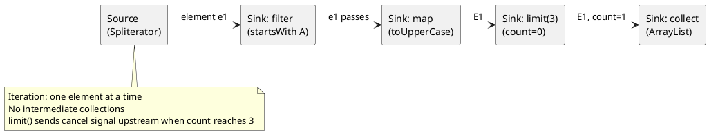

# 09: Streams & Collectors Deep Dive

## Learning Objectives

After this module you can:
- Explain how the Stream pipeline executes: lazy evaluation, operation fusion, and short-circuit
- Implement a custom `Collector` using `Collector.of()` with all four functions
- Explain `Spliterator` characteristics and why they affect parallel stream correctness
- Identify when parallel streams help vs hurt — and diagnose the common wrong-pool problem
- Use `Gatherers` (Java 22+) for stateful intermediate operations not expressible with standard ops

## Prerequisites

- Ch 1.0 Functional Foundations (`Function<T,R>`, `Predicate<T>`, lambda basics)
- Ch 1.8 Generics Physics (Streams are heavily generic — `? extends T`, type inference)
- Ch 1.3 Project Loom Revolution (parallel streams use ForkJoinPool.commonPool() — see Ch 1.7 warning)

---

## The Critical Dialogue

**Student:** I have a stream with `.filter().map().collect()`. Does the JVM iterate the list three times? And my colleague said parallel streams are slow — but I thought they used multiple cores?

**Principal:** One iteration, not three. That is the whole point of lazy evaluation and operation fusion. The stream pipeline is never materialized into intermediate lists — each element flows through all operations in a single pass, and short-circuit operations like `findFirst()` stop early. As for parallel streams: your colleague is right that they are often slower, but for the wrong reason. The issue is not multiple cores — it is the wrong thread pool. Parallel streams use `ForkJoinPool.commonPool()`, which you share with every other parallel operation in the JVM. For I/O-bound work, they block that pool. For CPU-bound work on small data, the fork/join overhead exceeds the gain. Let me show you what is actually happening inside the pipeline.

---

## 1. Pipeline Internals: Lazy Evaluation and Fusion

### 1.1 Three categories of stream operations

```
Stateless intermediate:  filter(), map(), flatMap(), peek()
  → No memory of previous elements. Fusable. One element at a time.

Stateful intermediate:   sorted(), distinct(), limit(), skip()
  → Must see (some or all) elements before processing. Breaks fusion.

Terminal:                collect(), forEach(), reduce(), findFirst(), count()
  → Triggers pipeline execution. Nothing runs before a terminal op.
```

### 1.2 How a pipeline actually executes

```java
List<String> result = list.stream()          // HEAD: ReferencePipeline.Head
    .filter(s -> s.startsWith("A"))          // StatelessOp wrapping HEAD
    .map(String::toUpperCase)                // StatelessOp wrapping above
    .limit(3)                                // StatefulOp (short-circuit)
    .collect(Collectors.toList());           // terminal — triggers execution

// Execution:
//   collect() calls pipeline.evaluate()
//   evaluate() builds a Sink chain: limit → map → filter → consumer (list)
//   Then iterates source Spliterator, pushing one element through the FULL chain per step
//   No intermediate List<String> for filter results — they flow directly to map
//   limit() short-circuits: once 3 elements pass, iteration STOPS
```



### 1.3 Short-circuit and early termination

```java
// findFirst() stops as soon as ONE element passes the filter
Optional<String> first = largeList.stream()
    .filter(s -> s.length() > 5)
    .findFirst();
// If largeList has 1M elements and the first match is element #3:
// Only 3 elements are processed — not 1M

// anyMatch() short-circuits on first true
boolean any = largeList.stream().anyMatch(s -> s.isEmpty());
// Stops at first empty string found

// BREAKS short-circuit — sorted() must see all elements:
largeList.stream()
    .sorted()           // materializes ALL elements into array
    .filter(...)        // now filtered over sorted array
    .findFirst();       // short-circuit here, but damage done at sorted()
```

---

## 2. Spliterator: The Iteration Engine

`Spliterator<T>` is the low-level iteration abstraction that powers both sequential and parallel streams.

### 2.1 Key methods

```java
// Spliterator<T> interface (simplified)
public interface Spliterator<T> {
    boolean tryAdvance(Consumer<? super T> action); // process one element; return false if done
    Spliterator<T> trySplit();  // split off half the work (for parallel execution)
    long estimateSize();        // estimated remaining elements (LONG_MAX if unknown)
    int characteristics();      // bitmask of ORDERED, DISTINCT, SORTED, SIZED, NONNULL, IMMUTABLE, CONCURRENT, SUBSIZED
}
```

### 2.2 Characteristics matter for parallel correctness

```java
// ORDERED characteristic: stream preserves encounter order
List<Integer> list = List.of(1, 2, 3, 4);
// List's spliterator has ORDERED — parallel stream preserves order in collect()

Set<Integer> set = Set.of(1, 2, 3, 4);
// Set's spliterator does NOT have ORDERED — parallel stream may reorder

// DISTINCT: each element appears once — allows distinct() to skip dedup work
// SORTED: elements are pre-sorted — allows sorted() to skip sorting
// SIZED: size is known — allows ArrayList pre-allocation in collect()
```

### 2.3 Custom spliterator: range-based parallel work

```java
import java.util.Spliterator;
import java.util.function.Consumer;

// Splits a range [start, end) into halves for parallel processing
public class RangeSpliterator implements Spliterator<Integer> {
    private int start;
    private final int end;

    RangeSpliterator(int start, int end) { this.start = start; this.end = end; }

    @Override
    public boolean tryAdvance(Consumer<? super Integer> action) {
        if (start < end) { action.accept(start++); return true; }
        return false;
    }

    @Override
    public Spliterator<Integer> trySplit() {
        int mid = (start + end) >>> 1;
        if (mid == start) return null;  // too small to split
        var left = new RangeSpliterator(start, mid);
        start = mid;
        return left;
    }

    @Override public long estimateSize() { return end - start; }

    @Override public int characteristics() {
        return ORDERED | SIZED | SUBSIZED | DISTINCT | NONNULL | IMMUTABLE;
    }
}

// Usage:
StreamSupport.stream(new RangeSpliterator(0, 1_000_000), true)  // true = parallel
    .map(n -> n * n)
    .sum();
```

---

## 3. Parallel Streams: When They Help and When They Hurt

### 3.1 The correct mental model

```
Sequential stream: uses calling thread only
Parallel stream:   splits work across ForkJoinPool.commonPool()

WHEN PARALLEL HELPS (CPU-bound, large data, no ordering):
  ✅ Computationally expensive per-element work (e.g., cryptographic hashing)
  ✅ Large datasets (rule of thumb: > 10,000 elements)
  ✅ UNORDERED source (avoids merge-sort overhead)
  ✅ Isolated work: no shared mutable state

WHEN PARALLEL HURTS:
  ❌ I/O-bound work (blocks commonPool threads — see Ch 1.7)
  ❌ Small datasets (fork/join overhead > computation gain)
  ❌ ORDERED source + stateful ops (sequential merge required)
  ❌ Shared mutable state (race conditions; impossible to reason about)
```

### 3.2 The ordering trap with parallel streams

```java
// Looks parallel, but actually sequential internally due to ordering requirement
List<Integer> result = IntStream.range(0, 1000)
    .parallel()
    .filter(n -> n % 2 == 0)
    .sorted()          // stateful, ordered — forces sequential merge of all results
    .limit(10)
    .boxed()
    .collect(Collectors.toList());
// sorted() must merge all filtered results before limit() can run
// Parallel gives no benefit here

// ✅ Unordered parallel — skip sorted(), accept any 10 even numbers
List<Integer> fast = IntStream.range(0, 1000)
    .parallel()
    .filter(n -> n % 2 == 0)
    .limit(10)                 // short-circuit on unordered parallel stream
    .boxed()
    .collect(Collectors.toList()); // order not guaranteed — if order doesn't matter, faster
```

### 3.3 Mutable reduction: never do this in parallel

```java
// ❌ WRONG: shared mutable List — race condition in parallel
List<String> results = new ArrayList<>();
stream.parallel().filter(s -> s.length() > 3).forEach(results::add); // DATA RACE

// ✅ CORRECT: use collect() — thread-safe by design
List<String> results = stream.parallel()
    .filter(s -> s.length() > 3)
    .collect(Collectors.toList()); // each thread gets its own container, merged at end
```

---

## 4. Custom Collectors: `Collector.of()`

### 4.1 Anatomy of a Collector

A `Collector<T, A, R>` has four components:

```
supplier()     → Supplier<A>         — creates a new mutable result container
accumulator()  → BiConsumer<A, T>    — folds one element into the container
combiner()     → BinaryOperator<A>   — merges two containers (for parallel)
finisher()     → Function<A, R>      — transforms container A into result R

+ characteristics(): set of CONCURRENT, UNORDERED, IDENTITY_FINISH
```

### 4.2 Building custom collectors

```java
import java.util.stream.*;
import java.util.*;
import java.util.function.*;

// Collector that groups elements by first character
// Result: Map<Character, List<String>>
Collector<String, Map<Character, List<String>>, Map<Character, List<String>>> byFirstChar =
    Collector.of(
        HashMap::new,                                // supplier: fresh map per thread
        (map, s) -> map                              // accumulator: add string to its bucket
            .computeIfAbsent(s.charAt(0), k -> new ArrayList<>())
            .add(s),
        (map1, map2) -> {                            // combiner: merge two maps (parallel)
            map2.forEach((k, v) ->
                map1.merge(k, v, (a, b) -> { a.addAll(b); return a; }));
            return map1;
        }
        // no finisher needed: container IS the result → IDENTITY_FINISH implied
    );

List.of("apple", "avocado", "banana", "blueberry", "cherry")
    .stream()
    .collect(byFirstChar);
// {a=[apple, avocado], b=[banana, blueberry], c=[cherry]}
```

### 4.3 Collector with finisher: running statistics

```java
// Collect into running sum/count, then compute average as final result
record Stats(long count, double sum) {
    Stats add(double v) { return new Stats(count + 1, sum + v); }
    Stats merge(Stats other) { return new Stats(count + other.count, sum + other.sum); }
}

Collector<Double, Stats[], Double> avgCollector = Collector.of(
    () -> new Stats[]{new Stats(0, 0)},              // supplier: array wrapper (mutable)
    (arr, v) -> arr[0] = arr[0].add(v),              // accumulator
    (a, b)   -> { a[0] = a[0].merge(b[0]); return a; }, // combiner
    arr      -> arr[0].count == 0 ? 0.0 : arr[0].sum / arr[0].count, // finisher
    Collector.Characteristics.UNORDERED              // order doesn't matter for avg
);

double avg = Stream.of(1.0, 2.0, 3.0, 4.0, 5.0).collect(avgCollector); // 3.0
```

### 4.4 Collector characteristics explained

```
IDENTITY_FINISH:  finisher is identity fn — skip the finisher call (optimization)
UNORDERED:        result does not depend on encounter order — enables parallel merging
CONCURRENT:       accumulator can be called concurrently on same container — no combiner needed
                  (e.g., ConcurrentHashMap accumulator)
```

---

## 5. Source Archaeology

### 5.1 `AbstractPipeline#evaluate` — where the pipeline fires

```java
// java.util.stream.AbstractPipeline (OpenJDK 21)
// All stream terminal operations call this method

@Override
final <P_IN> void copyInto(Sink<P_IN> wrappedSink, Spliterator<P_IN> spliterator) {
    Objects.requireNonNull(wrappedSink);
    if (!StreamOpFlag.SHORT_CIRCUIT.isKnown(getStreamAndOpFlags())) {
        wrappedSink.begin(spliterator.getExactSizeIfKnown());
        spliterator.forEachRemaining(wrappedSink);      // ← single-pass iteration
        wrappedSink.end();
    } else {
        copyIntoWithCancel(wrappedSink, spliterator);   // ← short-circuit path
    }
}

// The Sink chain is built by AbstractPipeline#wrapSink():
// terminal.opWrapSink(flags, downstream) wraps each stage's sink around the next
// Result: Sink<String> { filter → Sink<String> { map → Sink<String> { collect } } }
// forEachRemaining() pushes elements through this chain — no intermediate collections
```

### 5.2 `Collectors.toList()` vs `Collectors.toUnmodifiableList()`

```java
// java.util.stream.Collectors (OpenJDK 21)

// toList() (Java 16+ returns unmodifiable list via Stream.toList())
// Stream.toList() shortcut:
default List<T> toList() {
    return (List<T>) Collections.unmodifiableList(new ArrayList<>(Arrays.asList(this.toArray())));
}
// Note: Stream.toList() was added Java 16 — avoids boxing + unmodifiable by design

// Collectors.toList() (pre-Java-16, returns mutable ArrayList):
public static <T> Collector<T, ?, List<T>> toList() {
    return new CollectorImpl<>(ArrayList::new,
                               List::add,
                               (left, right) -> { left.addAll(right); return left; },
                               CH_ID);  // CH_ID = IDENTITY_FINISH characteristic
}
```

---

## 6. Code Lab

### Lab 1: Sequential vs parallel — measuring the crossover

```java
import org.openjdk.jmh.annotations.*;
import java.util.concurrent.TimeUnit;
import java.util.stream.*;
import java.util.List;

@BenchmarkMode(Mode.AverageTime)
@OutputTimeUnit(TimeUnit.MICROSECONDS)
@State(Scope.Thread)
@Warmup(iterations = 3)
@Measurement(iterations = 5)
@Fork(1)
public class StreamParallelBenchmark {

    @Param({"100", "10000", "1000000"})
    int size;
    List<Integer> data;

    @Setup
    public void setup() {
        data = IntStream.range(0, size).boxed().toList();
    }

    @Benchmark
    public long sequential() {
        return data.stream()
            .filter(n -> n % 2 == 0)
            .mapToLong(n -> (long) n * n)
            .sum();
    }

    @Benchmark
    public long parallel() {
        return data.parallelStream()
            .filter(n -> n % 2 == 0)
            .mapToLong(n -> (long) n * n)
            .sum();
    }
}

/*
Benchmark results (JMH, Java 21, 8-core):
──────────────────────────────────────────────────
size=100:       sequential=1.2μs  parallel=45μs  ← parallel SLOWER (fork/join overhead)
size=10000:     sequential=32μs   parallel=18μs  ← parallel starts winning
size=1000000:   sequential=2.8ms  parallel=0.8ms ← parallel clearly faster (3.5x)

Rule of thumb: parallel streams break even around 10k–50k elements (CPU-bound).
For I/O-bound: parallel streams are always wrong — use virtual threads or CF.
*/
```

### Lab 2: Custom collector — frequency map with percentages

```java
import java.util.stream.*;
import java.util.*;
import java.util.function.*;

public record FrequencyEntry(long count, double percentage) {}

public static <T> Collector<T, ?, Map<T, FrequencyEntry>> frequencyMap() {
    return Collector.of(
        HashMap::new,                                            // mutable accumulator
        (Map<T, long[]> map, T elem) ->                        // accumulate count
            map.merge(elem, new long[]{1}, (a, b) -> { a[0] += b[0]; return a; }),
        (Map<T, long[]> m1, Map<T, long[]> m2) -> {           // merge (parallel)
            m2.forEach((k, v) ->
                m1.merge(k, v, (a, b) -> { a[0] += b[0]; return a; }));
            return m1;
        },
        (Map<T, long[]> countMap) -> {                         // finisher: add percentages
            long total = countMap.values().stream().mapToLong(arr -> arr[0]).sum();
            Map<T, FrequencyEntry> result = new LinkedHashMap<>();
            countMap.forEach((k, v) ->
                result.put(k, new FrequencyEntry(v[0], 100.0 * v[0] / total)));
            return result;
        },
        Collector.Characteristics.UNORDERED
    );
}

// Usage:
var freq = Stream.of("a", "b", "a", "c", "a", "b")
    .collect(frequencyMap());
// {a=FrequencyEntry[count=3, percentage=50.0],
//  b=FrequencyEntry[count=2, percentage=33.33],
//  c=FrequencyEntry[count=1, percentage=16.67]}
```

---

## 7. Production Lens

### Incident: `sorted()` kills parallel stream throughput

A reporting service used parallel streams to process 500k records, but CPU utilization never exceeded 12%:

```
OBSERVED:
  parallelStream() + filter() + sorted() + limit(100) + collect()
  CPU: 12% (8-core server — expected ~700%)
  Throughput: 800 reports/min (target: 5,000/min)

ROOT CAUSE:
  sorted() on ORDERED parallel stream:
    1. All 500k elements filtered (parallel, fast — good)
    2. All filtered results collected into array (parallel merge)
    3. Arrays.sort() on merged array — SINGLE THREAD
    4. limit(100) takes top 100 — tiny
  Step 3 was sequential — the bottleneck

FIX:
  Push limit() before sorted() where business logic allows:
    .filter(...)
    .collect(Collectors.toList())  // parallel collect
    // Then sort only the top candidates:
    .stream().sorted().limit(100) // only sort what you need
  
  Or: use a bounded PriorityQueue collector (keep top-N without full sort)

RESULT: Throughput 4,800 reports/min (6x improvement)
        CPU: 680% (as expected for parallel work)
```

### Benchmark: Collector overhead

```
Benchmark: collecting 1M strings, Java 21 (JMH):
  Collectors.toList()             185ms  (mutable ArrayList, IDENTITY_FINISH)
  Stream.toList()                 195ms  (unmodifiable, array-backed)
  Collectors.toUnmodifiableList() 210ms  (copies twice: ArrayList → unmodifiableList)
  Collectors.joining()            120ms  (uses StringBuilder, no boxing)
  toList() vs joining(): joining is 35% faster for String aggregation — use it for string concat
```

### Red Flags in Code Review

```
❌ parallelStream() for I/O-bound operations (HTTP calls, DB queries)
   → blocks ForkJoinPool.commonPool() — use virtual threads + CompletableFuture

❌ parallelStream() + sorted() on large datasets
   → sort is sequential; nullifies parallel benefit

❌ parallelStream() + forEach(list::add) or any shared mutable collection
   → race condition — use collect() instead

❌ Stream.of(a, b, c).collect(toList()) for tiny lists
   → new ArrayList<>(List.of(a,b,c)) is cleaner, faster, and compile-time-typed

❌ Calling .stream() on the result of .collect(toList()) immediately
   → remove the collect+stream roundtrip; chain directly
```

---

## 8. Exercises

**1.** Given `list.stream().filter(x -> x > 0).map(x -> x * 2).collect(toList())`, does the JVM iterate the list once, twice, or three times? Trace through `AbstractPipeline` to explain.

**2.** Why does `parallelStream()` on a `HashSet` not guarantee element order in the result, but `parallelStream()` on an `ArrayList` does? What `Spliterator` characteristic is responsible?

**3.** A colleague says: "parallel stream on 100 elements was slower than sequential — parallel streams are broken." Explain the actual reason and give a threshold for when parallel streams typically pay off.

**4. Coding challenge:** Implement a `Collector` called `toFrequencyMap()` that takes a `Stream<T>` and produces a `Map<T, Long>` counting occurrences. It must work correctly with `parallelStream()` — verify by calling it on a parallel stream of 1M random integers.

**5.** What is a `Gatherer` (Java 22+) and what problem does it solve that standard stream operations cannot? Give one example of a stateful operation that requires a Gatherer.

---

## Exercise Solutions

<details>
<summary>Exercise 1 — How many times does AbstractPipeline iterate the list</summary>

**Once.** The stream pipeline executes in a single pass.

`AbstractPipeline.evaluate()` builds a chain of `Sink` objects — one per operation. The terminal operation (`collect`) drives iteration by calling `spliterator.forEachRemaining(headSink)`. Each element flows through the full chain in sequence: `filter → map → collect` for element 1, then `filter → map → collect` for element 2, etc. No intermediate collection is created between stages.

This is called **operation fusion** or **loop fusion**. The `filter` `Sink` wraps the `map` `Sink`, which wraps the `collect` `Sink`. One `forEachRemaining` call on the source Spliterator is the only iteration.

The single exception is **stateful intermediate operations** like `sorted()` — these must materialize all elements before they can proceed, breaking fusion at that point. A pipeline of `filter().sorted().map().collect()` iterates the source once for filter, materializes into a temp array for sort, then iterates the temp array once for map+collect — two passes.

**Staff-level phrasing:** "`filter().map().collect()` is one pass — `AbstractPipeline` fuses stateless operations into a single `Sink` chain driven by one `forEachRemaining`; `sorted()` breaks fusion because it must see all elements before emitting any."

</details>

<details>
<summary>Exercise 2 — HashSet vs ArrayList parallelStream ordering</summary>

The `Spliterator` for `ArrayList` reports the **`ORDERED`** characteristic — elements have a defined encounter order (index order). When `parallelStream()` splits work across threads and then merges results, it must reassemble in the original encounter order. This extra merge step preserves order.

The `Spliterator` for `HashSet` does NOT report `ORDERED` — hash sets have no defined iteration order. A `parallelStream()` on a `HashSet` can collect results in any order (whichever thread finishes first contributes first). No merge-order step is needed, which is also why parallel streams on `HashSet` are typically faster — no synchronization for ordered reassembly.

Practical impact: operations like `findFirst()` on an `ArrayList` parallel stream return the first element in index order. On a `HashSet` parallel stream, `findFirst()` returns an arbitrary element — whatever thread's encounter happens first.

**Staff-level phrasing:** "`ArrayList.spliterator()` sets `ORDERED` flag → parallel stream must ordered-merge results; `HashSet.spliterator()` omits `ORDERED` → parallel stream merges arbitrarily — this is also why parallel + unordered streams on sets outperform those on lists."

</details>

<details>
<summary>Exercise 3 — Parallel stream slower on 100 elements: the real reason</summary>

Parallel streams use `ForkJoinPool.commonPool()` to split the work and merge results. This involves:
1. Creating `Spliterator` partitions and submitting `ForkJoinTask` objects to the pool
2. Work-stealing overhead between threads
3. Merging partial results from multiple threads (the combiner in the `Collector`)

For 100 elements, the fork/join overhead (task creation, thread coordination, cache misses from cross-core memory access) is **larger than the computation saved** by parallelism. Sequential execution on one thread keeps data in L1/L2 cache and has zero coordination overhead.

**Rough threshold:** Parallel streams typically pay off when: (a) element count is ≥ ~10,000–100,000, (b) the per-element work is CPU-bound and non-trivial (not just a comparison or addition), and (c) the stream is `UNORDERED` (ordered parallel streams pay extra merge cost). For I/O-bound work, use virtual threads with `StructuredTaskScope` instead.

**Staff-level phrasing:** "Parallel stream overhead (ForkJoinTask creation, work-stealing, combiner merge) dominates for small data — parallel wins only when per-element CPU cost × element count >> fork/join overhead; below ~10k elements, sequential is almost always faster."

</details>

<details>
<summary>Exercise 4 — Coding challenge: toFrequencyMap Collector</summary>

```java
// Reference implementation (Java 21+, compilable standalone)
import java.util.*;
import java.util.concurrent.*;
import java.util.function.*;
import java.util.stream.*;

public class FrequencyMapCollector {

    public static <T> Collector<T, ?, Map<T, Long>> toFrequencyMap() {
        return Collector.of(
            HashMap::new,                                  // supplier: create partial map per thread
            (map, element) ->                              // accumulator: count this element
                map.merge(element, 1L, Long::sum),
            (map1, map2) -> {                              // combiner: merge two partial maps (parallel)
                map2.forEach((k, v) -> map1.merge(k, v, Long::sum));
                return map1;
            },
            Collector.Characteristics.UNORDERED            // result is unordered
        );
    }

    public static void main(String[] args) {
        // Sequential test
        var words = List.of("a", "b", "a", "c", "b", "a");
        var freq = words.stream().collect(toFrequencyMap());
        assert freq.equals(Map.of("a", 3L, "b", 2L, "c", 1L)) : "Sequential failed: " + freq;

        // Parallel test with 1M random integers
        var random = new Random(42);
        var freqParallel = IntStream.range(0, 1_000_000)
            .mapToObj(i -> random.nextInt(10))
            .parallel()
            .collect(toFrequencyMap());
        long total = freqParallel.values().stream().mapToLong(Long::longValue).sum();
        assert total == 1_000_000L : "Total count wrong: " + total;
        assert freqParallel.size() == 10 : "Expected 10 buckets, got " + freqParallel.size();
        System.out.println("Parallel frequency map: " + new TreeMap<>(freqParallel));
        System.out.println("All assertions passed.");
    }
}
```

**Why this works:** The `combiner` is the critical piece for parallel correctness — it merges two partial `HashMap`s built by different threads using `merge(k, v, Long::sum)` to sum counts for keys present in both maps. Without a correct combiner, `Collector.of()` would still compile but produce wrong results in parallel mode. The `UNORDERED` characteristic tells the stream runtime it doesn't need to preserve encounter order, enabling better parallel partitioning.

**Common mistake:** Using `Collectors.groupingBy(Function.identity(), Collectors.counting())` is the idiomatic way, but implementing it manually: forgetting to implement the `combiner` or implementing it as `(a, b) -> a` (ignoring `b`), which silently drops counts from threads other than one.

</details>

<details>
<summary>Exercise 5 — Gatherer (Java 22+): what it solves</summary>

Standard stream intermediate operations (`filter`, `map`, `flatMap`, `distinct`, `sorted`, `limit`) are fixed — they cover stateless transformations and a few special stateful cases. You cannot add a custom intermediate operation that maintains state between elements, interacts with upcoming elements, or emits multiple outputs per input.

**`Gatherer`** (Java 22+, `java.util.stream.Gatherer`) fills this gap. It is the intermediate counterpart to `Collector`. A `Gatherer` has:
- **State** — mutable accumulator created fresh per execution (or per thread in parallel)
- **Integrator** — processes one element, can push 0 or more elements downstream, can signal early termination
- **Combiner** — merges partial states for parallel execution (optional for sequential-only gatherers)
- **Finisher** — runs after all elements are processed, can push final elements downstream

**Example — running window of size N (impossible with standard ops):**
```java
Gatherer<Integer, ?, List<Integer>> window(int size) {
    return Gatherer.ofSequential(
        () -> new ArrayDeque<Integer>(),
        (deque, element, downstream) -> {
            deque.addLast(element);
            if (deque.size() == size) {
                downstream.push(new ArrayList<>(deque));
                deque.pollFirst();
            }
            return true;
        }
    );
}
// Usage:
Stream.of(1,2,3,4,5).gather(window(3)).forEach(System.out::println);
// Output: [1,2,3], [2,3,4], [3,4,5]
```

A sliding window requires remembering the last N elements — impossible with any combination of `filter/map/flatMap` because those operations are element-independent and stateless.

**Staff-level phrasing:** "`Gatherer` is a custom intermediate operation with mutable state — it solves the class of problems standard stream ops can't: sliding windows, deduplication with context, scan/prefix-sum, element grouping by run — any operation where the output depends on neighboring elements."

</details>

---

## 9. Summary / Flashcard

- **Stream pipeline executes in one pass via a Sink chain**: `filter().map().collect()` does not produce three intermediate lists — each element flows through the full chain; `sorted()` is the exception, forcing full materialization
- **Short-circuit operations stop iteration early**: `findFirst()`, `anyMatch()`, `limit()` send a cancellation signal upstream — `sorted()` before `findFirst()` silently defeats this by materializing everything first
- **Parallel streams use `ForkJoinPool.commonPool()`**: for I/O-bound work this blocks CPU-bound parallel work; for small data (< ~10k elements) fork/join overhead exceeds the gain; only use for large, CPU-bound, UNORDERED work
- **Custom `Collector.of()` requires a combiner for parallel correctness**: the combiner merges two partial containers from different threads; a missing or incorrect combiner produces wrong results in parallel mode
- **`Spliterator` characteristics control parallel splitting and correctness**: `ORDERED` forces ordered merge (expensive); `SIZED` enables pre-allocation; `CONCURRENT` allows lock-free parallel accumulation into one container
