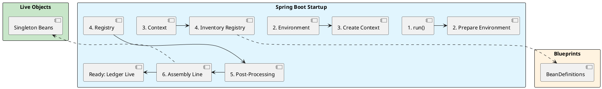

# 2.0: Spring Bootstrap - Demystifying the Magic

## The Critical Dialogue

**Student:** I just add `@SpringBootApplication` and call `SpringApplication.run()`. My app starts, but I have no idea how. How does Spring find my code? How are these objects created? It feels like one giant black box.

**Principal:** A Junior sees an annotation; a Principal sees a **Bootstrapping Engine**. When you call `run()`, you are triggering a massive multi-stage discovery process. Spring has to inventory your JAR, negotiate with the JVM, and build a massive dependency graph (the `ApplicationContext`) before the first byte of business logic runs. To master Spring, we must stop using the magic and start understanding the **Lifecycle of a Blueprint**.

---

## 1. Anatomy of the Magic: @SpringBootApplication

### 1.1 The Triad of Discovery

The `@SpringBootApplication` annotation is a convenience alias for three core mechanisms.

> [!abstract] 1. @Configuration
> Marks the class as a source of bean definitions. It is the "Root Blueprint."

> [!abstract] 2. @ComponentScan
> Tells Spring to recursively crawl your packages. A Principal knows this is an **O(N) operation**—the more classes you have, the slower your Ledger starts.

> [!abstract] 3. @EnableAutoConfiguration
> This is the "Convention over Configuration" engine. It tells Spring: "Look at the classpath. If you see the `H2` driver, automatically create a `DataSource` for me."

---

## 2. The Engine: SpringApplication.run()

### 2.1 The 5-Phase Startup Flow

When you call `SpringApplication.run()`, the following industrial process occurs:

**Phase 1: Environment Preparation**
Spring loads your `application.yaml`, profiles, and system properties into the `Environment` object.

**Phase 2: Context Creation**
Spring creates the physical container. For a web app, it instantiates an `AnnotationConfigServletWebServerApplicationContext`.

**Phase 3: The Blueprint Inventory (Registry)**
Spring crawls the classpath (`@ComponentScan`) and identifies every `@Component`. It does NOT create objects yet. It creates **`BeanDefinition`** objects and stores them in the **`BeanDefinitionRegistry`**.

**Phase 4: Post-Processing**
Spring calls `BeanFactoryPostProcessors`. This is where the "Auto-Configuration" happens. Spring might see your `DataSource` definition and say: "Wait, I need to add a ConnectionPool to this."

**Phase 5: The Assembly Line (Instantiation)**
Finally, Spring iterates through the registry and creates the actual Java objects (Beans) in the correct order of their dependencies.

---

## 3. Registries and Factories: The Internal Wiring

### 3.1 BeanFactory vs. ApplicationContext

**What is it?**
. **BeanFactory:** The lowest level. It just knows how to hold and create beans.
. **ApplicationContext:** The "God Object." It is a BeanFactory plus global features like Events, Internationalization, and Fleet-wide environment management.

### 3.2 The BeanDefinitionRegistry

This is the most critical internal component for an Architect. It is the "Source of Truth" for what *should* exist in your application.

> [!info] The Dynamic Registration Hook
> A Principal doesn't just rely on `@ComponentScan`. We use `ImportBeanDefinitionRegistrar` to programmatically inject blueprints into this registry at runtime. This allows us to build "Adaptive Systems" that change their structure based on the environment.

---

## 🧵 The GOL Challenge: Phase 5 (The Bootstrapper)

**Context:** The Ledger is starting too slow. We suspect `@ComponentScan` is wasting time looking through thousands of third-party utility classes.

**The Task:**

. **Trace the run():** Use a debugger to place a breakpoint in `SpringApplication.run()`. Step into the code and identify where the `context` is instantiated.

. **Audit the Registry:** Implement a `BeanFactoryPostProcessor` that prints the names of all `BeanDefinitions` in the registry. Identify 3 beans that were "Auto-Configured" that you didn't explicitly define.

. **Manual Control:** Disable `@ComponentScan` for a sub-package of the Ledger and manually register those beans using a `@Configuration` class. Compare the startup time.

---

## 🧠 Principal's Inquiry

. **The Proxy Rationale:** Why does Spring wrap `@Configuration` classes in a **CGLIB Proxy**? What would happen to the Singleton guarantee if it didn't?

. **Eager vs Lazy:** By default, all singletons are created in Phase 5. How does the `LazyInitBeanFactoryPostProcessor` change the physics of startup speed vs. first-request latency?

. **Registry Conflict:** What happens if two different `BeanDefinitionRegistrars` try to register a bean with the same name but different classes? How does Spring resolve the "Blueprint Conflict"?

**Principal Summary:** Bootstrapping is about **Discovery and Validation**. A Principal Architect controls the discovery process to minimize startup "Jitter" and maximize fleet efficiency.
