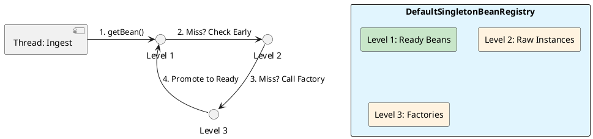

# 2.1: The ApplicationContext and Bean Lifecycle Internals


## The Critical Dialogue


**Student:** Our Ledger won't start. We added a `ShippingService` that depends on `TaxService`, but `TaxService` also needs the `ShippingService`. Spring is throwing a `BeanCurrentlyInCreationException`. Why can't it just "figure it out"?


**Principal:** You've hit the **Circular Bootstrap Deadlock**. To a Junior, this is a bug to be fixed with `@Lazy`. To a Principal, this is a failure to understand the **Assembly Line**. Spring doesn't create objects in one go; it uses a **Three-Stage Construction Process**. If you use Constructor Injection, you are forcing Spring to finish stage 3 before it even starts stage 1. To fix this at fleet-scale, we must master the **Singleton Cache** and the **Refresh Pipeline**.


---


## 1. The Assembly Line: Three-Level Singleton Cache


### 1.1 How Spring "Sees" the Future


Spring's core engine, the `DefaultSingletonBeanRegistry`, manages bean creation using three distinct maps (The Three-Level Cache). This is how it resolves circular dependencies without global locks.


> [!abstract] SDK Source: The Triple Cache
> . **Level 1: singletonObjects:** Fully initialized beans. Ready for use.
> . **Level 2: earlySingletonObjects:** "Raw" instances. The object exists in memory but hasn't been "decorated" (proxied) or had its properties set.
> . **Level 3: singletonFactories:** The "Object Factories." This level stores a lambda that *could* create the bean.


### 1.2 The Resolution Mechanics


When `ShippingService` asks for `TaxService`, Spring:
1.  Creates a "Raw" `ShippingService` and puts it in the **Level 3 Cache**.
2.  Starts creating `TaxService`.
3.  `TaxService` asks for `ShippingService`. Spring looks in the cache, finds the raw instance in Level 3, promotes it to Level 2, and hands it to `TaxService`.
4.  Construction continues. The circle is broken.





---


## 2. Global Fleet Performance: Functional Registration


### 2.1 The $O(N)$ Scanning Tax


In our **GOL system**, we have 1,000+ classes. Traditional `@ComponentScan` forces Spring to parse every `.class` file in your JAR at startup. At Netflix-scale, this adds **5-10 seconds** of "Warm-up" time.


**The Principal's Choice: ImportBeanDefinitionRegistrar**
Instead of scanning, we programmatically tell Spring exactly what to load.


```java
// Principal Level: Zero-Scan Registration
public class LedgerRegistrar implements ImportBeanDefinitionRegistrar {
    @Override
    public void registerBeanDefinitions(AnnotationMetadata metadata, BeanDefinitionRegistry registry) {
        var definition = BeanDefinitionBuilder.rootBeanDefinition(LedgerService.class)
            .setScope("singleton")
            .getBeanDefinition();
        registry.registerBeanDefinition("ledgerService", definition);
    }
}
```


---


## 3. Cross-Context Physics: Scoped Proxies


### 3.1 The Singleton-to-Request Trap


**What is it?**
A common failure in microservices: a Singleton bean (e.g., `AuditService`) is injected with a Request-Scoped bean (e.g., `UserContext`). 


**The Failure State:**
The Singleton is created once at startup. It will hold onto the **first user's context** for the entire life of the application. Every subsequent transaction will be audited under the wrong user.


**The Fix: Scoped Proxies**
A Principal uses `ObjectProvider(T)` or `@Scope(proxyMode = INTERFACES)`. Spring injects a **Dynamic Proxy** that lookups the *current* request-scoped bean on every method call.


---


## 🧵 The GOL Challenge: Phase 5 (Internalist)


**Context:** The Ledger is failing to start due to a circular dependency between `LedgerService` and `AnalyticsService`. Furthermore, startup time in our Kubernetes pods has exceeded 15 seconds.


**The Task:**


. **Source Archaeology:** Open `DefaultSingletonBeanRegistry.java` in your IDE. Find the `getSingleton(String beanName, boolean allowEarlyReference)` method. Trace how it traverses the three levels of cache.


. **Circular Fix:** Refactor the `LedgerService` and `AnalyticsService` to use **Setter Injection** and explain how the Three-Level Cache resolves the issue.


. **Startup Optimization:** Replace `@ComponentScan` in your core module with a custom `ImportBeanDefinitionRegistrar`. Measure the reduction in startup time.


. **Context Integrity:** Implement a `UserContext` bean with `Scope("request")`. Inject it into the `LedgerService` using `ObjectProvider`. Ensure that every incoming order sees the correct user metadata.


---


## 🧠 Principal's Inquiry


. **Constructor Deadlock:** Why can the Three-Level Cache NOT resolve circular dependencies when using **Constructor Injection**? (Hint: Think about when the object reference is actually created).


. **BFPP vs BPP:** Why is it dangerous to inject a bean into a `BeanFactoryPostProcessor`? How does this trigger "Premature Initialization" and bypass AOP proxies?


. **The Context Refresh Event:** Why should a Principal prefer `EventListener(ContextRefreshedEvent.class)` over `@PostConstruct` for starting background fleet-telemetry tasks?


**Principal Summary:** Mastery of Spring internals is about **Controlling the Assembly Line**. We use the registry hooks to optimize for fleet-wide performance and architectural integrity.
