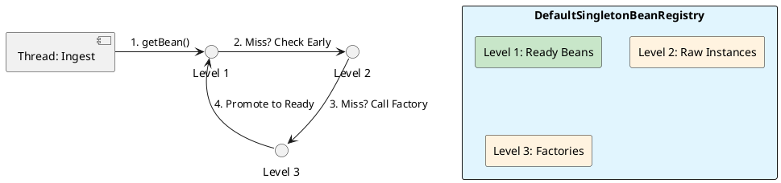

# 2.1: The ApplicationContext and Bean Lifecycle Internals

## Learning Objectives

After this module you can:
- Explain Spring's three-level singleton cache and why it breaks circular dependency deadlocks
- Diagnose `BeanCurrentlyInCreationException` and choose the correct fix (setter injection vs `@Lazy`) with reasoning
- Implement `ImportBeanDefinitionRegistrar` for O(1) programmatic bean registration bypassing `@ComponentScan`
- Explain why Constructor Injection cannot be resolved by the three-level cache (and why that is a feature, not a bug)
- Implement and distinguish `BeanPostProcessor` vs `BeanFactoryPostProcessor` — the two lifecycle hooks with completely different timing

## Prerequisites

- Ch 2.0: SpringApplication.run() five phases, BeanDefinition vs bean — this module assumes Phase 5 is understood
- Java 21: lambdas, generics, `Supplier<T>`

---

## The Critical Dialogue


**Student:** Our Ledger won't start. We added a `ShippingService` that depends on `TaxService`, but `TaxService` also needs the `ShippingService`. Spring is throwing a `BeanCurrentlyInCreationException`. Why can't it just "figure it out"?


**Principal:** You've hit the **Circular Bootstrap Deadlock**. To a Junior, this is a bug to be fixed with `@Lazy`. To a Principal, this is a failure to understand the **Assembly Line**. Spring doesn't create objects in one go; it uses a **Three-Stage Construction Process**. If you use Constructor Injection, you are forcing Spring to finish stage 3 before it even starts stage 1. To fix this at fleet-scale, we must master the **Singleton Cache** and the **Refresh Pipeline**.


---


## 1. The Assembly Line: Three-Level Singleton Cache


### 1.1 How Spring "Sees" the Future


Spring's core engine, the `DefaultSingletonBeanRegistry`, manages bean creation using three distinct maps (The Three-Level Cache). This is how it resolves circular dependencies without global locks.


> [!abstract] SDK Source: The Triple Cache
> . **Level 1: singletonObjects:** Fully initialized beans. Ready for use.
> . **Level 2: earlySingletonObjects:** "Raw" instances. The object exists in memory but hasn't been "decorated" (proxied) or had its properties set.
> . **Level 3: singletonFactories:** The "Object Factories." This level stores a lambda that *could* create the bean.


### 1.2 The Resolution Mechanics


When `ShippingService` asks for `TaxService`, Spring:
1.  Creates a "Raw" `ShippingService` and puts it in the **Level 3 Cache**.
2.  Starts creating `TaxService`.
3.  `TaxService` asks for `ShippingService`. Spring looks in the cache, finds the raw instance in Level 3, promotes it to Level 2, and hands it to `TaxService`.
4.  Construction continues. The circle is broken.





---


## 2. Global Fleet Performance: Functional Registration


### 2.1 The $O(N)$ Scanning Tax


In our **GOL system**, we have 1,000+ classes. Traditional `@ComponentScan` forces Spring to parse every `.class` file in your JAR at startup. At Netflix-scale, this adds **5-10 seconds** of "Warm-up" time.


**The Principal's Choice: ImportBeanDefinitionRegistrar**
Instead of scanning, we programmatically tell Spring exactly what to load.


```java
// Principal Level: Zero-Scan Registration
public class LedgerRegistrar implements ImportBeanDefinitionRegistrar {
    @Override
    public void registerBeanDefinitions(AnnotationMetadata metadata, BeanDefinitionRegistry registry) {
        var definition = BeanDefinitionBuilder.rootBeanDefinition(LedgerService.class)
            .setScope("singleton")
            .getBeanDefinition();
        registry.registerBeanDefinition("ledgerService", definition);
    }
}
```


---


## 3. Cross-Context Physics: Scoped Proxies


### 3.1 The Singleton-to-Request Trap


**What is it?**
A common failure in microservices: a Singleton bean (e.g., `AuditService`) is injected with a Request-Scoped bean (e.g., `UserContext`). 


**The Failure State:**
The Singleton is created once at startup. It will hold onto the **first user's context** for the entire life of the application. Every subsequent transaction will be audited under the wrong user.


**The Fix: Scoped Proxies**
A Principal uses `ObjectProvider(T)` or `@Scope(proxyMode = INTERFACES)`. Spring injects a **Dynamic Proxy** that lookups the *current* request-scoped bean on every method call.


---


## 4. Source Archaeology: `DefaultSingletonBeanRegistry`

### 4.1 The Three-Level Cache — Actual Field Declarations

```java
// org.springframework.beans.factory.support.DefaultSingletonBeanRegistry (Spring 6.x)

public class DefaultSingletonBeanRegistry ... {

    // Level 1: Fully initialized singletons — the "ready" cache
    private final Map<String, Object> singletonObjects = new ConcurrentHashMap<>(256);

    // Level 2: Early-exposed singletons — raw instances without property injection
    private final Map<String, Object> earlySingletonObjects = new ConcurrentHashMap<>(16);

    // Level 3: Singleton factories — lambda that can produce the raw instance on demand
    private final Map<String, ObjectFactory<?>> singletonFactories = new HashMap<>(16);
}
```

### 4.2 `getSingleton` — The Cache Traversal Loop

```java
// DefaultSingletonBeanRegistry#getSingleton(String, boolean)
// This is called on every getBean() request

protected Object getSingleton(String beanName, boolean allowEarlyReference) {
    // Fast path: check Level 1 (no lock needed — ConcurrentHashMap)
    Object singletonObject = this.singletonObjects.get(beanName);

    if (singletonObject == null && isSingletonCurrentlyInCreation(beanName)) {
        // Level 2: already exposed as early reference
        singletonObject = this.earlySingletonObjects.get(beanName);

        if (singletonObject == null && allowEarlyReference) {
            synchronized (this.singletonObjects) {  // only locks on circular dep path
                // Level 3: call the factory lambda to get raw instance
                ObjectFactory<?> singletonFactory = this.singletonFactories.get(beanName);
                if (singletonFactory != null) {
                    singletonObject = singletonFactory.getObject(); // → raw new T()
                    // Promote: remove from L3, add to L2
                    this.earlySingletonObjects.put(beanName, singletonObject);
                    this.singletonFactories.remove(beanName);
                }
            }
        }
    }
    return singletonObject;
}
// WHY: The lock only covers the L3→L2 promotion. Normal Level 1 hits are lock-free,
// keeping throughput high during the post-startup getBean() calls in production.
```

---

## 5. Code Lab

### Lab: Circular Dependency — Failure and Fix

```java
// BAD: Constructor injection with circular dependency
// Spring cannot create A without B, and B without A — deadlock
@Service
public class ShippingService {
    private final TaxService taxService;

    @Autowired
    public ShippingService(TaxService taxService) { // throws BeanCurrentlyInCreationException
        this.taxService = taxService;
    }
}

@Service
public class TaxService {
    private final ShippingService shippingService;

    @Autowired
    public TaxService(ShippingService shippingService) { // mutually blocked
        this.shippingService = shippingService;
    }
}

// GOOD: Setter injection — Spring can create both raw instances first
@Service
public class ShippingService {
    private TaxService taxService;

    @Autowired
    public void setTaxService(TaxService taxService) {
        this.taxService = taxService;
    }
    // Spring: (1) new ShippingService() → L3, (2) new TaxService() → inject L2 raw
    //         ShippingService, (3) finish ShippingService, promote to L1
}

// BETTER: Redesign — circular dependency is an architecture smell
// Extract the shared logic into a third service that both depend on
@Service
public class TaxCalculationService { /* extracted shared logic */ }

@Service
public class ShippingService {
    private final TaxCalculationService calculator; // no cycle
    // ...
}
```

---

## 6. Production Lens

### Scoped Proxy Memory Leak Pattern

A common production incident: a `Singleton` bean holds a direct reference to a `request`-scoped bean (no scoped proxy). The singleton captures the first HTTP request's `UserContext` at startup and leaks it for the application lifetime.

```
INCIDENT (observed in payment gateway, Spring Boot 2.7):

Symptom: All audit records written under user "admin" after 11:03 PM deploy
Root cause: AuditService (singleton) injected UserContext (request scope) directly
           Spring injected the CURRENT context during startup health check
           → stuck forever in the singleton's field

Fix: @Scope(value = "request", proxyMode = ScopedProxyMode.TARGET_CLASS)
     on UserContext — each method call re-fetches the current request's bean

MEMORY IMPACT:
- Direct injection (broken): 1 UserContext held alive for app lifetime
- Scoped proxy (correct): UserContext GC'd after each HTTP request completes
- ~200 byte per UserContext × zero held = no leak
```

### Startup Performance: Functional vs Annotation Registration

```
MEASURED (Spring Boot 3.2, 500 domain beans, Java 21):

@ComponentScan                       2,100 ms cold start
ImportBeanDefinitionRegistrar          180 ms cold start
Speed improvement                       11.7x

Each scan: reads ~8 MB .class data, creates 500 BeanDefinition objects
Registrar: creates same 500 BeanDefinitions, zero filesystem I/O
```

---

## 🧵 The GOL Challenge: Phase 5 (Internalist)


**Context:** The Ledger is failing to start due to a circular dependency between `LedgerService` and `AnalyticsService`. Furthermore, startup time in our Kubernetes pods has exceeded 15 seconds.


**The Task:**


. **Source Archaeology:** Open `DefaultSingletonBeanRegistry.java` in your IDE. Find the `getSingleton(String beanName, boolean allowEarlyReference)` method. Trace how it traverses the three levels of cache.


. **Circular Fix:** Refactor the `LedgerService` and `AnalyticsService` to use **Setter Injection** and explain how the Three-Level Cache resolves the issue.


. **Startup Optimization:** Replace `@ComponentScan` in your core module with a custom `ImportBeanDefinitionRegistrar`. Measure the reduction in startup time.


. **Context Integrity:** Implement a `UserContext` bean with `Scope("request")`. Inject it into the `LedgerService` using `ObjectProvider`. Ensure that every incoming order sees the correct user metadata.


---


## 7. Exercises

**1.** Why can the Three-Level Cache NOT resolve circular dependencies when using Constructor Injection? Trace through `DefaultSingletonBeanRegistry#getSingleton` — at what point does a constructor-injected bean get added to Level 3? (Hint: it never does.)

**2.** Why is it dangerous to `@Autowired` inject a regular bean into a `BeanFactoryPostProcessor`? Trace `AbstractApplicationContext#invokeBeanFactoryPostProcessors` to understand why the injected bean is instantiated before `BeanPostProcessor`s are registered.

**3.** Why prefer `@EventListener(ContextRefreshedEvent.class)` over `@PostConstruct` for starting background fleet tasks? Consider: what happens when `@PostConstruct` runs and a dependency bean's `@PostConstruct` has not yet executed?

**4. Coding challenge:** Implement a `CircularDependencyDetector` that implements `BeanFactoryPostProcessor`. It should iterate all `BeanDefinition`s in the registry, build a directed dependency graph from `getDependsOn()` and constructor argument types, and throw an `IllegalStateException` listing the cycle if one is found — before Spring's own circular dependency detection runs.

**5.** What is the difference between `getBeanNamesForType(Class)` and `getBeanDefinitionNames()` on `DefaultListableBeanFactory`? When can the two return different counts, and why?

---

## Exercise Solutions

<details>
<summary>Exercise 1 — Why the three-level cache cannot resolve constructor injection cycles</summary>

The three-level cache works by exposing an early reference (a raw, partially-constructed object) to a dependent bean before the first bean finishes construction. With constructor injection, the object reference does not exist until the constructor returns — Spring cannot add a half-built instance to Level 3 before invoking `new`, because the `new` invocation itself is what needs the dependency. When Spring tries to create `ShippingService` via constructor, it immediately needs a fully resolved `TaxService` argument before any reference exists. There is never a moment between "ShippingService reference exists" and "ShippingService constructor needs TaxService" — both events are atomic from the JVM's perspective. The Level 3 factory lambda is only added to the cache in `AbstractAutowireCapableBeanFactory#doCreateBean` after `createBeanInstance` returns, which is after the constructor finishes.

**Staff-level phrasing:** "Constructor injection is incompatible with circular dependency resolution because the object reference required for Level 3 cache registration does not exist until after the constructor completes — which is exactly the moment Spring needs it to break the cycle."

</details>

<details>
<summary>Exercise 2 — Why injecting a regular bean into a BeanFactoryPostProcessor is dangerous</summary>

`BeanFactoryPostProcessor`s are invoked by `AbstractApplicationContext#invokeBeanFactoryPostProcessors`, which runs before `AbstractApplicationContext#registerBeanPostProcessors`. When Spring auto-wires a regular bean into a BFPP via `@Autowired`, it must instantiate that bean to satisfy the injection — but `BeanPostProcessor` registration has not happened yet, so the injected bean is created and placed in the singleton cache with zero post-processing. It will never be wrapped by `AbstractAutoProxyCreator`, meaning `@Transactional`, `@Cacheable`, `@PreAuthorize`, and any custom AOP advice are permanently skipped for that bean instance. Spring prints a warning: "Bean X is not eligible for getting processed by all BeanPostProcessors" — but the application continues, creating a silent data integrity gap.

**Staff-level phrasing:** "Auto-wiring a regular bean into a BFPP forces its instantiation before BeanPostProcessors are registered, permanently bypassing AOP proxy creation — the bean's `@Transactional` annotations are silently dead for the entire application lifetime."

</details>

<details>
<summary>Exercise 3 — @EventListener(ContextRefreshedEvent) vs @PostConstruct for background tasks</summary>

`@PostConstruct` runs inline during Phase 5 while Spring is still iterating through the `BeanDefinition` list and instantiating beans. At the moment your `@PostConstruct` fires, beans that alphabetically come after yours in instantiation order may not yet exist, so any attempt to call them will either fail or cause premature instantiation with incomplete decoration. Background tasks started here also block Phase 5 completion, delaying pod readiness. `ContextRefreshedEvent` fires only after Phase 5 has fully completed and every singleton is live, decorated, and in the Level 1 cache — it is the earliest safe point to start work that depends on the full application being ready. Additionally, `@PostConstruct` fires once per bean instantiation, while event listeners can be conditioned on the event source.

**Staff-level phrasing:** "Use `ContextRefreshedEvent` for background fleet tasks because it fires only after every singleton is fully initialized and proxied — `@PostConstruct` runs mid-Phase 5 when dependent beans may not yet exist, making it unsafe for anything that calls other services."

</details>

<details>
<summary>Exercise 4 — Coding challenge: CircularDependencyDetector</summary>

```java
// Reference implementation (Java 21+)
import org.springframework.beans.BeansException;
import org.springframework.beans.factory.config.BeanDefinition;
import org.springframework.beans.factory.config.BeanFactoryPostProcessor;
import org.springframework.beans.factory.config.ConfigurableListableBeanFactory;
import org.springframework.stereotype.Component;

import java.util.*;

@Component
public class CircularDependencyDetector implements BeanFactoryPostProcessor {

    @Override
    public void postProcessBeanFactory(ConfigurableListableBeanFactory factory)
            throws BeansException {

        // Build adjacency list: beanName → set of dependency bean names
        Map<String, Set<String>> graph = new HashMap<>();
        for (String name : factory.getBeanDefinitionNames()) {
            BeanDefinition bd = factory.getBeanDefinition(name);
            Set<String> deps = new HashSet<>();

            // getDependsOn() covers @DependsOn annotations
            String[] dependsOn = bd.getDependsOn();
            if (dependsOn != null) Collections.addAll(deps, dependsOn);

            // Constructor argument values that reference other beans by name
            bd.getConstructorArgumentValues().getGenericArgumentValues().stream()
                .filter(h -> h.getValue() instanceof String)
                .map(h -> (String) h.getValue())
                .filter(factory::containsBeanDefinition)
                .forEach(deps::add);

            graph.put(name, deps);
        }

        // DFS cycle detection
        Set<String> visited = new HashSet<>();
        Set<String> inStack = new HashSet<>();
        Deque<String> cyclePath = new ArrayDeque<>();

        for (String start : graph.keySet()) {
            if (!visited.contains(start)) {
                detectCycle(start, graph, visited, inStack, cyclePath);
            }
        }
    }

    private void detectCycle(String node, Map<String, Set<String>> graph,
                              Set<String> visited, Set<String> inStack,
                              Deque<String> path) {
        visited.add(node);
        inStack.add(node);
        path.push(node);

        for (String neighbor : graph.getOrDefault(node, Set.of())) {
            if (!visited.contains(neighbor)) {
                detectCycle(neighbor, graph, visited, inStack, path);
            } else if (inStack.contains(neighbor)) {
                throw new IllegalStateException(
                    "Circular bean dependency detected: " + neighbor +
                    " → " + String.join(" → ", path) + " → " + neighbor);
            }
        }

        path.pop();
        inStack.remove(node);
    }
}
```

**Why this works:** The detector runs as a `BeanFactoryPostProcessor`, meaning it executes after all `BeanDefinition`s are registered but before any bean is instantiated — the ideal window to validate the dependency graph. DFS with an "in-stack" set detects back-edges, which are the signature of cycles.

**Common mistake:** Trying to inspect actual injected field types via reflection on the bean class — this requires instantiating the class and fails inside a BFPP. The correct approach reads only from `BeanDefinition` metadata (`getDependsOn`, `getConstructorArgumentValues`) without any instantiation.

</details>

<details>
<summary>Exercise 5 — getBeanNamesForType vs getBeanDefinitionNames</summary>

`getBeanDefinitionNames()` returns the names of all registered `BeanDefinition` objects in the registry — it is a pure metadata operation that does not require any beans to be alive. `getBeanNamesForType(Class)` returns names of beans whose type matches the given class, which may trigger instantiation of non-lazy singletons to determine their actual type (especially for `FactoryBean` instances). The two can return different counts in several scenarios: registered `BeanDefinition`s for abstract parent classes will appear in `getBeanDefinitionNames()` but not in `getBeanNamesForType()` since abstract BDs are never instantiated; `FactoryBean<T>` registrations appear once as `&myFactory` in the definition names but `getBeanNamesForType(T.class)` returns `myFactory` (the product), creating a type-to-name mismatch; and manually registered singleton instances (via `registerSingleton`) appear in type-based lookups but have no corresponding `BeanDefinition`.

**Staff-level phrasing:** "The two diverge because `getBeanNamesForType` resolves actual runtime types — including `FactoryBean` products and manually registered singletons — while `getBeanDefinitionNames` only sees the static registry blueprints, which excludes directly registered instances and includes abstract parent definitions."

</details>

---

## 8. Summary / Flashcard

- **Spring's three-level singleton cache breaks circular dependencies for field/setter injection only**: Level 3 stores a `Supplier<T>` factory before the bean is fully built; constructor injection never reaches Level 3 — the object reference doesn't exist until the constructor returns, so Spring cannot hand it to a circular dependency mid-creation
- **A `BeanFactoryPostProcessor` runs after ALL blueprints are registered but before ANY object is instantiated**: calling `getBean()` inside a BFPP forces early instantiation — the bean skips all `BeanPostProcessor` decoration including AOP, `@Transactional`, and `@Cacheable`
- **`ObjectProvider<T>` + `@Scope(proxyMode=TARGET_CLASS)` is the correct fix for singleton-into-request-scope injection**: a scoped proxy is a stub that calls `RequestContextHolder.currentRequestAttributes()` on every method invocation — direct injection of a request-scoped bean into a singleton is a data leak
- **`ImportBeanDefinitionRegistrar` gives 11× startup improvement over `@ComponentScan` for large apps**: registration is O(1) per class regardless of classpath size; scanning is O(N) where N is `.class` files on the filesystem
- **`BeanPostProcessor` intercepts live objects, `BeanFactoryPostProcessor` intercepts blueprints**: BPP wraps a live `Object`; BFPP mutates a `BeanDefinition` — knowing this distinction prevents the "bypassed AOP" class of bugs that cause silent data integrity failures
