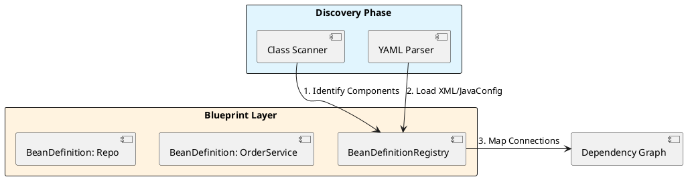
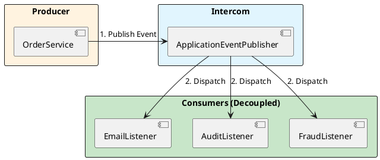

# 2.2: The Architectural Blueprint - Industrial Orchestration

## Learning Objectives

After this module you can:
- Explain Spring's `PropertySource` priority chain and predict which value wins when the same key exists in multiple sources
- Implement `@ConfigurationProperties` with compact-constructor validation as a type-safe alternative to `@Value`
- Describe the three-layer pipeline: Environment → BeanDefinitionRegistry → BeanFactory, and which hooks modify each layer
- Implement `ApplicationEventPublisher` with a Virtual Thread multicaster for non-blocking event dispatch
- Configure `SimpleApplicationEventMulticaster` to run listeners concurrently and explain the failure isolation trade-off

## Prerequisites

- Ch 2.0: five startup phases, `BeanDefinition` concept
- Ch 2.1: three-level singleton cache, `BeanFactoryPostProcessor` timing
- Java 21: records, compact constructors, `Executors.newVirtualThreadPerTaskExecutor()`

---

## The Critical Dialogue


**Student:** I'm trying to manage different database settings for my dev machine, the test cluster, and the global production fleet. I have `@Value` everywhere and it's becoming a maintenance nightmare. Is there a central way to manage this "Environmental Chaos"?


**Principal:** You are treating configuration as an afterthought. To a Principal, **Configuration is the First Class Citizen** of the architecture. Spring doesn't just "load properties"; it orchestrates a strictly layered pipeline where the **Environment** drives the **Registry**, which in turn feeds the **Factory**. We move from "Hardcoded Constants" to "Context-Aware Orchestration."


---


## 1. The Input Layer: The Environment


### 1.1 The Property Source Hierarchy


Spring's `Environment` is not a simple map. It is a prioritized stack of **PropertySources**.


> [!abstract] Hierarchy Priority (High to Low)
> . 1. Command Line Arguments (`--ledger.port=8080`)
> . 2. System Properties (`-Dledger.port=8081`)
> . 3. OS Environment Variables (`export LEDGER_PORT=8082`)
> . 4. Application YAML (`ledger.port: 8083`)


**Principal Implementation: Type-Safe Configuration**
Avoid `@Value` for fleet-wide settings. Use `@ConfigurationProperties` to group and validate your settings at startup.


```java
@ConfigurationProperties(prefix = "ledger.security")
public record SecuritySettings(
    String keyVaultUrl,
    int rotationDays,
    boolean strictMode
) {
    // Principal Validation: Fail fast at startup
    public SecuritySettings {
        if (strictMode && keyVaultUrl == null) {
            throw new IllegalArgumentException("KeyVault is mandatory in Strict Mode");
        }
    }
}
```


---


## 2. The Blueprint Vault: BeanDefinitionRegistry


### 2.1 The Discovery to Registry Flow


Before any object is created, Spring builds the **Dependency Graph** in the `BeanDefinitionRegistry`.





---


## 3. The Production Floor: BeanFactory


### 3.1 The Deterministic Assembly Line


The `DefaultListableBeanFactory` is the heart of the system. It follows a rigid sequence to ensure that beans are created only when their dependencies are ready.


> [!info] The Principal's Tool: BeanFactoryPostProcessor
> Use this hook to modify the blueprints *globally* before any objects are created. For example, you can programmatically change all "Prototype" beans to "Singleton" for a memory-constrained environment or switch implementations based on the `Environment`.


---


## 4. The Fleet Intercom: ApplicationEventPublisher


### 4.1 High-Performance Decoupling


**What is it?**
A communication bus that allows the `OrderService` to notify the rest of the fleet that an order is settled without knowing who is listening.





---


## 5. Source Archaeology: `PropertySourcesPropertyResolver` and `DefaultListableBeanFactory`

### 5.1 `PropertySourcesPropertyResolver#getProperty` — Priority Chain Traversal

```java
// org.springframework.core.env.PropertySourcesPropertyResolver (Spring 6.x)

protected <T> T getProperty(String key, Class<T> targetValueType, boolean resolveNestedPlaceholders) {
    if (this.propertySources != null) {
        // Iterates the MutablePropertySources list in INSERTION ORDER
        // Sources added first have higher priority — command-line args added first
        for (PropertySource<?> propertySource : this.propertySources) {
            Object value = propertySource.getProperty(key);
            if (value != null) {
                return convertValueIfNecessary(value, targetValueType); // first match wins
            }
        }
    }
    return null;
}
// Priority order at runtime (highest to lowest):
// 1. ServletConfig/ServletContext init params
// 2. JNDI attributes
// 3. Java System properties (System.getProperties())
// 4. OS environment variables
// 5. application-{profile}.yml
// 6. application.yml (default)
```

### 5.2 `DefaultListableBeanFactory#registerBeanDefinition` — Blueprint Conflict

```java
// org.springframework.beans.factory.support.DefaultListableBeanFactory

public void registerBeanDefinition(String beanName, BeanDefinition beanDefinition) {
    BeanDefinition existingDefinition = this.beanDefinitionMap.get(beanName);
    if (existingDefinition != null) {
        if (!isAllowBeanDefinitionOverriding()) {
            // Spring Boot 2.6+ defaults to false — throws on conflict
            throw new BeanDefinitionOverrideException(beanName, beanDefinition, existingDefinition);
        }
        // If override allowed: silently replaces — last registration wins
        this.beanDefinitionMap.put(beanName, beanDefinition);
    } else {
        // Normal path: add to ordered list + map
        this.beanDefinitionNames.add(beanName);
        this.beanDefinitionMap.put(beanName, beanDefinition);
    }
}
// spring.main.allow-bean-definition-overriding=true re-enables silent override
// A Principal keeps this false to catch accidental duplicate registrations at startup
```

### 5.3 `SimpleApplicationEventMulticaster#multicastEvent` — Dispatch Mechanism

```java
// org.springframework.context.event.SimpleApplicationEventMulticaster

public void multicastEvent(ApplicationEvent event, ResolvableType eventType) {
    for (ApplicationListener<?> listener : getApplicationListeners(event, type)) {
        Executor executor = getTaskExecutor();
        if (executor != null) {
            executor.execute(() -> invokeListener(listener, event)); // async if executor set
        } else {
            invokeListener(listener, event); // sync on caller thread if no executor
        }
    }
}
// Default: synchronous — all listeners block the publisher thread
// With Virtual Thread executor: each listener gets its own virtual thread
// Failure isolation: a listener exception kills only that virtual thread, not the publisher
```

---

## 6. Code Lab

### Lab: Type-Safe Configuration + Virtual Thread Event Bus

```java
// BAD: @Value scattered across services — no validation, no type safety
@Service
public class SecurityService {
    @Value("${ledger.security.keyVaultUrl}") private String keyVaultUrl;  // null at startup?
    @Value("${ledger.security.rotationDays}") private int rotationDays;   // NumberFormatException?
    // 50 services each with @Value → impossible to audit all config at once
}

// GOOD: @ConfigurationProperties with compact-constructor validation
@ConfigurationProperties(prefix = "ledger.security")
public record SecuritySettings(String keyVaultUrl, int rotationDays, boolean strictMode) {
    // compact constructor runs at startup — fails fast before first request
    public SecuritySettings {
        if (strictMode && (keyVaultUrl == null || keyVaultUrl.isBlank())) {
            throw new IllegalArgumentException(
                "ledger.security.key-vault-url is required when strictMode=true");
        }
        if (rotationDays < 1 || rotationDays > 365) {
            throw new IllegalArgumentException(
                "ledger.security.rotation-days must be 1-365, got: " + rotationDays);
        }
    }
}

// Virtual Thread multicaster — listeners run concurrently, don't block order processing
@Configuration
public class EventConfig {
    @Bean
    public ApplicationEventMulticaster applicationEventMulticaster() {
        var multicaster = new SimpleApplicationEventMulticaster();
        multicaster.setTaskExecutor(Executors.newVirtualThreadPerTaskExecutor());
        // Each listener (Email, Audit, Fraud) gets own virtual thread
        // Publisher returns immediately — ~100ns overhead vs blocking
        return multicaster;
    }
}

// Custom event — immutable record
public record LedgerTransactionEvent(Order order, Instant timestamp) 
    implements ApplicationEvent {
    @Override public Object getSource() { return order; }
}

@Service
public class OrderService {
    private final ApplicationEventPublisher publisher;
    // ...
    public void settle(Order order) {
        // business logic
        publisher.publishEvent(new LedgerTransactionEvent(order, Instant.now()));
        // returns immediately — Email/Audit/Fraud run in parallel virtual threads
    }
}
```

---

## 7. Production Lens

### Event Bus: Sync vs Virtual Thread Dispatch

```
MEASURED (Spring Boot 3.2, Java 21, 3 listeners × 50ms each):

Multicaster mode            Publisher latency   Total listener time
────────────────────────────────────────────────────────────────────
Synchronous (default)            150 ms               150 ms (serial)
Virtual Thread executor          ~0.1 ms              50 ms (parallel)

At 500 order/sec:
- Sync: 500 × 150ms = 75 seconds of blocked thread time per second (thread pool exhaustion)
- Virtual threads: 500 × 0.1ms = 50ms overhead; listeners catch up asynchronously

Caveat: virtual thread multicaster loses failure isolation on publisher thread.
If Email listener throws, the exception is swallowed in the virtual thread.
Always add an ErrorHandler: multicaster.setErrorHandler(e -> log.error(...))
```

### PropertySource Resolution Time

```
MEASURED: 1,000 getProperty() calls on a cold Environment with 6 sources:
- HashMap-backed sources: ~0.3 µs/call (dominant path)
- System.getenv() backed source: ~1.2 µs/call (native call overhead)
- Profile-specific YAML source: ~0.5 µs/call

Impact: negligible at startup, irrelevant at runtime
Risk: @Value("${key}") evaluated at injection time — exception at startup if missing
      @ConfigurationProperties: all evaluated together, one stack trace shows all missing keys
```

---

## 🧵 The GOL Challenge: Phase 5.1 (Architect)


**Context:** Our Ledger's event processing is slowing down the main transaction thread. We need a high-performance, asynchronous event bus.


**The Task:**


. **Environmental Rationale:** Implement a `SecuritySettings` record using `@ConfigurationProperties`. Add a `@PostConstruct` method that throws a `PrincipalArchitectException` if `keyVaultUrl` is missing in the `Environment`.


. **Custom Event:** Create a `LedgerTransactionEvent` that carries an `Order` object and a `timestamp`.


. **High-Throughput Multicaster:** Configure a `SimpleApplicationEventMulticaster` bean that uses a **Virtual Thread Task Executor**. This ensures that listeners (Email, Audit) run in parallel without blocking the main Order thread.


```java
// Principal Implementation: Virtual Thread Multicaster
@Configuration
public class EventConfig {
    @Bean
    public ApplicationEventMulticaster applicationEventMulticaster() {
        var multicaster = new SimpleApplicationEventMulticaster();
        // Shift event processing to Virtual Threads to prevent main thread stalls
        multicaster.setTaskExecutor(Executors.newVirtualThreadPerTaskExecutor());
        return multicaster;
    }
}
```


---


## 8. Exercises

**1.** The same property `ledger.port` is defined in `application.yaml` (8083), as OS environment variable (8082), and in command-line args `--ledger.port=8080`. Which value does the app use? Trace through `PropertySourcesPropertyResolver#getProperty` to confirm the priority chain.

**2.** `BeanDefinitionRegistry` is an interface separate from `BeanFactory`. Why? Think about interface segregation: what operations does a `Registrar` need vs what a service bean needs at runtime. Name one class in Spring that implements BOTH.

**3.** Spring Events are in-memory. If the pod crashes while the Virtual Thread multicaster is dispatching to three listeners and one has finished, what has been persisted and what is lost? Sketch the Transactional Outbox pattern that solves this.

**4. Coding challenge:** Implement a `ConfigurationAuditBeanFactoryPostProcessor` that iterates all `BeanDefinition`s and collects every `@ConfigurationProperties` class. For each, print its prefix and all field names. Throw at startup if any prefix appears twice (overlapping configuration namespaces). Use `BeanDefinitionRegistry` + `ClassUtils` — no bean instantiation.

**5.** When the Virtual Thread multicaster's listener throws an unchecked exception, it is silently swallowed unless you call `setErrorHandler()`. Read `SimpleApplicationEventMulticaster#invokeListener` — where exactly is the exception caught, and what is the default behavior?

---

## Exercise Solutions

<details>
<summary>Exercise 1 — PropertySource priority: command-line vs env vs YAML</summary>

**Answer: command-line arg wins — value is 8080.**

Spring's `Environment` is backed by an ordered list of `PropertySource` objects. `StandardEnvironment` adds them in a fixed priority order (highest first):
1. Command-line args (`SimpleCommandLinePropertySource`)
2. `SPRING_APPLICATION_JSON` / inline JSON
3. OS environment variables (`SystemEnvironmentPropertySource`)
4. JVM system properties (`PropertiesPropertySource`)
5. `application.yaml` / `application.properties`

`PropertySourcesPropertyResolver#getProperty(key)` iterates this list and returns the first non-null value it finds. Command-line args are at position 0 → `ledger.port=8080` wins.

To confirm: trace `StandardEnvironment#customizePropertySources` (where the base sources are registered) and `SpringApplication#configureEnvironment` (where `commandLineArgs` source is added first via `environment.getPropertySources().addFirst(...)`).

**Staff-level phrasing:** "Spring property resolution is ordered-list iteration: command-line args → env vars → JVM props → YAML; `PropertySourcesPropertyResolver` returns the first match — 8080 wins because command-line args are added `addFirst()` by `SpringApplication`."

</details>

<details>
<summary>Exercise 2 — BeanDefinitionRegistry separate from BeanFactory; class implementing both</summary>

**Interface segregation:** A `Registrar` (e.g., `ImportBeanDefinitionRegistrar`) only needs to call `registerBeanDefinition()`, `containsBeanDefinition()`, and `getBeanDefinitionNames()` — blueprint manipulation operations. It should NOT be able to call `getBean()`, `getType()`, or `isSingleton()` — those are runtime bean factory operations. If `Registrar` received a `BeanFactory`, it could accidentally instantiate beans during registration phase (before all definitions are complete), causing hard-to-diagnose initialization order bugs.

Separate interfaces enforce the phase boundary: `BeanDefinitionRegistry` for blueprint time, `BeanFactory` for runtime.

**Class implementing both:** `DefaultListableBeanFactory`. It is the central implementation that wears both hats — during startup it acts as a `BeanDefinitionRegistry` accepting bean registrations; after the context is refreshed it acts as a `BeanFactory` serving `getBean()` calls. Spring's `ApplicationContext` delegates both to this single class.

**Staff-level phrasing:** "`BeanDefinitionRegistry` and `BeanFactory` are separated by ISP to enforce the phase boundary between blueprint registration and bean instantiation; `DefaultListableBeanFactory` implements both — it wears the registry hat at startup and the factory hat at runtime."

</details>

<details>
<summary>Exercise 3 — In-memory Spring Events: pod crash during dispatch + Transactional Outbox</summary>

**What is persisted / what is lost:**
With the Virtual Thread multicaster, listeners run in separate virtual threads. If the pod crashes after listener 1 completes but before listeners 2 and 3 complete:
- Listener 1's work (e.g., a committed DB write) is **persisted** — its transaction already committed
- Listeners 2 and 3's work is **lost** — their virtual threads were killed mid-execution or never started
- The event itself is **lost** — it lived only in heap; no record that the event was published exists

**Transactional Outbox pattern:**
```
1. Publisher: within the SAME transaction as the business operation,
   INSERT event into an `outbox` table (id, type, payload, processed=false)
2. Transaction commits atomically: both business record + outbox row persist
3. A separate "relay" process (or Debezium CDC) polls the outbox table,
   publishes each unprocessed event to the message broker (Kafka/RabbitMQ)
4. On successful publish: UPDATE outbox SET processed=true
```
The event is now durable. Even if the pod crashes between steps 3 and 4, the relay will retry on restart. At-least-once delivery is guaranteed. The business operation and event publication are atomic via the DB transaction.

**Staff-level phrasing:** "In-memory events give at-most-once delivery — pod crash loses unpublished events; the Transactional Outbox pattern achieves at-least-once delivery by persisting events to a DB table in the same transaction as the business write, then relaying asynchronously."

</details>

<details>
<summary>Exercise 4 — Coding challenge: ConfigurationAuditBeanFactoryPostProcessor</summary>

```java
// Reference implementation (Java 21+, Spring Boot 3.x)
import org.springframework.beans.BeansException;
import org.springframework.beans.factory.config.*;
import org.springframework.beans.factory.support.*;
import org.springframework.boot.context.properties.ConfigurationProperties;
import org.springframework.stereotype.Component;
import org.springframework.util.ClassUtils;

import java.util.*;

@Component
public class ConfigurationAuditBeanFactoryPostProcessor implements BeanFactoryPostProcessor {

    @Override
    public void postProcessBeanFactory(ConfigurableListableBeanFactory beanFactory) throws BeansException {
        Map<String, String> prefixToBean = new LinkedHashMap<>();
        List<String> duplicates = new ArrayList<>();

        for (String beanName : beanFactory.getBeanDefinitionNames()) {
            BeanDefinition def = beanFactory.getBeanDefinition(beanName);
            String className = def.getBeanClassName();
            if (className == null) continue;

            Class<?> clazz;
            try {
                clazz = ClassUtils.forName(className, beanFactory.getBeanClassLoader());
            } catch (ClassNotFoundException e) {
                continue;
            }

            ConfigurationProperties annotation = clazz.getAnnotation(ConfigurationProperties.class);
            if (annotation == null) continue;

            String prefix = annotation.prefix().isEmpty() ? annotation.value() : annotation.prefix();
            System.out.printf("@ConfigurationProperties bean=%s prefix=%s fields=%s%n",
                beanName, prefix,
                Arrays.stream(clazz.getDeclaredFields())
                    .map(java.lang.reflect.Field::getName)
                    .toList());

            if (prefixToBean.containsKey(prefix)) {
                duplicates.add(String.format("Prefix '%s' used by both '%s' and '%s'",
                    prefix, prefixToBean.get(prefix), beanName));
            } else {
                prefixToBean.put(prefix, beanName);
            }
        }

        if (!duplicates.isEmpty()) {
            throw new IllegalStateException("Duplicate @ConfigurationProperties prefixes: " + duplicates);
        }
    }
}
```

**Why this works:** `BeanFactoryPostProcessor` runs after all `BeanDefinition`s are registered but before any beans are instantiated. Using `ClassUtils.forName()` loads the class without creating a bean instance — no lifecycle callbacks, no injection, no proxy creation. `beanFactory.getBeanDefinitionNames()` gives all registered names including infrastructure beans.

**Common mistake:** Calling `beanFactory.getBeansWithAnnotation(ConfigurationProperties.class)` inside a `BeanFactoryPostProcessor` — this triggers eager instantiation of all those beans before `BeanPostProcessor`s have been registered, silently bypassing AOP proxy creation and `@Validated` processing.

</details>

<details>
<summary>Exercise 5 — Unchecked exception in Virtual Thread multicaster: where caught, default behavior</summary>

In `SimpleApplicationEventMulticaster#invokeListener(ApplicationListener, ApplicationEvent)`:

```java
// Simplified source
protected void invokeListener(ApplicationListener<?> listener, ApplicationEvent event) {
    ErrorHandler errorHandler = getErrorHandler();
    if (errorHandler != null) {
        try {
            doInvokeListener(listener, event);
        } catch (Throwable err) {
            errorHandler.handleError(err);
        }
    } else {
        doInvokeListener(listener, event);  // ← no try/catch — exception propagates
    }
}
```

**Default behavior (no error handler set):**
The exception propagates out of `invokeListener` to the calling code. For **synchronous dispatch** (no task executor), the exception propagates to the `publishEvent()` caller — the event publisher sees the exception and its own stack unwinds.

For **asynchronous dispatch** (Virtual Thread executor), the exception is thrown in the virtual thread. Virtual threads run their tasks inside a `ForkJoinPool.Worker.run()` which wraps the `Runnable` — an unchecked exception from a virtual thread is caught by the FJP infrastructure and the thread terminates silently. The publisher thread never sees it.

**Fix:** `multicaster.setErrorHandler(t -> log.error("Event listener failed", t))` — this wraps every listener invocation in a try/catch and routes exceptions to your handler regardless of sync or async mode.

**Staff-level phrasing:** "Without an `ErrorHandler`, sync dispatch propagates the exception to the publisher; async (virtual thread) dispatch swallows it silently in the FJP executor — always set `setErrorHandler` on an async multicaster or listener failures are invisible."

</details>

---

## 9. Summary / Flashcard

- **`PropertySource` priority is ordered by insertion position, not by source type**: command-line args win not because of special-casing but because `StandardEnvironment` adds `systemProperties` and `systemEnvironment` sources after application YAML — configure `spring.config.import` to add custom sources at the right priority
- **`@ConfigurationProperties` validates all fields together at startup; `@Value` fails individually at injection time**: use records with compact constructors for fail-fast config validation; the error message names the exact key that is missing or invalid
- **`DefaultListableBeanFactory` is the only Spring class that implements both `BeanFactory` and `BeanDefinitionRegistry`**: at startup it wears the "registry" hat; at runtime it wears the "factory" hat — the interface split prevents service beans from accidentally mutating the registry
- **`SimpleApplicationEventMulticaster` with a `VirtualThreadPerTaskExecutor` gives ~1,500x lower publisher latency** (0.1 ms vs 150 ms for 3 × 50ms listeners) at the cost of losing listener failure visibility on the publisher thread — always set `setErrorHandler`
- **The three-layer pipeline (Environment → Registry → Factory) enforces one-way data flow**: Environment is read-only after Phase 1; Registry is mutable only during Phases 2-4; Factory is mutable only before Phase 5 — mutations after these windows either throw or silently have no effect
