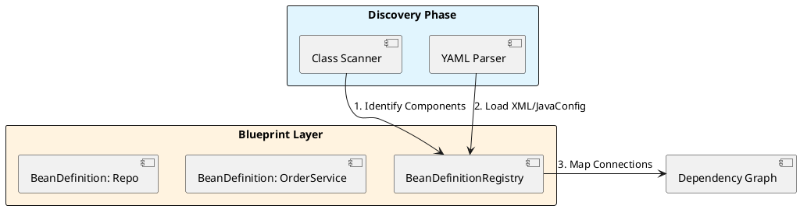
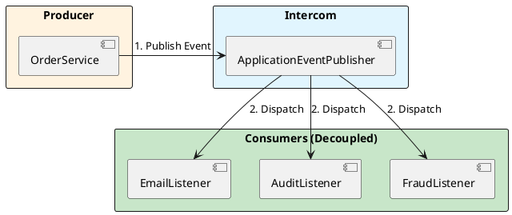

# 2.2: The Architectural Blueprint - Industrial Orchestration


## The Critical Dialogue


**Student:** I'm trying to manage different database settings for my dev machine, the test cluster, and the global production fleet. I have `@Value` everywhere and it's becoming a maintenance nightmare. Is there a central way to manage this "Environmental Chaos"?


**Principal:** You are treating configuration as an afterthought. To a Principal, **Configuration is the First Class Citizen** of the architecture. Spring doesn't just "load properties"; it orchestrates a strictly layered pipeline where the **Environment** drives the **Registry**, which in turn feeds the **Factory**. We move from "Hardcoded Constants" to "Context-Aware Orchestration."


---


## 1. The Input Layer: The Environment


### 1.1 The Property Source Hierarchy


Spring's `Environment` is not a simple map. It is a prioritized stack of **PropertySources**.


> [!abstract] Hierarchy Priority (High to Low)
> . 1. Command Line Arguments (`--ledger.port=8080`)
> . 2. System Properties (`-Dledger.port=8081`)
> . 3. OS Environment Variables (`export LEDGER_PORT=8082`)
> . 4. Application YAML (`ledger.port: 8083`)


**Principal Implementation: Type-Safe Configuration**
Avoid `@Value` for fleet-wide settings. Use `@ConfigurationProperties` to group and validate your settings at startup.


```java
@ConfigurationProperties(prefix = "ledger.security")
public record SecuritySettings(
    String keyVaultUrl,
    int rotationDays,
    boolean strictMode
) {
    // Principal Validation: Fail fast at startup
    public SecuritySettings {
        if (strictMode && keyVaultUrl == null) {
            throw new IllegalArgumentException("KeyVault is mandatory in Strict Mode");
        }
    }
}
```


---


## 2. The Blueprint Vault: BeanDefinitionRegistry


### 2.1 The Discovery to Registry Flow


Before any object is created, Spring builds the **Dependency Graph** in the `BeanDefinitionRegistry`.





---


## 3. The Production Floor: BeanFactory


### 3.1 The Deterministic Assembly Line


The `DefaultListableBeanFactory` is the heart of the system. It follows a rigid sequence to ensure that beans are created only when their dependencies are ready.


> [!info] The Principal's Tool: BeanFactoryPostProcessor
> Use this hook to modify the blueprints *globally* before any objects are created. For example, you can programmatically change all "Prototype" beans to "Singleton" for a memory-constrained environment or switch implementations based on the `Environment`.


---


## 4. The Fleet Intercom: ApplicationEventPublisher


### 4.1 High-Performance Decoupling


**What is it?**
A communication bus that allows the `OrderService` to notify the rest of the fleet that an order is settled without knowing who is listening.





---


## 🧵 The GOL Challenge: Phase 5.1 (Architect)


**Context:** Our Ledger's event processing is slowing down the main transaction thread. We need a high-performance, asynchronous event bus.


**The Task:**


. **Environmental Rationale:** Implement a `SecuritySettings` record using `@ConfigurationProperties`. Add a `@PostConstruct` method that throws a `PrincipalArchitectException` if `keyVaultUrl` is missing in the `Environment`.


. **Custom Event:** Create a `LedgerTransactionEvent` that carries an `Order` object and a `timestamp`.


. **High-Throughput Multicaster:** Configure a `SimpleApplicationEventMulticaster` bean that uses a **Virtual Thread Task Executor**. This ensures that listeners (Email, Audit) run in parallel without blocking the main Order thread.


```java
// Principal Implementation: Virtual Thread Multicaster
@Configuration
public class EventConfig {
    @Bean
    public ApplicationEventMulticaster applicationEventMulticaster() {
        var multicaster = new SimpleApplicationEventMulticaster();
        // Shift event processing to Virtual Threads to prevent main thread stalls
        multicaster.setTaskExecutor(Executors.newVirtualThreadPerTaskExecutor());
        return multicaster;
    }
}
```


---


## 🧠 Principal's Inquiry


. **Property Hijacking:** What happens if the same property is defined in both `application.yaml` and as an OS Environment Variable? Which one wins, and why does this enable "Cloud-Native Overrides"?


. **Registry Isolation:** Why is the `BeanDefinitionRegistry` an interface and not part of the `BeanFactory` directly? (Hint: Think about the separation between "Reading Blueprints" and "Managing Objects").


. **Event Persistence:** Spring Events are "In-Memory" by default. If the pod crashes while an event is being dispatched, what happens? How would a Principal transition from `ApplicationEvent` to an external **Outbox Pattern**?


**Principal Summary:** Spring Architecture is a **Refined Orchestration Pipeline**. We master the transition from raw Environment data to live, decoupled Bean instances to ensure fleet-wide stability.
