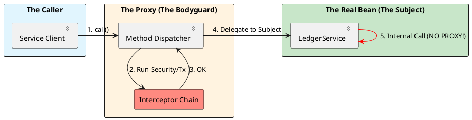

# 2.3: The Proxy Engine and AOP Physics


## The Critical Dialogue


**Student:** I added `@Transactional` to my method, but it's not working. When I call `processOrder()` which internally calls `recordAudit()` in the same class, the audit isn't being saved to the database on failure. Is Spring's transaction management unreliable?


**Principal:** Spring's transaction management is perfectly reliable; your understanding of **Object Identity** in a proxy-based world is what's failing. When you use AOP, Spring doesn't give you your object—it gives you a **Bodyguard Proxy**. If you talk to the bodyguard, he manages the transaction. If you call a method from *inside* the class, you're bypassing the bodyguard and talking directly to the "vulnerable" object. This is the **Self-Invocation Trap**, and it's the number one cause of data corruption in Spring systems.


---


## 1. The Proxy Pattern: The Smart Wrapper


**What is it?**
A Proxy is a surrogate object that controls access to the original object. It has the exact same method signatures as your class, but it adds "Advice" (logic) before or after the actual method execution.


### 1.1 The Three Pillars of Spring AOP
Spring uses proxies primarily for three "Cross-Cutting Concerns":
. **1. Transactions (@Transactional):** Opens a DB connection, sets `autoCommit(false)`, and performs a `commit/rollback`.
. **2. Security (@PreAuthorize):** Inspects the `SecurityContext` before allowing the method to run.
. **3. Caching (@Cacheable):** Checks a Redis/Caffeine cache; if found, it returns the value *without even calling your method*.


---


## 2. The Internal Mechanics: JDK vs. CGLIB


A Principal knows exactly which "Physical Form" their bean has taken in the JVM.


> [!abstract] 1. JDK Dynamic Proxy (Interface-based)
> Uses the native `java.lang.reflect.Proxy`.
> . **Requirement:** Your bean must implement an interface.
> . **Physics:** It creates a proxy object that implements that interface. It is faster to create but slightly slower to execute due to reflection calls.


> [!abstract] 2. CGLIB (Class-based)
> Uses bytecode generation to create a **Subclass** of your bean at runtime.
> . **Requirement:** Your class and methods must NOT be `final`.
> . **Physics:** It literally "extends" your class. Spring 6+ defaults to CGLIB because it handles "self-references" and "concrete types" much better.





---


## 3. The Failure State: The Self-Invocation Trap


This is the most critical technical concept in Spring Architecture.


### 3.1 Code Archaeology of a Failure
```java
@Service
public class OrderService {

    public void process(Order o) {
        // ... business logic ...
        // FAILURE: This call is NOT transactional!
        this.recordInJournal(o); 
    }

    @Transactional
    public void recordInJournal(Order o) {
        repo.save(o);
    }
}
```


**Why it fails:**
When you call `process()`, you are calling it on the **Proxy**. The proxy sees no `@Transactional` on `process()`, so it just passes the call through. Once inside the `OrderService`, the `this` keyword refers to the **actual object**, not the proxy. The call to `recordInJournal` is a direct local call. The "Bodyguard" is standing outside the door while the fight happens inside the room.


---


## 4. The Principal's Fixes


### 4.1 Solution A: Structural Separation (Recommended)
Move the transactional logic to a separate bean. This forces the call to go through the proxy.


### 4.2 Solution B: Self-Injection (The "Bodyguard-in-a-Box")
If you must keep it in the same class, inject the proxy into itself.


```java
@Service
public class OrderService {
    // Principal Trick: Inject the proxy of OURSELVES
    @Autowired
    private ObjectProvider(OrderService) self;

    public void process(Order o) {
        // SUCCESS: We call the method on the PROXY, not on 'this'
        self.getIfAvailable().recordInJournal(o);
    }

    @Transactional
    public void recordInJournal(Order o) {
        repo.save(o);
    }
}
```


---


## 🧵 The GOL Challenge: Phase 5.2 (The Proxy Audit)


**Context:** We suspect our "Fraud Audit" is being bypassed during batch processing because of internal method calls.


**The Task:**


. **The Trap:** Create a `JournalService` with an internal call to a `@Transactional` method. Write a test that triggers an exception and prove that the transaction **fails to roll back**.


. **The Fix:** Refactor the service using the `ObjectProvider` self-injection pattern shown above. Verify that the rollback now works.


. **Source Archaeology:** Put a breakpoint in `org.springframework.aop.framework.ReflectiveMethodInvocation`. Inspect the `interceptorsAndDynamicMethodMatchers` list. How many "Bodyguards" are active for a standard `@Transactional` method?


---


## 🧠 Principal's Inquiry


. **Finality Physics:** What happens if you add `@Transactional` to a `public final` method in a CGLIB-proxied class? (Hint: Can you override a final method?).


. **Object Identity:** In a proxied bean, `bean.getClass()` will not return your class name (e.g., `OrderService`). What does it return instead, and why does this break some `equals()` implementations?


. **The Performance Ceiling:** At 1 million requests per second, a single extra AOP interceptor adds **30ms of overhead** per 1,000 calls. How do you decide when to switch to **AspectJ (Compile-time weaving)** to remove the proxy tax?


**Principal Summary:** Proxies are the **Invisible Hand** of Spring. We master the "Self-Invocation" physics to ensure our Ledger's data integrity is never compromised by hidden local calls.
