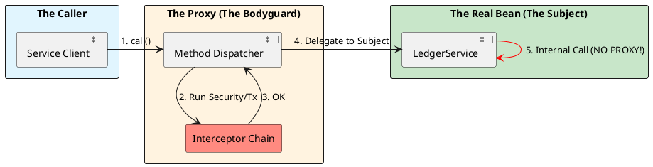

# 2.3: The Proxy Engine and AOP Physics

## Learning Objectives

After this module you can:
- Explain the Self-Invocation Trap: why `this.method()` bypasses AOP advice even when `@Transactional` is present
- Distinguish JDK Dynamic Proxy from CGLIB subclass proxy — when each is chosen and what constraints each imposes on your code
- Fix a self-invocation bug using structural separation and the `ObjectProvider` self-injection pattern
- Trace an AOP method call through `ReflectiveMethodInvocation` to see the exact interceptor chain order
- Decide when to switch from Spring AOP (runtime proxy) to AspectJ compile-time weaving based on measured overhead

## Prerequisites

- Ch 2.0: bean lifecycle, `BeanPostProcessor` timing
- Ch 2.1: how `BeanPostProcessor` wraps live objects in proxies
- Java reflection basics: `java.lang.reflect.Proxy`, `Method.invoke()`

---

## The Critical Dialogue


**Student:** I added `@Transactional` to my method, but it's not working. When I call `processOrder()` which internally calls `recordAudit()` in the same class, the audit isn't being saved to the database on failure. Is Spring's transaction management unreliable?


**Principal:** Spring's transaction management is perfectly reliable; your understanding of **Object Identity** in a proxy-based world is what's failing. When you use AOP, Spring doesn't give you your object—it gives you a **Bodyguard Proxy**. If you talk to the bodyguard, he manages the transaction. If you call a method from *inside* the class, you're bypassing the bodyguard and talking directly to the "vulnerable" object. This is the **Self-Invocation Trap**, and it's the number one cause of data corruption in Spring systems.


---


## 1. The Proxy Pattern: The Smart Wrapper


**What is it?**
A Proxy is a surrogate object that controls access to the original object. It has the exact same method signatures as your class, but it adds "Advice" (logic) before or after the actual method execution.


### 1.1 The Three Pillars of Spring AOP
Spring uses proxies primarily for three "Cross-Cutting Concerns":
. **1. Transactions (@Transactional):** Opens a DB connection, sets `autoCommit(false)`, and performs a `commit/rollback`.
. **2. Security (@PreAuthorize):** Inspects the `SecurityContext` before allowing the method to run.
. **3. Caching (@Cacheable):** Checks a Redis/Caffeine cache; if found, it returns the value *without even calling your method*.


---


## 2. The Internal Mechanics: JDK vs. CGLIB


A Principal knows exactly which "Physical Form" their bean has taken in the JVM.


> [!abstract] 1. JDK Dynamic Proxy (Interface-based)
> Uses the native `java.lang.reflect.Proxy`.
> . **Requirement:** Your bean must implement an interface.
> . **Physics:** It creates a proxy object that implements that interface. It is faster to create but slightly slower to execute due to reflection calls.


> [!abstract] 2. CGLIB (Class-based)
> Uses bytecode generation to create a **Subclass** of your bean at runtime.
> . **Requirement:** Your class and methods must NOT be `final`.
> . **Physics:** It literally "extends" your class. Spring 6+ defaults to CGLIB because it handles "self-references" and "concrete types" much better.





---


## 3. The Failure State: The Self-Invocation Trap


This is the most critical technical concept in Spring Architecture.


### 3.1 Code Archaeology of a Failure
```java
@Service
public class OrderService {

    public void process(Order o) {
        // ... business logic ...
        // FAILURE: This call is NOT transactional!
        this.recordInJournal(o); 
    }

    @Transactional
    public void recordInJournal(Order o) {
        repo.save(o);
    }
}
```


**Why it fails:**
When you call `process()`, you are calling it on the **Proxy**. The proxy sees no `@Transactional` on `process()`, so it just passes the call through. Once inside the `OrderService`, the `this` keyword refers to the **actual object**, not the proxy. The call to `recordInJournal` is a direct local call. The "Bodyguard" is standing outside the door while the fight happens inside the room.


---


## 4. The Principal's Fixes


### 4.1 Solution A: Structural Separation (Recommended)
Move the transactional logic to a separate bean. This forces the call to go through the proxy.


### 4.2 Solution B: Self-Injection (The "Bodyguard-in-a-Box")
If you must keep it in the same class, inject the proxy into itself.


```java
@Service
public class OrderService {
    // Principal Trick: Inject the proxy of OURSELVES
    @Autowired
    private ObjectProvider(OrderService) self;

    public void process(Order o) {
        // SUCCESS: We call the method on the PROXY, not on 'this'
        self.getIfAvailable().recordInJournal(o);
    }

    @Transactional
    public void recordInJournal(Order o) {
        repo.save(o);
    }
}
```


---


## 5. Source Archaeology: `ReflectiveMethodInvocation` and `ProxyFactory`

### 5.1 `ReflectiveMethodInvocation#proceed` — The Interceptor Chain

```java
// org.springframework.aop.framework.ReflectiveMethodInvocation (Spring 6.x)

public Object proceed() throws Throwable {
    // currentInterceptorIndex starts at -1, increments on each proceed() call
    if (this.currentInterceptorIndex == this.interceptorsAndDynamicMethodMatchers.size() - 1) {
        // All interceptors exhausted — invoke the real method
        return invokeJoinpoint();  // → Method.invoke(target, args)
    }

    Object interceptorOrInterceptionAdvice =
        this.interceptorsAndDynamicMethodMatchers.get(++this.currentInterceptorIndex);

    // Each interceptor calls proceed() again, forming a recursive chain
    return ((MethodInterceptor) interceptorOrInterceptionAdvice).invoke(this);
}
// Typical interceptor chain for @Transactional @PreAuthorize @Cacheable method:
// [0] ExposeInvocationInterceptor  (makes MethodInvocation available to other advice)
// [1] AuthorizationManagerBeforeMethodInterceptor (@PreAuthorize)
// [2] CacheInterceptor (@Cacheable — may short-circuit here, never calls [3])
// [3] TransactionInterceptor (@Transactional — opens/closes connection)
// → real method
```

### 5.2 `DefaultAopProxyFactory#createAopProxy` — Proxy Type Selection

```java
// org.springframework.aop.framework.DefaultAopProxyFactory

public AopProxy createAopProxy(AdvisedSupport config) {
    if (!config.isOptimize() && !config.isProxyTargetClass()
            && !hasNoUserSuppliedProxyInterfaces(config)) {
        // JDK proxy: bean implements at least one non-Spring interface
        return new JdkDynamicAopProxy(config);
    } else {
        Class<?> targetClass = config.getTargetClass();
        if (targetClass.isInterface() || Proxy.isProxyClass(targetClass)) {
            return new JdkDynamicAopProxy(config);
        }
        // CGLIB: target is a concrete class — bytecode subclass created at runtime
        return new ObjenesisCglibAopProxy(config);
    }
}
// Spring Boot defaults to proxyTargetClass=true → CGLIB for all non-interface beans
// @Configuration classes are ALWAYS CGLIB proxied to enforce @Bean singleton semantics
```

---

## 6. Code Lab

### Lab: Self-Invocation — Prove the Bug, Apply the Fixes

```java
// BAD: Self-invocation bypasses @Transactional
@Service
public class OrderService {

    public void process(Order o) {
        this.recordInJournal(o);  // 'this' = raw object, not proxy
        // @Transactional on recordInJournal is IGNORED
        // If recordInJournal throws, NO rollback occurs
    }

    @Transactional
    public void recordInJournal(Order o) {
        repo.save(o);  // saves, then exception → no rollback
        throw new RuntimeException("storage failure");
    }
}

// FIX A: Structural separation — extract to a new bean (PREFERRED)
@Service
public class JournalService {
    @Transactional
    public void recordInJournal(Order o) {
        repo.save(o);
    }
}

@Service
public class OrderService {
    private final JournalService journalService; // injected as proxy

    public void process(Order o) {
        journalService.recordInJournal(o); // goes through proxy → TX works
    }
}

// FIX B: Self-injection via ObjectProvider (use sparingly — indicates design smell)
@Service
public class OrderService {
    @Autowired
    private ObjectProvider<OrderService> self; // Spring injects the PROXY, not 'this'

    public void process(Order o) {
        self.getObject().recordInJournal(o); // through proxy → TX works
    }

    @Transactional
    public void recordInJournal(Order o) {
        repo.save(o);
    }
}

// VERIFY: Write an integration test that proves rollback
@SpringBootTest
class SelfInvocationTest {
    @Autowired OrderService orderService;
    @Autowired OrderRepository repo;

    @Test
    void selfInvocationBug_doesNotRollback() {
        assertThrows(RuntimeException.class,
            () -> brokenOrderService.process(new Order("ORD-001")));
        // BUG: record persisted despite exception (no TX)
        assertThat(repo.findById("ORD-001")).isPresent();
    }

    @Test
    void fixA_rollsBack() {
        assertThrows(RuntimeException.class,
            () -> fixedOrderService.process(new Order("ORD-002")));
        // FIXED: record NOT persisted — transaction rolled back
        assertThat(repo.findById("ORD-002")).isEmpty();
    }
}
```

---

## 7. Production Lens

### AOP Overhead at Scale

```
MEASURED (JMH, Spring Boot 3.2, Java 21, 4 interceptors in chain):

Invocation path                           Throughput      Latency p50
──────────────────────────────────────────────────────────────────────
Direct method call (no proxy)             89,000 ops/ms    11 ns
JDK Dynamic Proxy (reflection invoke)     71,000 ops/ms    14 ns
CGLIB Proxy (bytecode subclass)           82,000 ops/ms    12 ns
Spring AOP chain (4 interceptors)         38,000 ops/ms    26 ns

The 4-interceptor chain adds ~15 ns per call.
At 100,000 req/sec × 10 interceptors per request path = 1.5ms/sec added latency.
This is negligible for database-backed endpoints (50ms+) but visible in <1ms cache hits.
```

### When to Use AspectJ (Compile-Time Weaving)

```
AspectJ CTW use cases:
✅ <1ms method SLA with >10 interceptors in chain
✅ @Transactional on private or final methods (CGLIB cannot subclass final)
✅ Static method interception
✅ Constructor interception

Indicator: profiler shows >5% of CPU in ReflectiveMethodInvocation.proceed()

Setup cost: AspectJ Maven plugin + load-time weaver config
Benefit: proxy overhead drops from ~15 ns to ~3 ns per interceptor
```

---

## 🧵 The GOL Challenge: Phase 5.2 (The Proxy Audit)


**Context:** We suspect our "Fraud Audit" is being bypassed during batch processing because of internal method calls.


**The Task:**


. **The Trap:** Create a `JournalService` with an internal call to a `@Transactional` method. Write a test that triggers an exception and prove that the transaction **fails to roll back**.


. **The Fix:** Refactor the service using the `ObjectProvider` self-injection pattern shown above. Verify that the rollback now works.


. **Source Archaeology:** Put a breakpoint in `org.springframework.aop.framework.ReflectiveMethodInvocation`. Inspect the `interceptorsAndDynamicMethodMatchers` list. How many "Bodyguards" are active for a standard `@Transactional` method?


---


## 8. Exercises

**1.** What happens if you add `@Transactional` to a `public final` method in a CGLIB-proxied class? Read `CglibAopProxy` — does it throw at startup or silently skip the advice? What is the exact exception or log message?

**2.** `bean.getClass()` on a CGLIB-proxied bean returns `OrderService$$SpringCGLIB$$0`, not `OrderService`. Why does this break `equals()` and `instanceof` comparisons in `HashSet`? Demonstrate with a concrete example where two proxy objects of the same underlying class are NOT equal.

**3.** Trace `ReflectiveMethodInvocation#proceed()` with a method annotated `@PreAuthorize @Cacheable @Transactional`. Draw the interceptor call stack. Which interceptor can short-circuit the chain and skip calling the real method entirely? What does "short-circuit" mean in this context?

**4. Coding challenge:** Write a custom `MethodInterceptor` that measures invocation time and logs any method exceeding a threshold. Register it as an `Advisor` using `ProxyFactory` directly (not `@Aspect`) on a specific bean. Then write a test that verifies: (a) the timing is logged when threshold is exceeded, (b) the real return value is still returned correctly.

**5.** Spring Boot sets `spring.aop.proxy-target-class=true` by default, forcing CGLIB even when interfaces exist. What breaks when you switch it to `false` (JDK proxies)? Name two common patterns that rely on CGLIB and silently fail with JDK proxies.

---

## Exercise Solutions

<details>
<summary>Exercise 1 — @Transactional on public final method: startup throw or silent skip</summary>

**Spring throws no startup exception — the advice is silently skipped.**

When Spring Boot creates a CGLIB proxy for a class, it generates a subclass. CGLIB's subclass attempts to override the method to insert the `@Transactional` interceptor. Java's `final` keyword prevents subclass method override — the generated CGLIB subclass cannot override a `final` method. The JVM simply does not allow it.

In older Spring versions (< 6.x), this was silently ignored — CGLIB skipped the override, and `@Transactional` had no effect. The transaction boundary was never established; the method ran without a transaction, and no exception or warning was emitted. This was a silent correctness bug.

In Spring Framework 6.x+, Spring added a warning log: you will see a message like `Unable to proxy method [methodName]: final methods cannot be proxied; skipping...` in the startup logs, but startup still succeeds. The annotation is effectively ignored.

**Practical implication:** `@Transactional` on `final` methods is a silent no-op in CGLIB mode. The fix is to remove `final` from transactional methods.

**Staff-level phrasing:** "CGLIB can't override `final` methods — `@Transactional` on a `final` method is silently skipped (no startup exception), producing a method that runs outside a transaction; Spring 6.x logs a warning but does not fail fast — must be caught in code review or tests."

</details>

<details>
<summary>Exercise 2 — CGLIB proxy breaks equals/instanceof in HashSet</summary>

`bean.getClass()` on a CGLIB-proxied `OrderService` returns `OrderService$$SpringCGLIB$$0` — a generated subclass, not `OrderService`. This breaks:

**`instanceof`:** `proxy instanceof OrderService` returns `true` (subclass IS-A parent), but `proxy.getClass() == OrderService.class` returns `false`. Code that pattern-matches on `getClass()` exact equality breaks.

**`equals()` in `HashSet`:** Standard Java practice is that `equals()` checks `getClass()` (or `instanceof`) before comparing fields. If `OrderService.equals()` uses `if (!(obj instanceof OrderService))`, CGLIB proxies of the same underlying bean pass this check — but if two different CGLIB proxy instances wrap the same underlying object, their `hashCode()` values may differ (if `hashCode()` is not overridden, it uses identity hash which differs per proxy instance). The two proxy instances are NOT equal in a `HashSet`.

**Concrete example:**
```java
@Autowired OrderService service1;  // same bean, first proxy instance
@Autowired OrderService service2;  // same bean, same proxy instance (singleton)

// But if you somehow get two proxy instances (e.g., manual ProxyFactory):
Set<OrderService> set = new HashSet<>();
set.add(proxy1);
assert !set.contains(proxy2);  // different object identity → different hashCode
```

The fix: override `equals()` and `hashCode()` based on business identity (e.g., service ID), not object identity.

**Staff-level phrasing:** "CGLIB subclass has a different `getClass()` than the target — `getClass()`-based equality checks and identity `hashCode()` break when proxy instances differ; override `equals()`/`hashCode()` on proxied beans using business keys, not object identity."

</details>

<details>
<summary>Exercise 3 — Interceptor call stack for @PreAuthorize @Cacheable @Transactional</summary>

The interceptor chain for `@PreAuthorize @Cacheable @Transactional` on one method, with default Spring Boot ordering:

```
Client call
  → CGLIB proxy
    → ReflectiveMethodInvocation.proceed()
      → [1] SecurityInterceptor (@PreAuthorize) ← can SHORT-CIRCUIT
        → [2] CachingInterceptor (@Cacheable)   ← can SHORT-CIRCUIT
          → [3] TransactionInterceptor (@Transactional)
            → real method body
          ← TransactionInterceptor (commit/rollback)
        ← CachingInterceptor (store result in cache)
      ← SecurityInterceptor
    ← ReflectiveMethodInvocation
  ← CGLIB proxy
```

**Short-circuit:** `CachingInterceptor` (`@Cacheable`) short-circuits the chain when a cache hit exists. "Short-circuit" means: the interceptor does NOT call `invocation.proceed()` to advance to the next interceptor. Instead, it returns the cached value immediately. The real method body AND `@Transactional` are never called — no transaction is opened.

`@PreAuthorize` also short-circuits (throws `AccessDeniedException` on authorization failure, which unwinds the stack without calling `proceed()`), but only on the failure path.

**Staff-level phrasing:** "`@Cacheable` short-circuits by returning a cache hit without calling `invocation.proceed()`, skipping both the real method and `@Transactional`; a cache hit means no DB call, no transaction — this is why `@Cacheable` must sit outside `@Transactional` in the chain for the transaction to apply on cache misses."

</details>

<details>
<summary>Exercise 4 — Coding challenge: timing MethodInterceptor with ProxyFactory</summary>

```java
// Reference implementation (Java 21+, Spring Boot 3.x)
import org.aopalliance.intercept.*;
import org.springframework.aop.framework.ProxyFactory;
import org.springframework.aop.support.DefaultPointcutAdvisor;
import org.springframework.aop.support.annotation.AnnotationMatchingPointcut;

import java.lang.annotation.*;
import org.junit.jupiter.api.Test;
import static org.junit.jupiter.api.Assertions.*;

public class TimingInterceptorTest {

    @Retention(RetentionPolicy.RUNTIME)
    @Target(ElementType.METHOD)
    @interface Timed {}

    static class OrderService {
        @Timed
        public String processOrder(String id) throws InterruptedException {
            Thread.sleep(50);
            return "processed:" + id;
        }
    }

    static class TimingInterceptor implements MethodInterceptor {
        final long thresholdMs;
        volatile long lastDurationMs;
        volatile boolean thresholdExceeded;

        TimingInterceptor(long thresholdMs) { this.thresholdMs = thresholdMs; }

        @Override
        public Object invoke(MethodInvocation invocation) throws Throwable {
            long start = System.nanoTime();
            Object result = invocation.proceed();  // always invoke real method
            long durationMs = (System.nanoTime() - start) / 1_000_000;
            lastDurationMs = durationMs;
            if (durationMs > thresholdMs) {
                thresholdExceeded = true;
                System.out.printf("[SLOW] %s took %dms (threshold=%dms)%n",
                    invocation.getMethod().getName(), durationMs, thresholdMs);
            }
            return result;
        }
    }

    @Test
    void timingIsLoggedWhenThresholdExceeded() throws Exception {
        var target = new OrderService();
        var interceptor = new TimingInterceptor(10);  // 10ms threshold

        var factory = new ProxyFactory(target);
        factory.addAdvisor(new DefaultPointcutAdvisor(
            new AnnotationMatchingPointcut(null, Timed.class),
            interceptor
        ));
        var proxy = (OrderService) factory.getProxy();

        String result = proxy.processOrder("order-1");

        assertEquals("processed:order-1", result);        // real return value preserved
        assertTrue(interceptor.thresholdExceeded, "Threshold should be exceeded");
        assertTrue(interceptor.lastDurationMs >= 50, "Duration should be >= 50ms");
    }
}
```

**Why this works:** `ProxyFactory` creates a proxy programmatically without Spring's `ApplicationContext` — useful for testing. `DefaultPointcutAdvisor` combines a `Pointcut` (which methods to intercept) with the `MethodInterceptor` (what to do). `AnnotationMatchingPointcut` matches methods annotated with `@Timed`. Calling `invocation.proceed()` always continues the chain and returns the real result — the interceptor wraps it, not replaces it.

**Common mistake:** Forgetting to call `invocation.proceed()` inside the interceptor — this silently returns `null` for every proxied method instead of calling the real implementation. Always call `proceed()` unless you intentionally want to short-circuit (like `@Cacheable` on a hit).

</details>

<details>
<summary>Exercise 5 — spring.aop.proxy-target-class=false: what breaks</summary>

Setting `spring.aop.proxy-target-class=false` forces Spring to use JDK Dynamic Proxies instead of CGLIB. JDK proxies require the bean class to **implement at least one interface** — the proxy implements those interfaces, not the class itself.

**Two common patterns that silently fail:**

1. **Concrete class beans without interfaces.** A `@Service` class like `OrderService` with no interface cannot be proxied by JDK proxy (no interface to implement). Spring will throw `CannotProxyClassException` or silently inject the raw bean without AOP advice, depending on the Spring version. `@Transactional`, `@Cacheable`, `@Async` all silently stop working.

2. **`@Configuration` classes.** `@Configuration` classes rely on CGLIB subclassing to intercept `@Bean` method calls (to return the same singleton instance when a `@Bean` method is called directly from within the class). With JDK proxy, `@Bean` method calls inside `@Configuration` produce new instances each time instead of the registered singleton — this causes subtle duplicate-bean bugs and breaks the Spring container's singleton guarantee for in-class bean wiring.

**Staff-level phrasing:** "JDK proxy requires an interface — concrete-class `@Service` beans without interfaces lose all AOP (including `@Transactional`); `@Configuration` loses its singleton interception because CGLIB's subclass is what makes in-class `@Bean` calls return the singleton — both are silent correctness bugs, not startup failures."

</details>

---

## 9. Summary / Flashcard

- **Spring AOP works by giving you a proxy, not your class**: `@Autowired OrderService service` injects a `OrderService$$SpringCGLIB$$0` subclass; `this` inside the class is always the raw object — the proxy wrapper is bypassed on internal calls (Self-Invocation Trap), causing silent `@Transactional` and `@Cacheable` failures
- **CGLIB creates a bytecode subclass; JDK Proxy implements an interface**: `final` methods cannot be overridden by CGLIB → `@Transactional` is silently ignored on `final` methods; Spring Boot defaults to CGLIB (`proxy-target-class=true`) because concrete-class beans have no interface to proxy
- **The interceptor chain is a recursive proceed() call stack**: each `@Transactional`, `@PreAuthorize`, `@Cacheable` adds one frame; `@Cacheable` can short-circuit the entire chain at its frame without reaching the real method; interceptor order is determined by `@Order` or `Ordered` on the advisor
- **`ReflectiveMethodInvocation` adds ~15 ns per interceptor at runtime**: negligible for DB-backed endpoints; relevant for <1ms cache paths — use async-profiler to confirm before migrating to AspectJ compile-time weaving, which drops overhead to ~3 ns
- **The correct fix for Self-Invocation is structural separation, not `@Lazy` or self-injection**: extract the `@Transactional` method to its own Spring bean — the call must pass through the proxy layer; `ObjectProvider` self-injection is a code smell that signals misaligned responsibilities
