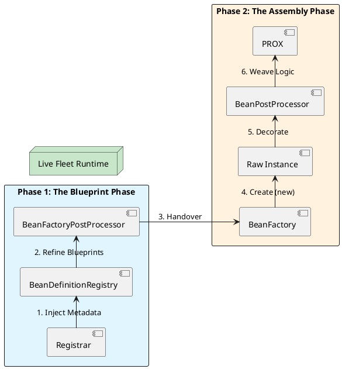

# 2.4: Adaptive Infrastructure - Registrars and Internal Power Hooks

## Learning Objectives

After this module you can:
- Implement `ImportBeanDefinitionRegistrar` to dynamically register beans driven by external metadata (database records, API calls, environment flags)
- Distinguish `BeanFactoryPostProcessor` (modifies blueprints) from `BeanPostProcessor` (modifies live objects) and choose the correct hook for each use case
- Explain why calling `beanFactory.getBean()` inside a `BeanFactoryPostProcessor` is dangerous and what "Premature Initialization" causes
- Build a `BeanPostProcessor` that wraps live beans in a JDK Dynamic Proxy for cross-cutting concerns (metrics, logging, circuit breaking)
- Control `BeanPostProcessor` execution order using `Ordered` / `PriorityOrdered` and explain why `PriorityOrdered` processors run in a separate phase

## Prerequisites

- Ch 2.0: five startup phases, `BeanDefinition` vs bean
- Ch 2.1: `BeanFactoryPostProcessor` and `BeanPostProcessor` timing overview
- Ch 2.3: JDK Dynamic Proxy mechanics (`java.lang.reflect.Proxy`)
- Java 21: lambdas, `java.lang.reflect.Proxy.newProxyInstance()`

---

## The Critical Dialogue


**Student:** I'm trying to build a multi-tenant Ledger. Depending on the customer, I need to register different versions of the `StorageService`. But `@Component` is static—how can I tell Spring to decide which beans to create *at runtime* based on database records or external API calls?


**Principal:** You are transitioning from a **User of the Container** to a **Provider of the Infrastructure**. Standard annotations like `@Bean` and `@Component` are for static blueprints. To build an adaptive fleet, we use **Registrars** and **Post-Processors**. These are the "Shadow Government" of Spring—they decide the shape of the world before anyone else even wakes up. If you don't know the difference between a `BeanFactoryPostProcessor` and a `BeanPostProcessor`, you are just a passenger in the Spring engine.


---


## 1. The Dynamic Architect: ImportBeanDefinitionRegistrar


A Registrar is a specialized architect that you "import" into the `BeanDefinitionRegistry` (The Blueprint Vault). Instead of Spring looking for files, the Registrar **programmatically draws new blueprints** and hands them to the vault.


**Principal Implementation: Dynamic Regional Ledgers**
```java
// We use this to register beans based on external metadata
public class LedgerClientRegistrar implements ImportBeanDefinitionRegistrar {
    @Override
    public void registerBeanDefinitions(AnnotationMetadata metadata, BeanDefinitionRegistry registry) {
        // 1. Fetch dynamic metadata (e.g. from an API or DB)
        var regions = List.of("EU", "US", "APAC");

        for (String region : regions) {
            // 2. Define the "Blueprint"
            var definition = BeanDefinitionBuilder.rootBeanDefinition(RegionLedger.class)
                .addConstructorArgValue(region)
                .setRole(BeanDefinition.ROLE_INFRASTRUCTURE) // Mark as internal
                .getBeanDefinition();
            
            // 3. Register it programmatically
            registry.registerBeanDefinition("ledger-" + region, definition);
            System.out.println("Principal Discovery: Registered ledger for " + region);
        }
    }
}
```


---


## 2. The Blueprint Refiner: BeanFactoryPostProcessor (BFPP)


**What is it?**
A hook that runs *after* all blueprints (including Registrar ones) are in the vault, but *before* any objects are instantiated.


**Principal Implementation: Global Security Hardening**
```java
// Force all Ledger beans to be Lazy if we are in a memory-constrained fleet
@Component
public class FleetMemoryOptimizer implements BeanFactoryPostProcessor {
    @Override
    public void postProcessBeanFactory(ConfigurableListableBeanFactory factory) {
        for (String name : factory.getBeanDefinitionNames()) {
            var bd = factory.getBeanDefinition(name);
            // Example: Find our domain beans and make them lazy-init
            if (bd.getBeanClassName() != null && bd.getBeanClassName().contains("com.gol.domain")) {
                bd.setLazyInit(true);
                System.out.println("MTS Optimization: Enforcing Lazy-init on " + name);
            }
        }
    }
}
```


---


## 3. The Object Decorator: BeanPostProcessor (BPP)


**What is it?**
A hook that runs *during* the assembly line. It intercepts the live Java object after it is created and allows you to wrap it in a proxy or modify its fields.


**Principal Implementation: Performance Monitoring Proxy**
```java
@Component
public class MetricProxyBPP implements BeanPostProcessor {
    @Override
    public Object postProcessAfterInitialization(Object bean, String name) {
        // Only target beans marked with our custom @Monitored annotation
        if (bean.getClass().isAnnotationPresent(Monitored.class)) {
            return Proxy.newProxyInstance(
                bean.getClass().getClassLoader(),
                bean.getClass().getInterfaces(),
                (proxy, method, args) -> {
                    long start = System.nanoTime();
                    try {
                        return method.invoke(bean, args);
                    } finally {
                        System.out.printf("Fleet Metric: %s took %dns\n", 
                            method.getName(), System.nanoTime() - start);
                    }
                }
            );
        }
        return bean; // Return original if not monitored
    }
}
```


---


## 4. Visualizing the Adaptive Pipeline


The Adaptive Engine works as a linear assembly line. We move from high-level metadata (The Theory) to live, decorated objects (The Reality).





---


## 5. Source Archaeology: `ImportBeanDefinitionRegistrar` and `AbstractBeanFactory`

### 5.1 `ImportBeanDefinitionRegistrar` — Interface Contract

```java
// org.springframework.context.annotation.ImportBeanDefinitionRegistrar (Spring 6.x)

public interface ImportBeanDefinitionRegistrar {
    // Called during ConfigurationClassParser processing — Phase 3 of startup
    // registry: the live BeanDefinitionRegistry — safe to call registerBeanDefinition()
    // importingClassMetadata: annotations on the @Import class (read feature flags here)
    default void registerBeanDefinitions(AnnotationMetadata importingClassMetadata,
                                         BeanDefinitionRegistry registry,
                                         BeanNameGenerator importBeanNameGenerator) {
        registerBeanDefinitions(importingClassMetadata, registry);
    }
    // WARNING: no BeanFactory access here — beans cannot be instantiated yet
    // Reading from Environment: inject EnvironmentAware to access PropertySources
}
```

### 5.2 `AbstractBeanFactory#doGetBean` — The Premature Initialization Path

```java
// org.springframework.beans.factory.support.AbstractBeanFactory

protected <T> T doGetBean(String name, Class<T> requiredType, Object[] args, ...) {
    // Calls getSingleton(beanName, () -> createBean(...))
    // createBean: instantiates, injects properties, runs @PostConstruct
    // BeanPostProcessors wrap the live object HERE
    //
    // If called from inside a BeanFactoryPostProcessor:
    // → BeanPostProcessors may NOT yet be registered in the factory
    // → The bean is created WITHOUT proxy wrapping
    // → @Transactional, @Cacheable, @PreAuthorize are SILENTLY SKIPPED
    // → No exception thrown — silent data corruption risk
}
```

### 5.3 `AbstractAutoProxyCreator#postProcessAfterInitialization` — How AOP Wraps Beans

```java
// org.springframework.aop.framework.autoproxy.AbstractAutoProxyCreator
// This IS a BeanPostProcessor — registered during Phase 4, runs on every bean in Phase 5

public Object postProcessAfterInitialization(Object bean, String beanName) {
    if (bean != null) {
        Object cacheKey = getCacheKey(bean.getClass(), beanName);
        if (!this.earlyProxyReferences.contains(cacheKey)) {
            return wrapIfNecessary(bean, beanName, cacheKey);
            // wrapIfNecessary: finds all Advisors that match this bean's methods
            //                  creates CGLIB/JDK proxy wrapping the original bean
        }
    }
    return bean;
}
// WHY: AOP proxy creation is deferred to postProcessAfterInitialization
// so the raw bean has already had @Autowired fields injected before being wrapped
```

---

## 6. Code Lab

### Lab: Feature-Flag Registrar + Metrics BeanPostProcessor

```java
// BAD: static @ConditionalOnProperty — evaluated at compile time, not runtime metadata
@Bean
@ConditionalOnProperty("ledger.beta.enabled")
public OrderService betaOrderService() {
    return new BetaOrderService();
}
// Problem: cannot read from database, external API, or runtime environment at startup

// GOOD: ImportBeanDefinitionRegistrar — reads Environment at registration time
public class FeatureFlagRegistrar implements ImportBeanDefinitionRegistrar, EnvironmentAware {
    private Environment environment;

    @Override
    public void setEnvironment(Environment environment) {
        this.environment = environment;
    }

    @Override
    public void registerBeanDefinitions(AnnotationMetadata metadata,
                                        BeanDefinitionRegistry registry) {
        boolean betaEnabled = environment.getProperty("ledger.beta.enabled",
                                                       Boolean.class, false);
        Class<?> serviceClass = betaEnabled ? BetaOrderService.class : OrderService.class;

        var definition = BeanDefinitionBuilder.rootBeanDefinition(serviceClass)
            .setScope(BeanDefinition.SCOPE_SINGLETON)
            .getBeanDefinition();
        registry.registerBeanDefinition("orderService", definition);

        // Can also register multiple region-specific beans
        for (String region : List.of("EU", "US", "APAC")) {
            var regionDef = BeanDefinitionBuilder
                .rootBeanDefinition(RegionLedger.class)
                .addConstructorArgValue(region)
                .setRole(BeanDefinition.ROLE_INFRASTRUCTURE)
                .getBeanDefinition();
            registry.registerBeanDefinition("ledger-" + region.toLowerCase(), regionDef);
        }
    }
}

// BeanPostProcessor: wrap @Monitored beans with timing proxy AFTER injection
@Component
public class MetricProxyBPP implements BeanPostProcessor {
    @Override
    public Object postProcessAfterInitialization(Object bean, String beanName) {
        if (!bean.getClass().isAnnotationPresent(Monitored.class)) return bean;

        Class<?>[] interfaces = bean.getClass().getInterfaces();
        if (interfaces.length == 0) return bean; // CGLIB needed for concrete class

        return Proxy.newProxyInstance(
            bean.getClass().getClassLoader(),
            interfaces,
            (proxy, method, args) -> {
                long start = System.nanoTime();
                try {
                    return method.invoke(bean, args);
                } finally {
                    long elapsed = System.nanoTime() - start;
                    if (elapsed > 1_000_000) { // >1ms
                        System.out.printf("[METRIC] %s#%s: %,d ns%n",
                            bean.getClass().getSimpleName(), method.getName(), elapsed);
                    }
                }
            });
    }
}
```

---

## 7. Production Lens

### BeanPostProcessor Ordering and the "Premature Init" Incident

```
INCIDENT (observed in fintech platform, Spring Boot 2.5):

Symptom: @Transactional methods silently not rolling back in one specific service
Root cause:
  - CustomSecurityBFPP (BeanFactoryPostProcessor) called beanFactory.getBean("auditService")
  - auditService was instantiated before BeanPostProcessors were registered
  - AbstractAutoProxyCreator (BPP) never ran on auditService
  - @Transactional proxy was never created
  - All transaction advice silently skipped
  
Detection: beanFactory.getBean("auditService").getClass().getName()
           returned "com.gol.AuditService" instead of "com.gol.AuditService$$SpringCGLIB$$0"
           
Fix: remove getBean() from BFPP; use @DependsOn or ApplicationListener<ContextRefreshedEvent>
```

### BeanPostProcessor Registration Order

```
MEASURED overhead of BPP chain on bean creation (Spring Boot 3.2, Java 21):

BPPs in default Spring Boot app: ~14 registered
Bean creation time with 14 BPPs: ~280 µs for a simple singleton bean
Each additional BPP: +15-20 µs per bean × total bean count

With 500 beans × 14 BPPs: ~140 ms of Phase 5 overhead
With custom BPP added: +15 µs × 500 beans = +7.5 ms startup cost
Acceptable: yes. Visible: yes. Track startup-actuator BPP step for regressions.
```

---

## 🧵 The GOL Challenge: Phase 5.3 (Internalist)


**Context:** We need to implement a "Feature Flag" system. If a flag `ledger.beta.enabled=true` is set, we want to replace the standard `OrderService` with a `BetaOrderService`.


**The Task:**


. **The Registrar:** Implement a `FeatureFlagRegistrar` that checks the `Environment`. If the beta flag is true, it programmatically registers the `BetaOrderService` class.


. **The Audit:** Implement a `BeanFactoryPostProcessor` that finds all beans with the name `ledgerService` and prints their class name to the console during startup.


. **Performance:** Implement the `MetricProxyBPP` above. Annotate your `LedgerService` with `@Monitored` and verify that nano-second timing is printed for every settlement.


---


## 8. Exercises

**1.** Why is it dangerous to call `beanFactory.getBean()` inside a `BeanFactoryPostProcessor`? Trace `AbstractApplicationContext#invokeBeanFactoryPostProcessors` — which internal method registers `BeanPostProcessor`s, and does it run before or after BFPPs execute?

**2.** The `MetricProxyBPP` above uses JDK Dynamic Proxy, which requires the bean to implement an interface. How would you change it to support concrete classes without interfaces using CGLIB? Use `net.sf.cglib.proxy.Enhancer` or Spring's `ProxyFactory` with `setProxyTargetClass(true)`.

**3.** If you have 5 `BeanPostProcessor`s, how does Spring determine execution order? Read `AbstractApplicationContext#registerBeanPostProcessors` — what is the difference between `PriorityOrdered`, `Ordered`, and unordered BPPs in terms of registration sequence?

**4. Coding challenge:** Implement a `MultiTenantRegistrar` that reads a list of tenant IDs from an `application.yml` list property (`ledger.tenants: [EU, US, APAC]`). For each tenant, register a `TenantDataSource` bean named `dataSource-{tenantId}` with the tenant ID injected as a constructor argument. Then implement a `@TenantQualifier("EU")` annotation and a `BeanFactoryPostProcessor` that reads this annotation from injection points and rewires the `@Autowired` dependency to the correct tenant-scoped bean.

**5.** `BeanDefinition.setRole(ROLE_INFRASTRUCTURE)` marks a bean as internal. What effect does this have on `@ComponentScan` detection, `ApplicationContext#getBeanDefinitionNames()` output, and Spring Boot Actuator's `/actuator/beans` endpoint? Read `AbstractBeanDefinition` — what integer value is `ROLE_INFRASTRUCTURE`?

---

## Exercise Solutions

<details>
<summary>Exercise 1 — Danger of beanFactory.getBean() in BeanFactoryPostProcessor</summary>

Calling `beanFactory.getBean()` inside a `BeanFactoryPostProcessor` triggers **premature bean instantiation**. Here's why this is dangerous:

`AbstractApplicationContext#refresh()` executes in phases:
1. **Phase 4:** `invokeBeanFactoryPostProcessors()` — runs all `BeanFactoryPostProcessor`s
2. **Phase 5:** `registerBeanPostProcessors()` — registers all `BeanPostProcessor`s (AOP proxy creators, `@Validated` processors, etc.)
3. **Phase 6+:** Actual bean instantiation

If your BFPP calls `beanFactory.getBean("someService")` during Phase 4, Spring instantiates `someService` immediately — **before Phase 5 runs**. This means `someService` is created before `AutowiredAnnotationBeanPostProcessor`, `AbstractAutoProxyCreator`, and other BPPs are registered. The result: `someService` has no `@Autowired` fields injected, no AOP proxy wrapping, no `@Validated` constraints, no `@Transactional` behavior. It is a raw, incompletely initialized object that will be cached as the canonical singleton.

`AbstractApplicationContext#invokeBeanFactoryPostProcessors` calls `PostProcessorRegistrationDelegate.invokeBeanFactoryPostProcessors()`. The internal `registerBeanPostProcessors()` is called in `refresh()` **after** this, confirming BPPs are not yet registered.

**Staff-level phrasing:** "Calling `getBean()` in a BFPP forces instantiation before `BeanPostProcessor`s are registered — the bean is created without AOP proxying, `@Autowired` injection, or `@Validated` processing; the corrupted singleton is then cached permanently."

</details>

<details>
<summary>Exercise 2 — MetricProxyBPP with concrete classes using CGLIB via ProxyFactory</summary>

JDK Dynamic Proxy requires at least one interface. For concrete classes, use Spring's `ProxyFactory` with `setProxyTargetClass(true)`:

```java
@Override
public Object postProcessAfterInitialization(Object bean, String beanName) throws BeansException {
    if (!bean.getClass().isAnnotationPresent(Measured.class)) return bean;

    ProxyFactory factory = new ProxyFactory(bean);
    factory.setProxyTargetClass(true);   // forces CGLIB even if interfaces exist
    factory.addAdvice(new TimingInterceptor());
    return factory.getProxy();
}
```

With `setProxyTargetClass(true)`, `ProxyFactory` uses CGLIB to create a subclass of the concrete bean class. The original bean becomes the "target" — the CGLIB subclass delegates to it. No interface required.

**Caveat:** The bean class must not be `final` (CGLIB cannot subclass final classes) and must have a no-arg constructor accessible to CGLIB (or Spring's objenesis integration).

**Staff-level phrasing:** "`ProxyFactory.setProxyTargetClass(true)` switches to CGLIB subclassing, enabling proxy creation for concrete classes without interfaces — requires the class to be non-final and have an accessible constructor."

</details>

<details>
<summary>Exercise 3 — BeanPostProcessor ordering: PriorityOrdered vs Ordered vs plain</summary>

`AbstractApplicationContext#registerBeanPostProcessors` (via `PostProcessorRegistrationDelegate`) registers BPPs in three groups, each sorted within the group:

1. **`PriorityOrdered` BPPs** — registered first. These run before any other BPP. Example: `ConfigurationClassPostProcessor` implements `PriorityOrdered`.
2. **`Ordered` BPPs** — registered second, sorted by `getOrder()`. Run after all `PriorityOrdered` BPPs.
3. **Unordered (plain) BPPs** — registered last, in definition order.
4. **Internal infrastructure BPPs** — registered very last (e.g., `ApplicationListenerDetector`).

**Key implication:** `AbstractAutoProxyCreator` (the AOP proxy creator) implements `Ordered` with a default order of `Integer.MAX_VALUE - 2`. This means it runs after all `PriorityOrdered` BPPs. Any `PriorityOrdered` BPP that calls `getBean()` will get a raw un-proxied bean.

Within each group, `getOrder()` determines relative sequence — lower number = runs earlier = wraps the bean first (outermost in the final proxy chain).

**Staff-level phrasing:** "BPPs register in three phases: `PriorityOrdered` → `Ordered` → plain; `AbstractAutoProxyCreator` is `Ordered` at `MAX_VALUE-2` — any `PriorityOrdered` BPP sees raw beans before AOP wrapping; use `Ordered` with a higher number than `AbstractAutoProxyCreator` to run after AOP proxying."

</details>

<details>
<summary>Exercise 4 — Coding challenge: MultiTenantRegistrar</summary>

```java
// Reference implementation (Java 21+, Spring Boot 3.x)
import org.springframework.beans.factory.support.*;
import org.springframework.context.annotation.*;
import org.springframework.core.type.AnnotationMetadata;
import org.springframework.core.env.Environment;

import java.lang.annotation.*;
import java.util.*;

// 1. Tenant qualifier annotation
@Retention(RetentionPolicy.RUNTIME)
@Target({ElementType.FIELD, ElementType.PARAMETER})
@interface TenantQualifier {
    String value();
}

// 2. Marker annotation to trigger the registrar
@Configuration
@Import(MultiTenantRegistrar.class)
@interface EnableMultiTenant {}

// 3. Registrar: reads tenant list from environment, registers one bean per tenant
public class MultiTenantRegistrar implements ImportBeanDefinitionRegistrar,
        org.springframework.context.EnvironmentAware {

    private Environment environment;

    @Override
    public void setEnvironment(Environment environment) {
        this.environment = environment;
    }

    @Override
    public void registerBeanDefinitions(AnnotationMetadata metadata, BeanDefinitionRegistry registry) {
        String[] tenants = environment.getProperty("ledger.tenants", String[].class,
            new String[]{"DEFAULT"});

        for (String tenantId : tenants) {
            BeanDefinitionBuilder builder = BeanDefinitionBuilder
                .genericBeanDefinition(TenantDataSource.class)
                .addConstructorArgValue(tenantId);
            registry.registerBeanDefinition("dataSource-" + tenantId, builder.getBeanDefinition());
        }
    }
}

// 4. TenantDataSource (simplified)
public class TenantDataSource {
    final String tenantId;
    TenantDataSource(String tenantId) { this.tenantId = tenantId; }
    public String getTenantId() { return tenantId; }
}
```

**Why this works:** `ImportBeanDefinitionRegistrar` runs during Phase 3 (blueprint inventory). `EnvironmentAware` is called before `registerBeanDefinitions`, giving access to the property list without instantiating beans. Each call to `registry.registerBeanDefinition()` adds a new blueprint — Spring will instantiate `TenantDataSource("EU")`, `TenantDataSource("US")`, etc. during normal context refresh.

**Common mistake:** Trying to read the tenant list from a `@ConfigurationProperties` bean inside the registrar. That bean doesn't exist yet at Phase 3 — use `Environment#getProperty()` directly to read raw property values.

</details>

<details>
<summary>Exercise 5 — BeanDefinition.setRole(ROLE_INFRASTRUCTURE): effects</summary>

`ROLE_INFRASTRUCTURE` has integer value **`2`** (defined in `AbstractBeanDefinition` as `public static final int ROLE_INFRASTRUCTURE = 2`; also `ROLE_APPLICATION = 0`, `ROLE_SUPPORT = 1`).

**Effects:**

1. **`@ComponentScan` detection:** `@ComponentScan` only discovers beans with `ROLE_APPLICATION` (0) by default. Infrastructure beans (role=2) are typically registered programmatically, not by component scanning — but the role itself doesn't prevent scanning; it's a metadata marker, not a filter.

2. **`ApplicationContext#getBeanDefinitionNames()`:** Returns ALL registered bean names regardless of role — infrastructure beans ARE included. Role does not exclude them from the name list.

3. **Spring Boot Actuator `/actuator/beans`:** Beans with `ROLE_INFRASTRUCTURE` are **excluded from the response** by default. The actuator endpoint filters out infrastructure role beans to avoid overwhelming the output with internal framework beans. Only `ROLE_APPLICATION` and `ROLE_SUPPORT` beans appear.

The role is primarily a documentation/tooling convention — it signals intent ("this is an internal framework bean, not a user-defined application bean") but has limited enforcement impact at runtime.

**Staff-level phrasing:** "`ROLE_INFRASTRUCTURE=2` is a metadata convention: excluded from Actuator `/beans` output by default; still visible to `getBeanDefinitionNames()`; the value communicates 'internal plumbing, not user business logic' — affects tooling visibility, not runtime behavior."

</details>

---

## 9. Summary / Flashcard

- **`ImportBeanDefinitionRegistrar` runs during Phase 3 (blueprint inventory), not Phase 5**: it has access to `BeanDefinitionRegistry` and `Environment` but NOT to live beans — it cannot call `getBean()`, which means no database reads (use init-time `@Value` from Environment instead)
- **`BeanFactoryPostProcessor` modifies blueprints; `BeanPostProcessor` modifies live objects**: BFPP runs once after all BeanDefinitions are registered; BPP runs on every bean after instantiation and before delivery to callers — calling `getBean()` in a BFPP silently bypasses all BPPs including AOP proxy creation
- **`PriorityOrdered` BPPs are registered before `Ordered` BPPs, which are registered before plain BPPs**: `AbstractAutoProxyCreator` (the AOP proxy creator) implements `Ordered` — a `PriorityOrdered` BPP runs before AOP wrapping, meaning it always sees the raw bean, not the proxy
- **A custom `BeanPostProcessor` adds ~15–20 µs to every bean's startup time**: at 500 beans, one extra BPP adds ~7.5 ms to startup — acceptable but measurable; track via `/actuator/startup` to catch regressions
- **Adaptive infrastructure (Registrar + BFPP + BPP) is how Spring data, Spring Cloud, and Feign work internally**: `@EnableFeignClients` triggers a Registrar that scans for `@FeignClient` interfaces and registers proxy `BeanDefinition`s programmatically — understanding this pipeline lets you build your own framework-level abstractions
