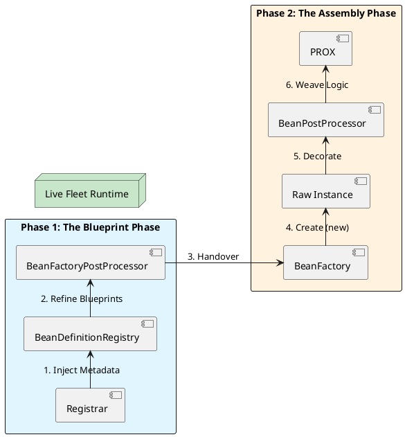

# 2.4: Adaptive Infrastructure - Registrars and Internal Power Hooks


## The Critical Dialogue


**Student:** I'm trying to build a multi-tenant Ledger. Depending on the customer, I need to register different versions of the `StorageService`. But `@Component` is static—how can I tell Spring to decide which beans to create *at runtime* based on database records or external API calls?


**Principal:** You are transitioning from a **User of the Container** to a **Provider of the Infrastructure**. Standard annotations like `@Bean` and `@Component` are for static blueprints. To build an adaptive fleet, we use **Registrars** and **Post-Processors**. These are the "Shadow Government" of Spring—they decide the shape of the world before anyone else even wakes up. If you don't know the difference between a `BeanFactoryPostProcessor` and a `BeanPostProcessor`, you are just a passenger in the Spring engine.


---


## 1. The Dynamic Architect: ImportBeanDefinitionRegistrar


A Registrar is a specialized architect that you "import" into the `BeanDefinitionRegistry` (The Blueprint Vault). Instead of Spring looking for files, the Registrar **programmatically draws new blueprints** and hands them to the vault.


**Principal Implementation: Dynamic Regional Ledgers**
```java
// We use this to register beans based on external metadata
public class LedgerClientRegistrar implements ImportBeanDefinitionRegistrar {
    @Override
    public void registerBeanDefinitions(AnnotationMetadata metadata, BeanDefinitionRegistry registry) {
        // 1. Fetch dynamic metadata (e.g. from an API or DB)
        var regions = List.of("EU", "US", "APAC");

        for (String region : regions) {
            // 2. Define the "Blueprint"
            var definition = BeanDefinitionBuilder.rootBeanDefinition(RegionLedger.class)
                .addConstructorArgValue(region)
                .setRole(BeanDefinition.ROLE_INFRASTRUCTURE) // Mark as internal
                .getBeanDefinition();
            
            // 3. Register it programmatically
            registry.registerBeanDefinition("ledger-" + region, definition);
            System.out.println("Principal Discovery: Registered ledger for " + region);
        }
    }
}
```


---


## 2. The Blueprint Refiner: BeanFactoryPostProcessor (BFPP)


**What is it?**
A hook that runs *after* all blueprints (including Registrar ones) are in the vault, but *before* any objects are instantiated.


**Principal Implementation: Global Security Hardening**
```java
// Force all Ledger beans to be Lazy if we are in a memory-constrained fleet
@Component
public class FleetMemoryOptimizer implements BeanFactoryPostProcessor {
    @Override
    public void postProcessBeanFactory(ConfigurableListableBeanFactory factory) {
        for (String name : factory.getBeanDefinitionNames()) {
            var bd = factory.getBeanDefinition(name);
            // Example: Find our domain beans and make them lazy-init
            if (bd.getBeanClassName() != null && bd.getBeanClassName().contains("com.gol.domain")) {
                bd.setLazyInit(true);
                System.out.println("MTS Optimization: Enforcing Lazy-init on " + name);
            }
        }
    }
}
```


---


## 3. The Object Decorator: BeanPostProcessor (BPP)


**What is it?**
A hook that runs *during* the assembly line. It intercepts the live Java object after it is created and allows you to wrap it in a proxy or modify its fields.


**Principal Implementation: Performance Monitoring Proxy**
```java
@Component
public class MetricProxyBPP implements BeanPostProcessor {
    @Override
    public Object postProcessAfterInitialization(Object bean, String name) {
        // Only target beans marked with our custom @Monitored annotation
        if (bean.getClass().isAnnotationPresent(Monitored.class)) {
            return Proxy.newProxyInstance(
                bean.getClass().getClassLoader(),
                bean.getClass().getInterfaces(),
                (proxy, method, args) -> {
                    long start = System.nanoTime();
                    try {
                        return method.invoke(bean, args);
                    } finally {
                        System.out.printf("Fleet Metric: %s took %dns\n", 
                            method.getName(), System.nanoTime() - start);
                    }
                }
            );
        }
        return bean; // Return original if not monitored
    }
}
```


---


## 4. Visualizing the Adaptive Pipeline


The Adaptive Engine works as a linear assembly line. We move from high-level metadata (The Theory) to live, decorated objects (The Reality).





---


## 🧵 The GOL Challenge: Phase 5.3 (Internalist)


**Context:** We need to implement a "Feature Flag" system. If a flag `ledger.beta.enabled=true` is set, we want to replace the standard `OrderService` with a `BetaOrderService`.


**The Task:**


. **The Registrar:** Implement a `FeatureFlagRegistrar` that checks the `Environment`. If the beta flag is true, it programmatically registers the `BetaOrderService` class.


. **The Audit:** Implement a `BeanFactoryPostProcessor` that finds all beans with the name `ledgerService` and prints their class name to the console during startup.


. **Performance:** Implement the `MetricProxyBPP` above. Annotate your `LedgerService` with `@Monitored` and verify that nano-second timing is printed for every settlement.


---


## 🧠 Principal's Inquiry


. **The BeanFactory Lock:** Why is it dangerous to call `beanFactory.getBean()` inside a `BeanFactoryPostProcessor`? (Hint: It triggers "Premature Initialization," which can break BPPs).


. **Interface Rule:** Why does the `MetricProxyBPP` above use `JDK Dynamic Proxy`? What would you change to support classes without interfaces using **CGLIB**?


. **Ordering:** If you have 5 `BeanPostProcessors`, how does Spring decide the execution order? (Hint: `Ordered` interface vs `@Order`).


**Principal Summary:** Adaptive Infrastructure is about **Metadata Manipulation**. We move from raw configuration to decorated proxies through a strictly ordered linear assembly line.
