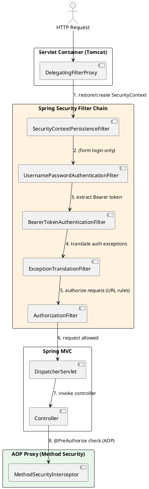
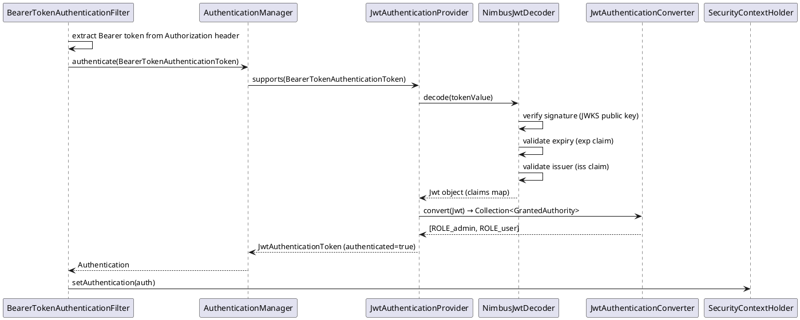

# 2.5: Spring Security Internals

## Learning Objectives

After this module you can:
- Trace an HTTP request through the complete Spring Security filter chain, naming each filter in order
- Explain how `SecurityContext` is stored and propagated using `ThreadLocal` and why this matters for virtual threads
- Configure an OAuth2 JWT resource server and trace the validation path from `BearerTokenAuthenticationFilter` to `JwtDecoder`
- Read Spring Security source to understand how `@PreAuthorize` evaluates expressions at the bytecode level
- Diagnose common security configuration mistakes by understanding the filter chain ordering

## Prerequisites

- Ch 2.0–2.4 Spring internals (ApplicationContext, AOP, CGLIB proxies — `@PreAuthorize` uses AOP)
- Ch 1.5 Java Memory Model (ThreadLocal has JMM implications for thread-per-request vs virtual threads)
- Basic OAuth2 / JWT concepts (what a Bearer token is, what claims are)

---

## The Critical Dialogue

**Student:** I added Spring Security to my Spring Boot 3 app and now all my endpoints return 401. I added `@EnableMethodSecurity` and `@PreAuthorize` but those seem to have no effect. How does Spring Security actually work, and why is it so hard to configure?

**Principal:** Spring Security is a servlet filter chain, not a Spring bean interceptor. It processes requests BEFORE they reach your controllers, at the raw `HttpServletRequest` level. Your `@PreAuthorize` annotations are handled LATER, via AOP, after the filter chain already decided whether to authenticate. You have two separate systems: filter-chain security (who is this user?) and method security (is this user allowed to call this method?). Misconfiguring either layer produces a 401 or 403 that looks identical. We will trace the full path from TCP socket to `@PreAuthorize` evaluation.

---

## 1. Architecture: Two Layers of Security



### 1.1 `DelegatingFilterProxy` — The Bridge

Spring Security is not a Spring bean in the Servlet sense — it's a Java `Filter`. `DelegatingFilterProxy` bridges the gap: registered as a servlet filter by Spring Boot auto-configuration, it delegates to a Spring bean named `springSecurityFilterChain` (`FilterChainProxy`).

```java
// What Spring Boot auto-config does (simplified):
// SecurityFilterAutoConfiguration registers:
DelegatingFilterProxy proxy = new DelegatingFilterProxy("springSecurityFilterChain");
// registered at /* with all dispatcher types
```

### 1.2 `FilterChainProxy` — The Chain Selector

`FilterChainProxy` holds multiple `SecurityFilterChain` instances. For each request, it finds the FIRST chain whose `RequestMatcher` matches the request path.

```java
// FilterChainProxy.doFilterInternal() — simplified
for (SecurityFilterChain chain : filterChains) {
    if (chain.matches(request)) {
        chain.getFilters().forEach(f -> f.doFilter(...));
        return;  // first match wins — no fall-through to next chain
    }
}
```

---

## 2. Default Filter Order (Spring Security 6)

The full default chain, in execution order:

| Order | Filter | Purpose |
|-------|--------|---------|
| 100 | `DisableEncodeUrlFilter` | Prevents session ID in URL |
| 200 | `WebAsyncManagerIntegrationFilter` | Propagates SecurityContext to async threads |
| 300 | `SecurityContextHolderFilter` | Loads/saves SecurityContext |
| 400 | `HeaderWriterFilter` | Writes security headers (HSTS, X-Frame-Options) |
| 500 | `CsrfFilter` | CSRF token validation |
| 600 | `LogoutFilter` | Handles `/logout` |
| 1100 | `BearerTokenAuthenticationFilter` | JWT extraction + validation |
| 1200 | `UsernamePasswordAuthenticationFilter` | Form login |
| 1500 | `AnonymousAuthenticationFilter` | Sets anonymous auth if no auth yet |
| 1600 | `ExceptionTranslationFilter` | Converts `AccessDeniedException` → 401/403 |
| 1700 | `AuthorizationFilter` | URL-level authorization rules |

**Critical insight:** `ExceptionTranslationFilter` wraps the chain below it. If `AuthorizationFilter` throws `AccessDeniedException`, `ExceptionTranslationFilter` catches it and decides: 401 (not authenticated) or 403 (authenticated but not authorized).

---

## 3. SecurityContext and ThreadLocal

### 3.1 How Context Propagates

```java
// SecurityContextHolderFilter (Spring Security 6) — simplified
public void doFilter(ServletRequest request, ...) {
    Supplier<SecurityContext> deferredContext = securityContextRepository.loadDeferredContext(request);
    try {
        SecurityContextHolder.setDeferredContext(deferredContext);  // stores in ThreadLocal
        chain.doFilter(request, response);
    } finally {
        SecurityContextHolder.clearContext();  // MUST clear — thread reuse in pool!
        request.setAttribute(FILTER_APPLIED, Boolean.TRUE);
    }
}
```

`SecurityContextHolder` stores the context in a `ThreadLocal<SecurityContext>`. This means:

```java
// Within any @Service or @Controller called from the same thread:
Authentication auth = SecurityContextHolder.getContext().getAuthentication();
// Works because same thread, same ThreadLocal
```

### 3.2 The Virtual Threads Problem

With Project Loom (Ch 1.3), virtual threads are cheap to create and may be mounted/unmounted across carrier threads. `ThreadLocal` values are NOT automatically propagated when a virtual thread is unmounted and remounted on a different carrier.

```java
// Spring Security 6.2+ solution: SecurityContextHolder strategy
// Use InheritableThreadLocal or explicit propagation for async

// For virtual threads with Spring Boot 3.2+:
// application.properties:
// spring.threads.virtual.enabled=true
// Spring auto-configures SecurityContextHolderStrategy to propagate correctly
```

---

## 4. JWT OAuth2 Resource Server: End-to-End

### 4.1 Configuration

```java
@Configuration
@EnableWebSecurity
@EnableMethodSecurity  // enables @PreAuthorize, @PostAuthorize
public class SecurityConfig {

    @Bean
    public SecurityFilterChain filterChain(HttpSecurity http) throws Exception {
        http
            .authorizeHttpRequests(auth -> auth
                .requestMatchers("/public/**").permitAll()
                .anyRequest().authenticated()
            )
            .oauth2ResourceServer(oauth2 -> oauth2
                .jwt(jwt -> jwt
                    .decoder(jwtDecoder())           // custom decoder
                    .jwtAuthenticationConverter(jwtAuthConverter())
                )
            );
        return http.build();
    }

    @Bean
    public JwtDecoder jwtDecoder() {
        // RS256: fetch public key from JWKS endpoint
        return NimbusJwtDecoder
            .withJwkSetUri("https://auth.example.com/.well-known/jwks.json")
            .build();
    }

    @Bean
    public JwtAuthenticationConverter jwtAuthConverter() {
        var converter = new JwtGrantedAuthoritiesConverter();
        converter.setAuthoritiesClaimName("roles");        // claim name in JWT
        converter.setAuthorityPrefix("ROLE_");             // prefix for hasRole() checks

        var authConverter = new JwtAuthenticationConverter();
        authConverter.setJwtGrantedAuthoritiesConverter(converter);
        return authConverter;
    }
}
```

### 4.2 `BearerTokenAuthenticationFilter` — Full Validation Path



### 4.3 Validation Failure Path

If any step fails (expired token, invalid signature, unknown key):
- `JwtDecoder` throws `JwtException`
- `JwtAuthenticationProvider` wraps it in `OAuth2AuthenticationException`  
- `BearerTokenAuthenticationFilter` catches it and calls `authenticationFailureHandler`
- Default handler calls `AuthenticationEntryPoint` → 401 with `WWW-Authenticate: Bearer error="invalid_token"`

---

## 5. Source Archaeology: `@PreAuthorize` — From Annotation to Bytecode

`@EnableMethodSecurity` triggers `MethodSecuritySelector` which imports `MethodSecurityConfiguration`.

```java
// MethodSecurityConfiguration (Spring Security 6) — simplified
@Bean
public MethodSecurityInterceptor methodSecurityInterceptor(
        AuthorizationManager<MethodInvocation> authorizationManager) {
    var interceptor = new AuthorizationManagerMethodBeforeAdvice<>(
        new AnnotationMatchingPointcut(null, PreAuthorize.class, true),
        new PreAuthorizeAuthorizationManager()
    );
    // This is an AOP advice (Ch 2.3) — wraps @PreAuthorize methods via CGLIB proxy
    return interceptor;
}
```

When a `@PreAuthorize("hasRole('ADMIN')")` method is called:

```java
// 1. CGLIB proxy intercepts the call (Ch 2.3 — Proxy Engine)
// 2. PreAuthorizeAuthorizationManager.check() is called:
//    a. Parses SpEL expression: "hasRole('ADMIN')"
//    b. Creates EvaluationContext with SecurityExpressionRoot
//    c. SecurityExpressionRoot.hasRole() checks:
//       SecurityContextHolder.getContext().getAuthentication().getAuthorities()
//    d. If expression returns false: throws AccessDeniedException
//    e. ExceptionTranslationFilter (filter chain layer) converts to 403

// Source: SecurityExpressionRoot.java (Spring Security 6)
// Line ~120:
public final boolean hasRole(String role) {
    return hasAnyRole(role);
}
public final boolean hasAnyRole(String... roles) {
    return hasAnyAuthorityName(
        defaultRolePrefix,  // "ROLE_"
        roles
    );
}
private boolean hasAnyAuthorityName(String prefix, String... roles) {
    Set<String> roleSet = getAuthoritySet();  // from Authentication.getAuthorities()
    for (String role : roles) {
        String defaultedRole = getRoleWithDefaultPrefix(prefix, role);
        if (roleSet.contains(defaultedRole)) return true;
    }
    return false;
}
```

---

## 6. Code Lab

### Lab: Complete JWT Resource Server with Test

```java
// Application code
@RestController
@RequestMapping("/api")
public class OrderController {

    @GetMapping("/orders")
    @PreAuthorize("hasRole('USER')")
    public List<String> getOrders() {
        return List.of("order-1", "order-2");
    }

    @DeleteMapping("/orders/{id}")
    @PreAuthorize("hasRole('ADMIN')")
    public void deleteOrder(@PathVariable String id) {
        // delete logic
    }
}

// Test: verifying the filter chain with mock JWT
import org.springframework.security.test.web.servlet.request.SecurityMockMvcRequestPostProcessors;
import static org.springframework.security.test.web.servlet.request.SecurityMockMvcRequestPostProcessors.jwt;

@SpringBootTest
@AutoConfigureMockMvc
class SecurityFilterChainTest {

    @Autowired MockMvc mockMvc;

    @Test
    void getOrders_withUserRole_returns200() throws Exception {
        mockMvc.perform(get("/api/orders")
                .with(jwt().authorities(new SimpleGrantedAuthority("ROLE_USER"))))
            .andExpect(status().isOk());
    }

    @Test
    void getOrders_withoutAuth_returns401() throws Exception {
        mockMvc.perform(get("/api/orders"))
            .andExpect(status().isUnauthorized());
    }

    @Test
    void deleteOrder_withUserRole_returns403() throws Exception {
        // USER can GET, but cannot DELETE (requires ADMIN)
        mockMvc.perform(delete("/api/orders/123")
                .with(jwt().authorities(new SimpleGrantedAuthority("ROLE_USER"))))
            .andExpect(status().isForbidden());
    }

    @Test
    void deleteOrder_withAdminRole_returns200() throws Exception {
        mockMvc.perform(delete("/api/orders/123")
                .with(jwt().authorities(new SimpleGrantedAuthority("ROLE_ADMIN"))))
            .andExpect(status().isOk());
    }
}
```

---

## 7. Production Lens

### Issue 1: CORS Before Authentication — Filter Order Matters

A common production mistake: CORS preflight `OPTIONS` requests fail with 401 before the CORS headers are written, because `AuthorizationFilter` runs before `CorsFilter`.

```java
// ❌ BAD: Explicit CORS config but missing permitAll for OPTIONS
http.authorizeHttpRequests(auth -> auth.anyRequest().authenticated());
// OPTIONS preflight → hits AuthorizationFilter → 401 → browser blocks CORS

// ✅ FIX: Explicitly permit OPTIONS or let Spring Security's CORS support handle it
http
    .cors(cors -> cors.configurationSource(corsConfigSource()))  // processes BEFORE auth
    .authorizeHttpRequests(auth -> auth
        .requestMatchers(HttpMethod.OPTIONS).permitAll()  // allow preflight
        .anyRequest().authenticated()
    );
```

### Issue 2: SecurityContext Lost in `@Async` Methods

```java
// ❌ BAD: @Async runs on a different thread — SecurityContext is ThreadLocal, not inherited
@Async
public CompletableFuture<Void> processInBackground() {
    Authentication auth = SecurityContextHolder.getContext().getAuthentication();
    // auth == null! Thread pool thread has no SecurityContext
}

// ✅ FIX: Configure SecurityContextHolder to use InheritableThreadLocal
@Bean
public MethodInvokingFactoryBean methodInvokingFactoryBean() {
    var methodInvokingFactoryBean = new MethodInvokingFactoryBean();
    methodInvokingFactoryBean.setTargetClass(SecurityContextHolder.class);
    methodInvokingFactoryBean.setTargetMethod("setStrategyName");
    methodInvokingFactoryBean.setArguments(SecurityContextHolder.MODE_INHERITABLETHREADLOCAL);
    return methodInvokingFactoryBean;
}
// Or use DelegatingSecurityContextAsyncTaskExecutor as your @Async executor
```

**Benchmark:** JWKS public key fetch is cached by `NimbusJwtDecoder` — typically 3-5ms on first request, ~0.1ms thereafter (in-memory RSA verification). Ed25519 (EdDSA) cuts verification to ~0.02ms vs RSA-256 ~0.1ms at 10k req/s: saves ~80ms/sec CPU time.

---

## 8. Exercises

**1.** A request comes in with a valid JWT but `@PreAuthorize("hasRole('ADMIN')")` throws 403. List the three most likely root causes, from most to least common.

**2.** Explain why `SecurityContextHolder.clearContext()` must be called in a `finally` block. What happens if it is not called in a thread-pool scenario?

**3.** You need two security configurations: public API at `/api/v1/**` (JWT auth) and admin UI at `/admin/**` (form login). How do you configure two `SecurityFilterChain` beans? What determines which chain handles a given request?

**4. Coding challenge:** Implement a custom `OncePerRequestFilter` that extracts a custom `X-API-KEY` header, validates it against a database, and sets an `Authentication` in the `SecurityContextHolder`. Write a unit test that verifies: valid key → 200, missing key → 401, invalid key → 403.

**5.** How does `@PreAuthorize` interact with Spring AOP proxies? If you call a `@PreAuthorize`-annotated method from within the same bean (self-invocation), does the security check run? Why or why not?

---

## 9. Summary / Flashcard

- **Spring Security = servlet filter chain, not Spring beans**: `FilterChainProxy` intercepts at the `Servlet` level before `DispatcherServlet`; `@PreAuthorize` runs later via AOP — these are two independent security layers
- **SecurityContext lives in ThreadLocal**: `SecurityContextHolderFilter` loads context at chain start, clears it at end; `@Async` and virtual threads require explicit propagation strategy configuration
- **JWT validation chain**: `BearerTokenAuthenticationFilter` → `JwtAuthenticationProvider` → `NimbusJwtDecoder` (signature + expiry + issuer) → `JwtAuthenticationConverter` (claims to authorities) → `SecurityContextHolder`
- **`@PreAuthorize` uses AOP + SpEL**: CGLIB proxy intercepts the call, evaluates the SpEL expression against `SecurityExpressionRoot` which reads from `SecurityContextHolder`; self-invocation bypasses the proxy
- **Filter order is the source of most config bugs**: CORS must run before auth filters; OPTIONS preflight needs explicit `permitAll()`; first matching `SecurityFilterChain` wins
