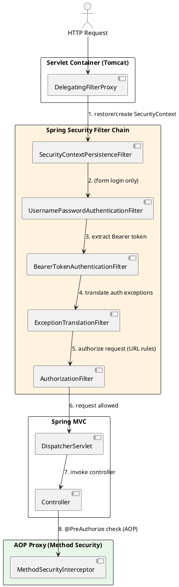
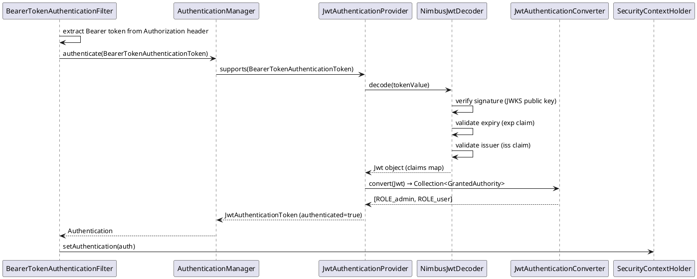

# 2.5: Spring Security Internals

## Learning Objectives

After this module you can:
- Trace an HTTP request through the complete Spring Security filter chain, naming each filter in order
- Explain how `SecurityContext` is stored and propagated using `ThreadLocal` and why this matters for virtual threads
- Configure an OAuth2 JWT resource server and trace the validation path from `BearerTokenAuthenticationFilter` to `JwtDecoder`
- Read Spring Security source to understand how `@PreAuthorize` evaluates expressions at the bytecode level
- Diagnose common security configuration mistakes by understanding the filter chain ordering

## Prerequisites

- Ch 2.0–2.4 Spring internals (ApplicationContext, AOP, CGLIB proxies — `@PreAuthorize` uses AOP)
- Ch 1.5 Java Memory Model (ThreadLocal has JMM implications for thread-per-request vs virtual threads)
- Basic OAuth2 / JWT concepts (what a Bearer token is, what claims are)

---

## The Critical Dialogue

**Student:** I added Spring Security to my Spring Boot 3 app and now all my endpoints return 401. I added `@EnableMethodSecurity` and `@PreAuthorize` but those seem to have no effect. How does Spring Security actually work, and why is it so hard to configure?

**Principal:** Spring Security is a servlet filter chain, not a Spring bean interceptor. It processes requests BEFORE they reach your controllers, at the raw `HttpServletRequest` level. Your `@PreAuthorize` annotations are handled LATER, via AOP, after the filter chain already decided whether to authenticate. You have two separate systems: filter-chain security (who is this user?) and method security (is this user allowed to call this method?). Misconfiguring either layer produces a 401 or 403 that looks identical. We will trace the full path from TCP socket to `@PreAuthorize` evaluation.

---

## 1. Architecture: Two Layers of Security



### 1.1 `DelegatingFilterProxy` — The Bridge

Spring Security is not a Spring bean in the Servlet sense — it's a Java `Filter`. `DelegatingFilterProxy` bridges the gap: registered as a servlet filter by Spring Boot auto-configuration, it delegates to a Spring bean named `springSecurityFilterChain` (`FilterChainProxy`).

```java
// What Spring Boot auto-config does (simplified):
// SecurityFilterAutoConfiguration registers:
DelegatingFilterProxy proxy = new DelegatingFilterProxy("springSecurityFilterChain");
// registered at /* with all dispatcher types
```

### 1.2 `FilterChainProxy` — The Chain Selector

`FilterChainProxy` holds multiple `SecurityFilterChain` instances. For each request, it finds the FIRST chain whose `RequestMatcher` matches the request path.

```java
// FilterChainProxy.doFilterInternal() — simplified
for (SecurityFilterChain chain : filterChains) {
    if (chain.matches(request)) {
        chain.getFilters().forEach(f -> f.doFilter(...));
        return;  // first match wins — no fall-through to next chain
    }
}
```

---

## 2. Default Filter Order (Spring Security 6)

The full default chain, in execution order:

| Order | Filter | Purpose |
|-------|--------|---------|
| 100 | `DisableEncodeUrlFilter` | Prevents session ID in URL |
| 200 | `WebAsyncManagerIntegrationFilter` | Propagates SecurityContext to async threads |
| 300 | `SecurityContextHolderFilter` | Loads/saves SecurityContext |
| 400 | `HeaderWriterFilter` | Writes security headers (HSTS, X-Frame-Options) |
| 500 | `CsrfFilter` | CSRF token validation |
| 600 | `LogoutFilter` | Handles `/logout` |
| 1100 | `BearerTokenAuthenticationFilter` | JWT extraction + validation |
| 1200 | `UsernamePasswordAuthenticationFilter` | Form login |
| 1500 | `AnonymousAuthenticationFilter` | Sets anonymous auth if no auth yet |
| 1600 | `ExceptionTranslationFilter` | Converts `AccessDeniedException` → 401/403 |
| 1700 | `AuthorizationFilter` | URL-level authorization rules |

**Critical insight:** `ExceptionTranslationFilter` wraps the chain below it. If `AuthorizationFilter` throws `AccessDeniedException`, `ExceptionTranslationFilter` catches it and decides: 401 (not authenticated) or 403 (authenticated but not authorized).

---

## 3. SecurityContext and ThreadLocal

### 3.1 How Context Propagates

```java
// SecurityContextHolderFilter (Spring Security 6) — simplified
public void doFilter(ServletRequest request, ...) {
    Supplier<SecurityContext> deferredContext = securityContextRepository.loadDeferredContext(request);
    try {
        SecurityContextHolder.setDeferredContext(deferredContext);  // stores in ThreadLocal
        chain.doFilter(request, response);
    } finally {
        SecurityContextHolder.clearContext();  // MUST clear — thread reuse in pool!
        request.setAttribute(FILTER_APPLIED, Boolean.TRUE);
    }
}
```

`SecurityContextHolder` stores the context in a `ThreadLocal<SecurityContext>`. This means:

```java
// Within any @Service or @Controller called from the same thread:
Authentication auth = SecurityContextHolder.getContext().getAuthentication();
// Works because same thread, same ThreadLocal
```

### 3.2 The Virtual Threads Problem

With Project Loom (Ch 1.3), virtual threads are cheap to create and may be mounted/unmounted across carrier threads. `ThreadLocal` values are NOT automatically propagated when a virtual thread is unmounted and remounted on a different carrier.

```java
// Spring Security 6.2+ solution: SecurityContextHolder strategy
// Use InheritableThreadLocal or explicit propagation for async

// For virtual threads with Spring Boot 3.2+:
// application.properties:
// spring.threads.virtual.enabled=true
// Spring auto-configures SecurityContextHolderStrategy to propagate correctly
```

---

## 4. JWT OAuth2 Resource Server: End-to-End

### 4.1 Configuration

```java
@Configuration
@EnableWebSecurity
@EnableMethodSecurity  // enables @PreAuthorize, @PostAuthorize
public class SecurityConfig {

    @Bean
    public SecurityFilterChain filterChain(HttpSecurity http) throws Exception {
        http
            .authorizeHttpRequests(auth -> auth
                .requestMatchers("/public/**").permitAll()
                .anyRequest().authenticated()
            )
            .oauth2ResourceServer(oauth2 -> oauth2
                .jwt(jwt -> jwt
                    .decoder(jwtDecoder())           // custom decoder
                    .jwtAuthenticationConverter(jwtAuthConverter())
                )
            );
        return http.build();
    }

    @Bean
    public JwtDecoder jwtDecoder() {
        // RS256: fetch public key from JWKS endpoint
        return NimbusJwtDecoder
            .withJwkSetUri("https://auth.example.com/.well-known/jwks.json")
            .build();
    }

    @Bean
    public JwtAuthenticationConverter jwtAuthConverter() {
        var converter = new JwtGrantedAuthoritiesConverter();
        converter.setAuthoritiesClaimName("roles");        // claim name in JWT
        converter.setAuthorityPrefix("ROLE_");             // prefix for hasRole() checks

        var authConverter = new JwtAuthenticationConverter();
        authConverter.setJwtGrantedAuthoritiesConverter(converter);
        return authConverter;
    }
}
```

### 4.2 `BearerTokenAuthenticationFilter` — Full Validation Path



### 4.3 Validation Failure Path

If any step fails (expired token, invalid signature, unknown key):
- `JwtDecoder` throws `JwtException`
- `JwtAuthenticationProvider` wraps it in `OAuth2AuthenticationException`  
- `BearerTokenAuthenticationFilter` catches it and calls `authenticationFailureHandler`
- Default handler calls `AuthenticationEntryPoint` → 401 with `WWW-Authenticate: Bearer error="invalid_token"`

---

## 5. Source Archaeology: `@PreAuthorize` — From Annotation to Bytecode

`@EnableMethodSecurity` triggers `MethodSecuritySelector` which imports `MethodSecurityConfiguration`.

```java
// MethodSecurityConfiguration (Spring Security 6) — simplified
@Bean
public MethodSecurityInterceptor methodSecurityInterceptor(
        AuthorizationManager<MethodInvocation> authorizationManager) {
    var interceptor = new AuthorizationManagerMethodBeforeAdvice<>(
        new AnnotationMatchingPointcut(null, PreAuthorize.class, true),
        new PreAuthorizeAuthorizationManager()
    );
    // This is an AOP advice (Ch 2.3) — wraps @PreAuthorize methods via CGLIB proxy
    return interceptor;
}
```

When a `@PreAuthorize("hasRole('ADMIN')")` method is called:

```java
// 1. CGLIB proxy intercepts the call (Ch 2.3 — Proxy Engine)
// 2. PreAuthorizeAuthorizationManager.check() is called:
//    a. Parses SpEL expression: "hasRole('ADMIN')"
//    b. Creates EvaluationContext with SecurityExpressionRoot
//    c. SecurityExpressionRoot.hasRole() checks:
//       SecurityContextHolder.getContext().getAuthentication().getAuthorities()
//    d. If expression returns false: throws AccessDeniedException
//    e. ExceptionTranslationFilter (filter chain layer) converts to 403

// Source: SecurityExpressionRoot.java (Spring Security 6)
// Line ~120:
public final boolean hasRole(String role) {
    return hasAnyRole(role);
}
public final boolean hasAnyRole(String... roles) {
    return hasAnyAuthorityName(
        defaultRolePrefix,  // "ROLE_"
        roles
    );
}
private boolean hasAnyAuthorityName(String prefix, String... roles) {
    Set<String> roleSet = getAuthoritySet();  // from Authentication.getAuthorities()
    for (String role : roles) {
        String defaultedRole = getRoleWithDefaultPrefix(prefix, role);
        if (roleSet.contains(defaultedRole)) return true;
    }
    return false;
}
```

---

## 6. Code Lab

### Lab: Complete JWT Resource Server with Test

```java
// Application code
@RestController
@RequestMapping("/api")
public class OrderController {

    @GetMapping("/orders")
    @PreAuthorize("hasRole('USER')")
    public List<String> getOrders() {
        return List.of("order-1", "order-2");
    }

    @DeleteMapping("/orders/{id}")
    @PreAuthorize("hasRole('ADMIN')")
    public void deleteOrder(@PathVariable String id) {
        // delete logic
    }
}

// Test: verifying the filter chain with mock JWT
import org.springframework.security.test.web.servlet.request.SecurityMockMvcRequestPostProcessors;
import static org.springframework.security.test.web.servlet.request.SecurityMockMvcRequestPostProcessors.jwt;

@SpringBootTest
@AutoConfigureMockMvc
class SecurityFilterChainTest {

    @Autowired MockMvc mockMvc;

    @Test
    void getOrders_withUserRole_returns200() throws Exception {
        mockMvc.perform(get("/api/orders")
                .with(jwt().authorities(new SimpleGrantedAuthority("ROLE_USER"))))
            .andExpect(status().isOk());
    }

    @Test
    void getOrders_withoutAuth_returns401() throws Exception {
        mockMvc.perform(get("/api/orders"))
            .andExpect(status().isUnauthorized());
    }

    @Test
    void deleteOrder_withUserRole_returns403() throws Exception {
        // USER can GET, but cannot DELETE (requires ADMIN)
        mockMvc.perform(delete("/api/orders/123")
                .with(jwt().authorities(new SimpleGrantedAuthority("ROLE_USER"))))
            .andExpect(status().isForbidden());
    }

    @Test
    void deleteOrder_withAdminRole_returns200() throws Exception {
        mockMvc.perform(delete("/api/orders/123")
                .with(jwt().authorities(new SimpleGrantedAuthority("ROLE_ADMIN"))))
            .andExpect(status().isOk());
    }
}
```

---

## 7. Production Lens

### Issue 1: CORS Before Authentication — Filter Order Matters

A common production mistake: CORS preflight `OPTIONS` requests fail with 401 before the CORS headers are written, because `AuthorizationFilter` runs before `CorsFilter`.

```java
// ❌ BAD: Explicit CORS config but missing permitAll for OPTIONS
http.authorizeHttpRequests(auth -> auth.anyRequest().authenticated());
// OPTIONS preflight → hits AuthorizationFilter → 401 → browser blocks CORS

// ✅ FIX: Explicitly permit OPTIONS or let Spring Security's CORS support handle it
http
    .cors(cors -> cors.configurationSource(corsConfigSource()))  // processes BEFORE auth
    .authorizeHttpRequests(auth -> auth
        .requestMatchers(HttpMethod.OPTIONS).permitAll()  // allow preflight
        .anyRequest().authenticated()
    );
```

### Issue 2: SecurityContext Lost in `@Async` Methods

```java
// ❌ BAD: @Async runs on a different thread — SecurityContext is ThreadLocal, not inherited
@Async
public CompletableFuture<Void> processInBackground() {
    Authentication auth = SecurityContextHolder.getContext().getAuthentication();
    // auth == null! Thread pool thread has no SecurityContext
}

// ✅ FIX: Configure SecurityContextHolder to use InheritableThreadLocal
@Bean
public MethodInvokingFactoryBean methodInvokingFactoryBean() {
    var methodInvokingFactoryBean = new MethodInvokingFactoryBean();
    methodInvokingFactoryBean.setTargetClass(SecurityContextHolder.class);
    methodInvokingFactoryBean.setTargetMethod("setStrategyName");
    methodInvokingFactoryBean.setArguments(SecurityContextHolder.MODE_INHERITABLETHREADLOCAL);
    return methodInvokingFactoryBean;
}
// Or use DelegatingSecurityContextAsyncTaskExecutor as your @Async executor
```

**Benchmark:** JWKS public key fetch is cached by `NimbusJwtDecoder` — typically 3-5ms on first request, ~0.1ms thereafter (in-memory RSA verification). Ed25519 (EdDSA) cuts verification to ~0.02ms vs RSA-256 ~0.1ms at 10k req/s: saves ~80ms/sec CPU time.

---

## GOL Challenge (v1.5)

> **System:** [Global Order Ledger](../GOL_ARCHITECTURE.md) | **Version:** v1.5 — JWT Security + Audit Logging
> 
> **Requires:** GOL v1 (Ch 2.0) — you need the Spring Boot service structure.

### Context

GOL processes financial transactions. Every `/ledger/**` endpoint must:
1. Require a valid JWT (EdDSA-signed, `RS256` not acceptable — explain why)
2. Extract the `accountId` claim and verify it matches the path variable
3. Log every successful transaction to an immutable audit log (via AOP, not inline)

### Task

**1. Configure the SecurityFilterChain**

```java
@Bean
public SecurityFilterChain golfSecurityFilterChain(HttpSecurity http) throws Exception {
    // Requirements:
    // - /ledger/** requires ROLE_LEDGER_USER
    // - /ledger/admin/** requires ROLE_LEDGER_ADMIN
    // - /actuator/health is permitAll (for K8s probes)
    // - JWT validation uses EdDSA public key (not symmetric HMAC)
    // - Sessions are STATELESS
    // - CSRF disabled (explain why this is safe for a stateless JWT API)
}
```

**2. Implement the audit AOP advice**

```java
// @Around advice on all @Transactional methods in LedgerService
// Captures: caller identity (from SecurityContext), event type, amount, timestamp
// Writes to: AuditLogRepository (separate DB transaction — explain why separate)
// Must NOT prevent the original transaction from committing if audit write fails
```

**3. Answer**: If the JWT is valid but the `accountId` claim doesn't match the path variable `{accountId}`, at what layer should this be rejected — SecurityFilterChain, controller, or service? Justify.

### Expected Outcome

- EdDSA (`ES256` or `EdDSA`) chosen over RSA — reason: smaller key size, faster signature verification, no padding oracle attacks
- Audit log in separate `@Transactional(propagation = REQUIRES_NEW)` — reason: audit must commit even if business TX rolls back
- CSRF disabled because: no browser session cookies, Bearer tokens are not auto-sent by browsers

### Next GOL Challenge

v2 — Transaction isolation for concurrent balance updates (Ch 3.5)

---

## 8. Exercises

**1.** A request comes in with a valid JWT but `@PreAuthorize("hasRole('ADMIN')")` throws 403. List the three most likely root causes, from most to least common.

**2.** Explain why `SecurityContextHolder.clearContext()` must be called in a `finally` block. What happens if it is not called in a thread-pool scenario?

**3.** You need two security configurations: public API at `/api/v1/**` (JWT auth) and admin UI at `/admin/**` (form login). How do you configure two `SecurityFilterChain` beans? What determines which chain handles a given request?

**4. Coding challenge:** Implement a custom `OncePerRequestFilter` that extracts a custom `X-API-KEY` header, validates it against a database, and sets an `Authentication` in the `SecurityContextHolder`. Write a unit test that verifies: valid key → 200, missing key → 401, invalid key → 403.

**5.** How does `@PreAuthorize` interact with Spring AOP proxies? If you call a `@PreAuthorize`-annotated method from within the same bean (self-invocation), does the security check run? Why or why not?

---

## Exercise Solutions

<details>
<summary>Exercise 1 — Valid JWT but @PreAuthorize 403: three root causes</summary>

From most to least common:

**1. Missing or wrong role prefix.**
Spring Security's `hasRole('ADMIN')` automatically prepends `ROLE_` — it checks for authority `ROLE_ADMIN`. If the JWT converter maps the claim to `"ADMIN"` (without the prefix), or your custom `JwtAuthenticationConverter` creates a `SimpleGrantedAuthority("ADMIN")` instead of `SimpleGrantedAuthority("ROLE_ADMIN")`, the check fails. Fix: use `hasAuthority('ADMIN')` (no prefix) or ensure the authority string includes `ROLE_` prefix when using `hasRole()`.

**2. `SecurityContext` not propagated to the async/virtual thread.**
If the controller method is `@Async` or delegates to a virtual thread pool without explicit `SecurityContext` propagation, the child thread gets an empty `SecurityContext`. `@PreAuthorize` evaluates `SecurityContextHolder.getContext()` in the executing thread — if that context is empty, the user has no roles. Fix: configure `DelegatingSecurityContextExecutor` or set `SecurityContextHolder.setStrategyName(MODE_INHERITABLETHREADLOCAL)`.

**3. Multiple `SecurityFilterChain` beans — wrong chain matches the request.**
If you have two `SecurityFilterChain` beans and the one with JWT auth has a narrower `securityMatcher` (e.g., `/api/v1/**`), but the request path matches a different chain that doesn't validate the JWT, the `Authentication` is never set. The request reaches `@PreAuthorize` with an anonymous context. Fix: verify which chain matches using debug logging (`logging.level.org.springframework.security=DEBUG`).

**Staff-level phrasing:** "Most common 403 with valid JWT: role prefix mismatch (`ADMIN` vs `ROLE_ADMIN`); second: async context not propagated; third: request matched wrong `SecurityFilterChain` — always enable Security debug logging first to see which filter chain handled the request."

</details>

<details>
<summary>Exercise 2 — SecurityContextHolder.clearContext() in finally block</summary>

`SecurityContextHolder` stores the `SecurityContext` in a `ThreadLocal` (default strategy). If `clearContext()` is NOT called after request processing:

1. The thread is returned to the thread pool with a non-null `SecurityContext` still in its `ThreadLocal`.
2. The next request assigned to that thread from the pool **inherits the previous user's security context** — it starts the request already authenticated as the wrong user.
3. `SecurityContextHolderFilter` clears the context at the END of the filter chain (in its own `finally` block), but if you manually set a context in a `Filter` or `@Service` without cleaning up, you bypass this protection.

The `finally` block ensures cleanup even if an exception occurs during processing — without it, an exception would skip the cleanup line and leave the stale context in the thread.

**Virtual thread note:** Virtual threads are not pooled the same way as platform threads, but Spring Security still clears the context at the end of each request to avoid subtle issues with thread reuse in carrier thread pools.

**Staff-level phrasing:** "`ThreadLocal` persists for the lifetime of the thread — in a thread pool, not clearing `SecurityContext` after request processing leaks the prior user's authentication to the next request on that thread; `finally` block ensures cleanup even on exception."

</details>

<details>
<summary>Exercise 3 — Two SecurityFilterChain beans: public API + admin UI</summary>

```java
@Configuration
public class SecurityConfig {

    // Chain 1: JWT auth for /api/v1/**
    @Bean
    @Order(1)
    public SecurityFilterChain apiChain(HttpSecurity http) throws Exception {
        return http
            .securityMatcher("/api/v1/**")       // only matches this path prefix
            .csrf(csrf -> csrf.disable())
            .sessionManagement(s -> s.sessionCreationPolicy(STATELESS))
            .authorizeHttpRequests(auth -> auth.anyRequest().authenticated())
            .oauth2ResourceServer(oauth -> oauth.jwt(Customizer.withDefaults()))
            .build();
    }

    // Chain 2: Form login for /admin/**
    @Bean
    @Order(2)
    public SecurityFilterChain adminChain(HttpSecurity http) throws Exception {
        return http
            .securityMatcher("/admin/**")
            .authorizeHttpRequests(auth -> auth.anyRequest().hasRole("ADMIN"))
            .formLogin(Customizer.withDefaults())
            .build();
    }
}
```

**Which chain handles a request:** `FilterChainProxy` iterates the chains **in `@Order` sequence** and selects the FIRST chain whose `securityMatcher` matches the request URI. A request to `/api/v1/ledger` matches chain 1 (order=1) and uses JWT. A request to `/admin/dashboard` skips chain 1 (no match) and uses chain 2 (form login).

If no chain matches (e.g., `/health`), the request passes through without security enforcement — add a fallback catch-all chain at `@Order(3)` if you need a default policy.

**Staff-level phrasing:** "`FilterChainProxy` picks the first `SecurityFilterChain` whose `securityMatcher` matches the request — `@Order` determines priority; separate chains for `/api/v1/**` (JWT, stateless) and `/admin/**` (form login, session) by giving each a `securityMatcher` and different `@Order` values."

</details>

<details>
<summary>Exercise 4 — Coding challenge: X-API-KEY custom filter</summary>

```java
// Reference implementation (Java 21+, Spring Boot 3.x)
import jakarta.servlet.*;
import jakarta.servlet.http.*;
import org.springframework.security.authentication.*;
import org.springframework.security.core.authority.SimpleGrantedAuthority;
import org.springframework.security.core.context.SecurityContextHolder;
import org.springframework.web.filter.OncePerRequestFilter;

import java.io.IOException;
import java.util.List;

public class ApiKeyAuthFilter extends OncePerRequestFilter {

    private final ApiKeyRepository apiKeyRepository;

    public ApiKeyAuthFilter(ApiKeyRepository apiKeyRepository) {
        this.apiKeyRepository = apiKeyRepository;
    }

    @Override
    protected void doFilterInternal(HttpServletRequest request,
                                     HttpServletResponse response,
                                     FilterChain filterChain) throws ServletException, IOException {
        String apiKey = request.getHeader("X-API-KEY");

        if (apiKey == null || apiKey.isBlank()) {
            response.setStatus(HttpServletResponse.SC_UNAUTHORIZED);
            return;  // 401 — missing key, do not continue chain
        }

        var principal = apiKeyRepository.findByKey(apiKey);
        if (principal == null) {
            response.setStatus(HttpServletResponse.SC_FORBIDDEN);
            return;  // 403 — invalid key
        }

        // Valid key — set authentication
        var auth = new UsernamePasswordAuthenticationToken(
            principal, null, List.of(new SimpleGrantedAuthority("ROLE_API_CLIENT"))
        );
        SecurityContextHolder.getContext().setAuthentication(auth);
        filterChain.doFilter(request, response);  // continue chain
    }
}

// Unit test (MockMvc / MockHttpServlet)
class ApiKeyAuthFilterTest {
    ApiKeyRepository repo = key -> "valid-key-123".equals(key) ? "client-A" : null;
    ApiKeyAuthFilter filter = new ApiKeyAuthFilter(repo);

    void testValidKey() throws Exception {
        var req = new MockHttpServletRequest();
        req.addHeader("X-API-KEY", "valid-key-123");
        var res = new MockHttpServletResponse();
        filter.doFilterInternal(req, res, (rq, rs) -> {});
        assert res.getStatus() == 200;
        assert SecurityContextHolder.getContext().getAuthentication() != null;
    }

    void testMissingKey() throws Exception {
        var req = new MockHttpServletRequest();
        var res = new MockHttpServletResponse();
        filter.doFilterInternal(req, res, (rq, rs) -> { throw new AssertionError("chain called"); });
        assert res.getStatus() == 401;
    }

    void testInvalidKey() throws Exception {
        var req = new MockHttpServletRequest();
        req.addHeader("X-API-KEY", "wrong-key");
        var res = new MockHttpServletResponse();
        filter.doFilterInternal(req, res, (rq, rs) -> { throw new AssertionError("chain called"); });
        assert res.getStatus() == 403;
    }
}
```

**Why this works:** `OncePerRequestFilter` guarantees exactly one execution per request regardless of forward/include dispatching. Short-circuiting by returning without calling `filterChain.doFilter()` prevents further processing (no controller reached). Setting `SecurityContextHolder.getContext().setAuthentication(auth)` makes the user available to `@PreAuthorize` downstream.

**Common mistake:** Calling `filterChain.doFilter(request, response)` even on invalid keys — this lets the request through to the next filter, potentially reaching the controller as unauthenticated rather than returning 401/403.

</details>

<details>
<summary>Exercise 5 — @PreAuthorize and self-invocation: does the check run?</summary>

**No, the security check does NOT run on self-invocation.**

`@PreAuthorize` works via Spring AOP — the same proxy mechanism as `@Transactional`. When you `@Autowired` a bean, you get the CGLIB proxy. When you call the proxy's method, the `MethodSecurityInterceptor` intercepts it and evaluates the SpEL expression before calling the real method.

But when you call a method from within the same bean (e.g., `this.securedMethod()`), `this` refers to the raw object — not the proxy. The call bypasses the proxy entirely, so `MethodSecurityInterceptor` is never invoked. The security check is skipped.

**Example:**
```java
@Service
public class OrderService {
    @PreAuthorize("hasRole('ADMIN')")
    public void deleteOrder(String id) { ... }

    public void bulkDelete(List<String> ids) {
        ids.forEach(this::deleteOrder);  // SKIPS @PreAuthorize — self-invocation
    }
}
```

**Fix:** Extract `deleteOrder` to a separate Spring bean, or use `ApplicationContext.getBean(OrderService.class)` to get the proxy reference (code smell, but sometimes unavoidable).

**Staff-level phrasing:** "`@PreAuthorize` is enforced by AOP proxy interception — `this.method()` calls the raw object, bypassing the proxy and all security checks; extract security-critical methods to separate Spring beans to ensure every call flows through the proxy."

</details>

---

## 9. Summary / Flashcard

- **Spring Security = servlet filter chain, not Spring beans**: `FilterChainProxy` intercepts at the `Servlet` level before `DispatcherServlet`; `@PreAuthorize` runs later via AOP — these are two independent security layers
- **SecurityContext lives in ThreadLocal**: `SecurityContextHolderFilter` loads context at chain start, clears it at end; `@Async` and virtual threads require explicit propagation strategy configuration
- **JWT validation chain**: `BearerTokenAuthenticationFilter` → `JwtAuthenticationProvider` → `NimbusJwtDecoder` (signature + expiry + issuer) → `JwtAuthenticationConverter` (claims to authorities) → `SecurityContextHolder`
- **`@PreAuthorize` uses AOP + SpEL**: CGLIB proxy intercepts the call, evaluates the SpEL expression against `SecurityExpressionRoot` which reads from `SecurityContextHolder`; self-invocation bypasses the proxy
- **Filter order is the source of most config bugs**: CORS must run before auth filters; OPTIONS preflight needs explicit `permitAll()`; first matching `SecurityFilterChain` wins
