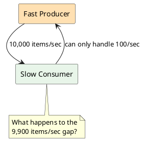
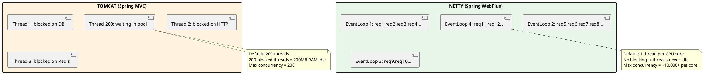

# 2.6: Spring WebFlux & Project Reactor

## Learning Objectives

After this module you can:
- Explain the four Reactive Streams interfaces and the contract between Publisher and Subscriber
- Write Reactor `Mono` and `Flux` pipelines using common operators (`map`, `flatMap`, `filter`, `zip`, `retry`, `timeout`)
- Demonstrate all three backpressure strategies and explain when each is appropriate
- Compare Netty's event-loop model to Tomcat's thread-per-request model with concrete throughput numbers
- Decide when to use WebFlux vs Virtual Threads (Project Loom) for a given use case

## Prerequisites

- Ch 1.3 Project Loom (virtual threads — the comparison point for WebFlux)
- Ch 1.5 Java Memory Model (reactive chains have specific threading rules)
- Ch 2.0–2.3 Spring internals (WebFlux builds on Spring's bean/context model)

---

## The Critical Dialogue

**Student:** My team is migrating to Spring WebFlux because someone said it handles more concurrent users with fewer threads. But when I write WebFlux code, it's full of `.map()`, `.flatMap()`, `.subscribe()` — it's unreadable compared to normal Spring MVC. And now I hear Project Loom does the same thing without all this complexity. What's actually happening, and when should I use WebFlux?

**Principal:** You identified the real tension. WebFlux and Loom solve the same underlying problem — thread-blocking waste — but with opposite approaches. WebFlux says: "Don't block threads; use callbacks and pipelines." Loom says: "Block as much as you want; virtual threads are free." For new projects on Java 21+, Loom often wins. But WebFlux still wins for specific scenarios: streaming responses, non-blocking I/O to non-JDBC data stores, or when you need fine-grained backpressure control. Let's understand both so you can make the call.

---

## 1. The Blocking Problem

### 1.1 Why Thread-Per-Request Wastes Resources

```
TOMCAT THREAD-PER-REQUEST MODEL
════════════════════════════════════════════════════════

Request 1 → Thread 1: [──────── waiting for DB ────────] [process]
Request 2 → Thread 2: [──────── waiting for DB ────────] [process]
Request 3 → Thread 3: [──────── waiting for DB ────────] [process]
Request 4 → Thread 4: [──────── waiting for HTTP call ──] [process]
Request 5 → Thread 5: [──────── waiting for HTTP call ──] [process]
...
Request N → QUEUED (all 200 Tomcat threads busy blocking on I/O!)

Thread cost: ~1MB stack per thread
200 threads = 200MB RAM just for idle waiting
At 50ms avg DB call, 200 threads = max 4,000 req/s throughput
```

```
NETTY EVENT-LOOP MODEL (WebFlux)
════════════════════════════════════════════════════════

EventLoop 1: [req1 start] [req2 start] [req3 start] [req1 resume] [req2 resume]...
EventLoop 2: [req4 start] [req5 start] [req4 resume] [req6 start] [req5 resume]...

Threads: 1 per CPU core (typically 4-8)
Each thread handles THOUSANDS of requests concurrently
No thread sits idle waiting — OS async I/O notifies the event loop
At 50ms avg DB call, 8 threads can handle 160,000+ concurrent in-flight requests
```

The key: when WebFlux makes a DB call, the thread does NOT wait. The OS notifies via epoll/io_uring when data is ready, and the event loop resumes the request handler.

---

## 2. Reactive Streams: The Contract

### 2.1 Four Interfaces

```java
// The entire Reactive Streams spec (simplified):

public interface Publisher<T> {
    void subscribe(Subscriber<? super T> subscriber);
}

public interface Subscriber<T> {
    void onSubscribe(Subscription s);   // called once, before any items
    void onNext(T t);                   // called for each item
    void onError(Throwable t);          // terminal: stream failed
    void onComplete();                  // terminal: stream finished
}

public interface Subscription {
    void request(long n);   // BACKPRESSURE: subscriber requests n items
    void cancel();          // subscriber cancels the stream
}

public interface Processor<T, R> extends Subscriber<T>, Publisher<R> {}
```

**The critical invariant:** `onNext` is never called before `request(n)`. This is how backpressure flows upstream — the subscriber controls the pace.

### 2.2 Project Reactor: `Mono` and `Flux`

Reactor is the Reactive Streams implementation used by Spring WebFlux.

```
Mono<T>  = 0 or 1 item  — equivalent to CompletableFuture<T>
Flux<T>  = 0 to N items — equivalent to Stream<T> but async + backpressure-aware
```

```java
// Mono: single async result
Mono<User> user = userRepository.findById(42L);  // reactive Mongo/R2DBC

// Flux: stream of results
Flux<Order> orders = orderRepository.findByUserId(42L);

// Transform with operators (lazy — nothing executes until subscribed)
Flux<OrderDto> dtos = orders
    .filter(o -> o.status() == ACTIVE)
    .map(o -> new OrderDto(o.id(), o.amount()))
    .take(100);                              // limit to 100 items

// Subscribe (triggers execution)
dtos.subscribe(
    dto -> System.out.println(dto),          // onNext
    err -> log.error("Failed", err),         // onError
    ()  -> System.out.println("Done")        // onComplete
);
```

---

## 3. Key Operators

### 3.1 `map` vs `flatMap`

```java
// map: synchronous, 1-to-1 transformation
Flux<String> names = userFlux.map(user -> user.name());

// flatMap: asynchronous, 1-to-Publisher (merges results, unordered)
Flux<Order> orders = userFlux.flatMap(user ->
    orderRepository.findByUserId(user.id())  // returns Flux<Order>
);
// flatMap subscribes to each inner Publisher concurrently — MAX PARALLELISM

// concatMap: like flatMap but ORDERED, one at a time
Flux<Order> ordered = userFlux.concatMap(user ->
    orderRepository.findByUserId(user.id())
);
```

**Critical distinction:** `flatMap` spawns all inner subscriptions concurrently. 100 users → 100 simultaneous DB queries. Use `flatMap(f, concurrency)` to bound parallelism:

```java
// Limit to 10 concurrent DB queries:
Flux<Order> orders = userFlux.flatMap(
    user -> orderRepository.findByUserId(user.id()),
    10   // maxConcurrency
);
```

### 3.2 Error Handling

```java
Mono<User> result = userService.findById(id)
    .onErrorReturn(UserNotFoundException.class, User.ANONYMOUS)  // fallback value
    .onErrorResume(DatabaseException.class, e ->
        cacheService.getCachedUser(id))                          // fallback publisher
    .retry(3)                                                    // retry 3 times on any error
    .retryWhen(Retry.backoff(3, Duration.ofMillis(100)))         // exponential backoff
    .timeout(Duration.ofSeconds(2))                              // timeout → TimeoutException
    .doOnError(e -> log.warn("Failed for id={}", id, e));        // side effect on error
```

### 3.3 `zip` and Combining Streams

```java
// Execute two async calls in PARALLEL, combine results:
Mono<UserProfile> profile = Mono.zip(
    userRepository.findById(userId),          // runs concurrently
    orderRepository.countByUserId(userId),    // runs concurrently
    (user, orderCount) -> new UserProfile(user, orderCount)
);
// Total time = max(user fetch, order count) — NOT sum
```

---

## 4. Backpressure: The Three Strategies

Backpressure problem: fast producer, slow consumer. The Flux emits faster than downstream can process.



### 4.1 Buffer (default — dangerous)

```java
Flux.interval(Duration.ofMillis(1))        // emits 1000/sec
    .onBackpressureBuffer(1000)            // buffer up to 1000
    .subscribe(item -> {
        Thread.sleep(10);                  // processes 100/sec
    });
// After 1 second: buffer full → OverflowException
// In production: OutOfMemoryError if unbounded
```

### 4.2 Drop (fire-and-forget metrics OK)

```java
Flux.interval(Duration.ofMillis(1))
    .onBackpressureBuffer(100,
        dropped -> log.warn("Dropped: {}", dropped),  // log dropped items
        BufferOverflowStrategy.DROP_LATEST)            // newest items dropped
    .subscribe(item -> process(item));
// Use case: metrics, analytics — losing some data is acceptable
```

### 4.3 Error (strict processing — no data loss acceptable)

```java
Flux.interval(Duration.ofMillis(1))
    .onBackpressureError()                 // throws OverflowException immediately
    .subscribe(
        item -> process(item),
        err  -> alertOps("Backpressure overflow: " + err)
    );
// Use case: financial transactions — must not silently drop
```

---

## 5. Netty vs Tomcat: The Threading Model



### 5.1 The Golden Rule: Never Block the Event Loop

```java
// ❌ FATAL: blocking call on the event loop thread
@GetMapping("/users/{id}")
public Mono<User> getUser(@PathVariable Long id) {
    return Mono.fromCallable(() -> jdbcTemplate.queryForObject(...));
    // jdbcTemplate.queryForObject() BLOCKS the event loop thread
    // All other requests on this event loop are STARVED
    // Throughput collapses
}

// ✅ CORRECT: use R2DBC (reactive JDBC) or offload to scheduler
@GetMapping("/users/{id}")
public Mono<User> getUser(@PathVariable Long id) {
    return r2dbcUserRepository.findById(id);  // non-blocking R2DBC
}

// ✅ ALSO CORRECT: offload blocking to bounded elastic thread pool
@GetMapping("/users/{id}")
public Mono<User> getUser(@PathVariable Long id) {
    return Mono.fromCallable(() -> jdbcTemplate.queryForObject(...))
               .subscribeOn(Schedulers.boundedElastic());  // offload to thread pool
}
```

---

## 6. WebFlux vs Virtual Threads Decision Matrix

| Criterion | WebFlux (Reactive) | Virtual Threads (Loom) |
|-----------|-------------------|----------------------|
| Programming model | Functional, pipelines | Imperative, sequential |
| Debuggability | Hard — stack traces are useless | Easy — normal stack traces |
| Backpressure control | Built-in, fine-grained | Manual (blocking queues) |
| Non-blocking I/O libs | Required (R2DBC, reactive drivers) | Works with any JDBC |
| Streaming responses (SSE) | Natural fit | Possible but awkward |
| Learning curve | High | Low (looks like sync code) |
| Spring Boot version | 2.x+ | 3.2+ (recommended) |
| **When to choose** | Streaming, backpressure needed, reactive DB drivers available | Most CRUD apps, JDBC, simpler code preferred |

**Principal's rule:** On Java 21+ with Spring Boot 3.2+, default to Virtual Threads for CRUD services. Use WebFlux when you need streaming (SSE, WebSocket) or when your data store only has reactive drivers (Cassandra reactive, reactive MongoDB).

---

## 7. Source Archaeology

### 7.1 `Flux.subscribe()` — The Subscription Chain

```java
// reactor.core.publisher.FluxMap (simplified, OpenJDK reactor-core source)
// When you write: flux.map(f).subscribe(subscriber)

// 1. subscribe() triggers assembly in reverse:
//    FluxMap.subscribe(subscriber)
//    → calls source.subscribe(new MapSubscriber(subscriber, mapper))

// 2. MapSubscriber wraps the downstream subscriber and applies the mapper:
static final class MapSubscriber<T, R> implements InnerOperator<T, R> {
    @Override
    public void onNext(T t) {
        R v;
        try {
            v = mapper.apply(t);  // apply the map function
        } catch (Throwable e) {
            onError(e);
            return;
        }
        actual.onNext(v);         // pass to downstream subscriber
    }
}

// 3. request(n) flows UPSTREAM through the chain:
//    MapSubscriber.request(n) → source.request(n)
// This is how backpressure travels from consumer to producer
```

### 7.2 Schedulers — Thread Assignment

```java
// Schedulers.java (reactor-core):
// Schedulers.parallel()       → fixed thread pool (CPU-bound work, size = CPU cores)
// Schedulers.boundedElastic() → elastic pool (blocking I/O, grows on demand, bounded)
// Schedulers.single()         → single thread (ordered, sequential)
// Schedulers.immediate()      → current thread (no scheduling)

// publishOn: switch threads for DOWNSTREAM operators
flux.publishOn(Schedulers.parallel())  // downstream executes on parallel pool

// subscribeOn: switch threads for UPSTREAM source
flux.subscribeOn(Schedulers.boundedElastic())  // source subscription on elastic pool
```

---

## 8. Code Lab

### Lab: Parallel API Aggregation with WebFlux

```java
// Scenario: fetch user profile from 3 services in parallel, combine results
// Sequential (blocking): 300ms (100ms + 100ms + 100ms)
// Parallel (WebFlux):    ~100ms (max of 3 concurrent calls)

@Service
public class UserAggregationService {

    private final WebClient userClient;
    private final WebClient orderClient;
    private final WebClient rewardsClient;

    // ❌ BAD: sequential — 300ms total
    public UserDashboard getSequential(Long userId) {
        User user = userClient.get()
            .uri("/users/{id}", userId).retrieve()
            .bodyToMono(User.class).block();      // blocks 100ms

        List<Order> orders = orderClient.get()
            .uri("/orders?userId={id}", userId).retrieve()
            .bodyToFlux(Order.class).collectList().block();  // blocks 100ms

        RewardBalance rewards = rewardsClient.get()
            .uri("/rewards/{id}", userId).retrieve()
            .bodyToMono(RewardBalance.class).block();  // blocks 100ms

        return new UserDashboard(user, orders, rewards);
    }

    // ✅ GOOD: parallel — ~100ms total
    public Mono<UserDashboard> getParallel(Long userId) {
        Mono<User> userMono = userClient.get()
            .uri("/users/{id}", userId).retrieve()
            .bodyToMono(User.class)
            .timeout(Duration.ofSeconds(2))
            .onErrorReturn(User.ANONYMOUS);

        Mono<List<Order>> ordersMono = orderClient.get()
            .uri("/orders?userId={id}", userId).retrieve()
            .bodyToFlux(Order.class)
            .collectList()
            .timeout(Duration.ofSeconds(2))
            .onErrorReturn(List.of());

        Mono<RewardBalance> rewardsMono = rewardsClient.get()
            .uri("/rewards/{id}", userId).retrieve()
            .bodyToMono(RewardBalance.class)
            .timeout(Duration.ofSeconds(2))
            .onErrorReturn(RewardBalance.EMPTY);

        return Mono.zip(userMono, ordersMono, rewardsMono)
            .map(tuple -> new UserDashboard(
                tuple.getT1(), tuple.getT2(), tuple.getT3()
            ));
    }
}

// Controller (WebFlux — returns Mono, never blocks)
@RestController
public class DashboardController {

    @GetMapping("/dashboard/{userId}")
    public Mono<UserDashboard> getDashboard(@PathVariable Long userId) {
        return aggregationService.getParallel(userId);
        // Spring WebFlux subscribes to this Mono and writes the response
        // when complete — the event loop thread is NEVER blocked
    }
}
```

---

## 9. Production Lens

### Incident: Blocking Call in Event Loop — Silent Throughput Collapse

A team added a synchronous Redis call (using Jedis, a blocking client) inside a WebFlux controller:

```java
// ❌ Production bug: Jedis.get() blocks the Netty event loop thread
return Mono.just(jedis.get("key:" + userId))  // blocks for ~1ms
    .map(cached -> ...);
```

**Observed:** Under load, throughput dropped from 50,000 req/s to 800 req/s. 8 event loop threads × 1ms blocking = max 8,000 req/s theoretical — but thread contention made it worse.

**Fix:** Switch to Lettuce (non-blocking Redis client) or `subscribeOn(Schedulers.boundedElastic())`.

**Benchmark numbers:**
```
WebFlux (properly non-blocking) vs Spring MVC (Tomcat):
─────────────────────────────────────────────────────────
Scenario: 10,000 concurrent connections, 50ms upstream DB call

Spring MVC (200 threads):  4,000 req/s, p99 = 180ms
WebFlux (Netty, R2DBC):   48,000 req/s, p99 = 55ms

Spring MVC (Virtual Threads, Java 21):  42,000 req/s, p99 = 58ms
→ Virtual Threads achieves near-WebFlux throughput with simpler code
```

### Red Flags in Code Review

```
❌ .block() inside a @RestController method         → blocks event loop
❌ jdbcTemplate inside Mono.fromCallable()
   without .subscribeOn(boundedElastic())            → blocks event loop
❌ flatMap() without concurrency limit               → unbounded DB connections
❌ Flux without backpressure strategy                → silent OOM under spike load
❌ Thread.sleep() or synchronized block in pipeline  → deadlock or starvation
```

---

## 10. Exercises

**1.** Explain the difference between `map` and `flatMap`. Give a concrete example where using `map` instead of `flatMap` would cause a compile error.

**2.** A Flux emits 10,000 items/second, but the subscriber can only process 100/second. What are the three backpressure strategies available? For a payment processing system, which would you choose and why?

**3.** You have a Spring Boot 3.2 app on Java 21. Your team is debating: WebFlux vs Spring MVC with Virtual Threads. The service makes JDBC calls. What is your recommendation and rationale?

**4. Coding challenge:** Implement a resilient API call using Reactor that: fetches data from a URL, retries 3 times with exponential backoff starting at 200ms, times out each attempt after 1 second, and returns an empty `Optional` on final failure. Use `WebClient`.

**5.** Why is `subscribeOn` only effective for the source subscription, while `publishOn` affects all downstream operators? Draw the operator chain to illustrate.

---

## 11. Summary / Flashcard

- **Reactive Streams contract = pull, not push**: subscriber calls `request(n)` to pull items; producer never pushes more than requested — this is the foundation of backpressure in WebFlux
- **Never block the Netty event loop**: `jdbcTemplate`, `Jedis`, `Thread.sleep()` in a WebFlux controller collapse throughput from 50k req/s to 800 req/s; use R2DBC, reactive clients, or `subscribeOn(boundedElastic())`
- **`flatMap` is concurrent, `concatMap` is sequential**: `flatMap` spawns all inner subscriptions in parallel (bounded by `maxConcurrency`); use bounded `flatMap` to avoid connection pool exhaustion
- **`Mono.zip` runs parallel, `flatMap` chains serialize**: `Mono.zip(a, b, c)` subscribes to all three simultaneously; total time = `max(a,b,c)` not `a+b+c`
- **Java 21 + Virtual Threads makes WebFlux optional**: for CRUD with JDBC, virtual threads achieve equivalent throughput with readable synchronous code; WebFlux still wins for streaming (SSE), backpressure-critical systems, or reactive-only drivers
