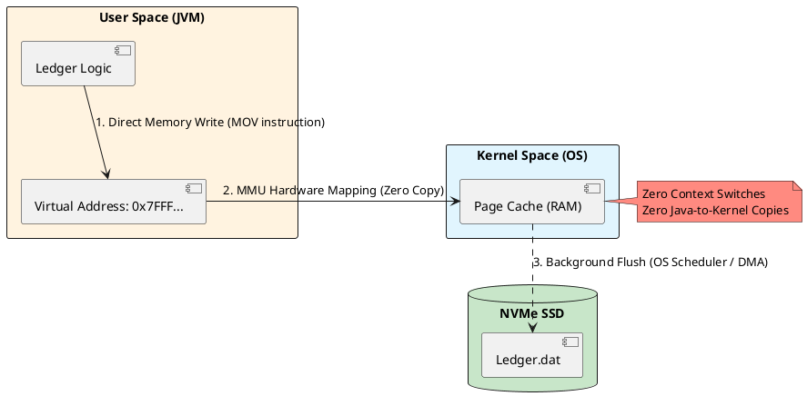

# 3.1: Zero-Copy Persistence and Memory-Mapped I/O


## The Critical Dialogue


**Student:** Our Ledger is performing beautifully in-memory, but as soon as we start persisting orders to disk, our P99 latency spikes to 100ms. We are using standard `FileOutputStream`. I upgraded the hardware to NVMe SSDs, but the latency didn't drop. Why is the disk so slow compared to RAM?


**Principal:** The disk isn't slow; your **Interaction with the OS Kernel** is. You are hitting a bottleneck not in the silicon, but in the software abstraction layer. When you use standard I/O, you are performing "Double Copying." Data moves from your application into the JVM buffer, then into the Kernel buffer, and finally to the hardware. You are paying the **Context Switch Tax** on every write. 

At a scale like Netflix or a global financial ledger, we don't treat the disk as a "file." We treat it as an extension of the CPU's memory. To reach Principal level, we must bypass the Kernel's bureaucracy using **Memory-Mapped I/O (mmap)** and **Zero-Copy**. We will map our Ledger file directly into the CPU's address space.


---


## 1. The Physics of the OS Page Cache


### 1.1 The Kernel-to-User Barrier: Why Double Copying Fails


In standard Java I/O (e.g., `Files.write` or `FileOutputStream`), every operation involves a **System Call**. Let's break down the exact physics of what happens when you call `write(byte[])`:


. **The Context Switch:** The CPU must switch from "User Mode" (your Java application) to "Kernel Mode" (the Operating System). This switch requires saving the CPU registers and flushing the TLB (Translation Lookaside Buffer). This takes **~1,000 to 3,000 nanoseconds**.
. **The First Copy:** The JVM copies the `byte[]` from the Managed Heap (User Space) into a native memory buffer (Kernel Space).
. **The Second Copy:** The OS kernel copies the data from its buffer into the **Page Cache** (the OS's disk cache in RAM).
. **The Hardware Write:** Eventually, the OS schedules a DMA (Direct Memory Access) transfer from the Page Cache to the physical NVMe SSD.


> [!info] The Principal View
> At 1 million orders/sec, these context switches and memory copies become the primary bottleneck. You are burning memory bandwidth and CPU cycles just moving bytes from one side of the RAM to the other. The CPU should be executing business logic, not shuffling bytes.


### 1.2 The mmap Solution: Virtual Memory Magic


Memory-Mapped I/O (mmap) completely eliminates the context switch and the double copy for reads and writes.


. **Mechanism:** The OS maps a range of **Virtual Addresses** directly to a physical file on disk. 
. **The Magic:** When you write to that memory address in Java, you are writing *directly* into the OS **Page Cache**. The hardware's Memory Management Unit (MMU) translates your virtual address to the physical RAM address. There is no intermediate "Copy" instruction, and no system call is made during the write.


---


## 2. Visualizing the Zero-Copy Architecture


**What is it?**
The following diagram shows the bypass of the standard I/O pipeline. Instead of moving data *through* the kernel via system calls, we share a physical memory region *with* the kernel.


**Why do we use it?**
We use this to achieve **Zero-Latency Persistence**. The application "sees" the file as a contiguous block of memory, allowing for O(1) access times for any transaction in the Ledger.





---


## 3. Source Archaeology: java.nio.channels.FileChannel


A Principal uses the NIO `FileChannel` to trigger the `mmap()` system call. Let's look under the hood of the JDK.


> [!abstract] SDK Deep Dive: MappedByteBuffer
> Inside `FileChannelImpl.c` (the native source code of the JDK), the `map()` method directly invokes the Linux `mmap` system call. 
> . **The Return Type:** It returns a `DirectByteBuffer`. Unlike a standard `byte[]`, this object points to a memory address **outside the JVM Heap**.
> . **The GC Exemption:** Because the memory is off-heap, the Garbage Collector (GC) never scans it. You can map a 100GB Ledger file into memory, and it will have **zero impact on GC pause times**. 


---


## 4. Hardware Physics: PCIe and NUMA Architecture


To truly understand scale (e.g., streaming Netflix video BLOBs or ingesting millions of trades), you must understand the hardware beneath the JVM.


### 4.1 PCIe Bandwidth
A modern NVMe SSD is connected directly to the CPU via PCIe lanes. A PCIe 4.0 x4 connection provides roughly **8 GB/s** of throughput. If your Java application is double-copying data, you will max out your CPU memory bus before you ever saturate the NVMe drive. Zero-copy ensures the data flows directly from the Page Cache to the SSD via DMA.


### 4.2 NUMA (Non-Uniform Memory Access)
In multi-socket servers, memory is physically attached to specific CPUs. 
. **The Trap:** If Thread A on CPU 1 tries to read a `MappedByteBuffer` that is physically located in the RAM attached to CPU 2, the data must cross the UPI (Ultra Path Interconnect) bus.
. **The Latency:** This cross-NUMA access adds critical microsecond delays. 
. **The Principal Fix:** We pin our ingestion threads to specific CPU cores and allocate memory locally to avoid NUMA boundary crossings.


---


## 5. Principal Implementation: The High-Speed Journal


We will build a persistence engine that writes 1M orders/sec by treating a file like a raw memory array.


```java
// Principal Level: Zero-Copy Journaling
public class FastLedgerJournal implements AutoCloseable {
    private final FileChannel channel;
    private final MappedByteBuffer buffer;
    private final long totalSize;

    public FastLedgerJournal(File file, long size) throws IOException {
        this.totalSize = size;
        this.channel = FileChannel.open(file.toPath(), 
                StandardOpenOption.READ, StandardOpenOption.WRITE, StandardOpenOption.CREATE);
        
        // Map 1GB of disk space directly to the CPU's address space
        this.buffer = channel.map(FileChannel.MapMode.READ_WRITE, 0, size);
    }

    public void persistTransaction(long orderId, double amount) {
        // High-Performance Pointer Bump
        // This compiles down to a direct memory write (MOV instruction in assembly)
        if (buffer.remaining() < 16) {
            throw new BufferOverflowException();
        }
        
        buffer.putLong(orderId);     // 8 bytes
        buffer.putDouble(amount);    // 8 bytes
        
        // No flush() or write() system calls! 
        // The OS MMU handles the physical write in the background.
    }

    @Override
    public void close() throws Exception {
        // Force the OS to flush remaining dirty pages to disk
        buffer.force(); 
        channel.close();
    }
}
```


---


## 6. Reliability: msync and the Durability Trade-off


### 6.1 The "Dirty Page" Mechanics


When you write to the `MappedByteBuffer`, the page in RAM is marked by the MMU as **Dirty**. The OS kernel flushes these dirty pages to disk asynchronously (usually every few seconds).


> [!info] The Risk Audit
> . **Crash Safety:** If the **JVM crashes** (e.g., `OutOfMemoryError`), the OS still owns the Page Cache. The OS will seamlessly finish writing the dirty pages to disk. Your data is **Safe**.
> . **Power Failure:** If the **physical machine loses power** or the OS kernel panics, any un-flushed dirty pages in RAM are instantly lost.
> . **The Solution (`msync`):** For critical financial data, we can call `buffer.force()`. This triggers the native **`msync`** system call, forcing the hardware to synchronously flush the cache to the physical NVMe drive. However, calling this on every transaction drops throughput from 1,000,000 to 5,000 ops/sec. A Principal batches these calls (e.g., sync every 10ms).


---


## 🧵 The GOL Challenge: Phase 6 (Persistence)


**Context:** The Ledger needs to survive a pod restart without losing a single transaction. However, using standard I/O is causing CPU stalls, and using `buffer.force()` on every write is too slow.


**The Task:**


. **Zero-Copy Implementation:** Implement the `FastLedgerJournal`. Use the `JOL` (Java Object Layout) tool concept to ensure your binary layout is aligned to 8-byte boundaries to maximize CPU cache hits.


. **Adaptive Sync (Group Commit):** Implement a "Batch Sync" strategy. Instead of syncing on every write, use a background Virtual Thread that calls `buffer.force()` every 50ms or when 10,000 orders have been written. Measure the massive throughput increase using a JMH benchmark.


. **Page Fault Audit:** Run your journal on a Linux machine and use the command `sar -B 1`. Identify the number of **Major Page Faults**. Explain why "Pre-faulting" the file (writing zeros to the entire mapped area at startup) eliminates these latency spikes during runtime.


---


## 🧠 Principal's Inquiry


. **The 2GB Limit:** Why is `MappedByteBuffer` strictly limited to 2GB in Java? (Hint: Think about the `int` index type in the legacy ByteBuffer API). How does **Project Panama** (Module 3.2) break this barrier using `MemorySegment`?


. **Address Space Fragmentation:** In a 64-bit JVM, we have a massive virtual address space. Why can we still run out of "Virtual Memory" if we map tens of thousands of small files?


. **Pointer Tearing:** If you write a 64-bit `long` to a mapped buffer without `volatile` semantics on a 32-bit architecture, can a reader on another thread see a "half-written" value? How does `VarHandle` solve this?


**Principal Summary:** Persistence is about **Bypassing the Kernel**. We use memory-mapped I/O (mmap) to treat the disk as an extension of RAM. By understanding PCIe bandwidth, NUMA architecture, and Page Cache physics, we eliminate double-copying and ensure the Ledger scales to the absolute limits of the hardware.
