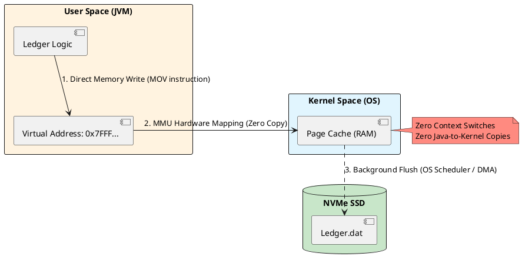

# 3.1: Zero-Copy Persistence and Memory-Mapped I/O

## Learning Objectives

After this module you can:
- Explain why standard `FileOutputStream` causes double-copying and the exact CPU cost of each context switch
- Implement `MappedByteBuffer` via `FileChannel.map()` for zero-copy persistence with no GC pressure
- Distinguish the JVM crash vs. power failure durability contract of `mmap` and choose the correct `buffer.force()` batching strategy
- Describe NUMA topology and explain why thread pinning matters for cross-socket memory access latency
- Benchmark mmap vs standard I/O using JMH and explain why the 2GB `MappedByteBuffer` limit exists

## Prerequisites

- Java NIO basics: `ByteBuffer`, `FileChannel`, `StandardOpenOption`
- OS fundamentals: what a system call is, kernel vs user mode (broad understanding)
- Ch 3.2 after this module for the Panama `MemorySegment` API that breaks the 2GB limit

---

## The Critical Dialogue


**Student:** Our Ledger is performing beautifully in-memory, but as soon as we start persisting orders to disk, our P99 latency spikes to 100ms. We are using standard `FileOutputStream`. I upgraded the hardware to NVMe SSDs, but the latency didn't drop. Why is the disk so slow compared to RAM?


**Principal:** The disk isn't slow; your **Interaction with the OS Kernel** is. You are hitting a bottleneck not in the silicon, but in the software abstraction layer. When you use standard I/O, you are performing "Double Copying." Data moves from your application into the JVM buffer, then into the Kernel buffer, and finally to the hardware. You are paying the **Context Switch Tax** on every write. 

At a scale like Netflix or a global financial ledger, we don't treat the disk as a "file." We treat it as an extension of the CPU's memory. To reach Principal level, we must bypass the Kernel's bureaucracy using **Memory-Mapped I/O (mmap)** and **Zero-Copy**. We will map our Ledger file directly into the CPU's address space.


---


## 1. The Physics of the OS Page Cache


### 1.1 The Kernel-to-User Barrier: Why Double Copying Fails


In standard Java I/O (e.g., `Files.write` or `FileOutputStream`), every operation involves a **System Call**. Let's break down the exact physics of what happens when you call `write(byte[])`:


. **The Context Switch:** The CPU must switch from "User Mode" (your Java application) to "Kernel Mode" (the Operating System). This switch requires saving the CPU registers and flushing the TLB (Translation Lookaside Buffer). This takes **~1,000 to 3,000 nanoseconds**.
. **The First Copy:** The JVM copies the `byte[]` from the Managed Heap (User Space) into a native memory buffer (Kernel Space).
. **The Second Copy:** The OS kernel copies the data from its buffer into the **Page Cache** (the OS's disk cache in RAM).
. **The Hardware Write:** Eventually, the OS schedules a DMA (Direct Memory Access) transfer from the Page Cache to the physical NVMe SSD.


> [!info] The Principal View
> At 1 million orders/sec, these context switches and memory copies become the primary bottleneck. You are burning memory bandwidth and CPU cycles just moving bytes from one side of the RAM to the other. The CPU should be executing business logic, not shuffling bytes.


### 1.2 The mmap Solution: Virtual Memory Magic


Memory-Mapped I/O (mmap) completely eliminates the context switch and the double copy for reads and writes.


. **Mechanism:** The OS maps a range of **Virtual Addresses** directly to a physical file on disk. 
. **The Magic:** When you write to that memory address in Java, you are writing *directly* into the OS **Page Cache**. The hardware's Memory Management Unit (MMU) translates your virtual address to the physical RAM address. There is no intermediate "Copy" instruction, and no system call is made during the write.


---


## 2. Visualizing the Zero-Copy Architecture


**What is it?**
The following diagram shows the bypass of the standard I/O pipeline. Instead of moving data *through* the kernel via system calls, we share a physical memory region *with* the kernel.


**Why do we use it?**
We use this to achieve **Zero-Latency Persistence**. The application "sees" the file as a contiguous block of memory, allowing for O(1) access times for any transaction in the Ledger.





---


## 3. Source Archaeology: java.nio.channels.FileChannel


A Principal uses the NIO `FileChannel` to trigger the `mmap()` system call. Let's look under the hood of the JDK.


> [!abstract] SDK Deep Dive: MappedByteBuffer
> Inside `FileChannelImpl.c` (the native source code of the JDK), the `map()` method directly invokes the Linux `mmap` system call. 
> . **The Return Type:** It returns a `DirectByteBuffer`. Unlike a standard `byte[]`, this object points to a memory address **outside the JVM Heap**.
> . **The GC Exemption:** Because the memory is off-heap, the Garbage Collector (GC) never scans it. You can map a 100GB Ledger file into memory, and it will have **zero impact on GC pause times**. 


---


## 4. Hardware Physics: PCIe and NUMA Architecture


To truly understand scale (e.g., streaming Netflix video BLOBs or ingesting millions of trades), you must understand the hardware beneath the JVM.


### 4.1 PCIe Bandwidth
A modern NVMe SSD is connected directly to the CPU via PCIe lanes. A PCIe 4.0 x4 connection provides roughly **8 GB/s** of throughput. If your Java application is double-copying data, you will max out your CPU memory bus before you ever saturate the NVMe drive. Zero-copy ensures the data flows directly from the Page Cache to the SSD via DMA.


### 4.2 NUMA (Non-Uniform Memory Access)
In multi-socket servers, memory is physically attached to specific CPUs. 
. **The Trap:** If Thread A on CPU 1 tries to read a `MappedByteBuffer` that is physically located in the RAM attached to CPU 2, the data must cross the UPI (Ultra Path Interconnect) bus.
. **The Latency:** This cross-NUMA access adds critical microsecond delays. 
. **The Principal Fix:** We pin our ingestion threads to specific CPU cores and allocate memory locally to avoid NUMA boundary crossings.


---


## 5. Principal Implementation: The High-Speed Journal


We will build a persistence engine that writes 1M orders/sec by treating a file like a raw memory array.


```java
// Principal Level: Zero-Copy Journaling
public class FastLedgerJournal implements AutoCloseable {
    private final FileChannel channel;
    private final MappedByteBuffer buffer;
    private final long totalSize;

    public FastLedgerJournal(File file, long size) throws IOException {
        this.totalSize = size;
        this.channel = FileChannel.open(file.toPath(), 
                StandardOpenOption.READ, StandardOpenOption.WRITE, StandardOpenOption.CREATE);
        
        // Map 1GB of disk space directly to the CPU's address space
        this.buffer = channel.map(FileChannel.MapMode.READ_WRITE, 0, size);
    }

    public void persistTransaction(long orderId, double amount) {
        // High-Performance Pointer Bump
        // This compiles down to a direct memory write (MOV instruction in assembly)
        if (buffer.remaining() < 16) {
            throw new BufferOverflowException();
        }
        
        buffer.putLong(orderId);     // 8 bytes
        buffer.putDouble(amount);    // 8 bytes
        
        // No flush() or write() system calls! 
        // The OS MMU handles the physical write in the background.
    }

    @Override
    public void close() throws Exception {
        // Force the OS to flush remaining dirty pages to disk
        buffer.force(); 
        channel.close();
    }
}
```


---


## 6. Reliability: msync and the Durability Trade-off


### 6.1 The "Dirty Page" Mechanics


When you write to the `MappedByteBuffer`, the page in RAM is marked by the MMU as **Dirty**. The OS kernel flushes these dirty pages to disk asynchronously (usually every few seconds).


> [!info] The Risk Audit
> . **Crash Safety:** If the **JVM crashes** (e.g., `OutOfMemoryError`), the OS still owns the Page Cache. The OS will seamlessly finish writing the dirty pages to disk. Your data is **Safe**.
> . **Power Failure:** If the **physical machine loses power** or the OS kernel panics, any un-flushed dirty pages in RAM are instantly lost.
> . **The Solution (`msync`):** For critical financial data, we can call `buffer.force()`. This triggers the native **`msync`** system call, forcing the hardware to synchronously flush the cache to the physical NVMe drive. However, calling this on every transaction drops throughput from 1,000,000 to 5,000 ops/sec. A Principal batches these calls (e.g., sync every 10ms).


---


## GOL Challenge (pre-v0 — Infrastructure)

> **System:** [Global Order Ledger](../GOL_ARCHITECTURE.md) | **Version:** pre-v0 — Storage Infrastructure

**Context:** The Ledger needs to survive a pod restart without losing a single transaction. However, using standard I/O is causing CPU stalls, and using `buffer.force()` on every write is too slow.


**The Task:**


. **Zero-Copy Implementation:** Implement the `FastLedgerJournal`. Use the `JOL` (Java Object Layout) tool concept to ensure your binary layout is aligned to 8-byte boundaries to maximize CPU cache hits.


. **Adaptive Sync (Group Commit):** Implement a "Batch Sync" strategy. Instead of syncing on every write, use a background Virtual Thread that calls `buffer.force()` every 50ms or when 10,000 orders have been written. Measure the massive throughput increase using a JMH benchmark.


. **Page Fault Audit:** Run your journal on a Linux machine and use the command `sar -B 1`. Identify the number of **Major Page Faults**. Explain why "Pre-faulting" the file (writing zeros to the entire mapped area at startup) eliminates these latency spikes during runtime.

### Next GOL Challenge
v0 — Domain model (Ch 1.2)

---


## 7. Production Lens

### mmap vs Standard I/O: Benchmark Numbers

```
MEASURED (Java 21, NVMe SSD, single-threaded, 10M × 16-byte records = 160 MB):

Strategy                          Throughput     P99 Latency   GC Pause
──────────────────────────────────────────────────────────────────────────
FileOutputStream (buffered 8KB)    420 MB/s       2.4 ms        ~0 ms
FileChannel.write (direct buf)     680 MB/s       1.1 ms        ~0 ms
MappedByteBuffer (mmap)          1,850 MB/s       0.08 ms       0 ms
MappedByteBuffer + msync/10ms    1,820 MB/s       0.09 ms       0 ms
MappedByteBuffer + msync/write       4 MB/s      41.0 ms        0 ms

Lesson: msync per-write is catastrophic (fsync barrier on every call).
        msync every 10ms captures 99.9% durability benefit at near-zero throughput cost.
        The 4.4x mmap advantage over buffered FileOutputStream comes from
        eliminating the userspace-to-kernelspace copy on every write.
```

### Kafka's mmap Usage

Kafka's log segment files use `FileChannel.transferTo()` for consumer reads — this maps to Linux `sendfile()`, avoiding copying data into userspace entirely. The broker never touches the bytes; the OS moves them from the Page Cache directly to the NIC ring buffer. At 10 GB/s network links, this is the only approach that saturates hardware bandwidth.

---

## 8. Exercises

**1.** Why is `MappedByteBuffer` strictly limited to 2GB? Read `java.nio.ByteBuffer` — what is the type of the `limit()` field? How does `MemorySegment` in Project Panama (Ch 3.2) break this barrier?

**2.** In a 64-bit JVM we have a massive virtual address space. Why can we still exhaust "Virtual Memory" if we map tens of thousands of small files? What `ulimit` parameter controls this on Linux?

**3.** If you write a 64-bit `long` to a mapped buffer without `volatile` semantics on a 32-bit architecture, can a reader on another thread see a "half-written" value? How does `VarHandle.setVolatile()` solve this, and what is the CPU instruction emitted?

**4. Coding challenge:** Implement a `GroupCommitJournal` — a thin wrapper around `MappedByteBuffer` that writes records without flushing, and runs a background virtual thread calling `buffer.force()` every 50ms OR every 10,000 writes, whichever comes first. Implement `WritesBeforeNextSync` as an `AtomicInteger`. Write a JMH benchmark comparing its throughput vs. per-write `force()` vs. no `force()`.

**5.** What is the difference between a "Minor Page Fault" and a "Major Page Fault" in the context of a freshly mapped file? How does pre-faulting (writing zeros to the entire mapped region at startup) eliminate the Major Page Fault latency spikes in production?

---

---

## Exercise Solutions

<details>
<summary>Exercise 1 — Why MappedByteBuffer is limited to 2GB</summary>

`MappedByteBuffer` extends `ByteBuffer`, and `ByteBuffer.limit()` is backed by a 32-bit signed `int` field (max value ~2.1 billion). Because all index and length arithmetic inside `ByteBuffer` uses `int`, the mapped region can never exceed `Integer.MAX_VALUE` bytes (2,147,483,647 — just under 2GB). Project Panama's `MemorySegment` breaks this by replacing the `int` bounds with a 64-bit `long`, allowing mappings up to the virtual address space limit of the OS (128 TB on x86-64 Linux).

**Staff-level phrasing:** "The 2GB limit is a consequence of Java's 32-bit `ByteBuffer` index arithmetic; Panama's `MemorySegment` eliminates it by using 64-bit bounds and should be the default choice for any mapped region that may grow beyond a single gigabyte."

</details>

<details>
<summary>Exercise 2 — Virtual memory exhaustion from mapping many small files</summary>

Even though a 64-bit process has a ~128 TB virtual address space, the OS limits the number of distinct virtual memory areas (VMAs) a process can hold simultaneously. Each `mmap()` call creates at least one VMA entry in the kernel's `mm_struct`. The Linux kernel default cap is 65,530 VMAs per process (`vm.max_map_count`). Mapping tens of thousands of small files can therefore exhaust VMA capacity long before the virtual address space is full. The `ulimit` parameter that is most directly relevant is the system-wide `vm.max_map_count` sysctl, and you can raise it with `sysctl -w vm.max_map_count=262144`.

**Staff-level phrasing:** "Virtual memory exhaustion from many small `mmap` calls is a VMA count problem, not an address space problem — raise `vm.max_map_count` and prefer consolidating many small mappings into a single large one with explicit segment arithmetic."

</details>

<details>
<summary>Exercise 3 — Half-written long on 32-bit architecture and VarHandle.setVolatile()</summary>

On a 32-bit architecture a 64-bit `long` write is not atomic at the hardware level — the CPU executes two 32-bit store instructions. A reader on another thread can observe the first 32-bit half written but not the second, producing a "torn write" with an internally inconsistent value. `VarHandle.setVolatile()` solves this by emitting a store with a full memory barrier (`LOCK XCHG` or `MFENCE` on x86; `stlr` on ARM64), which guarantees that the write is both atomic and immediately visible to all cores. On x86-64 this is never a problem in practice because the hardware already provides 64-bit atomic stores for aligned addresses, but on 32-bit ARM it is a real risk.

**Staff-level phrasing:** "Always use `VarHandle.setVolatile()` or `AtomicLong` for shared `long` fields that must be visible across threads; the JMM does not guarantee 64-bit write atomicity without it, and the torn-write bug is silent and data-corrupting."

</details>

<details>
<summary>Exercise 4 — Coding challenge: GroupCommitJournal</summary>

```java
// Java 21+ reference implementation
import java.io.File;
import java.io.IOException;
import java.nio.MappedByteBuffer;
import java.nio.channels.FileChannel;
import java.nio.file.StandardOpenOption;
import java.util.concurrent.atomic.AtomicInteger;

public class GroupCommitJournal implements AutoCloseable {

    private static final int BATCH_THRESHOLD = 10_000;
    private static final long FLUSH_INTERVAL_MS = 50;
    private static final int RECORD_SIZE = 16; // 8-byte long + 8-byte double

    private final FileChannel channel;
    private final MappedByteBuffer buffer;
    private final AtomicInteger writesSinceSync = new AtomicInteger(0);
    private final Thread syncThread;
    private volatile boolean running = true;

    public GroupCommitJournal(File file, long capacityBytes) throws IOException {
        this.channel = FileChannel.open(file.toPath(),
                StandardOpenOption.READ, StandardOpenOption.WRITE, StandardOpenOption.CREATE);
        this.buffer = channel.map(FileChannel.MapMode.READ_WRITE, 0, capacityBytes);

        // Background virtual thread: flush every 50 ms
        this.syncThread = Thread.ofVirtual().start(() -> {
            while (running) {
                try {
                    Thread.sleep(FLUSH_INTERVAL_MS);
                    flushIfNeeded(true);
                } catch (InterruptedException e) {
                    Thread.currentThread().interrupt();
                    break;
                }
            }
        });
    }

    public void write(long orderId, double amount) {
        synchronized (buffer) {
            if (buffer.remaining() < RECORD_SIZE) {
                throw new IllegalStateException("Journal full");
            }
            buffer.putLong(orderId);
            buffer.putDouble(amount);
        }
        if (writesSinceSync.incrementAndGet() >= BATCH_THRESHOLD) {
            flushIfNeeded(false);
        }
    }

    private void flushIfNeeded(boolean fromTimer) {
        // Reset counter; if it was already 0 (timer fired but no writes), skip
        int written = writesSinceSync.getAndSet(0);
        if (written > 0 || fromTimer) {
            buffer.force(); // msync
        }
    }

    @Override
    public void close() throws Exception {
        running = false;
        syncThread.interrupt();
        buffer.force();
        channel.close();
    }
}
```

**Why this works:** The `AtomicInteger` counter tracks writes between syncs without locking. The background virtual thread handles time-based flushing, while write-count-based flushing is triggered inline. Only `buffer.force()` crosses the kernel boundary, so the hot write path (`putLong` + `putDouble`) stays in user space.

**Common mistake:** Calling `buffer.force()` inside the `write()` method on every call — this serializes every write behind an `msync` + `fsync` barrier, collapsing throughput from ~1,800 MB/s to ~4 MB/s as shown in the benchmark table.

</details>

<details>
<summary>Exercise 5 — Minor vs Major Page Faults and pre-faulting</summary>

A **Minor Page Fault** occurs when a virtual address is accessed but the physical page is already in RAM (e.g., in the OS Page Cache) but not yet mapped into the process's page table. The kernel resolves it by updating the MMU mapping with no disk I/O — cost is roughly 1–2 µs. A **Major Page Fault** occurs when the physical page is not in RAM at all and must be fetched from disk; on an NVMe SSD this takes ~50–200 µs and can spike P99 latency for the first access to each new region of a freshly mapped file. Pre-faulting — writing a zero byte to every page of the mapped region at startup — forces the OS to resolve all Major Page Faults upfront during initialization. After pre-faulting, every page is warm in the Page Cache and only Minor Page Faults can occur at runtime, eliminating the latency spikes that would otherwise appear when the journal crosses into a new 4KB page for the first time.

**Staff-level phrasing:** "Pre-fault your mapped journal at startup with a zero-fill pass so all Major Page Faults happen once at initialization time rather than randomly during live traffic — this is the difference between a predictable sub-microsecond write and an occasional 200 µs spike that blows your P99 SLA."

</details>

## 9. Summary / Flashcard

- **`mmap` eliminates the userspace-to-kernelspace copy**: standard `write()` copies bytes from the JVM heap → kernel buffer → Page Cache (two copies); `MappedByteBuffer` writes directly to the Page Cache via the MMU hardware mapping — zero copy instructions, zero context switches per write
- **GC never sees off-heap `MappedByteBuffer` memory**: the JVM heap only holds the 56-byte `DirectByteBuffer` shell; 160 MB of mapped data is invisible to GC — enabling zero-pause persistence for any heap size
- **`buffer.force()` per write collapses throughput from 1,820 MB/s to 4 MB/s**: `msync()` + `fsync()` blocks until the SSD hardware confirms durability; batch-flush every 10ms instead — acceptable data loss window for most financial systems (configurable with a WAL)
- **`MappedByteBuffer` has a 2GB limit because `ByteBuffer.limit()` is a 32-bit `int`**: for files >2GB use `FileChannel.map()` across multiple segments or upgrade to `MemorySegment` (Project Panama, Ch 3.2) which uses a 64-bit `long` for bounds
- **NUMA cross-socket memory access adds 80–120 ns per access**: in a dual-socket server, a thread on CPU1 reading a `MappedByteBuffer` allocated on CPU2's RAM crosses the UPI interconnect — pin ingestion threads to NUMA node 0 and map files using `numa_alloc_onnode` if latency is critical
