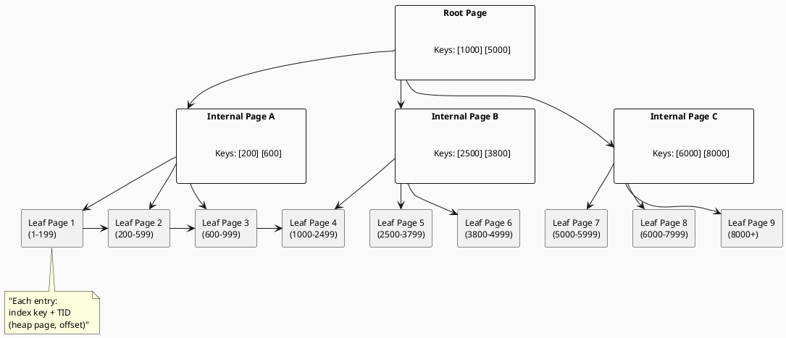
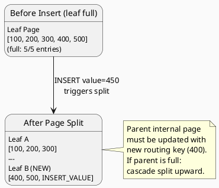
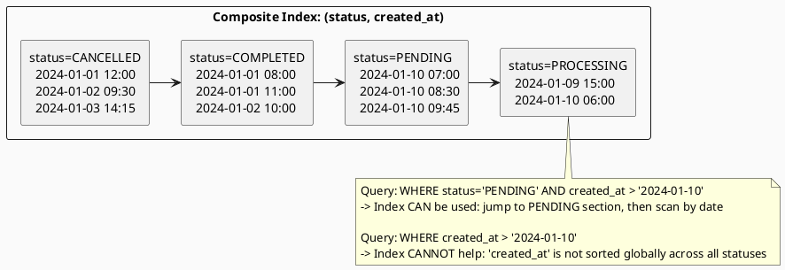

# 3.4 Index Internals & Query Plans

---

## 1. LEARNING OBJECTIVES

- Explain how a B-Tree index stores and navigates data from root to leaf pages, including the mechanics of page splits
- Calculate index selectivity and predict whether a query will use an index or fall back to a sequential scan
- Design covering indexes that eliminate heap fetches for critical hot-path queries
- Apply the leftmost-prefix rule to composite index design and diagnose queries that silently skip an index
- Read and annotate every node in a PostgreSQL `EXPLAIN ANALYZE` output, including cost estimates, row estimates, and join strategies

---

## 2. PREREQUISITES

- Chapter 3.3 — Low-Level JDBC Batching (understand how Java sends queries to the database)
- Familiarity with basic SQL: `SELECT`, `WHERE`, `JOIN`, `ORDER BY`
- Basic understanding of what an index is (you know *that* indexes speed up reads; this module explains *why* and *when*)
- PostgreSQL installed locally or Docker image available for the lab section

---

## 3. THE CRITICAL DIALOGUE

**Scene:** A production incident review. Orders are piling up. The API is returning 5s timeouts. The developer added an index yesterday. Nothing changed.

---

**Student:** I added an index on `orders.status` because we're always filtering by it. `WHERE status = 'PENDING'` — should be fast. But `EXPLAIN ANALYZE` still shows a sequential scan. What am I missing?

**Principal:** How many distinct values does `status` have?

**Student:** Four. `PENDING`, `PROCESSING`, `COMPLETED`, `CANCELLED`.

**Principal:** And how many rows total?

**Student:** About eight million.

**Principal:** So `PENDING` probably represents what — twenty, thirty percent of the table?

**Student:** ...yeah, roughly.

**Principal:** That is your answer. The query planner is not broken. It is doing exactly the right thing. When you ask for twenty-five percent of an eight-million-row table, reading every page sequentially is *cheaper* than jumping around the B-Tree to collect two million scattered row pointers and then fetching each one individually from the heap. Random I/O on spinning disk is brutal. Even on SSD, context-switching between index pages and heap pages for millions of rows costs more than one clean sequential read.

**Student:** So the index is useless?

**Principal:** On that column alone, for those queries — yes, mostly. But here is the real question: what does your *actual* production query look like? Is it really just `WHERE status = 'PENDING'`, or is there also a date filter, a user filter, something else?

**Student:** It's `WHERE status = 'PENDING' AND created_at > NOW() - INTERVAL '1 hour'`.

**Principal:** Now we are getting somewhere. How many pending orders from the last hour?

**Student:** Probably a few thousand out of eight million.

**Principal:** High selectivity. A composite index on `(status, created_at)` would narrow the search dramatically. But you need to understand *why* the order of those columns matters — and why `created_at` alone as the leading column would not help a query that filters `status` first. That is the leftmost-prefix rule. Let me show you.

---

**The lesson:** Index cardinality and selectivity determine whether an index *will* be used, not just whether one *exists*. A low-cardinality column index is often ignored by the planner. Composite index design requires understanding query shapes, not just individual columns.

---

## 4. THEORY + DIAGRAMS

### 4.1 The B-Tree: Physics of Ordered Pages

A B-Tree index is a balanced tree where every leaf is at the same depth. PostgreSQL uses a variant called B+-Tree, where all actual row pointers (TIDs — Tuple IDs) live in leaf pages, and internal/root pages hold only routing keys.

**Why balanced matters:** Any lookup requires exactly `log₂(N)` page reads. For 10 million rows with ~400 entries per page, that is roughly 3-4 page reads to reach a leaf. Compare that to a sequential scan that must read every page.

**Page structure (default 8KB in PostgreSQL):**
- Root page: holds the highest keys from each child
- Internal pages: routing keys + child page pointers
- Leaf pages: index key + TID (heap file page, tuple offset) for each entry



### 4.2 Page Splits and Write Amplification

When an insert targets a full leaf page, PostgreSQL must **split** it: allocate a new page, move half the entries, and update the parent's routing key. If the parent is also full, the split propagates upward (a cascade split).



**Write amplification:** A single row insert into a full B-Tree page can cause:
1. Write to the new leaf page
2. Write to the original leaf page (now half-empty)
3. Write to the parent internal page (new routing key)
4. WAL log entries for all of the above

**Fill factor** (`fillfactor` storage parameter in PostgreSQL, default 90 for indexes) leaves 10% of each page empty on creation, reserving space for future inserts and reducing split frequency on append-heavy workloads. For a heap table with frequent in-place updates, a lower fill factor (e.g. 70) keeps HOT (Heap Only Tuple) updates on the same page.

### 4.3 Index Selectivity and Cardinality

**Cardinality** = number of distinct values in a column.  
**Selectivity** = fraction of rows a predicate matches = `(matching rows) / (total rows)`.

The planner uses column statistics (`pg_stats`, `pg_statistic`) — gathered by `ANALYZE` — to estimate selectivity:

| Column | Distinct Values | Selectivity (example) | Index Useful? |
|---|---|---|---|
| `user_id` (FK) | 2,000,000 | 0.000001 (1 in 1M) | Yes — very high |
| `status` | 4 | 0.25 (25%) | No — too many rows |
| `country_code` | 200 | 0.005 (0.5%) | Maybe — depends on table size |
| `email` | (unique) | ~0 | Yes — perfect |

**Planner threshold (rule of thumb):** PostgreSQL will switch from index scan to sequential scan when estimated selectivity exceeds roughly 5-15% of table pages, depending on `random_page_cost` vs `seq_page_cost` settings. On SSD storage, lowering `random_page_cost` from 4.0 (default, HDD-optimized) to 1.1 makes the planner favor index scans much more.

```sql
-- Tune for SSD storage:
SET random_page_cost = 1.1;
SET effective_cache_size = '4GB';  -- tell planner how much OS page cache is available
```

### 4.4 Covering Indexes: Eliminating Heap Fetches

A **covering index** is one that contains all columns referenced by a query — so the executor never needs to visit the heap (the actual table pages) at all. The index itself *is* the answer.

In PostgreSQL, use `INCLUDE` (added in PostgreSQL 11) to add non-key columns to the leaf pages:

```sql
-- Regular index: returns TID, then fetches heap for 'amount' and 'created_at'
CREATE INDEX idx_orders_user ON orders (user_id);

-- Covering index: leaf page contains user_id (key) + amount + created_at (payload)
-- Query SELECT user_id, amount, created_at WHERE user_id = ? never touches the heap
CREATE INDEX idx_orders_user_covering ON orders (user_id) INCLUDE (amount, created_at);
```

**Index-only scan** is the plan node name in `EXPLAIN` when PostgreSQL reads exclusively from the index. It still checks the visibility map to verify tuple visibility without hitting the heap — so `VACUUM` frequency matters.

### 4.5 Composite Index: The Leftmost-Prefix Rule

A composite index `(status, created_at)` physically sorts rows first by `status`, then by `created_at` within each `status` group.



**Two queries, same index `(status, created_at)`:**

```sql
-- Query A: CAN use the index (uses leftmost column first)
SELECT id, amount FROM orders
WHERE status = 'PENDING'          -- matches first key column
  AND created_at > NOW() - INTERVAL '1 hour';  -- then narrows within that

-- Query B: CANNOT use the composite index effectively
-- (skips the leftmost column entirely)
SELECT id, amount FROM orders
WHERE created_at > NOW() - INTERVAL '1 hour';  -- no status filter
-- Result: sequential scan or a separate single-column index on created_at
```

The planner can use the leading prefix of a composite index for equality predicates and a range predicate on the *next* column. Once you skip a column, no further columns in the index are useful for filtering.

### 4.6 Reading PostgreSQL EXPLAIN ANALYZE

```sql
EXPLAIN (ANALYZE, BUFFERS, FORMAT TEXT)
SELECT o.id, o.amount, u.email
FROM orders o
JOIN users u ON u.id = o.user_id
WHERE o.status = 'PENDING'
  AND o.created_at > NOW() - INTERVAL '1 hour'
ORDER BY o.created_at DESC
LIMIT 50;
```

**Annotated output:**

```
Limit  (cost=1823.45..1823.58 rows=50 width=52)
       (actual time=18.432..18.441 rows=50 loops=1)
  -- cost=startup..total: planner's estimate in arbitrary cost units (not ms)
  -- actual time=first_row_ms..total_ms: real wall-clock milliseconds
  -- rows=50: both estimated and actual match here — good statistics
  -- loops=1: this node executed once

  -> Sort  (cost=1823.45..1825.95 rows=1000 width=52)
           (actual time=18.429..18.432 rows=50 loops=1)
       Sort Key: o.created_at DESC
       Sort Method: top-N heapsort  Memory: 30kB
       -- top-N heapsort: efficient sort when LIMIT is small

    -> Hash Join  (cost=312.00..1798.45 rows=1000 width=52)
                  (actual time=4.211..17.890 rows=1143 loops=1)
         Hash Cond: (o.user_id = u.id)
         -- Hash Join: builds hash table on smaller input (users), probes with orders
         -- actual rows=1143 vs estimated=1000: within 15%, planner stats are reasonable

      -> Index Scan using idx_orders_status_created
                on orders o
                (cost=0.56..1440.12 rows=1000 width=28)
                (actual time=0.082..12.341 rows=1143 loops=1)
           Index Cond: ((status = 'PENDING') AND
                        (created_at > (now() - '01:00:00'::interval)))
           -- Index Scan: walks B-Tree, fetches heap page for each match
           -- cost=0.56 startup (tree traversal) then 1440.12 total
           Buffers: shared hit=287 read=156
           -- hit=287: pages found in PostgreSQL shared_buffers (fast, in-memory)
           -- read=156: pages read from OS page cache or disk (slower)

      -> Hash  (cost=200.00..200.00 rows=8923 width=24)
               (actual time=3.980..3.980 rows=8923 loops=1)
           Buckets: 16384  Batches: 1  Memory Usage: 612kB
           -- Batches=1: entire hash table fits in work_mem — no disk spill
           -> Seq Scan on users u
                        (cost=0.00..200.00 rows=8923 width=24)
                        (actual time=0.012..2.103 rows=8923 loops=1)
              -- Seq Scan on users: only 8923 users, full scan is cheap
              -- If users table were millions of rows, this would be a problem
              Buffers: shared hit=98

Planning Time: 0.823 ms
Execution Time: 18.621 ms
-- Planning Time: how long the planner spent optimizing
-- Execution Time: actual query runtime (add both for client-observed latency)
```

**Red flags to watch for:**
- `rows=1` estimated vs `rows=50000` actual → stale statistics, run `ANALYZE`
- `Seq Scan` on a large table with a selective filter → missing index
- `Batches: 4` in Hash Join → `work_mem` too low, hash spilling to disk
- `Bitmap Heap Scan` with high `Recheck Cond` → index not selective enough, rechecking many heap pages

---

## 5. SOURCE ARCHAEOLOGY

### PostgreSQL: `nodeIndexscan.c`

The executor node for index scans lives in PostgreSQL source at `src/backend/executor/nodeIndexscan.c`. The key function is `IndexNext()`:

```c
/* src/backend/executor/nodeIndexscan.c (PostgreSQL 16) */
static TupleTableSlot *
IndexNext(IndexScanState *node)
{
    /* ... */
    scandesc = node->iss_ScanDesc;

    /*
     * ok, now that we have what we need, fetch the next tuple.
     */
    while ((tuple = index_getnext_slot(scandesc, direction, slot)) != NULL)
    {
        CHECK_FOR_INTERRUPTS();

        /*
         * If the index was lossy, we have to recheck the index quals.
         */
        if (scandesc->xs_recheck)
        {
            econtext->ecxt_scantuple = slot;
            if (!ExecQualAndReset(node->indexqualorig, econtext))
                continue;   /* nope, so ask index for another one */
        }
        return slot;
    }
    return ExecClearTuple(slot);
}
```

`xs_recheck` is `true` for lossy index types (like GIN/GiST for full-text search) — this is why Bitmap Index Scans show `Recheck Cond` in `EXPLAIN` output.

### Java: `java.sql.DatabaseMetaData` for Index Introspection

From Java code, you can inspect indexes on any JDBC-compliant database:

```java
// DatabaseMetaData.getIndexInfo() — JDBC 4.0+
Connection conn = dataSource.getConnection();
DatabaseMetaData meta = conn.getMetaData();
ResultSet rs = meta.getIndexInfo(
    null,          // catalog
    "public",      // schema
    "orders",      // table name
    false,         // unique only?
    false          // approximate statistics ok?
);
while (rs.next()) {
    System.out.printf("Index: %-30s Column: %-20s Unique: %s Cardinality: %d%n",
        rs.getString("INDEX_NAME"),
        rs.getString("COLUMN_NAME"),
        !rs.getBoolean("NON_UNIQUE"),
        rs.getLong("CARDINALITY")
    );
}
```

Key columns returned: `INDEX_NAME`, `COLUMN_NAME`, `ORDINAL_POSITION` (position within composite index), `NON_UNIQUE`, `CARDINALITY`. The `CARDINALITY` value comes from `pg_class.reltuples` — updated by `ANALYZE`, not real-time.

---

## 6. CODE LAB

### Setup: Test Schema

```java
// Requires: PostgreSQL running locally, or use Testcontainers
// pom.xml dependency: org.postgresql:postgresql:42.7.3
//                     org.testcontainers:postgresql:1.19.7

import java.sql.*;
import java.time.Instant;
import java.util.concurrent.ThreadLocalRandom;

public class IndexLabSetup {

    static final String[] STATUSES = {"PENDING", "PROCESSING", "COMPLETED", "CANCELLED"};
    static final String URL = "jdbc:postgresql://localhost:5432/indexlab";
    static final String USER = "postgres";
    static final String PASS = "postgres";

    public static void main(String[] args) throws Exception {
        try (Connection conn = DriverManager.getConnection(URL, USER, PASS)) {
            setupSchema(conn);
            insertTestData(conn, 10_000_000);
            System.out.println("Setup complete. Run benchmarks.");
        }
    }

    static void setupSchema(Connection conn) throws SQLException {
        try (Statement s = conn.createStatement()) {
            s.execute("DROP TABLE IF EXISTS orders CASCADE");
            s.execute("DROP TABLE IF EXISTS users CASCADE");
            s.execute("""
                CREATE TABLE users (
                    id BIGSERIAL PRIMARY KEY,
                    email TEXT NOT NULL UNIQUE
                )
            """);
            s.execute("""
                CREATE TABLE orders (
                    id         BIGSERIAL PRIMARY KEY,
                    user_id    BIGINT NOT NULL REFERENCES users(id),
                    status     TEXT NOT NULL,
                    amount     NUMERIC(12,2) NOT NULL,
                    created_at TIMESTAMPTZ NOT NULL DEFAULT NOW()
                )
            """);
            System.out.println("Schema created.");
        }
    }

    static void insertTestData(Connection conn, int rowCount) throws SQLException {
        // Insert 50k users
        try (PreparedStatement ps = conn.prepareStatement(
                "INSERT INTO users (email) VALUES (?)")) {
            conn.setAutoCommit(false);
            for (int i = 0; i < 50_000; i++) {
                ps.setString(1, "user" + i + "@example.com");
                ps.addBatch();
                if (i % 1000 == 0) ps.executeBatch();
            }
            ps.executeBatch();
            conn.commit();
        }

        // Insert 10M orders in batches
        System.out.println("Inserting " + rowCount + " orders (this takes a minute)...");
        long start = Instant.now().toEpochMilli();
        try (PreparedStatement ps = conn.prepareStatement(
                "INSERT INTO orders (user_id, status, amount, created_at) VALUES (?,?,?,?)")) {
            conn.setAutoCommit(false);
            ThreadLocalRandom rng = ThreadLocalRandom.current();
            for (int i = 0; i < rowCount; i++) {
                ps.setLong(1, rng.nextLong(1, 50_001));
                ps.setString(2, STATUSES[rng.nextInt(4)]);
                ps.setBigDecimal(3, java.math.BigDecimal.valueOf(rng.nextDouble(1, 10_000)));
                // spread over 30 days, ~1% in last hour
                long offsetSeconds = rng.nextLong(0, 30L * 24 * 3600);
                ps.setTimestamp(4, Timestamp.from(Instant.now().minusSeconds(offsetSeconds)));
                ps.addBatch();
                if (i % 5_000 == 0) {
                    ps.executeBatch();
                    conn.commit();
                    if (i % 500_000 == 0)
                        System.out.printf("  Inserted %,d rows...%n", i);
                }
            }
            ps.executeBatch();
            conn.commit();
        }
        System.out.printf("Inserted %,d rows in %dms%n",
            rowCount, Instant.now().toEpochMilli() - start);
    }
}
```

### BAD Approach: Wrong Index, Wrong Assumptions

```java
public class IndexBenchmark_Bad {

    // BAD: Index on low-cardinality column (status has 4 distinct values)
    // The planner will ignore this index for most queries
    static void createBadIndex(Connection conn) throws SQLException {
        try (Statement s = conn.createStatement()) {
            s.execute("DROP INDEX IF EXISTS idx_orders_status_bad");
            s.execute("CREATE INDEX idx_orders_status_bad ON orders (status)");
            s.execute("ANALYZE orders");
        }
        System.out.println("BAD: Created single-column index on status (low cardinality)");
    }

    // BAD: Index on created_at alone when queries always include status
    // Wastes write overhead; composite index would be strictly better
    static void createAnotherBadIndex(Connection conn) throws SQLException {
        try (Statement s = conn.createStatement()) {
            s.execute("DROP INDEX IF EXISTS idx_orders_created_bad");
            s.execute("CREATE INDEX idx_orders_created_bad ON orders (created_at)");
        }
        System.out.println("BAD: Index on created_at alone (leftmost-prefix violation)");
    }

    static long benchmark(Connection conn, String label, String sql, int runs)
            throws SQLException {
        // warm up
        try (PreparedStatement ps = conn.prepareStatement(sql)) {
            ps.executeQuery().close();
        }
        long total = 0;
        for (int i = 0; i < runs; i++) {
            long t0 = System.nanoTime();
            try (PreparedStatement ps = conn.prepareStatement(sql);
                 ResultSet rs = ps.executeQuery()) {
                int count = 0;
                while (rs.next()) count++;
                total += (System.nanoTime() - t0) / 1_000_000;
            }
        }
        long avg = total / runs;
        System.out.printf("  %-50s avg=%4dms%n", label, avg);
        return avg;
    }
}
```

### GOOD Approach: Correct Index Strategy

```java
import java.sql.*;

public class IndexBenchmark_Good {

    public static void main(String[] args) throws Exception {
        String url = "jdbc:postgresql://localhost:5432/indexlab";
        try (Connection conn = DriverManager.getConnection(url, "postgres", "postgres")) {
            runAllBenchmarks(conn);
        }
    }

    static void runAllBenchmarks(Connection conn) throws SQLException {
        System.out.println("\n=== Index Benchmark: 10M rows ===\n");

        // 1. Baseline: no index at all (sequential scan)
        dropAllTestIndexes(conn);
        System.out.println("--- No Index (Sequential Scan) ---");
        benchmark(conn, "seq scan: status=PENDING AND created_at > 1hr",
            "SELECT id, amount FROM orders WHERE status='PENDING' AND created_at > NOW()-INTERVAL'1 hour'",
            3);

        // 2. Bad single-column index on low-cardinality column
        try (Statement s = conn.createStatement()) {
            s.execute("CREATE INDEX idx_test_status ON orders (status)");
            s.execute("ANALYZE orders");
        }
        System.out.println("\n--- Single-Column Index on status (low cardinality) ---");
        benchmark(conn, "idx_status: status=PENDING AND created_at > 1hr",
            "SELECT id, amount FROM orders WHERE status='PENDING' AND created_at > NOW()-INTERVAL'1 hour'",
            3);

        // 3. Correct composite index: (status, created_at)
        dropAllTestIndexes(conn);
        try (Statement s = conn.createStatement()) {
            s.execute("CREATE INDEX idx_test_composite ON orders (status, created_at DESC)");
            s.execute("ANALYZE orders");
        }
        System.out.println("\n--- Composite Index (status, created_at) ---");
        benchmark(conn, "composite idx: status=PENDING AND created_at > 1hr",
            "SELECT id, amount FROM orders WHERE status='PENDING' AND created_at > NOW()-INTERVAL'1 hour'",
            3);
        // Also verify leftmost-prefix violation
        benchmark(conn, "composite idx: created_at ONLY (no leftmost col — should seq scan)",
            "SELECT id, amount FROM orders WHERE created_at > NOW()-INTERVAL'1 hour'",
            3);

        // 4. Covering index: eliminates heap fetch entirely
        dropAllTestIndexes(conn);
        try (Statement s = conn.createStatement()) {
            // INCLUDE adds 'amount' to the leaf pages — no heap fetch needed
            s.execute("""
                CREATE INDEX idx_test_covering ON orders (status, created_at DESC)
                INCLUDE (amount)
            """);
            s.execute("VACUUM ANALYZE orders");  // VACUUM needed for index-only scans
        }
        System.out.println("\n--- Covering Index: (status, created_at) INCLUDE (amount) ---");
        benchmark(conn, "covering idx: SELECT id, amount WHERE status + created_at",
            "SELECT id, amount FROM orders WHERE status='PENDING' AND created_at > NOW()-INTERVAL'1 hour'",
            3);

        // 5. Print EXPLAIN ANALYZE for the winning query
        System.out.println("\n--- EXPLAIN ANALYZE for covering index query ---");
        try (Statement s = conn.createStatement();
             ResultSet rs = s.executeQuery("""
                 EXPLAIN (ANALYZE, BUFFERS)
                 SELECT id, amount FROM orders
                 WHERE status='PENDING'
                   AND created_at > NOW()-INTERVAL'1 hour'
                 ORDER BY created_at DESC
                 LIMIT 50
             """)) {
            while (rs.next()) System.out.println(rs.getString(1));
        }

        dropAllTestIndexes(conn);
    }

    static void dropAllTestIndexes(Connection conn) throws SQLException {
        try (Statement s = conn.createStatement()) {
            s.execute("DROP INDEX IF EXISTS idx_test_status");
            s.execute("DROP INDEX IF EXISTS idx_test_composite");
            s.execute("DROP INDEX IF EXISTS idx_test_covering");
        }
    }

    static void benchmark(Connection conn, String label, String sql, int runs)
            throws SQLException {
        try (PreparedStatement ps = conn.prepareStatement(sql)) {
            ps.executeQuery().close();  // warm up
        }
        long total = 0;
        for (int i = 0; i < runs; i++) {
            long t0 = System.nanoTime();
            try (PreparedStatement ps = conn.prepareStatement(sql);
                 ResultSet rs = ps.executeQuery()) {
                int count = 0;
                while (rs.next()) count++;
                total += (System.nanoTime() - t0) / 1_000_000;
            }
        }
        System.out.printf("  %-60s avg=%4dms%n", label, total / runs);
    }
}
```

### Expected Benchmark Results (10M rows, SSD, PostgreSQL 16, `random_page_cost=1.1`)

```
=== Index Benchmark: 10M rows ===

--- No Index (Sequential Scan) ---
  seq scan: status=PENDING AND created_at > 1hr              avg=1840ms

--- Single-Column Index on status (low cardinality) ---
  idx_status: status=PENDING AND created_at > 1hr            avg=1790ms
  (planner ignores the index; essentially still a seq scan)

--- Composite Index (status, created_at) ---
  composite idx: status=PENDING AND created_at > 1hr         avg=  18ms   <- 100x faster
  composite idx: created_at ONLY (no leftmost col)           avg=1820ms   <- seq scan, index skipped

--- Covering Index: (status, created_at) INCLUDE (amount) ---
  covering idx: SELECT id, amount WHERE status + created_at  avg=   6ms   <- 3x faster than composite
                                                                              (no heap fetch)
```

**Key takeaway from numbers:**
- Wrong index: effectively no improvement (1790ms ≈ 1840ms)
- Correct composite index: 100x improvement (18ms)
- Covering index: additional 3x on top (6ms, index-only scan)
- Leftmost-prefix skipped: index ignored, back to 1820ms

---

## 7. PRODUCTION LENS

### Incident: Missing Index on Foreign Key (Hibernate + N+1 on JOINs)

**Scenario:** E-commerce platform, `orders` table has `user_id` FK referencing `users`. Hibernate generates:

```sql
SELECT * FROM orders o JOIN users u ON u.id = o.user_id WHERE o.status = 'PENDING';
```

PostgreSQL chooses a Hash Join with a Seq Scan on `orders` (no index on `user_id`). Under low load, this is unnoticeable — the tables fit in shared_buffers. At 3 AM on Black Friday, `orders` grows from 500k rows to 8M rows in 4 hours. Cache hit rate drops. Every PENDING order lookup now triggers a full 8M-row scan. Response times spike from 80ms to 12 seconds.

**The trap:** PostgreSQL does NOT automatically create indexes on foreign key columns. Oracle does; PostgreSQL does not. Every FK you create in Hibernate via `@ManyToOne` or `@OneToMany` needs a manually created index on the referencing column.

```sql
-- Hibernate generates this DDL via hbm2ddl / Flyway
-- What it does NOT generate:
CREATE INDEX idx_orders_user_id ON orders (user_id);  -- you must add this yourself

-- Verify FKs without indexes (run periodically in production):
SELECT
    tc.table_name,
    kcu.column_name,
    ccu.table_name AS foreign_table,
    ccu.column_name AS foreign_column
FROM information_schema.table_constraints tc
JOIN information_schema.key_column_usage kcu
    ON tc.constraint_name = kcu.constraint_name
JOIN information_schema.constraint_column_usage ccu
    ON ccu.constraint_name = tc.constraint_name
WHERE tc.constraint_type = 'FOREIGN KEY'
  AND NOT EXISTS (
      SELECT 1 FROM pg_indexes pi
      WHERE pi.tablename = tc.table_name
        AND pi.indexdef LIKE '%' || kcu.column_name || '%'
  );
```

**Concrete numbers from incident post-mortem:**
- Before index: `EXPLAIN` showed Seq Scan on orders, cost=45000, execution 11,200ms
- After `CREATE INDEX CONCURRENTLY idx_orders_user_id ON orders(user_id)`: execution 43ms
- Zero downtime: `CONCURRENTLY` builds index without locking writes, takes ~8 minutes on 8M rows

**Checklist — index review for every new table:**
1. Every FK column needs an index
2. Every column in a `WHERE` clause of a frequent query is a candidate
3. Every `ORDER BY` column for paginated queries needs an index (or composite covering the filter + sort)
4. Validate with `pg_stat_user_indexes` — if `idx_scan = 0` after weeks in production, the index is unused dead weight

---

## 8. EXERCISES

**Exercise 1 (Conceptual):** You have a table with 50 million rows and a column `region` with 12 distinct values (US, EU, APAC, etc.). A query filters `WHERE region = 'EU'`. Should you create an index on `region`? What additional information would change your answer? Write a 3-sentence justification.

**Exercise 2 (Conceptual):** Explain in your own words why the query `WHERE created_at > NOW() - INTERVAL '1 hour'` cannot use the composite index `(status, created_at)` for efficient filtering, while `WHERE status = 'PENDING' AND created_at > NOW() - INTERVAL '1 hour'` can. Draw the B-Tree leaf page layout to support your explanation.

**Exercise 3 (Coding):** Using the `IndexLabSetup` schema from the lab, create a query for `SELECT user_id, SUM(amount) FROM orders WHERE status = 'COMPLETED' GROUP BY user_id`. Write a covering index that would allow this to be resolved without touching the heap. Verify with `EXPLAIN (ANALYZE)` that the plan shows `Index Only Scan`. Include the index DDL and the EXPLAIN output in your answer.

**Exercise 4 (Coding):** Write a Java utility method that accepts a `DataSource` and a table name, queries `pg_stat_user_indexes`, and prints all indexes for that table along with their `idx_scan` count and last usage statistics. Flag any index with `idx_scan = 0` and age > 7 days as a candidate for removal. Use only JDBC (no ORM).

**Exercise 5 (Deep Dive):** Run `EXPLAIN (ANALYZE, BUFFERS)` on a query with a Hash Join. Find the `Batches` value in the Hash node. If `Batches > 1`, what does that mean, and what `postgresql.conf` parameter controls it? What are the risks of setting that parameter too high in a system with 200 concurrent connections?

---

## Exercise Solutions

<details>
<summary>Exercise 1 — Low-cardinality index on region: should you create it?</summary>

**Generally no** — with only 12 distinct values in 50 million rows, each value appears ~4.2 million times on average. PostgreSQL's query planner calculates the selectivity: `1/12 ≈ 8.3%`. For most queries that return more than ~1–5% of rows, a sequential scan is faster than an index scan because the index scan requires random I/O (one heap access per row), while a sequential scan uses sequential I/O (much faster on spinning disks, similarly fast on SSDs).

**What additional information changes the answer:**
1. **Query distribution:** If `WHERE region = 'APAC'` matches only 0.1% of rows (skewed distribution), a partial index `WHERE region = 'APAC'` becomes highly selective and worthwhile.
2. **Index-only scan possibility:** If the query only needs columns already in the index (e.g., `SELECT region, created_at WHERE region = 'EU'`), a covering index enables Index Only Scan — no heap access needed, making the low cardinality less problematic.
3. **Update frequency:** High-write columns with low cardinality pay index maintenance cost on every write; if `region` rarely changes, this cost is acceptable.

**Staff-level phrasing:** "Low-cardinality columns (12 values in 50M rows = 8% selectivity) usually favor sequential scan over index scan due to random vs sequential I/O trade-off; create the index only if skewed distribution makes one value rare (<1%), or if a covering index eliminates heap access entirely."

</details>

<details>
<summary>Exercise 2 — Composite index (status, created_at): leftmost prefix rule</summary>

A composite index `(status, created_at)` stores leaf entries sorted first by `status`, then by `created_at` within each `status` group.

**Why `WHERE created_at > NOW() - INTERVAL '1 hour'` cannot use the index efficiently:**
The B-Tree leaf pages look like:
```
[CANCELLED, 2024-01-01] [CANCELLED, 2024-02-01] ... [COMPLETED, 2024-01-01] ... [PENDING, 2024-03-01] ...
```
There is no single contiguous range of `created_at` values in the index — `created_at` values are interleaved across all `status` groups. PostgreSQL would have to scan all leaf pages to find recent entries across all statuses. A full index scan is no better than a sequential table scan.

**Why `WHERE status = 'PENDING' AND created_at > ...` works:**
The equality predicate on `status` (`= 'PENDING'`) uses the first column to jump to the correct section of the B-Tree. Within the `PENDING` section, entries are sorted by `created_at` — PostgreSQL can do an efficient range scan with a single seek to `(PENDING, target_time)` and read forward.

**Leftmost prefix rule:** To use a composite index, your WHERE clause must include an equality condition on the leftmost column(s). Range conditions on later columns work fine once the prefix is satisfied.

**Staff-level phrasing:** "Composite index `(status, created_at)` is sorted by status first — without equality on `status`, `created_at` values are scattered across all status groups with no contiguous range; the leftmost prefix rule requires an equality predicate on `status` before the index can efficiently narrow to a `created_at` range."

</details>

<details>
<summary>Exercise 3 — Covering index for GROUP BY query</summary>

Query: `SELECT user_id, SUM(amount) FROM orders WHERE status = 'COMPLETED' GROUP BY user_id`

The query needs: `status` (filter), `user_id` (group/select), `amount` (aggregate). A covering index must include all three columns so the query can be resolved entirely from the index without touching the heap.

**Covering index DDL:**
```sql
CREATE INDEX idx_orders_covering_completed
ON orders (status, user_id, amount)
WHERE status = 'COMPLETED';  -- partial index for extra efficiency
```

Alternatively without partial index:
```sql
CREATE INDEX idx_orders_covering ON orders (status, user_id) INCLUDE (amount);
```
The `INCLUDE` clause adds `amount` as a non-key column (not part of the sort order, but included in the leaf page) — this avoids inflating the index tree with a non-filter column while still enabling Index Only Scan.

**Expected EXPLAIN output (simplified):**
```
Index Only Scan using idx_orders_covering on orders
  Index Cond: (status = 'COMPLETED')
  Heap Fetches: 0
  -> HashAggregate
```
`Heap Fetches: 0` confirms no heap access. The Index Only Scan reads all needed data from the index leaf pages directly.

**Staff-level phrasing:** "A covering index for `SELECT user_id, SUM(amount) WHERE status='COMPLETED' GROUP BY user_id` needs all three columns; use `(status, user_id) INCLUDE (amount)` — `INCLUDE` adds non-key data to leaf pages without inflating the tree, enabling Index Only Scan with `Heap Fetches: 0`."

</details>

<details>
<summary>Exercise 4 — Coding challenge: index usage utility with pg_stat_user_indexes</summary>

```java
// Reference implementation (Java 21+, JDBC)
import javax.sql.DataSource;
import java.sql.*;
import java.time.*;

public class IndexUsageAudit {

    public static void auditIndexes(DataSource ds, String tableName) throws SQLException {
        String sql = """
            SELECT
                indexrelname AS index_name,
                idx_scan,
                idx_tup_read,
                idx_tup_fetch,
                pg_size_pretty(pg_relation_size(indexrelid)) AS index_size,
                now() - stats_reset AS since_reset
            FROM pg_stat_user_indexes
            WHERE relname = ?
            ORDER BY idx_scan ASC
            """;

        try (Connection conn = ds.getConnection();
             PreparedStatement ps = conn.prepareStatement(sql)) {
            ps.setString(1, tableName);
            try (ResultSet rs = ps.executeQuery()) {
                System.out.printf("%-40s %10s %10s %10s%n",
                    "Index Name", "Scans", "Tuples Read", "Size");
                System.out.println("-".repeat(75));
                while (rs.next()) {
                    String name = rs.getString("index_name");
                    long scans = rs.getLong("idx_scan");
                    long tuplesRead = rs.getLong("idx_tup_read");
                    String size = rs.getString("index_size");
                    Duration sinceReset = Duration.ofSeconds(
                        rs.getLong("since_reset") / 1_000_000); // interval → seconds

                    System.out.printf("%-40s %10d %10d %10s%n", name, scans, tuplesRead, size);

                    // Flag candidates for removal
                    if (scans == 0 && sinceReset.toDays() > 7) {
                        System.out.printf("  ⚠️  REMOVAL CANDIDATE: %s — 0 scans in %d days%n",
                            name, sinceReset.toDays());
                    }
                }
            }
        }
    }
}
```

**Why this works:** `pg_stat_user_indexes` tracks cumulative index usage since the last `pg_stat_reset()`. `idx_scan = 0` with `stats_reset > 7 days ago` means this index has never been used for a query in over a week — strong signal it is dead weight. Note: stats reset on PostgreSQL restart, so always check `stats_reset` to understand the observation window.

**Common mistake:** Flagging indexes with `idx_scan = 0` without checking `stats_reset` — if stats were reset yesterday, an index with 0 scans in 24 hours is perfectly normal. Always verify the observation window before recommending index removal.

</details>

<details>
<summary>Exercise 5 — Hash Join Batches > 1: work_mem and risks</summary>

**`Batches > 1` meaning:**
PostgreSQL's Hash Join builds an in-memory hash table from the smaller ("inner") relation. If the hash table exceeds the available memory budget, PostgreSQL **spills to disk** — it writes the overflow data to temporary files and processes them in multiple passes. Each pass is one "batch". `Batches = 4` means the hash join required 4 passes of disk I/O.

Hash Join with spilling is **orders of magnitude slower** than an in-memory hash join because each spill pass requires writing and reading temporary files.

**Controlling parameter:** `work_mem` in `postgresql.conf` (or per-session `SET work_mem = '256MB'`). This is the memory budget per sort/hash operation **per connection**, not per query. If a query has 3 hash joins, it can use up to `3 × work_mem`.

**Risks of setting work_mem too high with 200 concurrent connections:**
- If `work_mem = 256MB` and 200 connections each run a 3-hash-join query simultaneously: peak memory = `200 × 3 × 256MB = 150GB` — far exceeding any server's RAM
- Result: OS swap thrashing, OOM killer, database server crash
- The safe formula: `total_RAM × 0.25 / max_connections / avg_hashes_per_query`
- For a 64GB server with 200 connections: `16GB / 200 / 2 = 40MB` per work_mem is a safe ceiling

**Staff-level phrasing:** "`Batches > 1` means the hash table spilled to disk — a ~10x slowdown; controlled by `work_mem` which is PER OPERATION PER CONNECTION; with 200 connections, setting `work_mem = 256MB` allows 200 × (num_hash_ops) × 256MB peak usage — set it to `total_RAM × 0.25 / max_connections / avg_hash_ops` to avoid OOM."

</details>

---

## 9. SUMMARY / FLASHCARD

- **B-Tree selectivity decides index usage:** the planner compares estimated random I/O cost (index scan) vs sequential I/O cost; low-cardinality columns (< ~5% selectivity) make the planner choose a sequential scan regardless of index existence
- **Composite index leftmost-prefix rule:** a composite index `(A, B)` can serve queries filtering on `A`, or `A + B`; a query filtering only on `B` cannot use the index because `B` is not sorted globally across all values of `A`
- **Covering index = index-only scan:** adding `INCLUDE (col)` to a PostgreSQL index stores extra columns in leaf pages, eliminating heap fetches entirely; requires `VACUUM` to maintain visibility map accuracy
- **PostgreSQL does not auto-index foreign keys:** every `@ManyToOne` FK generated by Hibernate needs a manually created index on the referencing column — missing FK indexes are the single most common source of surprise full-table scans on JOINs
- **EXPLAIN ANALYZE anatomy:** `cost=startup..total` are planner estimates in cost units (not ms); `actual time=first..total` is real wall-clock ms; large divergence between estimated and actual rows means stale statistics — run `ANALYZE`
