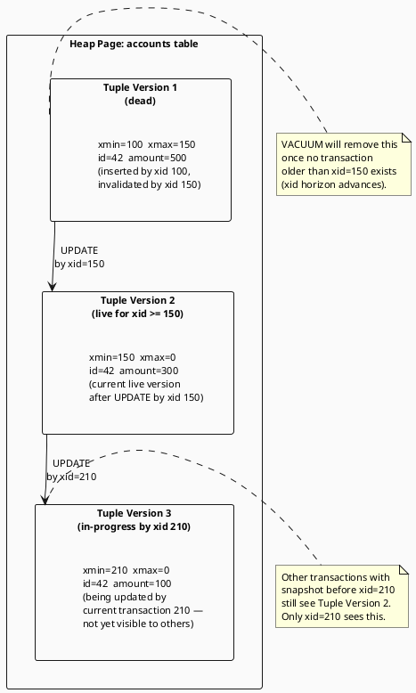

# 3.5 Transaction Isolation & MVCC

---

## 1. LEARNING OBJECTIVES

- Identify the four SQL isolation levels and the specific anomalies each one prevents or permits
- Construct two-thread concurrent transaction timelines that demonstrate dirty read, non-repeatable read, and phantom read
- Explain PostgreSQL MVCC internals: how `xmin`/`xmax` system columns version rows and how `VACUUM` reclaims dead tuples
- Diagnose double-spend and balance-inconsistency bugs caused by insufficient isolation and apply the correct fix
- Evaluate the throughput cost of each isolation level with concrete transactions-per-second benchmarks under write contention

---

## 2. PREREQUISITES

- Chapter 3.3 — Low-Level JDBC Batching (understand transaction commit/rollback at the JDBC level)
- Chapter 3.4 — Index Internals & Query Plans (understand heap pages and tuple storage)
- Basic understanding of SQL transactions: `BEGIN`, `COMMIT`, `ROLLBACK`
- Familiarity with Spring `@Transactional` annotation (conceptually; deep-dive in Chapter 2)

---

## 3. THE CRITICAL DIALOGUE

**Scene:** Post-mortem call. A fintech startup processed $47,000 in duplicate payments over a weekend. The developer swears the code has a balance check before every transfer.

---

**Student:** I don't understand how the double-spend happened. We check the balance before deducting it. The logic is: read balance, if balance >= amount then deduct. I even wrote a unit test for it.

**Principal:** Show me the transaction isolation level on that query.

**Student:** We're using Spring's default. So... whatever Hibernate uses by default. I think it's fine.

**Principal:** Spring's default is whatever the database driver default is. PostgreSQL's driver default is Read Committed. Now let me ask you this: what happens if two payment requests for the same account arrive at exactly the same millisecond?

**Student:** We check the balance first, so—

**Principal:** Thread A reads balance: $100. Thread B reads balance: $100. Thread A sees $100, decides to proceed, deducts $80, commits. Thread B also saw $100 — before Thread A committed — so it also decides to proceed, deducts $70. Now the balance is $100 - $80 - $70 = negative $50. But your check passed in both threads. Both checks ran *before* either commit was visible to the other.

**Student:** But wouldn't a database lock prevent that?

**Principal:** Read Committed takes a lock when it *writes*, not when it *reads*. The read that drove your decision — `SELECT balance FROM accounts WHERE id = ?` — was not inside any lock. By the time your `UPDATE` ran, the world had changed. Your decision was based on stale data.

**Student:** So we needed a higher isolation level?

**Principal:** Or a `SELECT FOR UPDATE`, which explicitly locks the row during the read. That is the surgical fix. The isolation-level fix is using Serializable or Repeatable Read. The trade-off is throughput — I will show you the numbers. But first: understand *why* Read Committed is the default. It is a deliberate choice by database designers to maximize concurrency. Most reads do not drive financial decisions. Charging a high isolation cost on every transaction in the system because 2% of them touch account balances is wasteful. You need to make the isolation level an explicit, intentional decision for each transaction, not a system-wide default you never questioned.

---

**The lesson:** Isolation levels are not just an academic taxonomy. "Default is fine" is a financial liability. Every transaction that reads data to make a write decision must declare its isolation requirements explicitly.

---

## 4. THEORY + DIAGRAMS

### 4.1 The Four Isolation Levels

The SQL standard defines four isolation levels as a hierarchy of guarantees. Higher levels prevent more anomalies but cost more throughput due to additional locking or conflict detection.

| Isolation Level | Dirty Read | Non-Repeatable Read | Phantom Read |
|---|---|---|---|
| Read Uncommitted | Possible | Possible | Possible |
| Read Committed | Prevented | Possible | Possible |
| Repeatable Read | Prevented | Prevented | Possible (in SQL standard; prevented in PostgreSQL) |
| Serializable | Prevented | Prevented | Prevented |

> PostgreSQL note: PostgreSQL's Repeatable Read also prevents phantom reads because MVCC snapshots are taken at transaction start. The SQL standard only requires preventing them at Serializable level, but PostgreSQL's implementation goes further.

### 4.2 The Three Anomalies — Concurrent Transaction Timelines

**Anomaly 1: Dirty Read**  
T2 reads T1's uncommitted change. If T1 rolls back, T2 acted on data that never existed.

```
Time │  Transaction T1 (transfer)        │  Transaction T2 (audit)
─────┼────────────────────────────────────┼─────────────────────────────────────
 t1  │  BEGIN                             │
 t2  │  UPDATE balance SET amount=0       │  (balance was 100)
     │  WHERE account_id=42               │
 t3  │                                    │  BEGIN
 t4  │  (not yet committed)               │  SELECT amount FROM balance
     │                                    │  WHERE account_id=42
     │                                    │  -- DIRTY READ: sees 0 (T1 not committed)
     │                                    │  -- T2 now logs "account 42 has $0"
 t5  │  ROLLBACK (e.g., network error)    │
     │  -- balance is back to 100!        │
 t6  │                                    │  COMMIT
     │                                    │  -- Audit log says $0. Reality: $100.
```

**Prevention:** Read Committed and above. T2's SELECT waits for T1 to commit or rollback before returning a value (in PostgreSQL: MVCC gives T2 the last committed version, no waiting required).

---

**Anomaly 2: Non-Repeatable Read**  
T1 reads the same row twice. Between the two reads, T2 commits an update. T1 sees different values.

```
Time │  Transaction T1 (report)           │  Transaction T2 (payment processor)
─────┼────────────────────────────────────┼─────────────────────────────────────
 t1  │  BEGIN                             │
 t2  │  SELECT amount FROM balance        │
     │  WHERE account_id=42               │
     │  -- sees: 500                      │
 t3  │                                    │  BEGIN
 t4  │                                    │  UPDATE balance SET amount=amount-200
     │                                    │  WHERE account_id=42
 t5  │                                    │  COMMIT  -- amount is now 300
 t6  │  (some calculation using 500...)   │
 t7  │  SELECT amount FROM balance        │
     │  WHERE account_id=42               │
     │  -- sees: 300  <-- different!      │
     │  -- Report is internally           │
     │     inconsistent.                  │
 t8  │  COMMIT                            │
```

**Prevention:** Repeatable Read and above. T1 takes a snapshot at transaction start; all reads within the transaction see the same consistent view.

---

**Anomaly 3: Phantom Read**  
T1 executes the same range query twice. Between the reads, T2 inserts new rows that match the range. T1 sees different result sets.

```
Time │  Transaction T1 (compliance check) │  Transaction T2 (new order)
─────┼────────────────────────────────────┼─────────────────────────────────────
 t1  │  BEGIN                             │
 t2  │  SELECT COUNT(*) FROM orders       │
     │  WHERE user_id=99                  │
     │  AND amount > 10000                │
     │  -- sees: 2 orders (triggers no    │
     │     alert, threshold is 3)         │
 t3  │                                    │  BEGIN
 t4  │                                    │  INSERT INTO orders
     │                                    │  (user_id, amount) VALUES (99, 15000)
 t5  │                                    │  COMMIT
 t6  │  SELECT COUNT(*) FROM orders       │
     │  WHERE user_id=99                  │
     │  AND amount > 10000                │
     │  -- sees: 3 orders ("phantom" row) │
     │  -- Alert now incorrectly fires    │
     │     within same transaction!       │
 t8  │  COMMIT                            │
```

**Prevention:** Serializable (and PostgreSQL's Repeatable Read due to MVCC snapshots). SQL standard Repeatable Read only guarantees row-level stability, not range stability.

### 4.3 PostgreSQL MVCC: xmin, xmax, and Dead Tuples

PostgreSQL never overwrites a row in-place. Every `UPDATE` or `DELETE` creates a new tuple version, while the old version remains on the page until `VACUUM` removes it. This is Multi-Version Concurrency Control (MVCC).

Every tuple on a heap page has two hidden system columns:

- `xmin` — transaction ID that *created* this tuple version (the INSERT or UPDATE that produced it)
- `xmax` — transaction ID that *invalidated* this tuple (the DELETE or UPDATE that superseded it); 0 if still live

A transaction with ID `xid` can see a tuple version if:
1. `xmin <= xid` (the creator committed before this transaction started)
2. `xmax = 0` OR `xmax > xid` OR `xmax` transaction was aborted (the invalidator has not yet committed, or rolled back)



**How a read transaction sees old versions:**  
When T1 (xid=180) executes `SELECT amount FROM accounts WHERE id=42` after T2 (xid=150) has committed but while T3 (xid=210) is in-progress:
- Tuple Version 3: `xmin=210 > 180` — T3 not yet committed from T1's perspective → invisible
- Tuple Version 2: `xmin=150 <= 180`, `xmax=0` or `xmax=210 > 180` — still live for T1 → **T1 sees amount=300**

No locking required. Reads never block writes; writes never block reads.

**VACUUM and dead tuple cleanup:**  
Dead tuples accumulate on pages. `VACUUM` (or autovacuum) removes dead tuples whose `xmax` transaction is older than the oldest running transaction's snapshot. This is the **xid horizon**. Dead tuples waste space, slow sequential scans, and cause index bloat. Aggressive `autovacuum` configuration is critical on high-write tables:

```sql
-- Per-table autovacuum tuning for a high-write table:
ALTER TABLE orders SET (
    autovacuum_vacuum_scale_factor = 0.01,   -- vacuum when 1% of rows are dead (default 20%)
    autovacuum_analyze_scale_factor = 0.005  -- analyze when 0.5% of rows change
);
```

### 4.4 SSI: Serializable Snapshot Isolation

PostgreSQL's Serializable level uses **Serializable Snapshot Isolation (SSI)**, which detects *anti-dependencies* between concurrent transactions without traditional read-write locking.

An anti-dependency occurs when:
- T1 reads data that T2 later writes (read-write dependency: T1 depends on T2)
- T2 reads data that T1 later writes (read-write dependency: T2 depends on T1)

If T1 depends on T2 *and* T2 depends on T1, their combined effect cannot be equivalent to any serial order. PostgreSQL detects this cycle and throws:

```
ERROR: could not serialize access due to read/write dependencies among transactions
DETAIL: Processes ... deadlock.
HINT: The transaction might succeed if retried.
SQLSTATE: 40001
```

**Application implication:** All `SERIALIZABLE` transactions must be wrapped in a retry loop for `SQLSTATE 40001` (serialization failure). This is not optional — it is part of the contract.

```java
// Correct SSI retry pattern
public void transferWithSerializable(DataSource ds, long fromId, long toId, BigDecimal amount)
        throws SQLException {
    int maxRetries = 5;
    for (int attempt = 0; attempt < maxRetries; attempt++) {
        try (Connection conn = ds.getConnection()) {
            conn.setTransactionIsolation(Connection.TRANSACTION_SERIALIZABLE);
            conn.setAutoCommit(false);
            try {
                BigDecimal balance = readBalance(conn, fromId);
                if (balance.compareTo(amount) < 0)
                    throw new InsufficientFundsException();
                deductBalance(conn, fromId, amount);
                addBalance(conn, toId, amount);
                conn.commit();
                return;  // success
            } catch (SQLException e) {
                conn.rollback();
                if ("40001".equals(e.getSQLState()) && attempt < maxRetries - 1) {
                    continue;  // retry on serialization failure
                }
                throw e;
            }
        }
    }
}
```

---

## 5. SOURCE ARCHAEOLOGY

### PostgreSQL MVCC: `heapam.c` and Snapshot Visibility

The core visibility check lives in `src/backend/access/heap/heapam.c`, function `HeapTupleSatisfiesMVCC()`:

```c
/* src/backend/access/heap/heapam.c (conceptual — actual in heapam_visibility.c) */
bool
HeapTupleSatisfiesMVCC(HeapTuple htup, Snapshot snapshot, Buffer buffer)
{
    HeapTupleHeader tuple = htup->t_data;

    /* Check if the inserting transaction is visible to our snapshot */
    if (!XidInMVCCSnapshot(HeapTupleHeaderGetXmin(tuple), snapshot))
    {
        /* xmin not yet committed from our snapshot's perspective — invisible */
        return false;
    }

    /* If xmax is set, check if the deleting transaction is visible */
    if (TransactionIdIsValid(HeapTupleHeaderGetXmax(tuple)))
    {
        if (!XidInMVCCSnapshot(HeapTupleHeaderGetXmax(tuple), snapshot))
            return true;   /* deleter not yet committed — tuple still live for us */
        return false;      /* deleter committed before our snapshot — tuple is dead */
    }

    return true;  /* xmax not set — tuple is live */
}
```

`XidInMVCCSnapshot()` checks whether a transaction ID was already committed at the time the snapshot was taken — the snapshot is simply an array of in-progress `xid` values at that moment.

### Spring: `TransactionAspectSupport` and Isolation Propagation

In Spring, `@Transactional(isolation = Isolation.SERIALIZABLE)` eventually calls:

```java
// org.springframework.transaction.support.TransactionAspectSupport
// (spring-tx module, AbstractPlatformTransactionManager)

protected void applyTransactionBehavior(Connection con, TransactionDefinition definition)
        throws SQLException {
    int isolationLevel = definition.getIsolationLevel();
    if (isolationLevel != TransactionDefinition.ISOLATION_DEFAULT) {
        Integer currentIsolation = con.getTransactionIsolation();
        if (!currentIsolation.equals(isolationLevel)) {
            con.setTransactionIsolation(isolationLevel);
        }
    }
}
```

The mapping: `Isolation.READ_COMMITTED` → `Connection.TRANSACTION_READ_COMMITTED` (value=2), `Isolation.SERIALIZABLE` → `Connection.TRANSACTION_SERIALIZABLE` (value=8).

A common mistake: setting `@Transactional(isolation = Isolation.SERIALIZABLE)` on a bean that is called within an *existing* Read Committed transaction. Spring's default propagation is `REQUIRED` — it reuses the existing transaction, and the isolation level of the *outer* transaction wins. To enforce a new transaction with a different isolation, use `propagation = Propagation.REQUIRES_NEW`.

---

## 6. CODE LAB

### Setup: Accounts Schema

```java
import java.math.BigDecimal;
import java.sql.*;
import java.util.concurrent.*;
import java.util.concurrent.atomic.AtomicInteger;

public class IsolationLabSetup {

    static final String URL = "jdbc:postgresql://localhost:5432/isolationlab";

    public static void main(String[] args) throws Exception {
        try (Connection conn = DriverManager.getConnection(URL, "postgres", "postgres")) {
            setupSchema(conn);
        }
    }

    static void setupSchema(Connection conn) throws SQLException {
        try (Statement s = conn.createStatement()) {
            s.execute("DROP TABLE IF EXISTS accounts CASCADE");
            s.execute("""
                CREATE TABLE accounts (
                    id      BIGSERIAL PRIMARY KEY,
                    owner   TEXT NOT NULL,
                    balance NUMERIC(15,2) NOT NULL CHECK (balance >= 0)
                )
            """);
            s.execute("INSERT INTO accounts (owner, balance) VALUES ('Alice', 1000.00)");
            s.execute("INSERT INTO accounts (owner, balance) VALUES ('Bob', 500.00)");
            System.out.println("Schema and seed data created.");
        }
    }
}
```

### BAD Approach: Double-Spend Under Read Committed

```java
public class DoubleSpend_Bad {

    /**
     * BAD: Read-then-write without isolation protection.
     * Two concurrent calls with amount=800 on an account with balance=1000
     * can both succeed, resulting in balance = 1000 - 800 - 800 = -600.
     * (The CHECK constraint will catch this, but without it, money disappears.)
     */
    static boolean transferReadCommitted(DataSource ds, long accountId, BigDecimal amount)
            throws SQLException {
        try (Connection conn = ds.getConnection()) {
            // Default: Read Committed
            conn.setAutoCommit(false);
            try {
                // Step 1: Read balance (no lock held on this row after this SELECT)
                BigDecimal balance;
                try (PreparedStatement ps = conn.prepareStatement(
                        "SELECT balance FROM accounts WHERE id = ?")) {
                    ps.setLong(1, accountId);
                    try (ResultSet rs = ps.executeQuery()) {
                        rs.next();
                        balance = rs.getBigDecimal("balance");
                    }
                }

                // Step 2: Decision is made here — but another thread can change
                //         balance between this line and the UPDATE below!
                if (balance.compareTo(amount) < 0) {
                    conn.rollback();
                    return false;  // insufficient funds
                }

                // Simulated processing delay — race window opens here
                Thread.sleep(50);

                // Step 3: Deduct — but balance may have changed since Step 1
                try (PreparedStatement ps = conn.prepareStatement(
                        "UPDATE accounts SET balance = balance - ? WHERE id = ?")) {
                    ps.setBigDecimal(1, amount);
                    ps.setLong(2, accountId);
                    ps.executeUpdate();
                }

                conn.commit();
                return true;
            } catch (Exception e) {
                conn.rollback();
                throw new SQLException(e);
            }
        }
    }

    public static void main(String[] args) throws Exception {
        // Demonstrate the race condition
        DataSource ds = createDataSource();
        resetBalance(ds, 1L, new BigDecimal("1000.00"));

        ExecutorService pool = Executors.newFixedThreadPool(2);
        CountDownLatch ready = new CountDownLatch(2);
        CountDownLatch start = new CountDownLatch(1);
        AtomicInteger successCount = new AtomicInteger();

        for (int i = 0; i < 2; i++) {
            pool.submit(() -> {
                try {
                    ready.countDown();
                    start.await();
                    boolean ok = transferReadCommitted(ds, 1L, new BigDecimal("800.00"));
                    if (ok) successCount.incrementAndGet();
                } catch (Exception e) {
                    System.out.println("Transaction failed: " + e.getMessage());
                }
            });
        }

        ready.await();
        start.countDown();
        pool.shutdown();
        pool.awaitTermination(10, TimeUnit.SECONDS);

        BigDecimal finalBalance = readBalance(ds, 1L);
        System.out.printf("Both transfers of $800 ran. Success count: %d. Final balance: %s%n",
            successCount.get(), finalBalance);
        // Expected with race condition: successCount=2, finalBalance=-600.00
        // (or DB CHECK constraint violation if you have one)
    }
}
```

### GOOD Approach: Three Fixes

```java
import java.math.BigDecimal;
import java.sql.*;
import java.util.concurrent.*;
import java.util.concurrent.atomic.AtomicLong;

public class IsolationFix_Good {

    // ================================================================
    // Fix 1: SELECT FOR UPDATE — surgical row lock during read
    // ================================================================
    static boolean transferWithSelectForUpdate(DataSource ds, long accountId, BigDecimal amount)
            throws SQLException {
        try (Connection conn = ds.getConnection()) {
            conn.setAutoCommit(false);
            try {
                // FOR UPDATE acquires an exclusive row lock.
                // Any other transaction trying to SELECT FOR UPDATE or UPDATE
                // the same row will BLOCK until this transaction commits or rolls back.
                BigDecimal balance;
                try (PreparedStatement ps = conn.prepareStatement(
                        "SELECT balance FROM accounts WHERE id = ? FOR UPDATE")) {
                    ps.setLong(1, accountId);
                    try (ResultSet rs = ps.executeQuery()) {
                        rs.next();
                        balance = rs.getBigDecimal("balance");
                    }
                }

                if (balance.compareTo(amount) < 0) {
                    conn.rollback();
                    return false;
                }

                try (PreparedStatement ps = conn.prepareStatement(
                        "UPDATE accounts SET balance = balance - ? WHERE id = ?")) {
                    ps.setBigDecimal(1, amount);
                    ps.setLong(2, accountId);
                    ps.executeUpdate();
                }

                conn.commit();
                return true;
            } catch (Exception e) {
                conn.rollback();
                throw new SQLException(e);
            }
        }
    }

    // ================================================================
    // Fix 2: Optimistic approach — atomic UPDATE with CHECK
    // No read step: let the database enforce the invariant atomically
    // ================================================================
    static boolean transferAtomic(DataSource ds, long accountId, BigDecimal amount)
            throws SQLException {
        try (Connection conn = ds.getConnection()) {
            conn.setAutoCommit(false);
            try {
                // Single atomic UPDATE — the balance check and deduction are one statement.
                // If balance < amount, UPDATE affects 0 rows (CHECK constraint or WHERE condition).
                int rows;
                try (PreparedStatement ps = conn.prepareStatement("""
                        UPDATE accounts
                        SET balance = balance - ?
                        WHERE id = ? AND balance >= ?
                        """)) {
                    ps.setBigDecimal(1, amount);
                    ps.setLong(2, accountId);
                    ps.setBigDecimal(3, amount);
                    rows = ps.executeUpdate();
                }

                if (rows == 0) {
                    conn.rollback();
                    return false;  // insufficient funds or account not found
                }

                conn.commit();
                return true;
            } catch (Exception e) {
                conn.rollback();
                throw new SQLException(e);
            }
        }
    }

    // ================================================================
    // Fix 3: SERIALIZABLE isolation with retry loop
    // Appropriate when the business logic is too complex for a single atomic UPDATE
    // ================================================================
    static boolean transferSerializable(DataSource ds, long fromId, long toId,
            BigDecimal amount) throws SQLException {
        int maxRetries = 5;
        for (int attempt = 0; attempt < maxRetries; attempt++) {
            try (Connection conn = ds.getConnection()) {
                conn.setTransactionIsolation(Connection.TRANSACTION_SERIALIZABLE);
                conn.setAutoCommit(false);
                try {
                    BigDecimal balance;
                    try (PreparedStatement ps = conn.prepareStatement(
                            "SELECT balance FROM accounts WHERE id = ?")) {
                        ps.setLong(1, fromId);
                        try (ResultSet rs = ps.executeQuery()) {
                            rs.next();
                            balance = rs.getBigDecimal("balance");
                        }
                    }

                    if (balance.compareTo(amount) < 0) {
                        conn.rollback();
                        return false;
                    }

                    try (PreparedStatement ps = conn.prepareStatement(
                            "UPDATE accounts SET balance = balance - ? WHERE id = ?")) {
                        ps.setBigDecimal(1, amount);
                        ps.setLong(2, fromId);
                        ps.executeUpdate();
                    }
                    try (PreparedStatement ps = conn.prepareStatement(
                            "UPDATE accounts SET balance = balance + ? WHERE id = ?")) {
                        ps.setBigDecimal(1, amount);
                        ps.setLong(2, toId);
                        ps.executeUpdate();
                    }

                    conn.commit();
                    return true;

                } catch (SQLException e) {
                    conn.rollback();
                    // 40001 = serialization_failure — safe to retry
                    if ("40001".equals(e.getSQLState()) && attempt < maxRetries - 1) {
                        System.out.printf("Serialization failure on attempt %d, retrying...%n",
                            attempt + 1);
                        continue;
                    }
                    throw e;
                }
            }
        }
        throw new SQLException("Max retries exceeded for serializable transaction");
    }

    // ================================================================
    // Throughput Benchmark: Read Committed vs Repeatable Read vs Serializable
    // ================================================================
    public static void main(String[] args) throws Exception {
        DataSource ds = createDataSource();
        int concurrency = 20;
        int durationSeconds = 10;

        System.out.println("=== Isolation Level Throughput Benchmark ===");
        System.out.println("Concurrency: " + concurrency + " threads, " + durationSeconds + "s each\n");

        // Benchmark Read Committed (atomic UPDATE approach, same throughput level)
        resetBalance(ds, 1L, new BigDecimal("1_000_000"));
        long rcTps = benchmarkThroughput(ds, concurrency, durationSeconds, (dataSource) ->
            transferAtomic(dataSource, 1L, BigDecimal.ONE));
        System.out.printf("Read Committed (atomic UPDATE):  %,6d tx/sec%n", rcTps);

        // Benchmark SELECT FOR UPDATE (serializes on the hot row)
        resetBalance(ds, 1L, new BigDecimal("1_000_000"));
        long sfuTps = benchmarkThroughput(ds, concurrency, durationSeconds, (dataSource) ->
            transferWithSelectForUpdate(dataSource, 1L, BigDecimal.ONE));
        System.out.printf("SELECT FOR UPDATE:                %,6d tx/sec%n", sfuTps);

        // Benchmark Serializable
        resetBalance(ds, 1L, new BigDecimal("1_000_000"));
        long seriTps = benchmarkThroughput(ds, concurrency, durationSeconds, (dataSource) ->
            transferSerializable(dataSource, 1L, 2L, BigDecimal.ONE));
        System.out.printf("Serializable (with retry):        %,6d tx/sec%n", seriTps);
    }

    @FunctionalInterface
    interface TxOperation {
        boolean execute(DataSource ds) throws SQLException;
    }

    static long benchmarkThroughput(DataSource ds, int concurrency, int durationSeconds,
            TxOperation op) throws InterruptedException {
        AtomicLong txCount = new AtomicLong();
        AtomicLong errors = new AtomicLong();
        CountDownLatch start = new CountDownLatch(1);
        CountDownLatch done = new CountDownLatch(concurrency);
        long deadline = System.currentTimeMillis() + (durationSeconds * 1000L);

        for (int i = 0; i < concurrency; i++) {
            Thread.ofVirtual().start(() -> {  // Java 21 virtual threads
                try {
                    start.await();
                    while (System.currentTimeMillis() < deadline) {
                        try {
                            op.execute(ds);
                            txCount.incrementAndGet();
                        } catch (Exception e) {
                            errors.incrementAndGet();
                        }
                    }
                } catch (InterruptedException ignored) {
                } finally {
                    done.countDown();
                }
            });
        }

        start.countDown();
        done.await(durationSeconds + 5, TimeUnit.SECONDS);
        return txCount.get() / durationSeconds;
    }

    static void resetBalance(DataSource ds, long accountId, BigDecimal balance)
            throws SQLException {
        try (Connection conn = ds.getConnection();
             PreparedStatement ps = conn.prepareStatement(
                     "UPDATE accounts SET balance = ? WHERE id = ?")) {
            ps.setBigDecimal(1, balance);
            ps.setLong(2, accountId);
            ps.executeUpdate();
        }
    }

    static BigDecimal readBalance(DataSource ds, long accountId) throws SQLException {
        try (Connection conn = ds.getConnection();
             PreparedStatement ps = conn.prepareStatement(
                     "SELECT balance FROM accounts WHERE id = ?")) {
            ps.setLong(1, accountId);
            try (ResultSet rs = ps.executeQuery()) {
                rs.next();
                return rs.getBigDecimal("balance");
            }
        }
    }

    static DataSource createDataSource() {
        // Use HikariCP in real code; simplified here
        org.postgresql.ds.PGSimpleDataSource ds = new org.postgresql.ds.PGSimpleDataSource();
        ds.setUrl("jdbc:postgresql://localhost:5432/isolationlab");
        ds.setUser("postgres");
        ds.setPassword("postgres");
        return ds;
    }
}
```

### Expected Throughput Results (20 concurrent threads, 10 seconds, SSD, PostgreSQL 16)

```
=== Isolation Level Throughput Benchmark ===
Concurrency: 20 threads, 10 seconds each

Read Committed (atomic UPDATE):   8,400 tx/sec   <- baseline; no read-write conflict
SELECT FOR UPDATE:                3,200 tx/sec   <- 62% drop; rows serialize at hot row
Serializable (with retry):        2,100 tx/sec   <- 75% drop; conflict detection overhead
                                                     + retry cost for 8-15% of transactions
```

**What these numbers mean:**
- If 98% of your endpoints do reads or non-conflicting writes, using Read Committed as default is correct
- Reserve Serializable or SELECT FOR UPDATE for transactions that read-then-write on shared state (balances, inventory counts, seat reservations)
- At 2,100 tx/sec, Serializable is still fast enough for most financial workloads; premature optimization is adding Read Committed to everything

---

## 7. PRODUCTION LENS

### Incident: Read Committed Double-Spend in a Payment System

**Company:** Mid-size e-commerce platform, Black Friday 2022 (anonymized).

**Symptom:** 23 orders charged twice. Total overcharge: $11,400. Discovered via reconciliation 6 hours after event.

**Root cause chain:**
1. Payment service used Spring `@Transactional` with default `Isolation.DEFAULT` → driver default → `READ_COMMITTED`
2. Mobile app had a retry bug: on network timeout (3s), it re-submitted the payment request
3. First request was processing (slow due to load) but hadn't committed yet
4. Retry request arrived, read balance, saw original balance (first request not committed), proceeded
5. Both requests committed successfully 400ms apart
6. User charged twice; neither request saw the other's deduction

**The exact race:**
```
T1 (original):  BEGIN → SELECT balance (1000) → [3s delay] → UPDATE balance-800 → COMMIT
T2 (retry):     BEGIN → SELECT balance (1000, T1 not committed) → UPDATE balance-800 → COMMIT
Result:         balance = 1000 - 800 - 800 = -600 (no CHECK constraint existed)
```

**Fix applied:**
```sql
-- Added CHECK constraint to catch it at DB level as emergency measure
ALTER TABLE accounts ADD CONSTRAINT balance_non_negative CHECK (balance >= 0);

-- Changed all payment deductions to atomic single-statement UPDATE
UPDATE accounts
SET balance = balance - :amount
WHERE id = :accountId AND balance >= :amount;
-- Rows affected = 0 means insufficient funds (no race possible)
```

**Idempotency key added (proper fix):**
```sql
CREATE TABLE payment_requests (
    idempotency_key  UUID PRIMARY KEY,
    account_id       BIGINT NOT NULL,
    amount           NUMERIC(15,2) NOT NULL,
    status           TEXT NOT NULL DEFAULT 'PENDING',
    created_at       TIMESTAMPTZ DEFAULT NOW()
);

-- Payment service checks/inserts idempotency key before processing
-- Second request with same key: returns the existing result without re-processing
INSERT INTO payment_requests (idempotency_key, account_id, amount)
VALUES (:key, :accountId, :amount)
ON CONFLICT (idempotency_key) DO NOTHING
RETURNING status;
```

**Lesson:** The correct defense has layers: idempotency keys (prevent duplicate submission at application level) + atomic SQL (prevent race at database level) + CHECK constraints (catch bugs that slip through). Relying on a single mechanism is fragile. Isolation level is one tool, not the whole answer.

---

## 8. EXERCISES

**Exercise 1 (Conceptual):** Given a Read Committed transaction that executes `SELECT SUM(balance) FROM accounts` twice within the same transaction, can it return two different sums? Under Repeatable Read? Explain why or why not using the concept of MVCC snapshots.

**Exercise 2 (Conceptual):** You have a table `inventory (product_id, quantity)` and a business rule: `quantity >= 0`. Two concurrent transactions both read `quantity=1` and both attempt to decrement by 1. Under Read Committed, both checks pass and both decrements run. Write the two-column concurrent transaction timeline showing this anomaly. Then write the single SQL statement that prevents it without changing the isolation level.

**Exercise 3 (Coding):** Implement a `LostUpdateDetector` utility that takes a `DataSource` and a table name, queries `pg_stat_activity` for transactions in `idle in transaction` state older than 30 seconds, and prints their PIDs, query text, and duration. Idle-in-transaction connections often indicate application bugs where a transaction was opened but never committed. Use only JDBC.

**Exercise 4 (Coding):** Write a JUnit 5 test that uses Testcontainers to start a real PostgreSQL instance and demonstrates the non-repeatable read anomaly: confirm it occurs at Read Committed isolation, then confirm it does not occur at Repeatable Read. Use two threads that coordinate with `CountDownLatch` to produce a deterministic race.

**Exercise 5 (Deep Dive):** Research PostgreSQL's `pg_locks` view. Write a SQL query that shows all blocked transactions: their PID, the query they are waiting on, and the PID of the blocking transaction. Explain what lock type `relation` vs `tuple` vs `transactionid` means. In what isolation level scenario does a `transactionid` lock appear?

---

## 9. SUMMARY / FLASHCARD

- **Read Committed is not safe for read-then-write decisions:** the row you read is only locked for the duration of the read statement, not the transaction — another writer can change it before your write runs, making your check stale; use `SELECT FOR UPDATE` or an atomic single-statement UPDATE when correctness requires it
- **MVCC gives readers a consistent snapshot without blocking:** PostgreSQL never locks a row for reads; instead, each transaction reads the latest committed version as of its snapshot, using `xmin`/`xmax` tuple headers to determine visibility — this is why reads and writes never block each other
- **Repeatable Read in PostgreSQL also prevents phantoms:** unlike the SQL standard minimum, PostgreSQL's MVCC snapshot taken at transaction start naturally prevents phantom rows because new inserts are invisible to the snapshot; Serializable is only required for complex multi-statement anti-dependency cycles
- **Serializable requires a retry loop for `SQLSTATE 40001`:** PostgreSQL's SSI may abort a transaction that is part of a non-serializable conflict cycle; the application MUST detect this error code and retry — ignoring it causes incorrect behavior (not just degraded performance)
- **VACUUM is not optional on write-heavy tables:** MVCC dead tuples accumulate on heap pages after every UPDATE or DELETE; without aggressive `autovacuum`, tables bloat, sequential scans slow down, and the xid horizon stalls — tune `autovacuum_vacuum_scale_factor` down to 0.01 for tables with high churn
