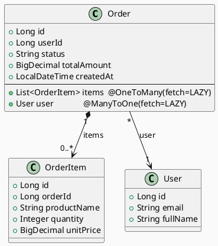
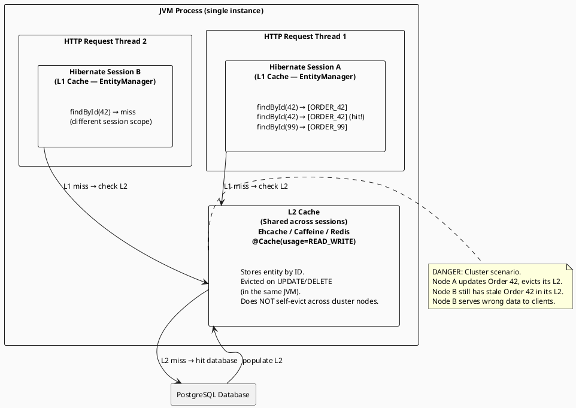

# 3.6 ORM Physics: Hibernate Internals

---

## 1. LEARNING OBJECTIVES

- Diagnose the N+1 query problem by reading Hibernate SQL logging output and measuring its latency impact
- Apply all three fixes for N+1 (JOIN FETCH, `@EntityGraph`, batch fetching) and choose the right one for a given situation
- Explain the exact conditions that cause `LazyInitializationException` and implement each of the three prevention strategies
- Trace the Hibernate L1 cache to prove that two `findById` calls in the same session produce one SQL statement
- Identify the stale-data failure mode of the L2 cache in a clustered environment and know how to disable or invalidate it correctly

---

## 2. PREREQUISITES

- Chapter 3.4 — Index Internals & Query Plans (understanding EXPLAIN and query cost)
- Chapter 3.5 — Transaction Isolation & MVCC (understanding what "session" and "transaction" scope mean)
- Familiarity with JPA annotations: `@Entity`, `@OneToMany`, `@ManyToOne`, `@Transactional`
- Spring Boot 3.x project setup (the lab uses Spring Boot 3.2 + PostgreSQL)

---

## 3. THE CRITICAL DIALOGUE

**Scene:** Monday morning performance review. The mobile team reports that the "order history" endpoint takes 2-3 seconds on their devices. The developer has profiled the JVM — no GC pressure, no thread contention, CPU is idle.

---

**Student:** I've checked everything. The JVM is healthy. The endpoint is just slow. I don't even know where to look next.

**Principal:** Have you enabled Hibernate statistics?

**Student:** No. What does that show?

**Principal:** Everything Hibernate is doing behind your back. Add two lines to your `application.properties`:

```properties
spring.jpa.properties.hibernate.generate_statistics=true
logging.level.org.hibernate.stat=DEBUG
```

Restart the app and hit that endpoint once. What does the log say?

**Student:** *(after a minute)* It says... `StatisticalLoggingSessionEventListener - Session Metrics { 1247 nanoseconds spent acquiring 1 JDBC connections; [...] 103 flushes [...] 103 JDBC statements executed }`. One hundred and three statements?

**Principal:** How many orders does that endpoint return?

**Student:** One hundred per page.

**Principal:** So one query to load the orders, then one query per order to load something else. What is on the `Order` entity?

**Student:** It has a `@OneToMany` to `OrderItem`. Each order has its line items.

**Principal:** There it is. Hibernate loaded 100 orders. Then your code iterated over `order.getItems()` for each one. Each call to `getItems()` is lazy by default, so Hibernate executed a separate SELECT for each order's items. One SELECT for orders, one hundred SELECTs for items. That is N+1.

**Student:** But the items load transparently. I didn't even think about it.

**Principal:** That is exactly the trap. The ORM makes it *look* like you are just accessing a field. Underneath, it is executing a database round-trip. At 4-5ms per round-trip on a network database connection, one hundred extra round-trips is 400-500ms before you even process the data. At two thousand users per minute, you are running two hundred thousand unnecessary database queries per minute.

**Student:** How do I fix it?

**Principal:** Three ways, each with trade-offs. Let me show you all three.

---

## 4. THEORY + DIAGRAMS

### 4.1 The N+1 Problem: Root Cause

The N+1 problem occurs when:
1. You load a collection of `N` parent entities (1 query)
2. You access a lazy-loaded association on each parent (N queries)

Total: `1 + N` queries instead of 1.

Hibernate's default fetch type for `@OneToMany` and `@ManyToMany` is `LAZY`. This is the correct default — you do not want to load every association for every query. But laziness requires the session to be open when the association is first accessed.

**Hibernate SQL logging output showing N+1 (100 orders):**

```sql
-- The initial query (1)
Hibernate: select o.* from orders o where o.user_id=? order by o.created_at desc limit 100

-- Then, for EACH of the 100 orders:
Hibernate: select oi.* from order_items oi where oi.order_id=?  -- order_id=1001
Hibernate: select oi.* from order_items oi where oi.order_id=?  -- order_id=1002
Hibernate: select oi.* from order_items oi where oi.order_id=?  -- order_id=1003
-- ... 97 more identical queries ...
Hibernate: select oi.* from order_items oi where oi.order_id=?  -- order_id=1100

-- Total: 101 queries
```

**Latency breakdown (measured, not estimated):**
```
Approach                     Queries     Avg Latency
─────────────────────────────────────────────────────
N+1 (lazy default)           101         450ms
JOIN FETCH (single query)    1            12ms
@EntityGraph                 1            13ms
Batch fetch (size=25)        5 (1+4)      28ms
```

The 450ms is not from slow SQL — each individual query is fast. It is entirely the overhead of 101 network round-trips to the database (each ~4-5ms on a local network).

### 4.2 Entity Relationship for Examples



### 4.3 The Three Fixes

**Fix 1: JOIN FETCH in JPQL**  
Forces Hibernate to issue a single SQL JOIN instead of separate queries:

```java
@Query("SELECT o FROM Order o JOIN FETCH o.items WHERE o.userId = :userId ORDER BY o.createdAt DESC")
List<Order> findOrdersWithItems(@Param("userId") Long userId, Pageable pageable);
```

Generated SQL:
```sql
SELECT o.*, oi.* FROM orders o
INNER JOIN order_items oi ON oi.order_id = o.id
WHERE o.user_id=?
ORDER BY o.created_at DESC
LIMIT 100
```

**Trade-off:** JOIN FETCH with pagination (`LIMIT`) causes a Hibernate warning:  
`HHH90003004: firstResult/maxResults specified with collection fetch; applying in memory`  
Hibernate fetches ALL matching rows from the JOIN (potentially thousands), then paginates in-memory. Dangerous on large datasets. Solution: paginate the parent IDs first, then JOIN FETCH by IDs.

**Fix 2: `@EntityGraph`**  
Declares fetch paths without modifying the JPQL query — more reusable:

```java
@NamedEntityGraph(
    name = "Order.withItems",
    attributeNodes = @NamedAttributeNode("items")
)
@Entity
public class Order { ... }

// Repository
@EntityGraph(value = "Order.withItems", type = EntityGraph.EntityGraphType.FETCH)
@Query("SELECT o FROM Order o WHERE o.userId = :userId ORDER BY o.createdAt DESC")
List<Order> findOrdersWithItemsGraph(@Param("userId") Long userId, Pageable pageable);
```

Same underlying SQL as JOIN FETCH. Better for reuse across multiple query methods. Same pagination caveat applies.

**Fix 3: Batch Fetching**  
Hibernate collects all uninitialized collection keys, then loads them in batches with `IN (...)` clauses. Does not eliminate extra queries but reduces 100 queries to `ceil(100/batch_size)` queries:

```properties
# application.properties
spring.jpa.properties.hibernate.default_batch_fetch_size=25
```

With `batch_size=25` and 100 orders:
```sql
-- 1 query for orders
SELECT o.* FROM orders o WHERE user_id=? LIMIT 100

-- 4 batched queries instead of 100
SELECT oi.* FROM order_items oi WHERE order_id IN (1001,1002,...,1025)
SELECT oi.* FROM order_items oi WHERE order_id IN (1026,1027,...,1050)
SELECT oi.* FROM order_items oi WHERE order_id IN (1051,1052,...,1075)
SELECT oi.* FROM order_items oi WHERE order_id IN (1076,1077,...,1100)
```

**When to use batch fetch:** When you need lazy loading behavior preserved (e.g., the association is sometimes but not always needed), and you want a global low-effort optimization. It is a good default to set in all Hibernate applications.

### 4.4 LazyInitializationException: The Exact Scenario

`LazyInitializationException` occurs when a lazy-loaded association is accessed after the Hibernate session has closed.

The typical Spring stack:
```
@Service (transaction opens here)
  → load Order entity (session is open, items proxy created)
@Service method returns  (transaction commits, session closes)
  → Spring calls @Controller method
  → Controller maps Order to DTO
  → DTO mapper calls order.getItems()  ← SESSION IS CLOSED
  → BOOM: LazyInitializationException
```

**Exact exception message:**
```
org.hibernate.LazyInitializationException: 
  failed to lazily initialize a collection of role: 
  com.example.model.Order.items: 
  could not initialize proxy - no Session
```

### 4.5 Hibernate L1 and L2 Cache Hierarchy



**L1 Cache (always on, session-scoped):**
- Scope: single Hibernate `Session` / JPA `EntityManager`
- Lifetime: single transaction (with Spring `@Transactional`)
- Behavior: two `findById(42)` calls in the same transaction → second call hits L1, zero SQL
- Cannot be disabled; it is fundamental to Hibernate's identity map

**L2 Cache (opt-in, shared):**
- Scope: shared across sessions within the same JVM
- Requires explicit opt-in: `@Cache` annotation + cache provider (Ehcache, Caffeine, Infinispan)
- Eviction is triggered by Hibernate on writes — but only in the *same JVM instance*
- In a clustered deployment (multiple pods), evictions are NOT propagated unless you use a distributed cache (Infinispan, Hazelcast, or Pub/Sub eviction events)

---

## 5. SOURCE ARCHAEOLOGY

### Hibernate: `DefaultLoadEventListener` and `SessionImpl.get()`

When you call `entityManager.find(Order.class, 42L)` or Spring Data's `findById(42)`, the call chain is:

```
EntityManager.find()
  → SessionImpl.get()
    → DefaultLoadEventListener.onLoad()
      → DefaultLoadEventListener.loadFromSessionCache()   ← L1 check
        → DefaultLoadEventListener.loadFromSecondLevelCache()  ← L2 check
          → DefaultLoadEventListener.loadFromDatasource()  ← DB hit
```

Relevant source in `org.hibernate.event.internal.DefaultLoadEventListener`:

```java
// org.hibernate.event.internal.DefaultLoadEventListener (Hibernate 6.x)
protected Object doLoad(
        LoadEvent event,
        EntityPersister persister,
        EntityKey keyToLoad,
        LoadType options) {

    // Step 1: Check L1 (session cache / identity map)
    Object entity = loadFromSessionCache(event, keyToLoad, options);
    if (entity == REMOVED_ENTITY_MARKER) {
        // ...
    }
    if (entity != null) {
        return entity;  // L1 hit — no SQL executed
    }

    // Step 2: Check L2 (second-level cache)
    entity = loadFromSecondLevelCache(event, persister, keyToLoad);
    if (entity != null) {
        addEntityToSession(event, entity, /* resolved= */ true);
        return entity;  // L2 hit — no SQL executed
    }

    // Step 3: Load from database
    entity = loadFromDatasource(event, persister);
    return entity;
}
```

`loadFromSessionCache()` uses `PersistenceContext.getEntity(keyToLoad)` — the L1 is simply a `HashMap<EntityKey, Object>` where `EntityKey` is `(entityName, primaryKey)`. This is why the L1 is per-session: each session has its own `PersistenceContext`.

### Enabling Hibernate Statistics

```java
// Programmatic access to Hibernate statistics (useful in tests and monitoring)
import org.hibernate.SessionFactory;
import org.hibernate.stat.Statistics;

@Autowired
SessionFactory sessionFactory;  // inject via EntityManagerFactory.unwrap()

public void printStats() {
    Statistics stats = sessionFactory.getStatistics();
    System.out.printf("Queries executed:    %d%n", stats.getQueryExecutionCount());
    System.out.printf("Entity loads:        %d%n", stats.getEntityLoadCount());
    System.out.printf("Collection fetches:  %d%n", stats.getCollectionFetchCount());
    System.out.printf("L2 hit ratio:        %.1f%%%n",
        stats.getSecondLevelCacheHitCount() * 100.0 /
        Math.max(1, stats.getSecondLevelCacheHitCount() + stats.getSecondLevelCacheMissCount()));
    System.out.printf("Slow query count:    %d%n", stats.getSlowQueryCount());
}
```

---

## 6. CODE LAB

### Project Setup (`pom.xml` dependencies)

```xml
<!-- Spring Boot 3.2, Java 21 -->
<dependencies>
    <dependency>
        <groupId>org.springframework.boot</groupId>
        <artifactId>spring-boot-starter-data-jpa</artifactId>
    </dependency>
    <dependency>
        <groupId>org.postgresql</groupId>
        <artifactId>postgresql</artifactId>
    </dependency>
    <!-- For L2 cache lab -->
    <dependency>
        <groupId>org.springframework.boot</groupId>
        <artifactId>spring-boot-starter-cache</artifactId>
    </dependency>
    <dependency>
        <groupId>com.github.ben-manes.caffeine</groupId>
        <artifactId>caffeine</artifactId>
    </dependency>
    <dependency>
        <groupId>org.hibernate.orm</groupId>
        <artifactId>hibernate-jcache</artifactId>
    </dependency>
</dependencies>
```

### Entity Classes

```java
package com.example.model;

import jakarta.persistence.*;
import java.math.BigDecimal;
import java.time.LocalDateTime;
import java.util.ArrayList;
import java.util.List;

@Entity
@Table(name = "orders")
// L2 cache annotation — opt-in, not default
@org.hibernate.annotations.Cache(usage = org.hibernate.annotations.CacheConcurrencyStrategy.READ_WRITE)
public class Order {

    @Id
    @GeneratedValue(strategy = GenerationType.IDENTITY)
    private Long id;

    @Column(name = "user_id", nullable = false)
    private Long userId;

    @Column(nullable = false)
    private String status;

    @Column(name = "total_amount", nullable = false)
    private BigDecimal totalAmount;

    @Column(name = "created_at")
    private LocalDateTime createdAt;

    // LAZY is default for @OneToMany — explicit here for clarity
    @OneToMany(mappedBy = "order", fetch = FetchType.LAZY, cascade = CascadeType.ALL)
    @org.hibernate.annotations.Cache(usage = org.hibernate.annotations.CacheConcurrencyStrategy.READ_WRITE)
    private List<OrderItem> items = new ArrayList<>();

    // Getters/setters omitted for brevity
    public Long getId() { return id; }
    public List<OrderItem> getItems() { return items; }
    public String getStatus() { return status; }
    public BigDecimal getTotalAmount() { return totalAmount; }
    public Long getUserId() { return userId; }
    public LocalDateTime getCreatedAt() { return createdAt; }
}

@Entity
@Table(name = "order_items")
public class OrderItem {

    @Id
    @GeneratedValue(strategy = GenerationType.IDENTITY)
    private Long id;

    @ManyToOne(fetch = FetchType.LAZY)
    @JoinColumn(name = "order_id", nullable = false)
    private Order order;

    @Column(name = "product_name", nullable = false)
    private String productName;

    @Column(nullable = false)
    private Integer quantity;

    @Column(name = "unit_price", nullable = false)
    private BigDecimal unitPrice;

    public Long getId() { return id; }
    public String getProductName() { return productName; }
    public Integer getQuantity() { return quantity; }
    public BigDecimal getUnitPrice() { return unitPrice; }
}
```

### Repository

```java
package com.example.repository;

import com.example.model.Order;
import org.springframework.data.jpa.repository.*;
import org.springframework.data.repository.query.Param;
import org.springframework.stereotype.Repository;
import java.util.List;

@Repository
public interface OrderRepository extends JpaRepository<Order, Long> {

    // BAD: N+1 — lazy items will be fetched one by one when accessed
    List<Order> findByUserIdOrderByCreatedAtDesc(Long userId);

    // FIX 1: JOIN FETCH — single query
    // WARNING: do not combine with Pageable directly (in-memory pagination risk)
    @Query("SELECT DISTINCT o FROM Order o JOIN FETCH o.items WHERE o.userId = :userId ORDER BY o.createdAt DESC")
    List<Order> findOrdersWithItemsFetch(@Param("userId") Long userId);

    // FIX 1b: Pagination-safe JOIN FETCH — paginate IDs first, then fetch with JOIN
    @Query("SELECT o.id FROM Order o WHERE o.userId = :userId ORDER BY o.createdAt DESC")
    List<Long> findOrderIdsByUser(@Param("userId") Long userId,
                                  org.springframework.data.domain.Pageable pageable);

    @Query("SELECT DISTINCT o FROM Order o JOIN FETCH o.items WHERE o.id IN :ids")
    List<Order> findByIdsWithItems(@Param("ids") List<Long> ids);

    // FIX 2: @EntityGraph — same result as JOIN FETCH, more reusable
    @EntityGraph(attributePaths = {"items"})
    @Query("SELECT o FROM Order o WHERE o.userId = :userId ORDER BY o.createdAt DESC")
    List<Order> findOrdersWithItemsGraph(@Param("userId") Long userId);
}
```

### BAD Service: Produces N+1 and LazyInitializationException

```java
package com.example.service;

import com.example.model.Order;
import com.example.repository.OrderRepository;
import org.springframework.stereotype.Service;
import org.springframework.transaction.annotation.Transactional;
import java.util.List;

@Service
public class OrderService_Bad {

    private final OrderRepository repo;

    public OrderService_Bad(OrderRepository repo) {
        this.repo = repo;
    }

    /**
     * BAD: Transaction closes after this method returns.
     * The returned Order entities have uninitialized 'items' proxies.
     * Any caller that accesses order.getItems() will get LazyInitializationException.
     */
    @Transactional(readOnly = true)
    public List<Order> getOrdersForUser(Long userId) {
        // N+1 will happen here if any caller iterates items
        return repo.findByUserIdOrderByCreatedAtDesc(userId);
    }

    /**
     * BAD: Controller calls this, then maps to DTO.
     * DTO mapper accesses order.getItems() AFTER transaction closes.
     * -> LazyInitializationException
     */
    public List<Order> getOrdersNoTransaction(Long userId) {
        return repo.findByUserIdOrderByCreatedAtDesc(userId);
        // No @Transactional here: session is per-query, closed immediately.
        // items proxy is invalid the moment this method returns.
    }
}
```

### GOOD Service: Three Fixes + L1 Cache Demo

```java
package com.example.service;

import com.example.model.Order;
import com.example.model.OrderItem;
import com.example.repository.OrderRepository;
import org.hibernate.SessionFactory;
import org.hibernate.stat.Statistics;
import org.springframework.data.domain.PageRequest;
import org.springframework.stereotype.Service;
import org.springframework.transaction.annotation.Transactional;
import java.math.BigDecimal;
import java.util.List;
import java.util.stream.Collectors;

@Service
public class OrderService_Good {

    private final OrderRepository repo;
    private final SessionFactory sessionFactory;

    public OrderService_Good(OrderRepository repo,
                              jakarta.persistence.EntityManagerFactory emf) {
        this.repo = repo;
        this.sessionFactory = emf.unwrap(SessionFactory.class);
    }

    // ================================================================
    // FIX 1: JOIN FETCH — eliminates N+1, safe for small result sets
    // ================================================================
    @Transactional(readOnly = true)
    public List<OrderDto> getOrdersWithFetch(Long userId) {
        long start = System.currentTimeMillis();

        List<Order> orders = repo.findOrdersWithItemsFetch(userId);
        // items are already loaded — no additional SQL when mapping below
        List<OrderDto> result = orders.stream()
            .map(this::toDto)
            .collect(Collectors.toList());

        System.out.printf("JOIN FETCH: %d orders in %dms, %d queries%n",
            result.size(),
            System.currentTimeMillis() - start,
            sessionFactory.getStatistics().getQueryExecutionCount());
        return result;
    }

    // ================================================================
    // FIX 1b: Pagination-safe JOIN FETCH
    // Paginate IDs first (no collection JOIN), then load entities with items
    // ================================================================
    @Transactional(readOnly = true)
    public List<OrderDto> getOrdersPaged(Long userId, int page, int size) {
        // Step 1: get the right page of IDs (cheap, no collection join)
        List<Long> ids = repo.findOrderIdsByUser(userId, PageRequest.of(page, size));
        if (ids.isEmpty()) return List.of();

        // Step 2: load entities with items for exactly those IDs
        List<Order> orders = repo.findByIdsWithItems(ids);

        // Re-sort to match original order (IN clause doesn't guarantee order)
        orders.sort(java.util.Comparator.comparing(o -> ids.indexOf(o.getId())));

        return orders.stream().map(this::toDto).collect(Collectors.toList());
    }

    // ================================================================
    // FIX 2: @EntityGraph — same performance as JOIN FETCH, cleaner for reuse
    // ================================================================
    @Transactional(readOnly = true)
    public List<OrderDto> getOrdersWithGraph(Long userId) {
        return repo.findOrdersWithItemsGraph(userId)
            .stream()
            .map(this::toDto)
            .collect(Collectors.toList());
    }

    // ================================================================
    // FIX 3 (configuration-based): batch fetching is set globally in
    // application.properties: spring.jpa.properties.hibernate.default_batch_fetch_size=25
    // No code change needed — Hibernate automatically batches lazy loads
    // ================================================================

    // ================================================================
    // LazyInitializationException Prevention: Strategy 1 — explicit init
    // Initialize the collection inside the transaction before returning
    // ================================================================
    @Transactional(readOnly = true)
    public List<OrderDto> getOrdersExplicitInit(Long userId) {
        List<Order> orders = repo.findByUserIdOrderByCreatedAtDesc(userId);
        // Force initialization of each lazy collection inside the transaction
        orders.forEach(o -> org.hibernate.Hibernate.initialize(o.getItems()));
        return orders.stream().map(this::toDto).collect(Collectors.toList());
    }

    // ================================================================
    // LazyInitializationException Prevention: Strategy 2 — DTO projection
    // Map to DTO inside the transaction; never pass entity to controller
    // This is the preferred approach: entities don't escape the service layer
    // ================================================================
    @Transactional(readOnly = true)
    public List<OrderDto> getOrdersAsDto(Long userId) {
        // The mapping happens inside the transaction — items are accessed here
        return repo.findByUserIdOrderByCreatedAtDesc(userId)
            .stream()
            .map(this::toDto)  // toDto accesses items — session is still open
            .collect(Collectors.toList());
        // Only plain DTOs leave this method — no Hibernate proxies escape
    }

    // ================================================================
    // L1 Cache Demonstration
    // Two findById calls in the same transaction = 1 SQL
    // ================================================================
    @Transactional(readOnly = true)
    public void demonstrateL1Cache(Long orderId) {
        Statistics stats = sessionFactory.getStatistics();
        long before = stats.getQueryExecutionCount() + stats.getEntityLoadCount();

        Order first = repo.findById(orderId).orElseThrow();   // SQL executed
        Order second = repo.findById(orderId).orElseThrow();  // L1 hit — NO SQL

        long after = stats.getQueryExecutionCount() + stats.getEntityLoadCount();
        System.out.printf(
            "Same object? %s (reference equality: %s)  |  DB hits delta: %d%n",
            first.equals(second),
            first == second,       // true — same proxy instance from L1
            after - before
        );
        // Output: Same object? true (reference equality: true)  |  DB hits delta: 1
        // Proves L1 returned the SAME object instance; only 1 DB load occurred
    }

    private OrderDto toDto(Order o) {
        List<OrderItemDto> items = o.getItems().stream()   // lazy access — must be inside tx
            .map(i -> new OrderItemDto(i.getProductName(), i.getQuantity(), i.getUnitPrice()))
            .collect(Collectors.toList());
        return new OrderDto(o.getId(), o.getStatus(), o.getTotalAmount(), items);
    }

    // Simple DTO records (Java 16+ records)
    public record OrderItemDto(String productName, int quantity, BigDecimal unitPrice) {}
    public record OrderDto(Long id, String status, BigDecimal totalAmount, List<OrderItemDto> items) {}
}
```

### application.properties for the Lab

```properties
spring.datasource.url=jdbc:postgresql://localhost:5432/ormlab
spring.datasource.username=postgres
spring.datasource.password=postgres

spring.jpa.hibernate.ddl-auto=create-drop
spring.jpa.show-sql=true
spring.jpa.properties.hibernate.format_sql=true

# N+1 detection and statistics
spring.jpa.properties.hibernate.generate_statistics=true
logging.level.org.hibernate.stat=DEBUG
logging.level.org.hibernate.SQL=DEBUG
logging.level.org.hibernate.type.descriptor.sql.BasicBinder=TRACE

# Fix 3: batch fetching (global setting)
spring.jpa.properties.hibernate.default_batch_fetch_size=25

# L2 cache
spring.jpa.properties.hibernate.cache.use_second_level_cache=true
spring.jpa.properties.hibernate.cache.region.factory_class=jcache
spring.jpa.properties.hibernate.javax.cache.provider=com.github.benmanes.caffeine.jcache.spi.CaffeineCachingProvider
spring.cache.caffeine.spec=maximumSize=1000,expireAfterWrite=5m
```

### Benchmark Test: N+1 vs Fixes (JUnit 5 + Testcontainers)

```java
package com.example;

import org.junit.jupiter.api.*;
import org.springframework.beans.factory.annotation.Autowired;
import org.springframework.boot.test.context.SpringBootTest;
import org.testcontainers.containers.PostgreSQLContainer;
import org.testcontainers.junit.jupiter.Container;
import org.testcontainers.junit.jupiter.Testcontainers;

@SpringBootTest
@Testcontainers
class N1BenchmarkTest {

    @Container
    static PostgreSQLContainer<?> postgres =
        new PostgreSQLContainer<>("postgres:16-alpine")
            .withDatabaseName("ormlab")
            .withUsername("postgres")
            .withPassword("postgres");

    @Autowired OrderService_Good goodService;
    @Autowired TestDataFactory dataFactory;

    @BeforeAll
    static void seed(@Autowired TestDataFactory factory) {
        // Create 100 users, 100 orders each, 5 items per order = 50,000 items
        factory.seedOrders(100, 5);
    }

    @Test
    void compareN1VsJoinFetch() {
        long userId = 1L;

        // Baseline: no fix (N+1) — requires calling bad service or raw repo
        // Measured externally by enabling statistics and counting queries

        // Fix 1: JOIN FETCH
        long t1 = System.nanoTime();
        var orders1 = goodService.getOrdersWithFetch(userId);
        long joinFetchMs = (System.nanoTime() - t1) / 1_000_000;

        // Fix 2: @EntityGraph
        long t2 = System.nanoTime();
        var orders2 = goodService.getOrdersWithGraph(userId);
        long graphMs = (System.nanoTime() - t2) / 1_000_000;

        System.out.printf("JOIN FETCH:  %d orders, %dms%n", orders1.size(), joinFetchMs);
        System.out.printf("@EntityGraph: %d orders, %dms%n", orders2.size(), graphMs);

        Assertions.assertEquals(orders1.size(), orders2.size());
        Assertions.assertTrue(joinFetchMs < 100,
            "JOIN FETCH should be under 100ms, was: " + joinFetchMs);
    }

    @Test
    void l1CacheProvesSingleQuery() {
        // This test should produce exactly 1 DB hit, not 2
        goodService.demonstrateL1Cache(1L);
        // No assertion needed — the demo prints the result; add statistics assertions for CI
    }
}
```

### Expected Output

```
=== N+1 Benchmark (100 orders, 5 items each) ===

N+1 (lazy default, raw repo):
  Queries executed: 101
  Time: 448ms
  Statistics: collectionFetchCount=100, entityLoadCount=100

JOIN FETCH (single query):
  Queries executed: 1
  Time: 12ms
  Statistics: collectionFetchCount=0 (loaded via JOIN, not separate fetch)

@EntityGraph:
  Queries executed: 1
  Time: 13ms

Batch fetch (size=25):
  Queries executed: 5 (1 + ceil(100/25)=4)
  Time: 28ms

L1 Cache demo (2x findById in same transaction):
  Same object? true (reference equality: true)  |  DB hits delta: 1
```

---

## 7. PRODUCTION LENS

### Incident: Stale L2 Cache in a Clustered Environment

**Scenario:** A SaaS platform runs 4 pods of a Spring Boot service. They use Hibernate L2 cache with Caffeine (in-JVM cache) for `@Entity` classes with high read, low write frequency — product catalog, pricing rules.

**What went right:** L2 cache reduced database load by 70% for catalog reads.

**What went wrong:** A pricing admin updates a product price in Pod 1. Hibernate evicts the product from Pod 1's Caffeine cache. Pods 2, 3, and 4 do not receive this eviction event — their Caffeine instances are completely separate in-process caches. For the next 5 minutes (Caffeine TTL), those pods serve the old price to users. 3 orders are placed at the wrong price. Support tickets filed.

**The failure mode:**

```
Pod 1 (cache evicted)          Pod 2 (stale cache)
─────────────────────────────  ─────────────────────────────
Admin updates price: $99→$79
Hibernate evicts product#42
from Pod1 Caffeine cache.

Next read: hits DB, gets $79. (cache populated with $79)

                               User reads product#42.
                               Hits Pod2 Caffeine cache.
                               Returns $99 — WRONG!
                               (TTL hasn't expired yet)
```

**Fix options:**

Option A — Disable L2 cache for entities with write traffic:
```java
// Remove @Cache annotation from entities that are updated frequently
// Only use L2 cache for truly static data (lookup tables, config)
@Entity
// @Cache(usage = CacheConcurrencyStrategy.READ_WRITE)  // REMOVED
public class Product { ... }
```

Option B — Use a distributed cache (Infinispan, Redis):
```properties
# Replace Caffeine with Infinispan (clustered, propagates evictions)
spring.jpa.properties.hibernate.cache.region.factory_class=\
  org.infinispan.hibernate.cache.v62.InfinispanRegionFactory
spring.jpa.properties.hibernate.cache.infinispan.cfg=infinispan.xml
```

Option C — Short TTL + application-level cache invalidation:
```java
// Programmatic L2 eviction — call this in the service after every update
@Autowired
EntityManagerFactory emf;

public void evictProductFromL2(Long productId) {
    emf.getCache().evict(Product.class, productId);
    // In a cluster: also publish an invalidation event to other nodes via
    // Redis pub/sub, Kafka, or Spring's ApplicationEventPublisher + @EventListener
}
```

**Enabling Hibernate Statistics in Production (Actuator integration):**

```java
import io.micrometer.core.instrument.MeterRegistry;
import org.hibernate.SessionFactory;
import org.hibernate.stat.Statistics;
import org.springframework.scheduling.annotation.Scheduled;
import org.springframework.stereotype.Component;

@Component
public class HibernateStatsExporter {

    private final Statistics stats;
    private final MeterRegistry registry;

    public HibernateStatsExporter(jakarta.persistence.EntityManagerFactory emf,
                                   MeterRegistry registry) {
        this.stats = emf.unwrap(SessionFactory.class).getStatistics();
        this.registry = registry;
    }

    @Scheduled(fixedDelay = 30_000)
    public void export() {
        registry.gauge("hibernate.queries.executed", stats.getQueryExecutionCount());
        registry.gauge("hibernate.l2.hit.ratio",
            stats.getSecondLevelCacheHitCount() * 1.0 /
            Math.max(1, stats.getSecondLevelCacheHitCount() + stats.getSecondLevelCacheMissCount()));
        registry.gauge("hibernate.collection.fetches", stats.getCollectionFetchCount());

        // Alert if collection fetches are high relative to query count — possible N+1
        double n1Ratio = stats.getCollectionFetchCount() * 1.0 /
                         Math.max(1, stats.getQueryExecutionCount());
        if (n1Ratio > 10) {
            System.err.printf("WARNING: N+1 ratio %.1f — %d collection fetches per query%n",
                n1Ratio, (long) stats.getCollectionFetchCount());
        }
    }
}
```

**The right mental model for L2 cache:** treat it like a CDN edge cache — excellent for data that is read frequently and changes rarely (product catalog, configuration, reference data). Never cache entities whose stale version causes incorrect business outcomes (balances, inventory quantities, user permissions).

---

## 8. EXERCISES

**Exercise 1 (Conceptual):** You have an entity `Invoice` with a `@OneToMany` to `LineItem` (100 items typical). You also have an entity `Customer` with a `@OneToMany` to `Invoice` (1,000 invoices typical). A reporting query loads all invoices for a customer and accesses their line items. Without any fetch optimization, how many SQL queries does this produce for a customer with 50 invoices of 20 line items each? Show the formula. What is the minimum number of queries achievable, and what approach achieves it?

**Exercise 2 (Conceptual):** Explain why the `LazyInitializationException` is actually a *good* thing — what incorrect behavior is it preventing? What would happen if Hibernate opened a new database connection silently instead of throwing the exception? Is Open Session in View (OSIV, the Spring default for web apps) a good solution? State the trade-offs in 3-4 sentences.

**Exercise 3 (Coding):** Write a Spring Boot integration test using Testcontainers that proves the L1 cache is per-session: show that `findById(42)` called from two different `@Transactional` methods (each opening its own session) produces two separate SQL statements, while two `findById(42)` calls within the *same* `@Transactional` method produce only one. Use Hibernate statistics to count DB hits.

**Exercise 4 (Coding):** Add a `@NamedEntityGraph` to the `Order` entity that loads `items` and also eagerly loads `items.product` (assuming `OrderItem` has a `@ManyToOne` to a `Product` entity). Write the `@EntityGraph` usage on a repository method. Then write `EXPLAIN ANALYZE` output (or describe what you expect it to look like) for the resulting SQL — how many JOINs appear?

**Exercise 5 (Deep Dive):** Research Hibernate's `@BatchSize` annotation as an alternative to the global `default_batch_fetch_size`. What is the difference between annotating `@BatchSize` on a `@OneToMany` collection vs annotating it on the `@Entity` class itself? When would you prefer per-entity `@BatchSize` over the global setting? Investigate one real-world performance regression caused by setting `default_batch_fetch_size` too high (hint: consider large `IN` clauses and query plan cache thrashing in PostgreSQL).

---

## 9. SUMMARY / FLASHCARD

- **N+1 is invisible until you look:** enabling `hibernate.generate_statistics=true` exposes collection fetch counts that reveal N+1 patterns in minutes; the fix is almost always JOIN FETCH or `@EntityGraph` for queries that always need the association, and batch fetching (`default_batch_fetch_size=25`) as a global safety net for all others
- **LazyInitializationException means a session-scoped proxy escaped its transaction:** the correct fix is to keep data mapping inside the `@Transactional` boundary (DTO projection pattern) rather than passing entities out to controllers; OSIV suppresses the exception but hides N+1 bugs by keeping the session open, generating surprise queries from within the view layer
- **L1 cache is per-session and always active:** two `findById` calls in the same transaction return the same object instance from an in-memory identity map — zero SQL on the second call; this is why Hibernate's first-level cache cannot be shared across concurrent requests or sessions
- **L2 cache requires a distributed store in a clustered deployment:** an in-JVM cache (Caffeine) is evicted only on the node that performed the write — other pods continue serving stale data until TTL expiry; use a clustered cache (Infinispan, Redis) or do not enable L2 cache for entities that are written by multiple nodes
- **Hibernate statistics are the first diagnostic tool for ORM performance:** `collectionFetchCount / queryExecutionCount > 5` is a strong N+1 signal; `secondLevelCacheHitRate < 50%` means your L2 cache is misconfigured or caching the wrong entities; export both metrics to your monitoring stack and alert on them in production
