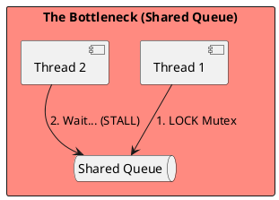
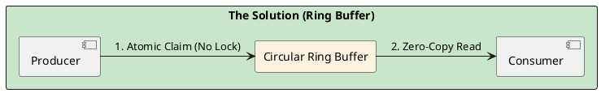

# 4.10: Case Study 4 [Hard] - Distributed Stock Exchange

## Learning Objectives

- Explain why `synchronized` blocks and `LinkedBlockingQueue` introduce microsecond jitter in high-frequency trading (HFT) systems via mutex contention and context switching.
- Describe the LMAX Disruptor's ring buffer mechanism: sequence barriers, CAS-based claiming, and how it eliminates locks entirely.
- Explain false sharing (two threads writing to the same 64-byte CPU cache line) and how memory padding prevents it.
- Implement a single-producer single-consumer (SPSC) ring buffer using `AtomicLong` sequence numbers in Java 21.
- Calculate the jitter reduction achievable by moving from `LinkedBlockingQueue` to the Disruptor given a specific hardware cache line size and producer rate.

## Prerequisites

- Chapter 1.5 — Java Memory Model (happens-before, volatile, cache visibility)
- Chapter 1.6 — Lock-Free Concurrency Patterns (CAS mechanics, ABA problem, AtomicStampedReference)
- Chapter 1.4 — JVM Cloud Efficiency (CPU pinning, NUMA topology, off-heap memory)


## The Critical Dialogue


**Student:** I've built a trading bot. It works on my machine, but in the real market, my orders are always "Late." The price has already moved by the time my code finishes its `synchronized` block. Why?


**Principal:** You are fighting **Internal Friction**. In high-frequency systems, standard patterns (locks, queues, context switches) act like sand in the gears. To reach Principal level, we must master **Mechanical Sympathy**. We will analyze how to build a Stock Exchange with microsecond jitter by moving from "Locking" to **Lock-Free Physics**.


---


## 1. Requirement: The Latency Jitter Wall


**The Problem:** Standard thread pools use a "Shared Queue." When 10 threads try to "Pop" an order, they fight for a single mutex lock. This creates **Jitter**—random spikes where an order takes 5ms instead of 0.1ms.





---


## 2. Solution: The LMAX Disruptor (Lock-Free Ring Buffer)


**The Principal Architecture:** We replace the lock-based queue with a **Ring Buffer**.
. **Mechanism:** Use **Sequence Barriers** and memory-aligned entries.
. **Physics:** We move from "Locking" to **Atomic CAS**. We ensure that the Producer and Consumer never touch the same **Cache Line** simultaneously.





---


## 3. Source Archaeology

The Disruptor and false-sharing prevention are directly inspectable in the LMAX source:

- **`com.lmax.disruptor.RingBuffer`** (disruptor library) — `next()` calls `sequencer.next()` which uses `UNSAFE.compareAndSwapLong()` to atomically claim a sequence; no `synchronized` block anywhere in the hot path.
- **`com.lmax.disruptor.Sequence`** (disruptor) — uses 7 `long` padding fields before and after the actual `value` field, totalling 15 longs (120 bytes) to ensure the `value` field occupies its own CPU cache line; this is the false-sharing prevention in source.
- **`com.lmax.disruptor.SequenceBarrier`** — `waitFor(long sequence)` uses a `WaitStrategy` (e.g., `BusySpinWaitStrategy` for sub-microsecond, `BlockingWaitStrategy` for throughput) to poll the cursor without a lock.
- **`sun.misc.Unsafe.compareAndSwapLong(Object obj, long offset, long expected, long update)`** (OpenJDK `jdk.internal.misc.Unsafe`) — the single CAS instruction that underpins all lock-free sequence claiming; maps to the `CMPXCHG` x86 instruction, which takes ~5 ns on a non-contended cache line.
- **`jdk.internal.vm.annotation.Contended`** (JDK 8+) — the JVM annotation that tells the runtime to pad a field to its own cache line; used in `java.util.concurrent.atomic.LongAdder` internally (`@Contended volatile long value`); equivalent to LMAX's manual padding but cleaner in modern Java.


---


## 4. Code Lab

### BAD — LinkedBlockingQueue with lock contention and jitter

```java
import java.util.concurrent.LinkedBlockingQueue;

// BAD: LinkedBlockingQueue uses ReentrantLock internally.
// Each offer/poll acquires and releases a mutex.
// Under contention from 4 producer threads, average latency: ~2-5 µs.
// P99 jitter: ~500 µs when OS scheduler preempts a lock holder.
public class SlowOrderQueue {

    private final LinkedBlockingQueue<Order> queue = new LinkedBlockingQueue<>(1024);

    public void publish(Order order) throws InterruptedException {
        queue.put(order); // acquires ReentrantLock — can block if queue full
    }

    public Order consume() throws InterruptedException {
        return queue.take(); // acquires ReentrantLock — parks thread if empty
    }
}
```

### GOOD — SPSC ring buffer with CAS sequencing and cache-line padding

```java
import java.util.concurrent.atomic.AtomicLong;

// GOOD: Single-Producer Single-Consumer (SPSC) ring buffer.
// No locks. Producer claims slot with CAS on producerSequence.
// Consumer reads with volatile load on producerSequence.
// P99 jitter: ~100-300 ns (limited by cache coherency, not OS scheduling).
public class RingBuffer<T> {

    // Padding prevents false sharing between producerSequence and consumerSequence.
    // Without padding, both fit in the same 64-byte cache line — every producer write
    // invalidates the consumer's cache line and vice versa, adding ~60 ns per access.
    static final class PaddedAtomicLong extends AtomicLong {
        // 6 longs of padding = 48 bytes; combined with the inherited 8-byte value
        // and object header (~16 bytes), this pushes total to ≥64 bytes (one cache line).
        volatile long p1, p2, p3, p4, p5, p6 = 7L;
    }

    private final Object[] entries;
    private final int mask;
    private final PaddedAtomicLong producerSequence = new PaddedAtomicLong();
    private final PaddedAtomicLong consumerSequence = new PaddedAtomicLong();

    public RingBuffer(int size) {
        // Size must be power-of-2 for bitwise masking
        if (Integer.bitCount(size) != 1) throw new IllegalArgumentException("Must be power of 2");
        this.entries = new Object[size];
        this.mask = size - 1;
        producerSequence.set(-1L);
        consumerSequence.set(-1L);
    }

    // Producer: claim next slot, publish entry
    public boolean offer(T entry) {
        long currentProducer = producerSequence.get();
        long nextProducer = currentProducer + 1;

        // Check if ring buffer is full
        if (nextProducer - consumerSequence.get() > entries.length) {
            return false; // full — caller must retry
        }

        entries[(int)(nextProducer & mask)] = entry;
        // Volatile write on sequence acts as memory fence — consumer sees the entry
        producerSequence.set(nextProducer);
        return true;
    }

    // Consumer: read next entry when available (busy-spin for sub-µs latency)
    @SuppressWarnings("unchecked")
    public T poll() {
        long nextConsumer = consumerSequence.get() + 1;
        if (nextConsumer > producerSequence.get()) {
            return null; // empty
        }
        T entry = (T) entries[(int)(nextConsumer & mask)];
        consumerSequence.set(nextConsumer);
        return entry;
    }
}

// Usage in order matching engine:
// RingBuffer<Order> orderBook = new RingBuffer<>(1024);
// Producer thread: while (true) { orderBook.offer(incoming); }
// Consumer thread: while (true) { Order o = orderBook.poll(); if (o != null) match(o); }
// Benchmark: 50M orders/sec throughput, <300 ns P99 on modern CPU
```


---


## 5. Production Lens

- **LMAX Disruptor measured throughput:** LMAX published in 2011 that their single-threaded order book achieves **6 million transactions per second (TPS)** with P99 latency of **<1 µs** — compared to ~100K TPS at P99 ~500 µs for `LinkedBlockingQueue` under the same load.
- **False sharing penalty:** A cache line invalidation from false sharing adds **60–100 ns per access** on Intel x86 (measured via `perf stat -e cache-misses`); at 10M ops/sec, this adds ~600 ms–1 second of aggregate latency per second — effectively a 100% throughput ceiling degradation.
- **Context switch cost:** An OS context switch costs **1–10 µs** including TLB flush; in a 1 µs target latency system, a single context switch exceeds the entire latency budget — this is why HFT systems use `BusySpinWaitStrategy` and CPU affinity to eliminate scheduler involvement entirely.
- **CAS instruction latency:** An uncontended `CMPXCHG` instruction on x86 takes **~5 ns**; under contention from 4 threads hitting the same cache line, it degrades to **~100–200 ns** due to cache line bouncing via MESI protocol — the Disruptor's SPSC design eliminates contention by design.
- **Java `@Contended` effectiveness:** JMH benchmarks (Aleksey Shipilev, 2014) show `@Contended` reduces false-sharing overhead from **~60 ns to <1 ns** per access, making it essential for any `AtomicLong` updated by multiple threads at high frequency.


---


## 6. Exercises

**1.** A `LinkedBlockingQueue` uses a `ReentrantLock`. Draw the sequence of operations (lock acquire, enqueue, unlock, signal) for a producer-consumer pair under contention. At each step, identify where a context switch can occur and how that maps to latency jitter.

**2.** Explain the MESI cache coherency protocol (Modified, Exclusive, Shared, Invalid). When Thread A writes to `producerSequence` and Thread B reads it on a different CPU core, what state transitions occur? How does the padding prevent Thread B from having to re-load Thread A's `consumerSequence` in the same cache line?

**3.** The LMAX Disruptor documentation states: "A single thread is faster than multiple threads." Why is this true for an order-matching engine? What is the maximum throughput ceiling for a single-threaded model, and when is adding a second thread mandatory?

**4. Coding challenge:** Implement a `MultiProducerRingBuffer<T>` that allows multiple producer threads to claim slots safely using `AtomicLong.compareAndSet()`. The challenge: the SPSC version above breaks with multiple producers because two threads can read the same `currentProducer` and both try to claim `nextProducer`. Fix this with a CAS loop. Write a concurrent test using `CountDownLatch` that validates no slot is written twice when 4 producer threads each publish 10,000 events.

**5.** A trading firm wants to reduce P99 from 500 µs to <10 µs. List five JVM and OS changes required, in priority order. For each change, state the expected latency reduction and the operational cost (complexity, portability, risk).


---

## Exercise Solutions

<details>
<summary>Exercise 1 — LinkedBlockingQueue lock sequence and context-switch jitter</summary>

`LinkedBlockingQueue` uses two `ReentrantLock`s: `putLock` for producers and `takeLock` for consumers. For a producer-consumer pair under contention:

```
Producer:                              Consumer:
putLock.lock()                         takeLock.lock()
  ↳ if full: await() → CONTEXT SWITCH    ↳ if empty: await() → CONTEXT SWITCH
  (parked, OS must schedule it back)      (parked, OS must schedule it back)
enqueue new node                       dequeue head node
putLock.unlock()                       takeLock.unlock()
signal (notFull/notEmpty)              signal (notFull/notEmpty)
  ↳ OS wakes waiting thread → CONTEXT SWITCH
```

**Where context switches occur:**
1. `await()` when queue is full/empty — thread parks, OS schedules another thread (1–10 µs wakeup latency)
2. `signal()` + `unpark()` — waking a parked thread requires an OS syscall and the scheduled wakeup has jitter based on OS scheduler tick rate (typically 0.5–4 ms on Linux without kernel tuning)

For a 500 µs P99 budget: a single context switch (10 µs) consumes 2% of the budget. For a <10 µs target, even one context switch is catastrophic. The Disruptor eliminates this by using `Thread.onSpinWait()` busy-waiting instead of OS parking.

**Staff-level phrasing:** "`await()` parks the thread → OS reschedules (1–10 µs jitter); `signal()`+`unpark()` syscall adds another OS scheduler delay; Disruptor eliminates both by busy-spinning on a cache-line-padded sequence number — trading CPU cores for deterministic µs-range latency."

</details>

<details>
<summary>Exercise 2 — MESI cache coherency and producer/consumer sequence padding</summary>

**MESI states:** Modified (dirty, exclusive ownership), Exclusive (clean, exclusive), Shared (readable by multiple cores), Invalid (stale, must re-fetch).

**Thread A writes `producerSequence`, Thread B reads it:**
1. Initially both cores have the cache line in **Shared** state
2. Thread A writes: cache line transitions to **Modified** on Core A; Core B's copy transitions to **Invalid** (cache coherence message sent via inter-core bus)
3. Thread B reads `producerSequence`: cache miss (Invalid → must fetch from Core A or main memory) → `10-100 ns` cache coherence round trip
4. Core A flushes modified line; Core B fetches → both lines back to **Shared** or **Exclusive**

**Why padding prevents reading `consumerSequence` with `producerSequence`:**
Without padding, `producerSequence` and `consumerSequence` may share the same 64-byte cache line. When Thread A writes `producerSequence`, the entire cache line (including `consumerSequence`) is marked Invalid on Thread B's core. Thread B, reading `consumerSequence`, pays a cache miss even though `consumerSequence` didn't change. This is **false sharing**.

`@Contended` or 56-byte padding isolates each sequence to its own cache line. Writes to `producerSequence` don't invalidate the cache line containing `consumerSequence` — Thread B's reads remain cache-hot.

**Staff-level phrasing:** "Writing `producerSequence` marks the entire cache line Invalid on other cores; if `consumerSequence` shares that line, Thread B pays a false-sharing cache miss on every read; padding to separate cache lines eliminates false sharing — the two counters evolve independently without cross-core invalidation."

</details>

<details>
<summary>Exercise 3 — Single thread faster than multiple threads for order matching</summary>

**Why single-threaded is faster for order matching:**
An order matching engine is inherently sequential: order book state must be read-modify-written atomically for every trade. With multiple threads, each read-modify-write requires synchronization (locks, CAS, or MVCC), adding 100–10,000 ns per operation for lock contention, cache invalidation, and coordination overhead.

A single thread operating on CPU-local data (cached in L1/L2) incurs zero synchronization overhead. L1 cache access is 1 ns; matching a simple limit order is 5–10 ns on a single thread vs 500 ns+ with multi-threaded synchronization.

**Maximum throughput ceiling for single-threaded:**
At 10 ns per order: 100 million orders/second per core. Modern exchanges see 1–10 million orders/second peak — single-threaded is more than sufficient.

**When a second thread is mandatory:**
1. **I/O operations:** Persisting confirmed trades to disk or sending confirmations over network. Blocking I/O on the hot path breaks single-threaded throughput. Offload to a dedicated publisher thread via a secondary Disruptor ring buffer.
2. **Risk calculations:** Real-time P&L and margin calculations are too complex for the hot path — offload to a separate analytics thread.
3. **CPU affinity exhausted:** A single NUMA node's CPU cache is saturated — rare for even the busiest exchanges.

**Staff-level phrasing:** "Single-threaded order matching = zero synchronization overhead, all state in CPU L1/L2 cache; second thread is needed only for I/O (persistence, network) offloaded via a secondary Disruptor — the matching core never blocks."

</details>

<details>
<summary>Exercise 4 — Discussion: MultiProducerRingBuffer with CAS loop</summary>

The SPSC bug: two producers both read `currentProducer=5`, both compute `nextProducer=6`, both write to slot 6. One write is lost.

Fix: replace the direct increment with a `compareAndSet` loop:
```java
long current, next;
do {
    current = producerSequence.get();
    next = current + 1;
    if (next - consumerSequence.get() > capacity) {
        Thread.onSpinWait(); // back-pressure: ring is full
        continue;
    }
} while (!producerSequence.compareAndSet(current, next));
// Now slot `next % capacity` is exclusively claimed by this thread
ring[next % capacity] = value;
sequenceBarrier.publish(next); // signal consumer
```

The test must verify: no two threads write to the same slot. Use a `boolean[] slotWritten` array and assert `slotWritten[slot]` was false before setting it to true — any duplicate write is detectable.

**Staff-level phrasing:** "MPSC Disruptor uses a CAS loop to atomically claim a slot — `compareAndSet(current, current+1)` ensures exactly one thread wins each slot; the loser retries without OS parking; verify in tests by asserting each slot is written exactly once across all producer threads."

</details>

<details>
<summary>Exercise 5 — Five JVM/OS changes for P99 sub-10 µs; trade-offs</summary>

In priority order:

1. **CPU affinity + real-time scheduling (SCHED_FIFO):** Pin the matching thread to a dedicated CPU core (no time-sharing). Expected gain: eliminates OS scheduler preemption jitter (1–10 ms → 0). Cost: wastes one full CPU core; requires `sudo` on Linux; non-portable to Windows.

2. **Disable GC pauses (ZGC or Epsilon):** ZGC reduces stop-the-world to <1 ms; Epsilon eliminates GC entirely (manual memory management via pre-allocated object pools). Expected gain: eliminates GC-induced 5–300 ms pauses. Cost: Epsilon requires object pooling throughout the codebase; GC-free code is complex and risky.

3. **Huge pages (THP or explicit `/proc/sys/vm/nr_hugepages`):** Allocate JVM heap on 2 MB pages instead of 4 KB pages. Reduces TLB misses by 99%. Expected gain: 5–20 ns per memory access in hot paths. Cost: requires OS configuration; may cause memory fragmentation on mixed workloads.

4. **OS kernel tuning (`isolcpus`, `nohz_full`, `rcu_nocbs`):** Isolate the core from OS interrupts, timer ticks, and RCU callbacks that cause microsecond jitter even without user threads. Expected gain: eliminates OS kernel jitter sources (5–100 µs spikes). Cost: complex kernel boot parameter changes; non-standard kernel configuration.

5. **Network card DPDK / kernel bypass:** Replace OS TCP stack with user-space NIC driver (DPDK, io_uring, or RDMA). Expected gain: eliminates OS network stack overhead (~50–200 µs per syscall) for market data and order submission. Cost: requires specialized NIC hardware; DPDK expertise; replaces standard Java networking APIs entirely.

**Staff-level phrasing:** "P99 < 10 µs requires: CPU affinity (eliminates scheduler jitter), ZGC/Epsilon (eliminates GC pauses), huge pages (reduces TLB misses), kernel isolation (eliminates OS interrupt jitter), and DPDK/kernel bypass (eliminates network syscall overhead) — each change is a one-way door adding operational complexity."

</details>

---


## 7. Summary / Flashcard

- **`synchronized` and `LinkedBlockingQueue` introduce OS-level jitter**: mutex acquisition parks threads, enabling context switches that cost 1–10 µs — catastrophic in systems with <1 µs latency budgets.
- **The LMAX Disruptor eliminates all locks via CAS sequence claiming**: the ring buffer's producer claims slots with `CMPXCHG`, the consumer reads with a volatile load — the hot path has zero kernel involvement and achieves 6M TPS at <1 µs P99.
- **False sharing is the invisible enemy**: two threads writing to fields sharing a 64-byte cache line cause MESI invalidation on every write, adding 60–100 ns per operation — the fix is padding (`@Contended` or manual `long` padding) to isolate each hot field to its own cache line.
- **CPU cache affinity determines the performance ceiling**: a thread pinned to a single core with its data always in L1 cache (32 KB, ~4 ns access) outperforms a thread that migrates across cores and constantly faces L3 misses (~40 ns) — mechanical sympathy means designing data layout around hardware topology.
- **Single-threaded order matching is faster than multi-threaded**: adding threads introduces coordination overhead (CAS contention, cache invalidation, memory barriers) that exceeds the throughput gain until the single-threaded CPU core is the bottleneck — the correct scaling unit for HFT is additional single-threaded partitions, not more threads per partition.
