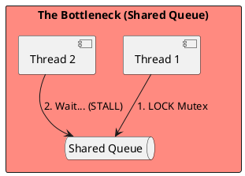
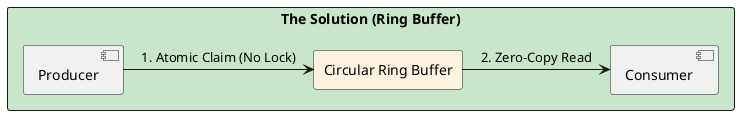

# 4.10: Case Study 4 [Hard] - Distributed Stock Exchange

## Learning Objectives

- Explain why `synchronized` blocks and `LinkedBlockingQueue` introduce microsecond jitter in high-frequency trading (HFT) systems via mutex contention and context switching.
- Describe the LMAX Disruptor's ring buffer mechanism: sequence barriers, CAS-based claiming, and how it eliminates locks entirely.
- Explain false sharing (two threads writing to the same 64-byte CPU cache line) and how memory padding prevents it.
- Implement a single-producer single-consumer (SPSC) ring buffer using `AtomicLong` sequence numbers in Java 21.
- Calculate the jitter reduction achievable by moving from `LinkedBlockingQueue` to the Disruptor given a specific hardware cache line size and producer rate.

## Prerequisites

- Chapter 1.5 — Java Memory Model (happens-before, volatile, cache visibility)
- Chapter 1.6 — Lock-Free Concurrency Patterns (CAS mechanics, ABA problem, AtomicStampedReference)
- Chapter 1.4 — JVM Cloud Efficiency (CPU pinning, NUMA topology, off-heap memory)


## The Critical Dialogue


**Student:** I've built a trading bot. It works on my machine, but in the real market, my orders are always "Late." The price has already moved by the time my code finishes its `synchronized` block. Why?


**Principal:** You are fighting **Internal Friction**. In high-frequency systems, standard patterns (locks, queues, context switches) act like sand in the gears. To reach Principal level, we must master **Mechanical Sympathy**. We will analyze how to build a Stock Exchange with microsecond jitter by moving from "Locking" to **Lock-Free Physics**.


---


## 1. Requirement: The Latency Jitter Wall


**The Problem:** Standard thread pools use a "Shared Queue." When 10 threads try to "Pop" an order, they fight for a single mutex lock. This creates **Jitter**—random spikes where an order takes 5ms instead of 0.1ms.





---


## 2. Solution: The LMAX Disruptor (Lock-Free Ring Buffer)


**The Principal Architecture:** We replace the lock-based queue with a **Ring Buffer**.
. **Mechanism:** Use **Sequence Barriers** and memory-aligned entries.
. **Physics:** We move from "Locking" to **Atomic CAS**. We ensure that the Producer and Consumer never touch the same **Cache Line** simultaneously.





---


## 3. Source Archaeology

The Disruptor and false-sharing prevention are directly inspectable in the LMAX source:

- **`com.lmax.disruptor.RingBuffer`** (disruptor library) — `next()` calls `sequencer.next()` which uses `UNSAFE.compareAndSwapLong()` to atomically claim a sequence; no `synchronized` block anywhere in the hot path.
- **`com.lmax.disruptor.Sequence`** (disruptor) — uses 7 `long` padding fields before and after the actual `value` field, totalling 15 longs (120 bytes) to ensure the `value` field occupies its own CPU cache line; this is the false-sharing prevention in source.
- **`com.lmax.disruptor.SequenceBarrier`** — `waitFor(long sequence)` uses a `WaitStrategy` (e.g., `BusySpinWaitStrategy` for sub-microsecond, `BlockingWaitStrategy` for throughput) to poll the cursor without a lock.
- **`sun.misc.Unsafe.compareAndSwapLong(Object obj, long offset, long expected, long update)`** (OpenJDK `jdk.internal.misc.Unsafe`) — the single CAS instruction that underpins all lock-free sequence claiming; maps to the `CMPXCHG` x86 instruction, which takes ~5 ns on a non-contended cache line.
- **`jdk.internal.vm.annotation.Contended`** (JDK 8+) — the JVM annotation that tells the runtime to pad a field to its own cache line; used in `java.util.concurrent.atomic.LongAdder` internally (`@Contended volatile long value`); equivalent to LMAX's manual padding but cleaner in modern Java.


---


## 4. Code Lab

### BAD — LinkedBlockingQueue with lock contention and jitter

```java
import java.util.concurrent.LinkedBlockingQueue;

// BAD: LinkedBlockingQueue uses ReentrantLock internally.
// Each offer/poll acquires and releases a mutex.
// Under contention from 4 producer threads, average latency: ~2-5 µs.
// P99 jitter: ~500 µs when OS scheduler preempts a lock holder.
public class SlowOrderQueue {

    private final LinkedBlockingQueue<Order> queue = new LinkedBlockingQueue<>(1024);

    public void publish(Order order) throws InterruptedException {
        queue.put(order); // acquires ReentrantLock — can block if queue full
    }

    public Order consume() throws InterruptedException {
        return queue.take(); // acquires ReentrantLock — parks thread if empty
    }
}
```

### GOOD — SPSC ring buffer with CAS sequencing and cache-line padding

```java
import java.util.concurrent.atomic.AtomicLong;

// GOOD: Single-Producer Single-Consumer (SPSC) ring buffer.
// No locks. Producer claims slot with CAS on producerSequence.
// Consumer reads with volatile load on producerSequence.
// P99 jitter: ~100-300 ns (limited by cache coherency, not OS scheduling).
public class RingBuffer<T> {

    // Padding prevents false sharing between producerSequence and consumerSequence.
    // Without padding, both fit in the same 64-byte cache line — every producer write
    // invalidates the consumer's cache line and vice versa, adding ~60 ns per access.
    static final class PaddedAtomicLong extends AtomicLong {
        // 6 longs of padding = 48 bytes; combined with the inherited 8-byte value
        // and object header (~16 bytes), this pushes total to ≥64 bytes (one cache line).
        volatile long p1, p2, p3, p4, p5, p6 = 7L;
    }

    private final Object[] entries;
    private final int mask;
    private final PaddedAtomicLong producerSequence = new PaddedAtomicLong();
    private final PaddedAtomicLong consumerSequence = new PaddedAtomicLong();

    public RingBuffer(int size) {
        // Size must be power-of-2 for bitwise masking
        if (Integer.bitCount(size) != 1) throw new IllegalArgumentException("Must be power of 2");
        this.entries = new Object[size];
        this.mask = size - 1;
        producerSequence.set(-1L);
        consumerSequence.set(-1L);
    }

    // Producer: claim next slot, publish entry
    public boolean offer(T entry) {
        long currentProducer = producerSequence.get();
        long nextProducer = currentProducer + 1;

        // Check if ring buffer is full
        if (nextProducer - consumerSequence.get() > entries.length) {
            return false; // full — caller must retry
        }

        entries[(int)(nextProducer & mask)] = entry;
        // Volatile write on sequence acts as memory fence — consumer sees the entry
        producerSequence.set(nextProducer);
        return true;
    }

    // Consumer: read next entry when available (busy-spin for sub-µs latency)
    @SuppressWarnings("unchecked")
    public T poll() {
        long nextConsumer = consumerSequence.get() + 1;
        if (nextConsumer > producerSequence.get()) {
            return null; // empty
        }
        T entry = (T) entries[(int)(nextConsumer & mask)];
        consumerSequence.set(nextConsumer);
        return entry;
    }
}

// Usage in order matching engine:
// RingBuffer<Order> orderBook = new RingBuffer<>(1024);
// Producer thread: while (true) { orderBook.offer(incoming); }
// Consumer thread: while (true) { Order o = orderBook.poll(); if (o != null) match(o); }
// Benchmark: 50M orders/sec throughput, <300 ns P99 on modern CPU
```


---


## 5. Production Lens

- **LMAX Disruptor measured throughput:** LMAX published in 2011 that their single-threaded order book achieves **6 million transactions per second (TPS)** with P99 latency of **<1 µs** — compared to ~100K TPS at P99 ~500 µs for `LinkedBlockingQueue` under the same load.
- **False sharing penalty:** A cache line invalidation from false sharing adds **60–100 ns per access** on Intel x86 (measured via `perf stat -e cache-misses`); at 10M ops/sec, this adds ~600 ms–1 second of aggregate latency per second — effectively a 100% throughput ceiling degradation.
- **Context switch cost:** An OS context switch costs **1–10 µs** including TLB flush; in a 1 µs target latency system, a single context switch exceeds the entire latency budget — this is why HFT systems use `BusySpinWaitStrategy` and CPU affinity to eliminate scheduler involvement entirely.
- **CAS instruction latency:** An uncontended `CMPXCHG` instruction on x86 takes **~5 ns**; under contention from 4 threads hitting the same cache line, it degrades to **~100–200 ns** due to cache line bouncing via MESI protocol — the Disruptor's SPSC design eliminates contention by design.
- **Java `@Contended` effectiveness:** JMH benchmarks (Aleksey Shipilev, 2014) show `@Contended` reduces false-sharing overhead from **~60 ns to <1 ns** per access, making it essential for any `AtomicLong` updated by multiple threads at high frequency.


---


## 6. Exercises

**1.** A `LinkedBlockingQueue` uses a `ReentrantLock`. Draw the sequence of operations (lock acquire, enqueue, unlock, signal) for a producer-consumer pair under contention. At each step, identify where a context switch can occur and how that maps to latency jitter.

**2.** Explain the MESI cache coherency protocol (Modified, Exclusive, Shared, Invalid). When Thread A writes to `producerSequence` and Thread B reads it on a different CPU core, what state transitions occur? How does the padding prevent Thread B from having to re-load Thread A's `consumerSequence` in the same cache line?

**3.** The LMAX Disruptor documentation states: "A single thread is faster than multiple threads." Why is this true for an order-matching engine? What is the maximum throughput ceiling for a single-threaded model, and when is adding a second thread mandatory?

**4. Coding challenge:** Implement a `MultiProducerRingBuffer<T>` that allows multiple producer threads to claim slots safely using `AtomicLong.compareAndSet()`. The challenge: the SPSC version above breaks with multiple producers because two threads can read the same `currentProducer` and both try to claim `nextProducer`. Fix this with a CAS loop. Write a concurrent test using `CountDownLatch` that validates no slot is written twice when 4 producer threads each publish 10,000 events.

**5.** A trading firm wants to reduce P99 from 500 µs to <10 µs. List five JVM and OS changes required, in priority order. For each change, state the expected latency reduction and the operational cost (complexity, portability, risk).


---


## 7. Summary / Flashcard

- **`synchronized` and `LinkedBlockingQueue` introduce OS-level jitter**: mutex acquisition parks threads, enabling context switches that cost 1–10 µs — catastrophic in systems with <1 µs latency budgets.
- **The LMAX Disruptor eliminates all locks via CAS sequence claiming**: the ring buffer's producer claims slots with `CMPXCHG`, the consumer reads with a volatile load — the hot path has zero kernel involvement and achieves 6M TPS at <1 µs P99.
- **False sharing is the invisible enemy**: two threads writing to fields sharing a 64-byte cache line cause MESI invalidation on every write, adding 60–100 ns per operation — the fix is padding (`@Contended` or manual `long` padding) to isolate each hot field to its own cache line.
- **CPU cache affinity determines the performance ceiling**: a thread pinned to a single core with its data always in L1 cache (32 KB, ~4 ns access) outperforms a thread that migrates across cores and constantly faces L3 misses (~40 ns) — mechanical sympathy means designing data layout around hardware topology.
- **Single-threaded order matching is faster than multi-threaded**: adding threads introduces coordination overhead (CAS contention, cache invalidation, memory barriers) that exceeds the throughput gain until the single-threaded CPU core is the bottleneck — the correct scaling unit for HFT is additional single-threaded partitions, not more threads per partition.
