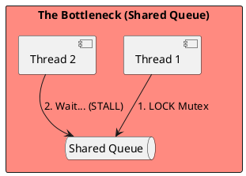
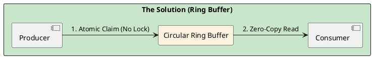

# 4.10: Case Study 4 [Hard] - Distributed Stock Exchange

## The Critical Dialogue

**Student:** I've built a trading bot. It works on my machine, but in the real market, my orders are always "Late." The price has already moved by the time my code finishes its `synchronized` block. Why?

**Principal:** You are fighting **Internal Friction**. In high-frequency systems, standard patterns (locks, queues, context switches) act like sand in the gears. To reach Principal level, we must master **Mechanical Sympathy**. We will analyze how to build a Stock Exchange with microsecond jitter by moving from "Locking" to **Lock-Free Physics**.

---

## 1. Requirement: The Latency Jitter Wall

**The Problem:** Standard thread pools use a "Shared Queue." When 10 threads try to "Pop" an order, they fight for a single mutex lock. This creates **Jitter**—random spikes where an order takes 5ms instead of 0.1ms.

---

## 2. Solution: The LMAX Disruptor (Lock-Free Ring Buffer)

**The Principal Architecture:** We replace the lock-based queue with a **Ring Buffer**.
. **Mechanism:** Use **Sequence Barriers** and memory-aligned entries.
. **Physics:** We move from "Locking" to **Atomic CAS**. We ensure that the Producer and Consumer never touch the same **Cache Line** simultaneously.

---

## 🧠 Principal's Inquiry

. **The LMAX Myth:** Why is LMAX faster with a single thread than with 10 threads? (Hint: The **L1 Cache Line Invalidation** penalty).

. **False Sharing:** How does the Disruptor use **Memory Padding** to prevent two threads from serializing on the same 64-byte cache line?

**Principal Summary:** High-Frequency Architecture is about **Removing the Middleman**. We use Ring Buffers to match CPU speed and Off-heap memory to bypass the JVM.
 Greenlanders use the type system to prove our software invariants.
