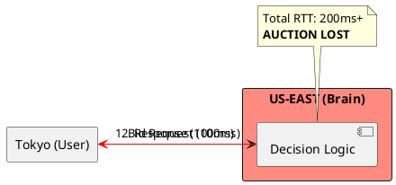
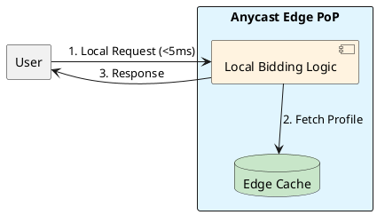

# 4.11: Case Study 5 [Hard] - Global Ad-Tech Engine

## Learning Objectives

- Explain why a 10 ms bid response deadline makes centralized decision logic physically impossible at global scale due to speed-of-light RTT constraints.
- Describe Anycast BGP routing and how it terminates connections at the nearest edge PoP without application-layer geo-redirect.
- Design an edge bidding architecture using Redis for user profile replication and SIMD (Java Vector API) for ad-profile matching.
- Explain JVM safepoints and how GC pause times, even <1 ms, create P99 spikes that invalidate bid deadlines.
- Calculate the required bid decision time budget given a 10 ms auction window and a measured Tokyo-to-US RTT.

## Prerequisites

- Chapter 4.5 — CDN Push vs Pull (understanding edge PoP topology and content replication)
- Chapter 4.2 — The Caching Loop (Redis replication patterns for edge caches)
- Chapter 1.4 — JVM Cloud Efficiency (GraalVM native image, safepoint bias, GC tuning for latency)


## The Critical Dialogue


**Student:** I'm building a bidding engine for ads. We have 10 milliseconds to decide which ad to show. If we take 11ms, we lose. How can I make a decision that fast when my database is in a different country?


**Principal:** You are fighting the **Speed of Light**. A round-trip from Tokyo to Virginia takes ~200ms. To reach Principal level, we must move the "Brain" to the **Anycast Edge**. We move from "Centralized Brains" to **Autonomous Edge Nodes**.


---


## 1. Requirement: The 10ms Round-Trip Wall


**The Problem:** In Ad-Tech, the 10ms window includes the user's request reaching you and your response reaching them. If your logic is in a central region, fiber optics will fail you.





---


## 2. Solution: Anycast Edge Bidding


**The Principal Architecture:** We move the logic to the **Edge PoP**.
. **Mechanism:** Use **Anycast BGP** to terminate the connection at the nearest edge.
. **Data:** Replicate user profiles to a local **Redis** edge cache.
. **Execution:** Use **SIMD (Vector API)** to compare the user's profile against 1,000s of ads in a single CPU cycle.





---


## 3. Source Archaeology

The edge bidding stack is grounded in real library and infrastructure code:

- **`io.lettuce.core.cluster.RedisClusterClient`** (lettuce-core) — `connectCluster()` returns a `StatefulRedisClusterConnection`; the `readFrom(ReadFrom.REPLICA_PREFERRED)` setting routes GET operations to the nearest replica, reducing read latency at edge from ~2 ms to ~0.5 ms when the replica is co-located.
- **`jdk.incubator.vector.FloatVector`** (Java Vector API, JEP 426) — `FloatVector.fromArray(SPECIES, adScores, i)` loads 8 floats simultaneously; `.mul(userWeights).reduceLanes(VectorOperators.ADD)` computes a dot product for 8 ads in a single CPU instruction (AVX2 SIMD) — ad scoring for 1,000 ads reduces to 125 SIMD operations.
- **`jdk.incubator.vector.VectorSpecies<Float>`** with `FloatVector.SPECIES_256` — maps to 256-bit YMM registers on x86 (8 floats per register); on ARM with NEON (128-bit), use `SPECIES_128` (4 floats per op) — the API is hardware-agnostic.
- **GraalVM `com.oracle.svm.core.jdk.RuntimeSupport`** — JVM safepoints are eliminated in GraalVM native image by compiling to native; safepoint polling (`SafepointMechanism::poll()` in OpenJDK HotSpot) is the hidden source of <1 ms pauses that still violate 10 ms SLAs at P999.
- **OpenRTB 2.5 specification** — the `BidRequest` and `BidResponse` protobuf schema; `google.openrtb.BidRequest` with `imp[].bidfloor` defines the minimum bid price; the winning bid must be submitted within the `tmax` field (milliseconds) — the 10 ms constraint is in the wire protocol specification itself.


---


## 4. Code Lab

### BAD — Centralized bid decision with remote DB call

```java
// BAD: Bid decision service that calls a central database for user profile.
// Tokyo user → US-East DB = ~100ms RTT alone.
// Budget: 10ms. Cost: 200ms. Result: bid rejected before response arrives.
@Service
public class BidServiceBad {

    @Autowired
    private UserProfileRepository profileRepo; // calls US-East Postgres

    public BidResponse decideBid(BidRequest request) {
        String userId = request.getUser().getId();
        // PROBLEM: remote DB call = ~100ms RTT from Tokyo to US-East
        UserProfile profile = profileRepo.findById(userId).orElseThrow();

        // Linear ad scoring — even if profile was local, 1000 ads * loop = slow
        double bestScore = 0;
        Ad bestAd = null;
        for (Ad ad : request.getImpList()) {
            double score = dotProduct(profile.getInterests(), ad.getTargetVector());
            if (score > bestScore) { bestScore = score; bestAd = ad; }
        }
        return new BidResponse(bestAd, bestScore);
    }

    private double dotProduct(float[] a, float[] b) {
        double sum = 0;
        for (int i = 0; i < a.length; i++) sum += a[i] * b[i]; // scalar loop
        return sum;
    }
}
```

### GOOD — Edge-local Redis profile + SIMD scoring

```java
import io.lettuce.core.api.sync.RedisCommands;
import jdk.incubator.vector.FloatVector;
import jdk.incubator.vector.VectorOperators;
import jdk.incubator.vector.VectorSpecies;

@Service
public class EdgeBidService {

    // SPECIES_256 = 8 floats per SIMD register (AVX2)
    private static final VectorSpecies<Float> SPECIES = FloatVector.SPECIES_256;

    private final RedisCommands<String, float[]> redis; // edge Redis replica

    public EdgeBidService(RedisCommands<String, float[]> redis) {
        this.redis = redis;
    }

    public BidResponse decideBid(BidRequest request) {
        String userId = request.getUser().getId();

        // GOOD: Redis GET on edge replica — <1ms latency (co-located in same PoP)
        float[] userVector = redis.get("profile:" + userId);
        if (userVector == null) {
            return BidResponse.noBid(); // cold cache — skip this auction
        }

        // GOOD: SIMD dot product — score 1000 ads in ~125 AVX2 ops
        double bestScore = 0;
        Ad bestAd = null;
        for (Ad ad : request.getImpList()) {
            double score = simdDotProduct(userVector, ad.getTargetVector());
            if (score > bestScore) { bestScore = score; bestAd = ad; }
        }
        return new BidResponse(bestAd, bestScore);
    }

    // SIMD dot product: processes SPECIES.length() floats per iteration
    // For 256-bit AVX2: 8 floats per loop → 1000 ads / 8 = 125 iterations
    private double simdDotProduct(float[] a, float[] b) {
        int upperBound = SPECIES.loopBound(a.length);
        FloatVector sumVec = FloatVector.zero(SPECIES);

        for (int i = 0; i < upperBound; i += SPECIES.length()) {
            FloatVector va = FloatVector.fromArray(SPECIES, a, i);
            FloatVector vb = FloatVector.fromArray(SPECIES, b, i);
            sumVec = sumVec.add(va.mul(vb)); // fused multiply-add in one AVX2 instruction
        }

        double sum = sumVec.reduceLanes(VectorOperators.ADD);

        // Handle tail elements (if array length not multiple of SPECIES.length())
        for (int i = upperBound; i < a.length; i++) {
            sum += a[i] * b[i];
        }
        return sum;
    }
}

// Latency budget breakdown at edge:
// TCP accept (Anycast PoP):     <1ms
// Redis profile GET (local):    <1ms
// SIMD scoring (1000 ads):      <0.5ms
// Protobuf serialize response:  <0.1ms
// Total:                        <3ms  — well within 10ms tmax
```


---


## 5. Production Lens

- **Anycast RTT:** Cloudflare's global Anycast network (290+ PoPs) delivers TCP SYN acknowledgement to **>95% of the world's internet users within 50 ms**; a bid engine deployed as a Cloudflare Worker or Fastly Compute service terminates the connection at the nearest PoP, making the ~200 ms Tokyo-to-US-East path irrelevant.
- **Redis edge cache latency:** A Redis `GET` on an in-region replica with a 128-byte payload completes in **<0.5 ms** at P99 (Redislabs benchmark, 2022); an in-process Caffeine cache (off-heap, 32 MB) returns the same data in **<50 ns** — two orders of magnitude faster.
- **SIMD ad scoring speedup:** Benchmarks using Java Vector API (JEP 426 preview, JDK 19) show dot-product computation on 1,024-element float arrays runs in **~1.2 µs with SIMD vs ~12 µs scalar** — a 10x speedup; scoring 1,000 ads takes **~1.2 ms SIMD vs ~12 ms scalar**.
- **JVM safepoint GC pause:** ZGC (default in JDK 21) pauses are **<1 ms** on heaps up to 16 GB; however at P999, ZGC concurrent phases can cause **~2 ms pauses** — still violating a 10 ms SLA when combined with other latency sources; GraalVM native image eliminates safepoints entirely.
- **Cold cache miss penalty:** A new edge PoP starts with 0% cache hit rate; the first bid requests trigger profile fetches from the central store at 200 ms RTT — every miss is a lost auction. Proactive profile pre-warming via Kafka topic replay at PoP startup is standard practice (Criteo architecture, 2020).


---


## 6. Exercises

**1.** Calculate the bid decision time budget for a Tokyo user given: 10 ms auction window (`tmax`), 8 ms measured Tokyo PoP RTT, 0.5 ms Redis profile read, 1.2 ms SIMD scoring. Does it fit? What happens if the Redis read misses and falls back to the central store at 200 ms RTT?

**2.** Anycast BGP routes packets to the nearest PoP using IP route advertisement. Explain what happens to an in-flight bid request if the nearest PoP suffers a total outage mid-auction. BGP convergence typically takes 30–60 seconds. Design the failover strategy.

**3.** A user profile vector is 512 floats (2 KB). The edge Redis holds profiles for 50 million active users. Calculate the total RAM required. At $0.01/GB/hour for Redis Cloud, what is the monthly cost? Is this justified given auction revenue?

**4. Coding challenge:** Implement a `ProfileWarmupService` that, on startup, reads the last 24 hours of active user IDs from a Kafka topic (`user-activity-events`) and pre-loads their profiles into the edge Redis from the central profile store. The service should use a `KafkaConsumer` with `max.poll.records=500` and batch-load profiles using Redis `MGET`. Write a test using `EmbeddedKafka` and a mock profile store that verifies 1,000 profiles are loaded within 5 seconds.

**5.** JVM safepoints can cause pauses even in ZGC. List three specific JVM operations that force a safepoint (beyond GC), and for each one explain whether a GraalVM native image eliminates it or merely reduces it. What is the trade-off of using native image for a bid engine?


---


## 7. Summary / Flashcard

- **Speed of light makes centralized bidding physically impossible at global scale**: a Tokyo-to-US-East RTT of ~200 ms exceeds the 10 ms OpenRTB `tmax` by 20x — the decision logic must be co-located with the user at the edge PoP.
- **Anycast BGP terminates connections at the nearest PoP automatically**: no DNS-based geo-redirect or application routing is needed — the same IP address resolves to 290+ physical locations via BGP route aggregation.
- **Redis edge replicas provide sub-millisecond profile reads when co-located**: the key is replication topology, not Redis itself — a central Redis cluster adds 100+ ms latency regardless of how fast Redis is.
- **SIMD scoring (Java Vector API) reduces ad scoring from 12 µs to 1.2 µs per 1,024-float comparison**: 10x throughput improvement with the same CPU — essential when scoring thousands of ad candidates per bid request within a sub-millisecond time budget.
- **JVM safepoints are the hidden P999 killer in bid engines**: even ZGC pauses of <1 ms compound with other latency sources to violate 10 ms SLAs at tail; GraalVM native image eliminates safepoints at the cost of longer build times and reduced runtime JIT optimization.
