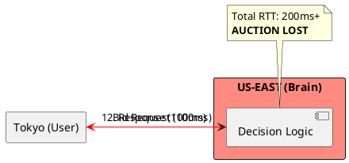
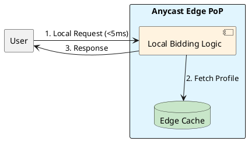

# 4.11: Case Study 5 [Hard] - Global Ad-Tech Engine

## The Critical Dialogue

**Student:** I'm building a bidding engine for ads. We have 10 milliseconds to decide which ad to show. If we take 11ms, we lose. How can I make a decision that fast when my database is in a different country?

**Principal:** You are fighting the **Speed of Light**. A round-trip from Tokyo to Virginia takes ~200ms. To reach Principal level, we must move the "Brain" to the **Anycast Edge**. We move from "Centralized Brains" to **Autonomous Edge Nodes**.

---

## 1. Requirement: The 10ms Round-Trip Wall

**The Problem:** In Ad-Tech, the 10ms window includes the user's request reaching you and your response reaching them. If your logic is in a central region, fiber optics will fail you.

---

## 2. Solution: Anycast Edge Bidding

**The Principal Architecture:** We move the logic to the **Edge PoP**.
. **Mechanism:** Use **Anycast BGP** to terminate the connection at the nearest edge.
. **Data:** Replicate user profiles to a local **Redis** edge cache.
. **Execution:** Use **SIMD (Vector API)** to compare the user's profile against 1,000s of ads in a single CPU cycle.

---

## 🧠 Principal's Inquiry

. **The Cold Cache:** What happens to bidding latency when a new Edge PoP is started?

. **P99 Jitter:** In a 10ms environment, why is the **JVM Safe-point** your biggest enemy?

**Principal Summary:** Ad-Tech Architecture is about **Decentralized Autonomy**. We use Anycast to conquer the Speed of Light and SIMD to conquer the CPU.
 Greenlanders use the type system to prove our software invariants.
