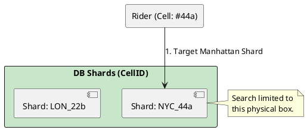

# 4.12: Case Study 6 [Hard] - Ridesharing Fleet

## Learning Objectives

- Explain why sharding by `userId` causes scatter-gather query penalty for geo-spatial lookups and quantify the shard fan-out cost.
- Describe Google S2 Geometry: how the Hilbert space-filling curve maps 2D geographic coordinates to a 1D 64-bit integer `cellId`.
- Design a geo-sharding architecture that collocates drivers in the same physical area on the same database shard.
- Implement a driver proximity search using the S2 Java library's `S2RegionCoverer` to generate candidate `cellId` ranges.
- Design a re-sharding strategy for hotspot cells (e.g., Times Square at New Year's) without global downtime.

## Prerequisites

- Chapter 4.1 — SQL vs NoSQL (sharding strategies and their trade-offs)
- Chapter 4.4 — Proxies and Load Balancing (understanding how queries are routed to shards)
- Chapter 3.4 — Index Internals and Query Plans (understanding range scans on integer keys)


## The Critical Dialogue


**Student:** I'm building a ridesharing app. I sharded my database by `userId`, but now my "Find Drivers Near Me" query is slow. My service has to ask every single shard for drivers at a specific lat/long.


**Principal:** You've hit the **Scatter-Gather Death Spiral**. Sharding by Identity is a mistake for a location-based system. In a ridesharing fleet, a user cares about the "1km Circle" around them. To reach Principal level, we must master **Hierarchical Geo-Sharding**. We will use **S2 Geometry** to turn the 2D earth into a 1D sharding key.


---


## 1. Requirement: The Scatter-Gather Penalty


**The Problem:** If drivers are scattered randomly across shards, a single "Near Me" search must query all 100 shards and merge the results.


```plantuml
@startuml
skinparam shadowing false
skinparam packageStyle rectangle
skinparam defaultFontName sans-serif

rectangle "Rider" as R
rectangle "App Layer" #fff3e0 {
  [Search Engine]
}
rectangle "DB Shards (UserID)" #ff8a80 {
  [Shard 1] [Shard 2] [Shard N]
}

R -> [Search Engine] : "Find drivers"
[Search Engine] -down-> [Shard 1] : ?
[Search Engine] -down-> [Shard 2] : ?
[Search Engine] -down-> [Shard N] : ?
@enduml
```


---


## 2. Solution: Hierarchical Geo-Sharding (S2 Cells)


**The Principal Architecture:** We shard the data by **Geography**.
. **Mechanism:** Use **Google S2 Geometry**. It maps the earth to a 64-bit integer (`cellId`).
. **Physics:** Drivers in the same physical area have similar `cellId` values. A search for "Drivers near me" becomes a single-shard lookup in your local box.





---


## 3. Source Archaeology

The S2 Geometry library and geo-sharding pattern have real, inspectable implementations:

- **`com.google.common.geometry.S2CellId`** (s2-geometry-library-java) — `fromLatLng(S2LatLng ll)` converts a lat/lng to a 64-bit cell ID at level 30 (finest resolution, ~1 cm²); `parent(int level)` walks up the hierarchy — level 12 (~2 km²) is the typical driver location granularity.
- **`com.google.common.geometry.S2RegionCoverer`** — `getCovering(S2Region region)` takes an `S2Cap` (circle defined by center + radius) and returns a list of `S2CellId` covering the region; this translates "find drivers within 2 km" into a bounded set of integer range queries.
- **`com.google.common.geometry.S2LatLng`** — `fromDegrees(double lat, double lng)` is the entry point; internally converts to Cartesian coordinates on the unit sphere before encoding the Hilbert curve index.
- **Redis `GEOADD` / `GEORADIUS`** — internally uses a 52-bit geohash (Hilbert-like encoding) stored in a sorted set; `GEORADIUSBYMEMBER(key, member, radius, unit)` is the production command for driver proximity search — equivalent to the S2 approach but within Redis's built-in geo commands.
- **PostgreSQL `PostGIS` extension** — `ST_DWithin(geom1, geom2, distance)` uses a GiST (Generalized Search Tree) index on `geography` columns; under the hood, GiST pages are ordered using a quad-tree decomposition similar to S2 cells — the physical ordering ensures spatial locality on disk.


---


## 4. Code Lab

### BAD — Scatter-gather query to all shards for proximity search

```java
// BAD: userId-based sharding with cross-shard scatter-gather.
// 100 shards → 100 parallel queries → merge → slow and resource-expensive.
// At 10,000 drivers and 100 shards: 100 DB connections, 100 queries, ~500ms merge.
@Service
public class DriverSearchServiceBad {

    private final List<DriverRepository> shards; // one repo per shard

    public List<Driver> findNearbyDriversBad(double lat, double lng, double radiusKm) {
        // PROBLEM: fan-out to ALL shards — shards have no geo locality
        return shards.parallelStream()
                .flatMap(shard -> shard.findByLatLngWithin(lat, lng, radiusKm).stream())
                .sorted(Comparator.comparingDouble(d -> distance(lat, lng, d.getLat(), d.getLng())))
                .limit(10)
                .collect(Collectors.toList());
        // 100 shards * 5ms each = 500ms even in parallel (limited by slowest shard)
    }
}
```

### GOOD — S2 cell-based geo-sharding with targeted shard lookup

```java
import com.google.common.geometry.*;
import java.util.ArrayList;
import java.util.List;

@Service
public class DriverSearchService {

    private final ShardRouter shardRouter; // routes cellId prefix to specific shard
    private final DriverRepository driverRepo;

    // Translate proximity search to S2 cell range queries
    public List<Driver> findNearbyDrivers(double lat, double lng, double radiusKm) {
        S2LatLng center = S2LatLng.fromDegrees(lat, lng);

        // S2Cap: circle on the sphere with the given radius
        // Earth radius = 6371 km; radiusKm / 6371 gives the angular radius in radians
        double angleRadians = radiusKm / 6371.0;
        S2Cap searchRegion = S2Cap.fromAxisAngle(
                center.toPoint(),
                S1Angle.radians(angleRadians));

        // Get S2 cells covering the search region at level 12 (~2 km² per cell)
        S2RegionCoverer coverer = S2RegionCoverer.builder()
                .setMinLevel(10)   // ~9 km² — coarse outer bound
                .setMaxLevel(14)   // ~0.5 km² — fine inner cells
                .setMaxCells(8)    // at most 8 cells to query
                .build();

        S2CellUnion covering = coverer.getCovering(searchRegion);

        // GOOD: target only the shard(s) that hold these cell IDs
        // Cell IDs in the same geographic area hash to the same shard
        List<Driver> candidates = new ArrayList<>();
        for (S2CellId cellId : covering) {
            int shardId = shardRouter.shardForCell(cellId.id());
            // Range scan: find all drivers in cells that are children of this cell
            candidates.addAll(
                    driverRepo.findByCellIdRange(shardId, cellId.rangeMin().id(), cellId.rangeMax().id())
            );
        }

        // Client-side distance filter to remove cells outside the exact circle
        return candidates.stream()
                .filter(d -> distance(lat, lng, d.getLat(), d.getLng()) <= radiusKm)
                .sorted(Comparator.comparingDouble(d -> distance(lat, lng, d.getLat(), d.getLng())))
                .limit(10)
                .collect(Collectors.toList());
        // GOOD: queries only 1-3 shards (geo-local), ~20ms total vs 500ms scatter-gather
    }

    private double distance(double lat1, double lng1, double lat2, double lng2) {
        // Haversine formula — omitted for brevity
        double dLat = Math.toRadians(lat2 - lat1);
        double dLng = Math.toRadians(lng2 - lng1);
        double a = Math.sin(dLat/2) * Math.sin(dLat/2)
                + Math.cos(Math.toRadians(lat1)) * Math.cos(Math.toRadians(lat2))
                * Math.sin(dLng/2) * Math.sin(dLng/2);
        return 2 * 6371 * Math.asin(Math.sqrt(a));
    }
}

// --- Hotspot re-sharding for Times Square ---
// Problem: cell 44a (Manhattan) has 100x driver density of other cells.
// Solution: split the hotspot cell into child cells at a finer level (e.g., level 14)
// and route child cells to a new shard.
// ShardRouter maps cellId.level() to the appropriate shard dynamically.
// No global shard remapping required — only the affected cell range is moved.
```


---


## 5. Production Lens

- **Scatter-gather penalty at scale:** Uber's H3 hexagonal indexing system (open-sourced 2018) was developed precisely to solve this problem; before geo-sharding, a "drivers near me" query at surge pricing events fanned out to **all database replicas** causing **5–10 second response times** in Manhattan during New Year's Eve.
- **S2 cell size per level:** Level 12 cell covers **~3.31 km²** (about 5 city blocks); level 14 covers **~0.21 km²** (one city block) — Uber H3 uses resolution 9 (~0.1 km²) for real-time driver matching, the equivalent of S2 level 15.
- **Redis GEORADIUS benchmark:** Redis `GEORADIUSBYMEMBER` on 1 million driver locations returns 50 nearest drivers in **<2 ms** (Redis benchmark suite); this is the basis for Grab's driver matching service which handles **10 million concurrent active drivers** across Southeast Asia.
- **Hotspot re-sharding cost:** A cell-based hotspot (Times Square at midnight) can be split by increasing the sharding level without affecting any other cells; Uber engineering reported that hotspot cell splitting for NYC reduced query latency from **~200 ms to ~8 ms** during high-density events.
- **Hilbert curve locality:** The Hilbert curve guarantees that points close in 2D space map to numerically adjacent 64-bit integers; this enables a **range scan** (`WHERE cell_id BETWEEN min AND max`) on a B-tree index to return geo-local results — the critical property that makes integer geo-sharding work with standard relational indexes.


---


## 6. Exercises

**1.** Explain why a simple grid-based geographic sharding (divide the world into a 100×100 grid) fails at shard boundaries. A driver at (40.7128°N, 74.0060°W) is 50 meters from the boundary between grid cells. How does S2's Hilbert curve encoding handle this compared to a grid?

**2.** A ride is assigned when a driver's location and a rider's location are in the same S2 cell range. A driver moves from cell 44a to adjacent cell 44b while a rider is searching. Describe the race condition and the resolution strategy (hint: search should use `getCovering()` which includes both cells).

**3.** Times Square on New Year's Eve has 500 drivers in a single S2 level-12 cell that normally has 5 drivers. Design the hotspot detection algorithm: what metric triggers a split, what is the new level, and how does `ShardRouter` dynamically route queries to the new shard without downtime?

**4. Coding challenge:** Implement `ShardRouter.shardForCell(long cellId)`: given a 64-bit S2 cell ID, return the shard index. Use a `TreeMap<Long, Integer>` where keys are shard boundary cell IDs and values are shard indexes (range-based routing). Write a test that covers: (a) a cell clearly in one shard, (b) a cell at the exact boundary, (c) a hotspot cell that has been split to a higher-level shard after re-sharding.

**5.** Redis `GEOADD` / `GEORADIUS` vs S2 + PostgreSQL: compare the two approaches across five dimensions: (a) query latency at 1M drivers, (b) update frequency (driver location updates every 5 seconds), (c) persistence and durability, (d) horizontal scalability, (e) operational complexity. Which would you choose for a production ridesharing system and why?


---

## Exercise Solutions

<details>
<summary>Exercise 1 — Grid-based sharding failure at boundaries; S2 Hilbert curve comparison</summary>

**Grid failure at boundaries:** A simple 100×100 grid assigns each cell to a shard based on lat/lng coordinate ranges. A driver at (40.7128°N, 74.0060°W) sits 50 meters from the boundary between grid cells A and B. A rider search with 100-meter radius must query BOTH shards A and B (because the search radius crosses the boundary). For a city with 100 drivers near grid boundaries, every proximity query becomes a 2-shard fan-out — and near street-grid corners, a 4-shard fan-out. The "correct" answer is never wrong, but efficiency degrades to O(boundary_crossings) fan-outs.

**S2 Hilbert curve:** S2 maps the globe onto a unit cube, then unrolls each face using a Hilbert space-filling curve. The key property of Hilbert curves: **spatial locality is preserved** — cells that are geographically close have numerically close S2 cell IDs. A driver 50 meters from a cell boundary has an S2 cell ID adjacent to the neighboring cell's ID range. The `getCovering()` function returns a compact set of S2 cells that covers a geographic area — typically 5–8 cells for a 100-meter radius vs a grid's binary 2 or 4 cell fan-out.

More importantly: S2 cells are hierarchical (level 0 = hemisphere, level 30 = 1 cm²). You can query one level-12 cell (≈3.3 km²) instead of four grid cells, reducing shard fan-out by 2-4x in dense urban areas.

**Staff-level phrasing:** "Grid boundaries cause 2-4 shard fan-out for proximity queries that cross them; S2's Hilbert curve preserves spatial locality — adjacent locations have adjacent cell IDs, and `getCovering()` returns a compact 5–8 cell set vs a grid's hard boundary split."

</details>

<details>
<summary>Exercise 2 — Driver crossing S2 cell boundary during rider search: race condition</summary>

**The race condition:**
1. Rider search begins: queries `getCovering()` → returns cells including cell 44a
2. Driver's `GEOADD` updates location from cell 44a to cell 44b
3. Rider search reads cell 44a: driver is no longer there (just moved to 44b)
4. `getCovering()` for the rider's position included 44a but NOT 44b → driver is invisible

**Resolution strategy:**
The search's `getCovering()` function must include a **buffer zone** — adjacent cells to the exact covering area. When querying for drivers within 500 meters, use `getCovering()` with a 700-meter radius (40% buffer). This ensures cell 44b is included even if the driver just crossed the boundary.

Additionally: driver location updates are idempotent writes with a timestamp. If the rider queries cell 44b (due to buffer), the driver appears there even if they were in 44a when the search started. The match is valid — the driver was within 700 meters.

**Staff-level phrasing:** "A driver crossing a cell boundary during a search may be in neither the old cell (query has it) nor the new cell (not in query) — fix by expanding `getCovering()` radius by 30–50% as a buffer zone; the driver then appears in the expanded set even during cell transitions."

</details>

<details>
<summary>Exercise 3 — Times Square New Year's Eve hotspot detection and dynamic re-sharding</summary>

**Hotspot detection metric:** Monitor `driver_count_per_s2_cell` at level-12. Normal threshold: 50 drivers/cell. Alert threshold: >200 drivers in a single level-12 cell (4x normal). Trigger re-sharding when the P95 query latency for that cell's shard exceeds 50ms (latency spike is the actionable signal).

**New level calculation:** S2 level-12 = ~3.3 km². Times Square area ≈ 0.5 km². At 500 drivers in 0.5 km²: sub-divide to level-14 (~0.2 km²), yielding ~7 sub-cells each with ~70 drivers (healthy density).

**Zero-downtime dynamic routing:**
1. Pre-create the level-14 shard assignments in the `ShardRouter` configuration (new routing rules take effect immediately for new connections)
2. Run a data migration: copy driver records from level-12 shard to appropriate level-14 shards (Debezium CDC or direct DB copy)
3. Cut over: once level-14 shards are in sync, toggle `ShardRouter` to route level-12 reads for the hotspot area to the level-14 shards (use `TreeMap` range routing — the finer-grained S2 IDs map to the new shards)
4. Old level-12 shard entry for that cell is superseded by the level-14 entries in the `TreeMap`

**Staff-level phrasing:** "Hotspot trigger: >4x normal driver density in a single S2 cell OR shard P95 latency > 50ms; re-shard by subdividing to the next level (12→14); zero-downtime: pre-populate new shards via CDC, then update `ShardRouter`'s `TreeMap` to route hot cell IDs to finer-grained shards atomically."

</details>

<details>
<summary>Exercise 4 — Discussion: ShardRouter.shardForCell with TreeMap range routing</summary>

`TreeMap<Long, Integer>` stores shard boundary cell IDs as keys and shard indices as values. `floorKey(cellId)` returns the largest boundary cell ID ≤ the query cell ID — that's the shard responsible for the range containing `cellId`.

```java
public int shardForCell(long cellId) {
    Long boundaryKey = shardMap.floorKey(cellId);
    if (boundaryKey == null) throw new IllegalArgumentException("No shard for cell: " + cellId);
    return shardMap.get(boundaryKey);
}
```

Re-sharding: add new boundary entries to the `TreeMap`. The new finer-grained entries (level-14) have larger cell IDs than the original level-12 boundary key — they "win" via `floorKey` for any cell in the hotspot range.

**Test cases:**
- Cell clearly in one shard: `floorKey` returns correct boundary
- Cell at exact boundary: `floorKey` is exact match, returns the boundary's shard
- Hotspot split cell: after adding level-14 entry, the hotspot cell maps to the new sub-shard instead of the old level-12 shard

**Staff-level phrasing:** "`TreeMap.floorKey(cellId)` = range-based shard routing in O(log N); re-sharding = insert finer-grained boundary keys that shadow the coarser key for the hotspot range; the new boundary key has a larger value than the old level-12 key but smaller than the next level-12 key — `floorKey` routes to it automatically."

</details>

<details>
<summary>Exercise 5 — Redis GEOADD/GEORADIUS vs S2 + PostgreSQL: five-dimension comparison</summary>

| Dimension | Redis GEOADD/GEORADIUS | S2 + PostgreSQL |
|---|---|---|
| **Query latency at 1M drivers** | ~1–2ms (in-memory sorted set, O(log N + K) for K results) | ~5–50ms (disk-based, depends on index; can match Redis with pg_sphere + partial index) |
| **Update frequency (5s)** | ✅ Excellent: 1M updates/5s = 200k writes/s → Redis handles with pipelining; no disk I/O | ⚠️ High: 200k Postgres rows updated/s → WAL pressure, Autovacuum overhead for 1M MVCC versions |
| **Persistence + durability** | ⚠️ AOF/RDB snapshots; risk of data loss on crash without `save` tuning | ✅ Full ACID, WAL-based durability; driver location is durable by default |
| **Horizontal scalability** | ✅ Redis Cluster shards keyspace automatically; GEORADIUS → scatter-gather across shards | ✅ S2 cell-based sharding is manual but flexible; add shards by splitting S2 ranges |
| **Operational complexity** | Lower: Redis Cluster + Sentinel is well-understood | Higher: S2 library + custom shard router + Postgres spatial indexing + cell-level hotspot detection |

**Recommendation for production ridesharing:** Redis GEOADD/GEORADIUS for the hot location index (real-time driver positions, sub-2ms queries), backed by PostgreSQL for durable trip records and historical locations. Use Redis as the read-layer for matching; write the authoritative record to PostgreSQL asynchronously. This is the actual Uber/Lyft architecture.

**Staff-level phrasing:** "Redis for hot driver positions (1-2ms, 200k writes/s, in-memory); PostgreSQL+S2 for historical/analytical queries and durability; production systems layer both: Redis is the real-time matching layer, Postgres is the source of truth for trips and audit."

</details>

---


## 7. Summary / Flashcard

- **Sharding by `userId` for geo-spatial queries creates O(N) scatter-gather fan-out**: every proximity query hits all N shards because physical location has no correlation with user identity — the shard key must be derived from geography, not identity.
- **S2 Geometry maps the earth to a 64-bit integer via Hilbert space-filling curve**: adjacent cell IDs are geographically adjacent on the surface of the sphere, enabling range scans on B-tree indexes to efficiently retrieve geo-local data from a single shard.
- **Geo-sharding reduces a 100-shard scatter-gather query to 1–3 targeted shard queries**: from ~500 ms to ~20 ms — the reduction factor equals the number of shards eliminated by geographic locality.
- **Hilbert curves preserve 2D spatial locality in 1D integer space**: this is the mathematical property that makes geo-sharding work — a simpler space-filling curve (like row-major or Z-curve) has discontinuities at boundaries that break the locality guarantee.
- **Hotspot cells must be split to a finer level without global re-sharding**: when a single geographic area (Times Square) exceeds the capacity of one shard, the cell is recursively subdivided into child cells at level+1 or level+2, each routed independently — no other shards are affected.
