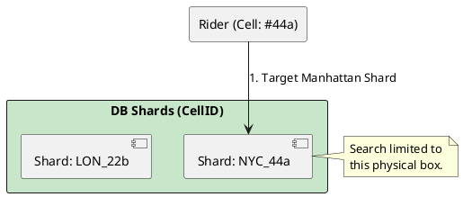

# 4.12: Case Study 6 [Hard] - Ridesharing Fleet


## The Critical Dialogue


**Student:** I'm building a ridesharing app. I sharded my database by `userId`, but now my "Find Drivers Near Me" query is slow. My service has to ask every single shard for drivers at a specific lat/long.


**Principal:** You've hit the **Scatter-Gather Death Spiral**. Sharding by Identity is a mistake for a location-based system. In a ridesharing fleet, a user cares about the "1km Circle" around them. To reach Principal level, we must master **Hierarchical Geo-Sharding**. We will use **S2 Geometry** to turn the 2D earth into a 1D sharding key.


---


## 1. Requirement: The Scatter-Gather Penalty


**The Problem:** If drivers are scattered randomly across shards, a single "Near Me" search must query all 100 shards and merge the results.


```plantuml
@startuml
skinparam shadowing false
skinparam packageStyle rectangle
skinparam defaultFontName sans-serif

rectangle "Rider" as R
rectangle "App Layer" #fff3e0 {
  [Search Engine]
}
rectangle "DB Shards (UserID)" #ff8a80 {
  [Shard 1] [Shard 2] [Shard N]
}

R -> [Search Engine] : "Find drivers"
[Search Engine] -down-> [Shard 1] : ?
[Search Engine] -down-> [Shard 2] : ?
[Search Engine] -down-> [Shard N] : ?
@enduml
```


---


## 2. Solution: Hierarchical Geo-Sharding (S2 Cells)


**The Principal Architecture:** We shard the data by **Geography**.
. **Mechanism:** Use **Google S2 Geometry**. It maps the earth to a 64-bit integer (`cellId`).
. **Physics:** Drivers in the same physical area have similar `cellId` values. A search for "Drivers near me" becomes a single-shard lookup in your local box.





---


## 🧠 Principal's Inquiry


. **The Hilbert Curve:** Why does S2 use a Hilbert Curve instead of a simple grid?


. **Load Balancing:** How do you re-shard a physical area that has 100x more traffic than the rest of the world (e.g. Times Square)?


**Principal Summary:** Geo-Scale Architecture is about **Mapping Digital State to Physical Reality**. We use S2 Geometry to ensure our data remains physically local to the user.
 Greenlanders use the type system to prove our software invariants.
