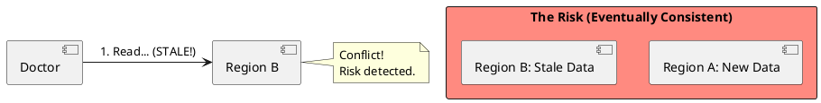
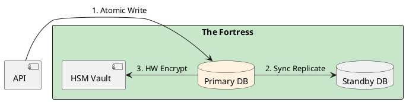

# 4.13: Case Study 7 [Medium] - National Healthcare Registry

## The Critical Dialogue

**Student:** I'm building a registry for medical records. Should I use Anycast and Sharding like we did for Netflix?

**Principal:** You are building a **Fortress**, not a **Streaming Fleet**. In healthcare, losing data is a legal catastrophe. Performance is secondary to **Audit Integrity** and **Strict ACID Consistency**. To reach Principal level, we must master **Vertical Scaling** and **Hardware Security**.

---

## 1. Requirement: The Auditability Wall

**The Problem:** In a distributed BASE system, data is eventually consistent. If a doctor updates a record in Region A, but Region B still sees old data, a patient could die.

---

## 2. Solution: The ACID Fortress (Postgres + HSM)

**The Principal Architecture:** We use a single, massive **ACID Fortress**.
. **Consistency:** One primary Postgres instance with synchronous replication to a "Hot Standby."
. **Security:** Field-level encryption with keys in an **HSM (Hardware Security Module)**.
. **Audit:** CDC streams every change to a tamper-proof log.

---

## 🧠 Principal's Inquiry

. **Vertical vs Horizontal:** When is it cheaper to buy a $50k server with 2TB of RAM than to manage a 50-node sharded cluster?

. **HSM Bottleneck:** Why is hardware encryption slower than software? How do you balance speed with security?

**Principal Summary:** Saturated Architecture is about **Integrity over Scale**. We use the ACID Fortress model when the cost of a single error is higher than the cost of latency.
 Greenlanders use the type system to prove our software invariants.
