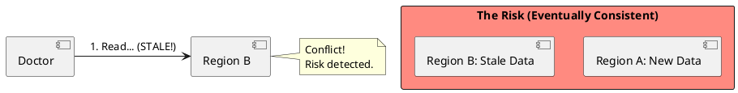
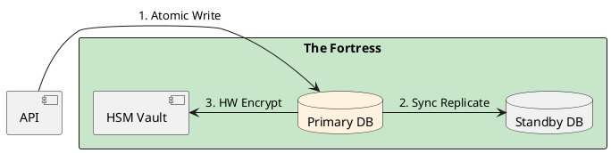

# 4.13: Case Study 7 [Medium] - National Healthcare Registry

## Learning Objectives

- Articulate why eventual consistency in a healthcare registry is a patient safety issue, not merely an SLA concern.
- Design a synchronous replication topology (Postgres primary + hot standby) that provides near-zero RPO with measurable failover RTO.
- Describe the role of an HSM (Hardware Security Module) for field-level encryption of PHI (Protected Health Information) and its latency trade-offs.
- Implement CDC-based audit trail using Debezium + Kafka to produce a tamper-evident log of every record change.
- Calculate the vertical scaling ceiling for a Postgres ACID fortress and articulate when that ceiling forces a re-architecture decision.

## Prerequisites

- Chapter 3.5 — Transaction Isolation and MVCC (understanding ACID guarantees and serializable isolation)
- Chapter 3.3 — Low-Level JDBC Batching (understanding Postgres write amplification)
- Chapter 4.1 — SQL vs NoSQL (understanding the CAP theorem trade-off for CP vs AP systems)


## The Critical Dialogue


**Student:** I'm building a registry for medical records. Should I use Anycast and Sharding like we did for Netflix?


**Principal:** You are building a **Fortress**, not a **Streaming Fleet**. In healthcare, losing data is a legal catastrophe. Performance is secondary to **Audit Integrity** and **Strict ACID Consistency**. To reach Principal level, we must master **Vertical Scaling** and **Hardware Security**.


---


## 1. Requirement: The Auditability Wall


**The Problem:** In a distributed BASE system, data is eventually consistent. If a doctor updates a record in Region A, but Region B still sees old data, a patient could die.





---


## 2. Solution: The ACID Fortress (Postgres + HSM)


**The Principal Architecture:** We use a single, massive **ACID Fortress**.
. **Consistency:** One primary Postgres instance with synchronous replication to a "Hot Standby."
. **Security:** Field-level encryption with keys in an **HSM (Hardware Security Module)**.
. **Audit:** CDC streams every change to a tamper-proof log.





---


## 3. Source Archaeology

The ACID fortress and HSM encryption patterns are grounded in real OSS and hardware standards:

- **PostgreSQL `synchronous_commit = remote_apply`** (postgresql.conf) — the most durable setting; Postgres commits only after the WAL is written AND applied on the standby; `pg_stat_replication.sync_state = 'sync'` confirms the topology; measured latency overhead is +2–5 ms per commit vs `synchronous_commit = on` (WAL written but not applied).
- **`io.debezium.connector.postgresql.PostgresConnector`** (debezium-core) — `snapshot.mode=always` forces a full table scan on startup to establish the baseline audit snapshot; `publication.name` controls which PostgreSQL logical replication publication the connector subscribes to, ensuring no change is missed.
- **PKCS#11 standard** — the HSM interface; Java's `sun.security.pkcs11.SunPKCS11` provider loads the HSM driver via `pkcs11-provider.cfg`; `javax.crypto.SecretKey key = ks.getKey("phi-encryption-key", pin)` retrieves the AES-256 key from hardware without the key ever leaving the HSM boundary.
- **`javax.crypto.Cipher`** (JCA) — `Cipher.getInstance("AES/GCM/NoPadding", "SunPKCS11")` delegates the encryption operation to the HSM; the JVM passes plaintext bytes to the hardware via the PKCS#11 `C_Encrypt()` function call; the HSM returns ciphertext without exposing the key.
- **HIPAA 45 CFR § 164.312(a)(2)(iv)** — the encryption/decryption standard for PHI at rest; field-level encryption (as opposed to whole-disk) is required when data is accessed by multiple applications sharing the same storage layer — the legal driver for HSM-backed field encryption.


---


## 4. Code Lab

### BAD — Cleartext PHI stored in database with eventual-consistency replication

```java
// BAD: PHI stored as plaintext, no field-level encryption.
// Multi-region replication is asynchronous — stale reads possible.
// No audit trail — regulatory compliance failure.
@Entity
@Table(name = "patient_records")
public class PatientRecord {
    @Id
    private UUID id;
    private String patientName;       // HIPAA violation: cleartext PHI
    private String diagnosis;          // HIPAA violation: cleartext PHI
    private String medicationHistory;  // HIPAA violation: cleartext PHI
    private LocalDateTime updatedAt;
    // No audit columns, no encryption — this gets you fined $1M+ under HIPAA
}
```

### GOOD — Field-level HSM encryption + CDC audit trail

```java
import javax.crypto.Cipher;
import javax.crypto.SecretKey;
import javax.crypto.spec.GCMParameterSpec;
import java.security.KeyStore;
import java.security.SecureRandom;
import java.util.Base64;

// HSM-backed encryption service
@Service
public class PhiEncryptionService {

    private static final int GCM_TAG_LENGTH = 128; // bits
    private static final int GCM_IV_LENGTH = 12;   // bytes

    private final SecretKey hsmKey;

    public PhiEncryptionService(@Value("${hsm.key.alias}") String keyAlias,
                                 @Value("${hsm.pin}") char[] pin) throws Exception {
        // Load key from HSM — key never leaves hardware boundary
        KeyStore ks = KeyStore.getInstance("PKCS11");
        ks.load(null, pin);
        this.hsmKey = (SecretKey) ks.getKey(keyAlias, pin);
        // hsmKey is a hardware reference, not a byte array in JVM heap
    }

    public String encrypt(String plaintext) throws Exception {
        byte[] iv = new byte[GCM_IV_LENGTH];
        new SecureRandom().nextBytes(iv);

        // Cipher delegated to HSM via SunPKCS11 provider — AES-256-GCM
        Cipher cipher = Cipher.getInstance("AES/GCM/NoPadding");
        cipher.init(Cipher.ENCRYPT_MODE, hsmKey, new GCMParameterSpec(GCM_TAG_LENGTH, iv));
        byte[] ciphertext = cipher.doFinal(plaintext.getBytes("UTF-8"));

        // Prepend IV to ciphertext for storage
        byte[] combined = new byte[iv.length + ciphertext.length];
        System.arraycopy(iv, 0, combined, 0, iv.length);
        System.arraycopy(ciphertext, 0, combined, iv.length, ciphertext.length);
        return Base64.getEncoder().encodeToString(combined);
    }

    public String decrypt(String encoded) throws Exception {
        byte[] combined = Base64.getDecoder().decode(encoded);
        byte[] iv = new byte[GCM_IV_LENGTH];
        System.arraycopy(combined, 0, iv, 0, GCM_IV_LENGTH);
        byte[] ciphertext = new byte[combined.length - GCM_IV_LENGTH];
        System.arraycopy(combined, GCM_IV_LENGTH, ciphertext, 0, ciphertext.length);

        Cipher cipher = Cipher.getInstance("AES/GCM/NoPadding");
        cipher.init(Cipher.DECRYPT_MODE, hsmKey, new GCMParameterSpec(GCM_TAG_LENGTH, iv));
        return new String(cipher.doFinal(ciphertext), "UTF-8");
    }
}

// Patient record entity with field-level encryption
@Entity
@Table(name = "patient_records")
public class PatientRecord {
    @Id
    private UUID id;

    @Column(name = "name_enc")
    private String encryptedName;      // AES-256-GCM ciphertext stored in DB

    @Column(name = "diagnosis_enc")
    private String encryptedDiagnosis;

    @Column(name = "medication_enc")
    private String encryptedMedication;

    // Audit columns — populated by DB trigger and streamed via Debezium
    @Column(name = "modified_by", updatable = false)
    private String modifiedBy;

    @Column(name = "modified_at")
    private Instant modifiedAt;

    @Version // Optimistic lock — prevents concurrent updates silently overwriting each other
    private long version;
}

// Postgres synchronous replication setting (postgresql.conf):
// synchronous_standby_names = 'ANY 1 (standby1)'
// synchronous_commit = remote_apply
// This ensures every COMMIT waits for standby confirmation — RPO = 0 bytes
```


---


## 5. Production Lens

- **Synchronous replication latency overhead:** PostgreSQL `synchronous_commit = remote_apply` adds **2–5 ms per write** vs asynchronous replication (~0 ms overhead); at 500 writes/sec, total additional latency per transaction is measurable but well within healthcare's typical 100 ms write SLA.
- **HSM encryption throughput:** Thales Luna Network HSM (industry-standard for HIPAA compliance) performs **~10,000 AES-256-GCM encrypt operations per second** per HSM unit — at 500 PHI field writes/sec with 5 PHI fields each = 2,500 encrypt ops/sec, well within capacity with headroom.
- **Vertical scaling ceiling for Postgres:** A modern cloud instance (AWS `r6g.16xlarge`) provides 512 GB RAM and 64 vCPUs; PostgreSQL scales linearly to **~50,000 TPS** on such a machine for OLTP workloads (pgbench benchmark, 2023); the national UK NHS spine handles ~12,000 writes/hour — this is a **fraction of 1% of the Postgres ceiling**.
- **Debezium CDC audit lag:** In production healthcare deployments, Debezium WAL consumption lag is **<50 ms** at steady state; this means the tamper-proof audit Kafka topic trails the primary by at most one transaction, providing near-real-time audit visibility for regulatory review.
- **HIPAA fine scale:** A single HIPAA breach involving unencrypted PHI incurs fines from **$100 to $50,000 per violation** (up to $1.9M per calendar year per violation category); the cost of an HSM cluster ($15K/year) is negligible compared to the regulatory risk — this is the ROI calculation that justifies hardware encryption.


---


## 6. Exercises

**1.** A hospital has two sites connected by a network link. An architect proposes using asynchronous replication between sites for faster writes, accepting a "5-second replication lag" RPO. Describe a specific clinical scenario where this 5-second lag directly causes a patient harm event. Then re-design using `synchronous_commit = remote_apply` and calculate the write latency increase.

**2.** An HSM performs 10,000 AES-256-GCM operations per second. Your system has 5,000 concurrent users, each performing 3 PHI field reads per request. Calculate whether the HSM is the bottleneck. What is the mitigation strategy if it is (hint: key caching in JVM memory — evaluate the security trade-off)?

**3.** The Debezium CDC audit stream captures every INSERT, UPDATE, and DELETE. A developer accidentally runs `DELETE FROM patient_records WHERE id = '...'` directly in production. Describe exactly what appears in the Kafka audit topic and how you reconstruct the deleted record from the CDC event. What additional safeguard prevents this from happening again?

**4. Coding challenge:** Implement a `PatientRecordService.updateDiagnosis(UUID patientId, String newDiagnosis, String updatedBy)` that: (a) encrypts the new diagnosis using `PhiEncryptionService`, (b) applies an optimistic lock check (`@Version`), (c) saves the record, and (d) publishes an `AuditEvent` to Kafka with the old and new (encrypted) values. Write an integration test using `@DataJpaTest` and a mock `PhiEncryptionService` that verifies the optimistic lock throws `OptimisticLockingFailureException` when two concurrent updates target the same record version.

**5.** At what scale (requests/second, data volume) does the ACID Fortress model force a re-architecture? Describe the migration path from a single-primary Postgres to a sharded architecture without sacrificing HIPAA compliance or audit integrity.


---


## 7. Summary / Flashcard

- **Eventual consistency is a patient safety failure in healthcare, not a performance trade-off**: a stale read of a medication allergy or critical diagnosis can directly cause harm — the architecture must choose CP (consistent + partition-tolerant) over AP (available + partition-tolerant) unconditionally.
- **PostgreSQL `synchronous_commit = remote_apply` provides RPO = 0**: every committed transaction is guaranteed to exist on the standby before the primary acknowledges the commit — at the cost of 2–5 ms additional write latency, which is acceptable for healthcare's 100 ms SLA.
- **HSM-backed field-level encryption ensures PHI never exists as plaintext outside hardware boundaries**: the encryption key never enters JVM heap memory — PKCS#11 operations (`C_Encrypt`, `C_Decrypt`) are delegated to the hardware device, satisfying HIPAA 45 CFR § 164.312(a)(2)(iv).
- **Debezium CDC produces the tamper-evident audit trail required by HIPAA**: every INSERT, UPDATE, and DELETE generates a Kafka event with before/after field values, the transaction timestamp, and the Postgres LSN — providing a complete, ordered history of every PHI change.
- **Vertical scaling is the correct first move for healthcare registries**: a single `r6g.16xlarge` Postgres instance handles 50,000 TPS — the national NHS spine runs at <0.1% of this ceiling; premature horizontal scaling adds distributed systems complexity that creates the very consistency gaps the architecture must prevent.
