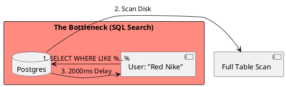

# 4.14: Case Study 8 [Medium] - E-commerce Mid-Market


## The Critical Dialogue


**Student:** I'm building an e-commerce site. We have 500k products. My Postgres database is slow because of `LIKE %...%` queries. Should I shard the database like Amazon?


**Principal:** You are using a **Relational Hammer** for a **Search Problem**. You don't need a sharded fleet; you need a **Hybrid Search Model**. Sharding at this scale is an expensive tax. We will move the search load off the database into a specialized engine.


---


## 1. Requirement: The Search Speed Wall


**The Problem:** Relational databases are optimized for **Records**, not **Tokens**. A search for "Red Nike" in SQL requires scanning millions of rows of text.





---


## 2. Solution: CQRS + Elasticsearch + Redis


**The Principal Architecture:** We build a **CQRS** hybrid.
. **Commands:** Postgres remains the source of truth for "Writes" (Orders, Stocks).
. **Queries:** We use **CDC** to stream product updates to **Elasticsearch**.
. **Speed:** We use **Redis** for product details to eliminate DB connections for reads.


```plantuml
@startuml
skinparam shadowing false
skinparam packageStyle rectangle
skinparam defaultFontName sans-serif

database "Postgres (Writes)" #c8e6c9
queue "Kafka / CDC" #e1f5fe as K
rectangle "Elastic (Reads)" #fff3e0 as ES
rectangle "Redis (Cache)" #fff3e0 as RED

[Order Service] -> "Postgres (Writes)" : 1. Update Stock
"Postgres (Writes)" -> K : 2. Stream Change
K -> ES : 3. Update Index
[Search API] -right-> ES : 4. Token Search (5ms)
@enduml
```


---


## 🧠 Principal's Inquiry


. **The Stale Index:** In a CDC-based system, what happens if the consumer is down for 10 minutes?


. **Inverted Index:** Why is Elasticsearch 100x faster for text searching than Postgres?


**Principal Summary:** Saturated Design is about **Tool Specialization**. We use Postgres for the "Source of Truth" and Elasticsearch for the "Query Experience."
 Greenlanders use the type system to prove our software invariants.
