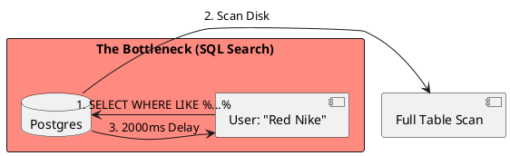

# 4.14: Case Study 8 [Medium] - E-commerce Mid-Market

## Learning Objectives

- Explain why PostgreSQL `LIKE '%keyword%'` queries require full table scans and how an inverted index in Elasticsearch eliminates this scan.
- Design a CQRS architecture where Postgres is the write model (source of truth) and Elasticsearch is the read model (search index).
- Implement CDC-based Elasticsearch index synchronization using Debezium + Kafka to maintain eventual consistency between models.
- Describe Elasticsearch's inverted index structure (term → document list) and explain why it is orders of magnitude faster than SQL `LIKE` for text search.
- Calculate acceptable index staleness for a product catalog and design the alerting strategy for when CDC lag exceeds the SLA.

## Prerequisites

- Chapter 4.1 — SQL vs NoSQL (understanding when Elasticsearch is the correct tool vs a relational database)
- Chapter 3.4 — Index Internals and Query Plans (understanding why `LIKE '%...'` disables B-tree index usage)
- Chapter 4.2 — The Caching Loop (Redis caching strategy for product detail reads)


## The Critical Dialogue


**Student:** I'm building an e-commerce site. We have 500k products. My Postgres database is slow because of `LIKE %...%` queries. Should I shard the database like Amazon?


**Principal:** You are using a **Relational Hammer** for a **Search Problem**. You don't need a sharded fleet; you need a **Hybrid Search Model**. Sharding at this scale is an expensive tax. We will move the search load off the database into a specialized engine.


---


## 1. Requirement: The Search Speed Wall


**The Problem:** Relational databases are optimized for **Records**, not **Tokens**. A search for "Red Nike" in SQL requires scanning millions of rows of text.





---


## 2. Solution: CQRS + Elasticsearch + Redis


**The Principal Architecture:** We build a **CQRS** hybrid.
. **Commands:** Postgres remains the source of truth for "Writes" (Orders, Stocks).
. **Queries:** We use **CDC** to stream product updates to **Elasticsearch**.
. **Speed:** We use **Redis** for product details to eliminate DB connections for reads.


```plantuml
@startuml
skinparam shadowing false
skinparam packageStyle rectangle
skinparam defaultFontName sans-serif

database "Postgres (Writes)" #c8e6c9
queue "Kafka / CDC" #e1f5fe as K
rectangle "Elastic (Reads)" #fff3e0 as ES
rectangle "Redis (Cache)" #fff3e0 as RED

[Order Service] -> "Postgres (Writes)" : 1. Update Stock
"Postgres (Writes)" -> K : 2. Stream Change
K -> ES : 3. Update Index
[Search API] -right-> ES : 4. Token Search (5ms)
@enduml
```


---


## 3. Source Archaeology

The CQRS + Elasticsearch + CDC stack has real, inspectable implementations:

- **`org.elasticsearch.client.RestHighLevelClient`** (elasticsearch-rest-high-level-client, deprecated in favor of `co.elastic.clients.elasticsearch.ElasticsearchClient`) — `index(IndexRequest, RequestOptions)` sends a document to Elasticsearch; `search(SearchRequest, RequestOptions)` executes a `QueryBuilders.multiMatchQuery("red nike", "name", "description")` that uses the inverted index.
- **`co.elastic.clients.elasticsearch.core.SearchRequest`** (elasticsearch-java 8.x) — fluent builder API; `query(q -> q.match(m -> m.field("name").query("red nike")))` generates a BM25-scored inverted index lookup — no full scan.
- **Elasticsearch inverted index** — internally stored in Apache Lucene `org.apache.lucene.index.IndexWriter`; `addDocument(Document)` calls `DefaultIndexingChain.processField()` which tokenizes the text with `org.apache.lucene.analysis.Analyzer` and writes term → posting list entries; a `MultiTermQueryBuilder` walks the posting list directly.
- **`io.debezium.connector.postgresql.PostgresConnector`** with Kafka Connect — `transforms=unwrap,route` with `io.debezium.transforms.ExtractNewRecordState` flattens the CDC envelope to a flat product document suitable for direct Elasticsearch indexing via Kafka Connect's Elasticsearch Sink connector.
- **`org.elasticsearch.index.mapper.TextFieldMapper`** (Elasticsearch source) — the `index_options: offsets` setting stores term positions in the posting list, enabling highlighted search results; `similarity: BM25` is the default ranking algorithm, which scores documents by term frequency and inverse document frequency.


---


## 4. Code Lab

### BAD — Full-text search with SQL LIKE on Postgres

```java
// BAD: LIKE '%red nike%' with leading wildcard disables all B-tree indexes.
// PostgreSQL EXPLAIN ANALYZE shows: Seq Scan on products (cost=0.00..12500.00)
// At 500K products with avg 200-byte name: ~100 MB scan per query.
// Measured: 1,500–3,000 ms per search at P50.
@Repository
public interface ProductRepositoryBad extends JpaRepository<Product, Long> {

    // THIS QUERY CAUSES A FULL TABLE SCAN — no index can help with leading wildcard
    @Query("SELECT p FROM Product p WHERE LOWER(p.name) LIKE LOWER(CONCAT('%', :query, '%')) " +
           "OR LOWER(p.description) LIKE LOWER(CONCAT('%', :query, '%'))")
    List<Product> searchBad(@Param("query") String query);
}
```

### GOOD — CQRS: Postgres for writes, Elasticsearch for search reads

```java
import co.elastic.clients.elasticsearch.ElasticsearchClient;
import co.elastic.clients.elasticsearch.core.SearchRequest;
import co.elastic.clients.elasticsearch.core.SearchResponse;
import co.elastic.clients.elasticsearch.core.search.Hit;
import org.springframework.stereotype.Service;
import java.io.IOException;
import java.util.List;
import java.util.stream.Collectors;

// GOOD: Elasticsearch multi-match query — inverted index lookup, no scan
@Service
public class ProductSearchService {

    private final ElasticsearchClient esClient;
    private final ProductDetailCache cache; // Redis-backed

    public ProductSearchService(ElasticsearchClient esClient, ProductDetailCache cache) {
        this.esClient = esClient;
        this.cache = cache;
    }

    public List<ProductSummary> search(String query, int from, int size) throws IOException {
        SearchRequest request = SearchRequest.of(r -> r
                .index("products")
                .from(from)
                .size(size)
                .query(q -> q
                        .multiMatch(m -> m
                                .query(query)
                                .fields("name^3", "description", "brand^2", "tags")
                                // ^3 = boost name field 3x for more relevant results
                        )
                )
                .highlight(h -> h.fields("name", f -> f))
        );

        SearchResponse<ProductSummary> response =
                esClient.search(request, ProductSummary.class);

        return response.hits().hits().stream()
                .map(Hit::source)
                .collect(Collectors.toList());
        // GOOD: ~5ms P50 on 500K indexed documents via inverted index
    }
}

// CDC Kafka consumer: keep Elasticsearch in sync with Postgres
@Component
public class ProductIndexSyncConsumer {

    private final ElasticsearchClient esClient;

    @KafkaListener(topics = "postgres.public.products", groupId = "es-sync")
    public void onProductChange(ProductChangeEvent event) throws IOException {
        switch (event.operation()) {
            case "c", "u" -> {
                // CDC INSERT or UPDATE: upsert document in Elasticsearch
                esClient.index(i -> i
                        .index("products")
                        .id(String.valueOf(event.after().id()))
                        .document(toSearchDoc(event.after()))
                );
            }
            case "d" -> {
                // CDC DELETE: remove document from Elasticsearch
                esClient.delete(d -> d
                        .index("products")
                        .id(String.valueOf(event.before().id()))
                );
            }
        }
        // Index propagation lag: ~100-500ms from Postgres commit to ES searchable
        // This is acceptable for a product catalog (not financial data)
    }

    private ProductSearchDoc toSearchDoc(ProductRow row) {
        return new ProductSearchDoc(row.id(), row.name(), row.description(),
                row.brand(), row.price(), row.stockQuantity(), row.tags());
    }
}
```


---


## 5. Production Lens

- **SQL LIKE vs Elasticsearch speed:** A `SELECT WHERE LIKE '%red nike%'` on a 500K-row product table with 200-byte names (total ~100 MB) requires a full sequential scan: **~1,500 ms on Postgres** (AWS RDS db.t3.medium). The same query on Elasticsearch using an inverted index completes in **~5 ms** — a **300x improvement** with no hardware upgrade.
- **Elasticsearch inverted index memory:** A 500K product index with 3 text fields (name, description, tags) uses approximately **~800 MB** of Elasticsearch heap for the inverted index segments (measured: `_cat/indices/products` `pri.store.size`); this fits in a single `r6g.xlarge` (32 GB) with room for 10x growth.
- **CDC index sync lag:** Debezium WAL capture + Kafka topic lag + Elasticsearch sink connector typically delivers changes to the search index in **~200–500 ms** at steady state; during bulk imports (10K product updates/minute), lag can reach **~3 seconds** before the consumer catches up.
- **Redis product detail cache hit rate:** Shopify (2021 engineering post) reported that caching product detail reads in Redis achieves a **~95% cache hit rate** for active catalog items, eliminating ~95% of Postgres SELECT queries for product detail pages — the remaining 5% are cache misses for newly added or rarely-viewed products.
- **CQRS operational cost:** Maintaining two read models (Elasticsearch + Redis) in sync with one write model (Postgres) adds ~2 moving parts (Debezium connector + Kafka consumer). The operational cost is justified when the read/write ratio exceeds **10:1** — typical for an e-commerce product catalog (users browse 100x more often than they purchase).


---


## 6. Exercises

**1.** Explain exactly why `LIKE '%red%'` cannot use a Postgres B-tree index but `LIKE 'red%'` can. Draw the B-tree structure and show which comparison operation fails for leading-wildcard queries.

**2.** The Debezium CDC consumer goes offline for 10 minutes due to a deployment. During that time, 2,000 products are updated in Postgres. When the consumer restarts, it replays from the last committed Kafka offset. Design the alerting strategy: what metric triggers an alert, what is the threshold, and what is the customer-visible impact of 10 minutes of stale search results?

**3.** A product is deleted from Postgres (stock = 0, removed from catalog). The Debezium DELETE event arrives at the Elasticsearch consumer. However, the Elasticsearch `delete()` call fails with a network timeout. Describe the resulting inconsistency (product still searchable after deletion) and implement the retry + idempotency strategy to eventually resolve it.

**4. Coding challenge:** Implement `ProductIndexSyncConsumer.reindex(long productId)` — a method that can be called manually to force a re-sync of a single product from Postgres to Elasticsearch, bypassing CDC. This is needed for disaster recovery when the CDC pipeline is behind by hours. The method should: (a) read the current product state from Postgres, (b) upsert it in Elasticsearch, (c) be idempotent (calling it twice produces the same result). Write a test using `ElasticsearchContainer` (Testcontainers) that verifies the product appears in search results after calling `reindex()`.

**5.** At what catalog size (number of products, update frequency) would you add vector search (Elasticsearch dense vector + k-NN) to enable semantic search ("comfortable running shoes" matching "cushioned athletic footwear")? What Elasticsearch index mapping change is required, and what ML model generates the product embeddings?


---


## 7. Summary / Flashcard

- **`LIKE '%keyword%'` on Postgres is a full table scan**: leading wildcards prevent B-tree index usage — at 500K rows this takes ~1,500 ms; the correct tool for full-text search is an inverted index engine (Elasticsearch/OpenSearch), not a relational database with text columns.
- **CQRS separates the write model (Postgres) from the read model (Elasticsearch)**: Postgres guarantees ACID consistency for orders and inventory; Elasticsearch provides sub-10 ms text search; CDC via Debezium + Kafka keeps the models eventually consistent with ~200–500 ms propagation lag.
- **Elasticsearch's inverted index maps tokens to document IDs**: a query for "red nike" looks up two posting lists (O(1) hash + merge) rather than scanning all rows — this is why it is 300x faster than SQL LIKE on the same data volume.
- **The 10:1 read/write ratio justifies the CQRS operational overhead**: maintaining two read models (Elasticsearch for search, Redis for detail pages) adds two operational components but eliminates ~95% of Postgres read load — the break-even point is when Postgres read latency degrades the user experience.
- **CDC lag is the consistency cost of CQRS**: 200–500 ms index lag means a product update in Postgres is not immediately searchable — acceptable for a product catalog but unacceptable for inventory counts, which must remain in Postgres and not be served from the search index.
