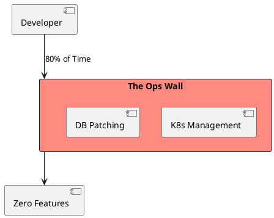
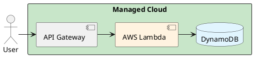

# 4.15: Case Study 9 [Easy] - Boutique NFT Gallery

## The Critical Dialogue

**Student:** I'm building an NFT gallery for 1,000 users. Do I need a Kubernetes cluster and a sharded database?

**Principal:** You are building a **Gallery**, not an **Empire**. If you spend 2 months on infrastructure, you are failing at **ROI**. A Principal Architect knows when to be "Lean." We will use **Serverless** to achieve maximum velocity. We move from "Managing Nodes" to **Publishing Logic**.

---

## 1. Requirement: The Speed to Market Wall

**The Problem:** Managing infrastructure takes time. For a boutique shop, every day spent on "Ops" is a day lost to marketing.

---

## 2. Solution: Managed Serverless (Lambda + DynamoDB)

**The Principal Architecture:** We use the **Managed Cloud**.
. **Logic:** AWS Lambda. Zero server maintenance.
. **Database:** DynamoDB. Scales from 1 to 1M without config.
. **Velocity:** We use **Terraform** to deploy in 5 minutes.

---

## 🧠 Principal's Inquiry

. **The Cold Start:** Why is the first request to a "Serverless" function slower than others?

. **Vendor Lock-in:** Is the **Velocity ROI** worth the lock-in to AWS DynamoDB?

**Principal Summary:** Saturated Design is about **Strategic Simplicity**. We use serverless to win the "Speed to Market" battle, accepting the "Cloud Tax" for the gift of time.
 Greenlanders use the type system to prove our software invariants.
