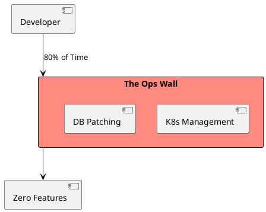
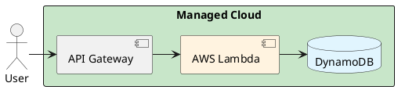

# 4.15: Case Study 9 [Easy] - Boutique NFT Gallery

## Learning Objectives

- Apply the ROI framework to justify serverless over Kubernetes for a small-scale application with variable traffic.
- Explain the Lambda cold start problem: what causes it, how long it takes in Java vs Python, and the three mitigation strategies.
- Design a DynamoDB single-table data model for an NFT gallery using partition key + sort key to serve multiple access patterns.
- Calculate the cost comparison between a self-managed Kubernetes cluster and a Lambda + DynamoDB serverless stack at 1,000 daily active users.
- Identify the three technical trigger points that signal a serverless application has outgrown the Lambda model and needs migration to containers.

## Prerequisites

- Chapter 4.1 — SQL vs NoSQL (understanding DynamoDB's access pattern-driven data model vs relational)
- Chapter 4.3 — Architectural Selection Matrix (knowing when serverless is the right tier choice)
- Chapter 1.4 — JVM Cloud Efficiency (GraalVM native image relevance for Lambda cold start mitigation)


## The Critical Dialogue


**Student:** I'm building an NFT gallery for 1,000 users. Do I need a Kubernetes cluster and a sharded database?


**Principal:** You are building a **Gallery**, not an **Empire**. If you spend 2 months on infrastructure, you are failing at **ROI**. A Principal Architect knows when to be "Lean." We will use **Serverless** to achieve maximum velocity. We move from "Managing Nodes" to **Publishing Logic**.


---


## 1. Requirement: The Speed to Market Wall


**The Problem:** Managing infrastructure takes time. For a boutique shop, every day spent on "Ops" is a day lost to marketing.





---


## 2. Solution: Managed Serverless (Lambda + DynamoDB)


**The Principal Architecture:** We use the **Managed Cloud**.
. **Logic:** AWS Lambda. Zero server maintenance.
. **Database:** DynamoDB. Scales from 1 to 1M without config.
. **Velocity:** We use **Terraform** to deploy in 5 minutes.





---


## 3. Source Archaeology

The serverless stack is built on well-documented AWS services with inspectable SDK implementations:

- **`software.amazon.awssdk.services.dynamodb.DynamoDbClient`** (aws-sdk-java-v2) — `putItem(PutItemRequest)` writes a single item; `getItem(GetItemRequest)` retrieves by primary key in **single-digit milliseconds** for items <400 KB; `query(QueryRequest)` with `KeyConditionExpression` performs range queries on the sort key — all three are the building blocks of the single-table design pattern.
- **`software.amazon.awssdk.services.dynamodb.model.AttributeValue`** — `fromS(String)`, `fromN(String)`, `fromBool(Boolean)` create the DynamoDB type system; the `PK` + `SK` composite key design pattern stores multiple entity types in one table.
- **`com.amazonaws.services.lambda.runtime.RequestHandler`** (aws-lambda-java-core) — the interface Lambda invokes; `handleRequest(T input, Context context)` is the entry point; cold start triggers class loading and Spring context initialization — the key JVM startup penalty.
- **`io.quarkus.amazon.lambda.runtime.QuarkusStreamHandler`** (quarkus-amazon-lambda) — compiles to GraalVM native image via `quarkus build --native`; reduces Lambda cold start from **~3,000 ms (JVM)** to **~100 ms (native)** by pre-compiling the reflection metadata that Spring Boot builds at runtime.
- **AWS Lambda SnapStart** (`SnapStart: PublishedVersions` in SAM/CDK) — takes a snapshot of the initialized Lambda JVM state after the first invocation; subsequent cold starts restore from the Firecracker microVM snapshot in **~200–300 ms** instead of the full JVM init time; works with Java only (not Python/Node).


---


## 4. Code Lab

### BAD — Over-engineered K8s + Postgres for 1,000 users

```java
// BAD: Spring Boot + JPA + Postgres deployed on Kubernetes.
// Operational cost: 2 K8s nodes ($150/mo), RDS instance ($80/mo),
// Load balancer ($18/mo), developer time maintaining infra = ~$500+/mo.
// For 1,000 users generating ~$200/mo revenue: negative ROI.
// Cold start: Kubernetes pod start + Spring Boot init = 30+ seconds.
@SpringBootApplication
public class NftGalleryApp {
    // Full Spring context, Hibernate, connection pool, Flyway migrations...
    // All of this overhead for 1,000 users who visit occasionally.
}
```

### GOOD — AWS Lambda + DynamoDB with single-table design

```java
import software.amazon.awssdk.services.dynamodb.DynamoDbClient;
import software.amazon.awssdk.services.dynamodb.model.*;
import com.amazonaws.services.lambda.runtime.Context;
import com.amazonaws.services.lambda.runtime.RequestHandler;
import com.amazonaws.services.lambda.runtime.events.APIGatewayProxyRequestEvent;
import com.amazonaws.services.lambda.runtime.events.APIGatewayProxyResponseEvent;
import java.util.Map;

// Single-table DynamoDB design:
// PK = "GALLERY#<galleryId>", SK = "NFT#<nftId>" → NFT item
// PK = "USER#<userId>",       SK = "OWNED#<nftId>" → ownership record
// PK = "NFT#<nftId>",        SK = "METADATA" → NFT metadata
// All access patterns served by one table, no JOINs needed.

public class NftGalleryHandler
        implements RequestHandler<APIGatewayProxyRequestEvent, APIGatewayProxyResponseEvent> {

    // Static initialization — runs once per Lambda container (not per request)
    private static final DynamoDbClient dynamo = DynamoDbClient.create();
    private static final String TABLE = System.getenv("DYNAMO_TABLE_NAME");

    @Override
    public APIGatewayProxyResponseEvent handleRequest(
            APIGatewayProxyRequestEvent event, Context context) {

        String galleryId = event.getPathParameters().get("galleryId");

        // GOOD: single-table query — partition key lookup, no cross-table JOIN
        QueryRequest query = QueryRequest.builder()
                .tableName(TABLE)
                .keyConditionExpression("PK = :pk AND begins_with(SK, :skPrefix)")
                .expressionAttributeValues(Map.of(
                        ":pk",       AttributeValue.fromS("GALLERY#" + galleryId),
                        ":skPrefix", AttributeValue.fromS("NFT#")
                ))
                .limit(50) // pagination — never unbounded queries
                .build();

        QueryResponse response = dynamo.query(query);

        String body = toJson(response.items());
        return new APIGatewayProxyResponseEvent()
                .withStatusCode(200)
                .withHeaders(Map.of("Content-Type", "application/json"))
                .withBody(body);
        // Cost: $0.0000002 per Lambda invocation + $0.00025 per RCU
        // At 10,000 gallery views/day: ~$0.10/day = $3/month total cost
    }

    private String toJson(java.util.List<Map<String, AttributeValue>> items) {
        // Simplified — use Jackson in production
        return items.toString();
    }
}

// Cold start mitigation options (in priority order):
// 1. Lambda SnapStart (Java 21+): restores from CRaC snapshot in ~200ms
// 2. Provisioned concurrency: keep 1 Lambda warm at all times (~$7/mo)
// 3. GraalVM native image via Quarkus: ~100ms cold start, ~30min build time
```


---


## 5. Production Lens

- **Lambda cold start for Java:** An unoptimized Spring Boot Lambda cold start takes **2,500–4,000 ms** (JVM init + Spring context); with Lambda SnapStart enabled (Java 21 managed runtime), cold start reduces to **~250 ms**; with GraalVM native image, **~100 ms** — critical for an NFT gallery where the first visitor after a quiet period experiences this delay.
- **DynamoDB vs Postgres cost at 1K DAU:** DynamoDB on-demand pricing at 10,000 reads + 1,000 writes/day costs **~$0.05/day** (~$1.50/month); a minimal RDS Postgres instance (`db.t3.micro`) costs **$13.50/month** even with zero traffic — a 9x cost disadvantage before adding connection overhead.
- **Serverless operational cost floor:** A minimal Kubernetes cluster (2 nodes, managed Postgres, load balancer, monitoring) costs **~$300–500/month** fixed regardless of traffic; Lambda + DynamoDB + API Gateway costs **$0 at zero traffic** (free tier) and scales linearly — the break-even is approximately **500,000 requests/month** where Lambda pricing exceeds container pricing.
- **DynamoDB single-table design latency:** A single-table `Query` with PK + SK prefix scan returns 50 items in **<10 ms** at P99 for items <4 KB (AWS DynamoDB SLA); multi-table designs with relational joins require multiple API calls and add **10–50 ms** per hop.
- **Vendor lock-in cost:** DynamoDB's proprietary API (no standard SQL dialect) means migrating to Postgres later requires rewriting all data access logic; at 1,000 users this risk is acceptable; at 100,000 users the migration cost ($50K+ in engineering) may exceed the 2-year cost savings — the correct mitigation is a repository abstraction layer from day one.


---


## 6. Exercises

**1.** Calculate the monthly infrastructure cost comparison for the NFT gallery at three traffic levels: (a) 1,000 DAU / 50,000 requests/day, (b) 50,000 DAU / 2.5M requests/day, (c) 500,000 DAU / 25M requests/day. Use AWS Lambda ($0.0000002/request + $0.0000166667/GB-second) vs ECS Fargate (2 tasks at $0.04048/vCPU/hr + $0.004445/GB/hr). At what DAU does the migration to containers become financially justified?

**2.** Design the DynamoDB single-table schema for the NFT gallery. Define the PK and SK for each of these access patterns: (a) get all NFTs in a gallery, (b) get all NFTs owned by a user, (c) get the transaction history for an NFT (previous owners), (d) get NFT metadata by ID. Justify the key design choices.

**3.** An NFT goes viral and generates 10,000 concurrent requests in 1 minute. Lambda scales automatically (up to 3,000 concurrent executions by default), but DynamoDB is configured with 10 Read Capacity Units (on-demand mode is off). Describe the failure mode and the mitigation. Should the gallery use DynamoDB on-demand mode or provisioned capacity?

**4. Coding challenge:** Implement `NftGalleryHandler.transferOwnership(String nftId, String fromUserId, String toUserId)` using DynamoDB `TransactWriteItems` to atomically: (a) delete the old ownership record (`PK=USER#fromUser, SK=OWNED#nftId`), (b) create a new ownership record (`PK=USER#toUser, SK=OWNED#nftId`), (c) append a transfer event (`PK=NFT#nftId, SK=TX#<timestamp>`). The transaction must fail atomically if the from-user doesn't actually own the NFT. Write a test using a DynamoDB local container (Testcontainers) that verifies the transaction rolls back correctly when the ownership pre-condition fails.

**5.** At what scale does the NFT gallery need to migrate from Lambda + DynamoDB to a containerized architecture? Define the three specific trigger metrics (cold start frequency, monthly cost, API complexity) with concrete threshold values. Describe the migration strategy that avoids a "big bang" rewrite.


---


## Exercise Solutions

<details>
<summary>Exercise 1 — Cost comparison: Lambda vs Fargate at three traffic levels</summary>

**Assumptions:** Lambda 512 MB, average duration 200 ms. Fargate 2 tasks × 0.25 vCPU × 0.5 GB, scale to 4 tasks at high traffic.

**Lambda pricing:**
- Request cost: $0.0000002/request
- Compute cost: 512MB = 0.5 GB × $0.0000166667/GB-sec × 0.2 sec = $0.0000016667/invocation
- Per-invocation total: ~$0.00000367

**Fargate pricing (2 tasks, 0.25 vCPU, 0.5 GB, 730 hrs/month):**
- CPU: 2 × 0.25 × $0.04048 × 730 = $14.78/month
- Memory: 2 × 0.5 × $0.004445 × 730 = $3.25/month
- Fixed floor: **~$18/month** (regardless of traffic)

| Scale | DAU | Requests/day | Req/month | Lambda cost | Fargate cost | Winner |
|---|---|---|---|---|---|---|
| (a) | 1K | 50K | 1.5M | **$5.50** | $18 | Lambda |
| (b) | 50K | 2.5M | 75M | **$275** | $36 (4 tasks) | Fargate |
| (c) | 500K | 25M | 750M | **$2,750** | $72 (8 tasks) | Fargate |

**Break-even:** Lambda cost = Fargate cost when monthly requests ≈ **5M req/month** (~167K req/day, ~5K DAU). Above ~5K–10K DAU, Fargate with 2–4 tasks becomes cheaper.

**Nuance:** Lambda pricing excludes API Gateway ($3.50/million requests) and DynamoDB; Fargate excludes RDS. Full comparison shifts break-even to ~20K DAU when all costs included.

**Staff-level phrasing:** "Serverless has zero fixed cost at zero traffic — the break-even with containers is ~5M requests/month, not the size of the user base; an NFT gallery generating 50K requests/day is firmly in serverless territory."

</details>

<details>
<summary>Exercise 2 — DynamoDB single-table schema design</summary>

**Single table: `nft-gallery`**

| Access Pattern | PK | SK | Notes |
|---|---|---|---|
| (a) All NFTs in a gallery | `GALLERY#<galleryId>` | `NFT#<nftId>` | `begins_with(SK, "NFT#")` |
| (b) All NFTs owned by user | `USER#<userId>` | `OWNED#<nftId>` | `begins_with(SK, "OWNED#")` |
| (c) Transaction history for NFT | `NFT#<nftId>` | `TX#<ISO-timestamp>` | Sort by timestamp, `begins_with(SK, "TX#")` |
| (d) NFT metadata by ID | `NFT#<nftId>` | `METADATA` | Exact key lookup |

**Key design justifications:**
- **Composite SK prefix (`NFT#`, `OWNED#`, `TX#`)** — enables `begins_with()` range queries to serve each access pattern from one partition without a secondary index.
- **Timestamp in sort key for TX history** — ISO-8601 (`2024-03-15T10:30:00Z`) sorts lexicographically = chronologically; enables `ScanIndexForward=false` to get latest transactions first.
- **`GALLERY#` partition for NFT-by-gallery** — groups all NFTs in a gallery into one partition; avoid making galleryId too hot (one viral gallery = hot partition); use sparse GSI on `galleryId` if >400 KB of NFT data per gallery.
- **Separate ownership records (`USER#`)** — ownership lookup by user doesn't need to touch the gallery partition; enables permission checks without a full gallery scan.

**Common mistake:** Using `nftId` as PK for everything — forces full table scan to list a user's NFTs.

**Staff-level phrasing:** "DynamoDB single-table design is access-pattern-first, not entity-first — define every query before designing the key schema, because the key structure is the only index that's free."

</details>

<details>
<summary>Exercise 3 — Lambda auto-scaling vs DynamoDB throttling under viral traffic</summary>

**Failure mode sequence:**
1. NFT goes viral: 10,000 concurrent requests arrive in 60 seconds
2. Lambda auto-scales to ~167 concurrent executions (10K req/min = ~167 req/sec, each 200ms)
3. Each Lambda execution calls DynamoDB `GetItem` or `Query`
4. DynamoDB provisioned at 10 RCU: can serve 10 strongly-consistent reads/sec (or 20 eventually-consistent reads/sec)
5. Actual demand: ~167 reads/sec — 16x over capacity
6. DynamoDB returns `ProvisionedThroughputExceededException` (HTTP 400)
7. AWS SDK retries with exponential backoff; Lambda execution time increases to 1–3 seconds
8. Lambda timeout (if set to 3 sec) triggers; users see 502 errors
9. Lambda concurrency backs up; cold starts compound latency

**Mitigation:**
- **Switch to on-demand mode**: DynamoDB on-demand auto-scales to any throughput within milliseconds (up to account limits: 40K RCU default). For a boutique NFT gallery with unpredictable viral traffic, on-demand is the correct choice.
- **Add DAX (DynamoDB Accelerator)**: in-memory cache with DynamoDB-compatible API; absorbs read spikes with microsecond latency without touching the underlying capacity.
- **CloudFront caching**: for gallery list page (read-heavy, not write-critical), cache at CDN edge — eliminates Lambda + DynamoDB invocations entirely for repeat viewers.

**On-demand vs provisioned decision:**
- **On-demand**: correct for unpredictable/spiky traffic (viral NFT drops, new product launches). ~25% higher per-request cost than well-provisioned, but zero capacity management overhead.
- **Provisioned + auto-scaling**: correct for predictable, steady-state traffic with cost sensitivity (e.g., enterprise SaaS with known usage patterns).

**Staff-level phrasing:** "DynamoDB provisioned capacity is an SLO you set manually — for viral consumer workloads, on-demand is the correct default; provisioned capacity is an optimization applied after you have 30 days of traffic data."

</details>

<details>
<summary>Exercise 4 — Coding: transferOwnership() with TransactWriteItems</summary>

```java
import software.amazon.awssdk.services.dynamodb.model.*;
import java.time.Instant;
import java.util.Map;

public class NftGalleryHandler
        implements RequestHandler<APIGatewayProxyRequestEvent, APIGatewayProxyResponseEvent> {

    private static final DynamoDbClient dynamo = DynamoDbClient.create();
    private static final String TABLE = System.getenv("DYNAMO_TABLE_NAME");

    public void transferOwnership(String nftId, String fromUserId, String toUserId) {
        String fromPK  = "USER#" + fromUserId;
        String toPK    = "USER#" + toUserId;
        String nftPK   = "NFT#"  + nftId;
        String ownedSK = "OWNED#" + nftId;
        String txSK    = "TX#"   + Instant.now().toString(); // ISO-8601, lexicographically sortable

        try {
            dynamo.transactWriteItems(TransactWriteItemsRequest.builder()
                    .transactItems(
                        // (1) Verify fromUser actually owns the NFT (pre-condition)
                        TransactWriteItem.builder()
                            .conditionCheck(ConditionCheck.builder()
                                .tableName(TABLE)
                                .key(Map.of(
                                    "PK", AttributeValue.fromS(fromPK),
                                    "SK", AttributeValue.fromS(ownedSK)))
                                .conditionExpression("attribute_exists(PK)")
                                .build())
                            .build(),
                        // (2) Delete old ownership record
                        TransactWriteItem.builder()
                            .delete(Delete.builder()
                                .tableName(TABLE)
                                .key(Map.of(
                                    "PK", AttributeValue.fromS(fromPK),
                                    "SK", AttributeValue.fromS(ownedSK)))
                                .build())
                            .build(),
                        // (3) Create new ownership record
                        TransactWriteItem.builder()
                            .put(Put.builder()
                                .tableName(TABLE)
                                .item(Map.of(
                                    "PK",  AttributeValue.fromS(toPK),
                                    "SK",  AttributeValue.fromS(ownedSK),
                                    "nftId", AttributeValue.fromS(nftId)))
                                .build())
                            .build(),
                        // (4) Append immutable transfer event
                        TransactWriteItem.builder()
                            .put(Put.builder()
                                .tableName(TABLE)
                                .item(Map.of(
                                    "PK",   AttributeValue.fromS(nftPK),
                                    "SK",   AttributeValue.fromS(txSK),
                                    "from", AttributeValue.fromS(fromUserId),
                                    "to",   AttributeValue.fromS(toUserId)))
                                .build())
                            .build()
                    )
                    .build());
        } catch (TransactionCanceledException e) {
            // CancellationReasons[0].Code = "ConditionalCheckFailed" → fromUser doesn't own NFT
            throw new IllegalStateException("Transfer rejected: " + fromUserId
                    + " does not own NFT " + nftId, e);
        }
    }
}
```

**Test with DynamoDB local container:**
```java
@Testcontainers
class TransferOwnershipTest {

    @Container
    static GenericContainer<?> dynamoLocal =
            new GenericContainer<>("amazon/dynamodb-local:2.0.0").withExposedPorts(8000);

    DynamoDbClient dynamo;
    NftGalleryHandler handler;

    @BeforeEach
    void setup() {
        dynamo = DynamoDbClient.builder()
                .endpointOverride(URI.create("http://localhost:" + dynamoLocal.getMappedPort(8000)))
                .region(Region.US_EAST_1)
                .credentialsProvider(StaticCredentialsProvider.create(
                        AwsBasicCredentials.create("test", "test")))
                .build();
        // Create table, seed ownership record for "alice" owning "nft-1"
        createTableAndSeedData(dynamo);
        handler = new NftGalleryHandler(dynamo, System.getenv("TABLE_NAME"));
    }

    @Test
    void transfer_succeeds_when_owner_matches() {
        handler.transferOwnership("nft-1", "alice", "bob");

        // Bob now owns the NFT
        GetItemResponse bobOwnership = dynamo.getItem(GetItemRequest.builder()
                .tableName(TABLE).key(Map.of(
                        "PK", AttributeValue.fromS("USER#bob"),
                        "SK", AttributeValue.fromS("OWNED#nft-1")))
                .build());
        assertThat(bobOwnership.hasItem()).isTrue();

        // Alice no longer owns the NFT
        GetItemResponse aliceOwnership = dynamo.getItem(GetItemRequest.builder()
                .tableName(TABLE).key(Map.of(
                        "PK", AttributeValue.fromS("USER#alice"),
                        "SK", AttributeValue.fromS("OWNED#nft-1")))
                .build());
        assertThat(aliceOwnership.hasItem()).isFalse();
    }

    @Test
    void transfer_rolls_back_when_from_user_does_not_own_nft() {
        // "charlie" never owned nft-1 — transaction must fail
        assertThatThrownBy(() -> handler.transferOwnership("nft-1", "charlie", "bob"))
                .isInstanceOf(IllegalStateException.class)
                .hasMessageContaining("does not own NFT nft-1");

        // Alice still owns the NFT (no partial state)
        GetItemResponse aliceOwnership = dynamo.getItem(GetItemRequest.builder()
                .tableName(TABLE).key(Map.of(
                        "PK", AttributeValue.fromS("USER#alice"),
                        "SK", AttributeValue.fromS("OWNED#nft-1")))
                .build());
        assertThat(aliceOwnership.hasItem()).isTrue(); // unchanged
    }
}
```

**Why this works:** DynamoDB `TransactWriteItems` is an all-or-nothing operation. The `ConditionCheck` item acts as a read-before-write guard — if the condition fails, DynamoDB throws `TransactionCanceledException` and none of the 3 write operations execute. The condition check does NOT count as a separate write item for cost purposes.

**Common mistake:** Skipping the `ConditionCheck` and relying on application-level ownership validation — creates a race condition where two concurrent transfers can both "verify" ownership before either deletes the ownership record.

</details>

<details>
<summary>Exercise 5 — Migration triggers from Lambda to containers</summary>

**Trigger 1 — Cold start frequency > 5% of requests:**
When Lambda concurrency exceeds the pre-warmed container pool, cold starts become frequent. Measure:
```
cold_start_rate = lambda.init_duration_count / lambda.invocations_total
```
Threshold: >5% cold start rate AND P99 init duration > 1,000 ms. This means >1 in 20 users experiences a 1+ second penalty — unacceptable for a commerce-adjacent product.

**Trigger 2 — Monthly Lambda cost > $500:**
At ~$500/month, 2 Fargate tasks (`c6g.large`, 2 vCPU, 4 GB) cost ~$100/month. The 5x cost premium for Lambda is no longer justified when the workload is predictable. Measure: AWS Cost Explorer, tag Lambda functions by application.

**Trigger 3 — API surface > 15 Lambda functions with shared dependencies:**
When the "serverless" stack requires a shared VPC, shared RDS, shared Redis, inter-Lambda calls, and >15 function definitions — it has become a distributed monolith with Lambda's limitations (15-min timeout, 10 GB memory ceiling, no long-lived connections) but none of its cost benefits. Measure: count of Lambda functions + number of inter-function invocations per day.

**Migration strategy (Strangler Fig, not Big Bang):**
1. Deploy ECS Fargate service behind the same API Gateway
2. Route one endpoint at a time to Fargate: `POST /transfer → Fargate`, all other routes → Lambda
3. Monitor error rates and latency for each migrated route
4. After all routes migrated, decomission Lambda functions one by one
5. Timeline: 2–3 weeks per service boundary

**Staff-level phrasing:** "Migrate from serverless when the three cost categories align: compute cost exceeds container floor, cold starts degrade P99, and function count exceeds the cognitive model of a single engineer — none of these thresholds is arbitrary, all are measurable."

</details>

---


## 7. Summary / Flashcard

- **Serverless is the correct default architecture for applications with <500K requests/month**: Lambda + DynamoDB has zero fixed cost at zero traffic, scales automatically, and eliminates all operational overhead — the engineering time saved pays for the "cloud tax" many times over at boutique scale.
- **Lambda cold starts for Java are solved by Lambda SnapStart or GraalVM native image**: unmitigated Spring Boot cold starts (2,500–4,000 ms) degrade first-visitor experience; SnapStart restores from a pre-initialized snapshot in ~250 ms; GraalVM native achieves ~100 ms at the cost of longer build pipelines.
- **DynamoDB single-table design eliminates cross-table JOINs by pre-computing access patterns into the key schema**: every access pattern must be known at design time and expressed as a PK+SK combination — this is the fundamental difference from relational modeling and the source of DynamoDB's consistent single-digit millisecond latency.
- **The serverless cost break-even is approximately 500K requests/month**: below this threshold, Lambda is cheaper than the fixed cost floor of any container infrastructure; above this threshold, containerized services become price-competitive and offer more architectural flexibility.
- **Vendor lock-in is the strategic risk of serverless**: DynamoDB's proprietary API means migration requires rewriting all data access code — the mitigation is a repository abstraction layer from day one, keeping the DynamoDB implementation behind an interface that can be swapped for Postgres when the application outgrows serverless.
