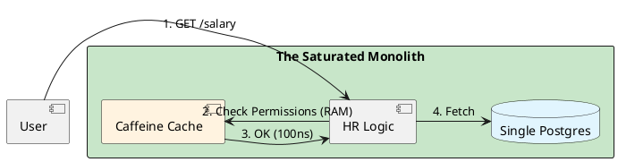

# 4.16: Case Study 10 [Easy] - Internal HR Portal


## The Critical Dialogue


**Student:** I'm building an internal HR portal for 5,000 employees. Should I use Microservices and Kafka to ensure each part is decoupled?


**Principal:** You are building a **Space Rocket** to cross the street. In a portal with 5,000 users, your enemy is **Logic Complexity**, not **Network Throughput**. By adding Microservices, you are creating a "Distributed Monolith" that is 10x harder to debug. To reach Principal level, we must master the **Saturated Monolith**.


---


## 1. Requirement: The Permission Join Wall


**The Problem:** Calculating who can see whose salary involves joining 5 tables. In a distributed system, this requires 5 network calls.


```plantuml
@startuml
skinparam shadowing false
skinparam packageStyle rectangle
skinparam defaultFontName sans-serif

rectangle "The Microservice Trap" #ff8a80 {
  [Org Chart Service] as A
  [Salary Service] as S3
}

A -> S1 : 1. Who is X?
S1 -> A : 2. OK
A -> S3 : 3. Get Salary
S3 -[#red]x A : 4. **TIMEOUT**
@enduml
```


---


## 2. Solution: The Saturated Monolith (Spring + Caffeine)


**The Principal Architecture:** We use a single JAR.
. **Logic:** Use **Strategic DDD (Chapter 14.1)** to keep code clean.
. **Consistency:** Use the **Local DB Transaction**. Zero risk of "Ghost Updates."
. **Performance:** Use **Caffeine L1 Cache** to store the Org Chart in RAM.





---


## 🧠 Principal's Inquiry


. **The Transition Point:** At what number of users should you split the Monolith into a Fleet? (Hint: The **Team Communication** tax).


. **Modular Monolith:** How can we use **ArchUnit** to ensure our Monolith doesn't become a "Big Ball of Mud"?


**Principal Summary:** Saturated Design is about **Matching Architecture to Human Scale**. We use the Monolith for internal systems to maximize developer focus on complex logic.
 Greenlanders use the type system to prove our software invariants.
