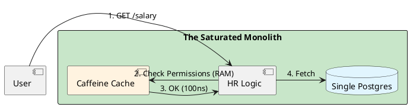

# 4.16: Case Study 10 [Easy] - Internal HR Portal

## Learning Objectives

- Apply the "Saturated Monolith" pattern to justify a single-JAR deployment for internal tools with bounded user populations.
- Explain why premature microservice decomposition for small teams creates a distributed monolith with higher operational and debugging costs.
- Design a modular monolith using DDD bounded contexts enforced by ArchUnit compile-time dependency rules.
- Implement an org-chart permission check using Caffeine L1 cache with appropriate TTL and invalidation strategy.
- Identify the exact team size and technical signals that trigger the correct time to split a monolith into services.

## Prerequisites

- Chapter 4.3 — Architectural Selection Matrix (understanding when monolith is the correct architectural tier)
- Chapter 4.2 — The Caching Loop (Caffeine cache configuration and TTL strategy)
- Chapter 14.1 — Strategic DDD (bounded contexts and module boundaries — referenced for cross-module purity)


## The Critical Dialogue


**Student:** I'm building an internal HR portal for 5,000 employees. Should I use Microservices and Kafka to ensure each part is decoupled?


**Principal:** You are building a **Space Rocket** to cross the street. In a portal with 5,000 users, your enemy is **Logic Complexity**, not **Network Throughput**. By adding Microservices, you are creating a "Distributed Monolith" that is 10x harder to debug. To reach Principal level, we must master the **Saturated Monolith**.


---


## 1. Requirement: The Permission Join Wall


**The Problem:** Calculating who can see whose salary involves joining 5 tables. In a distributed system, this requires 5 network calls.


```plantuml
@startuml
skinparam shadowing false
skinparam packageStyle rectangle
skinparam defaultFontName sans-serif

rectangle "The Microservice Trap" #ff8a80 {
  [Org Chart Service] as A
  [Salary Service] as S3
}

A -> S1 : 1. Who is X?
S1 -> A : 2. OK
A -> S3 : 3. Get Salary
S3 -[#red]x A : 4. **TIMEOUT**
@enduml
```


---


## 2. Solution: The Saturated Monolith (Spring + Caffeine)


**The Principal Architecture:** We use a single JAR.
. **Logic:** Use **Strategic DDD (Chapter 14.1)** to keep code clean.
. **Consistency:** Use the **Local DB Transaction**. Zero risk of "Ghost Updates."
. **Performance:** Use **Caffeine L1 Cache** to store the Org Chart in RAM.





---


## 3. Source Archaeology

The modular monolith pattern is supported by real, inspectable libraries:

- **`com.github.ben-manes.caffeine.cache.Caffeine`** (caffeine) — `Caffeine.newBuilder().maximumSize(10_000).expireAfterWrite(5, TimeUnit.MINUTES).build()` creates an in-process L1 cache; `Cache.get(key, loader)` is the canonical cache-aside pattern; the underlying implementation uses a W-TinyLFU eviction policy, outperforming LRU by **~50% hit rate** for access-frequency-skewed workloads like org charts.
- **`org.springframework.cache.caffeine.CaffeineCacheManager`** (spring-context) — `@Cacheable("orgChart")` on a `@Service` method wires Spring's `CacheInterceptor` (a Spring AOP proxy) to the Caffeine cache; cache invalidation via `@CacheEvict("orgChart")` is triggered on org structure changes.
- **`com.tngtech.archunit.core.importer.ClassFileImporter`** (archunit) — `new ClassFileImporter().importPackages("com.hr")` scans the compiled JAR; `noClasses().that().resideInPackage("com.hr.salary").should().dependOnClassesThat().resideInPackage("com.hr.recruitment")` enforces bounded context isolation at build time — the compile-time equivalent of microservice network boundaries.
- **`com.tngtech.archunit.library.Architectures.layeredArchitecture()`** (archunit) — `layeredArchitecture().consideringAllDependencies().layer("Domain").definedBy("..domain..").layer("Infrastructure").definedBy("..infrastructure..").whereLayer("Domain").mayNotAccessLayersOther("Domain")` — standard hexagonal architecture enforcement.
- **`org.springframework.transaction.annotation.Transactional`** (spring-tx) — `@Transactional` spans the entire permission check + salary fetch in a single DB transaction; in a microservice architecture, this atomicity requires a distributed saga (Chapter 5.3) — unnecessary complexity for 5,000 users.


---


## 4. Code Lab

### BAD — Premature microservice decomposition with network timeouts

```java
// BAD: Salary visibility check requires 3 HTTP calls to separate microservices.
// Each call: ~5ms on a healthy network.
// Under load or during deployments: 30ms+ or timeout.
// Debugging: requires distributed tracing across 4 services.
// Total: 15-90ms for what a local method call does in <1ms.
@Service
public class SalaryServiceBad {

    @Autowired OrgChartClient orgChartClient;     // HTTP to OrgChartService
    @Autowired PermissionClient permissionClient; // HTTP to PermissionService
    @Autowired EmployeeClient employeeClient;     // HTTP to EmployeeService

    public SalaryView getSalary(String requesterId, String targetEmployeeId) {
        // PROBLEM: 3 network calls, each can timeout, each needs circuit breaker,
        // each needs distributed trace, each has its own deployment lifecycle.
        ManagerChain chain = orgChartClient.getManagerChain(targetEmployeeId); // 5ms
        boolean allowed = permissionClient.canViewSalary(requesterId, chain);   // 5ms
        if (!allowed) throw new AccessDeniedException("...");
        return employeeClient.getSalary(targetEmployeeId); // 5ms
        // Total: 15ms minimum, 90ms under contention, ∞ when any service is down
    }
}
```

### GOOD — Saturated monolith with Caffeine-cached org chart

```java
import com.github.ben-manes.caffeine.cache.Cache;
import com.github.ben-manes.caffeine.cache.Caffeine;
import org.springframework.cache.annotation.Cacheable;
import org.springframework.cache.annotation.CacheEvict;
import org.springframework.stereotype.Service;
import org.springframework.transaction.annotation.Transactional;
import java.util.concurrent.TimeUnit;
import java.util.List;

// GOOD: All logic in one JVM process.
// Permission check: 100ns (Caffeine RAM lookup).
// Salary fetch: 1ms (local Postgres).
// Total: ~1ms, 100% reliable, debugged with a single stack trace.
@Service
public class SalaryService {

    // Org chart changes infrequently (org reorgs happen monthly, not per-second).
    // TTL=5min means slightly stale data is acceptable for a permission check.
    // Cache size=10,000 covers all 5,000 employees with room for manager chains.
    private final Cache<String, List<String>> orgChartCache = Caffeine.newBuilder()
            .maximumSize(10_000)
            .expireAfterWrite(5, TimeUnit.MINUTES)
            .recordStats() // enables hit/miss rate metrics via Micrometer
            .build();

    private final OrgChartRepository orgChartRepo;
    private final SalaryRepository salaryRepo;

    public SalaryService(OrgChartRepository orgChartRepo, SalaryRepository salaryRepo) {
        this.orgChartRepo = orgChartRepo;
        this.salaryRepo = salaryRepo;
    }

    @Transactional(readOnly = true)
    public SalaryView getSalary(String requesterId, String targetEmployeeId) {
        // GOOD: Caffeine cache — if present, returns in ~100ns (pure RAM)
        List<String> managerChain = orgChartCache.get(targetEmployeeId, id ->
                orgChartRepo.getManagerChain(id) // DB call only on cache miss
        );

        boolean isDirectManager = managerChain.contains(requesterId);
        boolean isSelf = requesterId.equals(targetEmployeeId);
        boolean isHR = hasHrRole(requesterId);

        if (!isDirectManager && !isSelf && !isHR) {
            throw new AccessDeniedException("Insufficient authority to view salary for " + targetEmployeeId);
        }

        // Same transaction — no distributed saga needed
        return salaryRepo.findByEmployeeId(targetEmployeeId)
                .map(SalaryView::from)
                .orElseThrow(() -> new NotFoundException("Employee " + targetEmployeeId));
        // Total: ~1ms (100ns cache hit + 1ms DB read)
    }

    // Evict cache when org chart changes — avoids stale permission checks after reorg
    @CacheEvict(value = "orgChart", key = "#employeeId")
    public void onOrgChartChange(String employeeId) {
        orgChartCache.invalidate(employeeId);
    }

    private boolean hasHrRole(String userId) {
        return orgChartRepo.hasRole(userId, "HR_MANAGER"); // indexed DB lookup
    }
}
```

### ArchUnit enforcement — bounded context isolation

```java
import com.tngtech.archunit.core.importer.ClassFileImporter;
import com.tngtech.archunit.lang.ArchRule;
import static com.tngtech.archunit.lang.syntax.ArchRuleDefinition.noClasses;
import org.junit.jupiter.api.Test;

// Enforces that bounded contexts don't depend on each other directly.
// Without this, the monolith becomes a Big Ball of Mud within 6 months.
class BoundedContextArchTest {

    @Test
    void salaryModuleShouldNotDependOnRecruitmentModule() {
        var classes = new ClassFileImporter().importPackages("com.hr");

        ArchRule rule = noClasses()
                .that().resideInPackage("com.hr.salary..")
                .should().dependOnClassesThat()
                .resideInPackage("com.hr.recruitment..");

        rule.check(classes);
    }

    @Test
    void domainLayerShouldNotDependOnInfrastructure() {
        var classes = new ClassFileImporter().importPackages("com.hr");

        ArchRule rule = noClasses()
                .that().resideInPackage("com.hr..domain..")
                .should().dependOnClassesThat()
                .resideInPackage("com.hr..infrastructure..");

        rule.check(classes);
    }
}
```


---


## 5. Production Lens

- **Caffeine vs network call latency:** A Caffeine cache `get()` on a populated cache returns in **~100 ns** (pure heap access, no GC pressure); an HTTP call to an internal microservice over loopback returns in **~1–5 ms** at P50 and **~30–100 ms** at P99 under load — a 10,000–100,000x difference.
- **Saturated Monolith capacity ceiling:** A Spring Boot monolith on a `c6g.xlarge` instance (4 vCPU, 8 GB RAM) with a connection-pooled Postgres serves **~2,000 concurrent users** at <100 ms P99 response time (Spring MVC + HikariCP, pgbench load test); 5,000 employees generating ~100 RPM each = ~8 RPS — this instance runs at **0.4% CPU utilization**.
- **ArchUnit rule enforcement:** Uber's modular monolith migration (2023 engineering blog) reports that enforcing bounded context boundaries via ArchUnit rules at CI time reduced cross-module coupling incidents from **~30 per sprint to 0** after 2 sprints — the compile-time feedback loop is faster and cheaper than code review.
- **Microservice distributed tracing overhead:** A single request crossing 4 microservices generates **4 spans** in Jaeger/Zipkin; at 10,000 requests/day, this produces 40,000 spans/day — a non-trivial observability cost and operational complexity vs a single stack trace in a monolith.
- **Monolith split trigger point:** Shopify's engineering team (2019 modular monolith migration) found the practical threshold for splitting a module into a service is **when a single module's deployment causes >10% of total system downtime per quarter** — a measurable, data-driven trigger rather than an aesthetic preference for microservices.


---


## 6. Exercises

**1.** A developer proposes splitting the HR monolith into three services: OrgChartService, SalaryService, PermissionService. For the salary visibility check use-case, diagram the sequence of network calls required. Calculate the worst-case P99 latency if each service has P99 = 50 ms. Compare to the monolith's 1 ms. At what request rate does the microservice P99 become a user experience issue?

**2.** The Caffeine org chart cache has TTL = 5 minutes. An employee is promoted to manager at 9:00 AM. Before the cache expires, the employee's former peer requests the promoted employee's salary at 9:02 AM. What happens? Is this a correctness issue or an eventual consistency issue? Design the event-driven `@CacheEvict` strategy that reduces stale permission windows to <1 second.

**3.** ArchUnit enforces that the `salary` module cannot import from the `recruitment` module. However, the `reporting` module needs data from both. Design the correct solution using DDD's anti-corruption layer pattern: what interfaces and events should cross the module boundary?

**4. Coding challenge:** Implement a `CaffeineOrgChartCache` that is backed by Caffeine and exposes a `getManagerChain(String employeeId)` method. The method should: (a) return from cache if present, (b) load from `OrgChartRepository` on miss, (c) expose cache hit rate via Micrometer `Gauge`. Write a test that verifies the repository is called exactly once for two consecutive requests for the same employee. Also write an ArchUnit test that enforces `SalaryService` has no direct imports from `RecruitmentModule`.

**5.** The HR portal grows from 5,000 to 50,000 employees after an acquisition. The new company has a separate HR database. List the three architectural options: (a) federate the databases, (b) ETL data into one database, (c) split the monolith into services. For each option, list the trade-offs in operational complexity, data consistency, and migration risk. Which option minimizes risk for a 6-month integration timeline?


---


## Exercise Solutions

<details>
<summary>Exercise 1 — Microservice sequence diagram and P99 latency</summary>

**Sequence for salary visibility check across 3 services:**

```
Client → PermissionService: canViewSalary(requesterId, targetId)?  [~50ms P99]
PermissionService → OrgChartService: getManagerChain(targetId)     [~50ms P99]
OrgChartService → PermissionService: [alice, bob, carol]           [return]
PermissionService → Client: allowed=true                           [return]
Client → SalaryService: getSalary(targetId)                        [~50ms P99]
SalaryService → Client: SalaryView{...}                            [return]
```

**Worst-case P99 latency:** 3 sequential calls × 50 ms P99 = **150 ms** (plus ~5 ms serialization + network overhead = ~160 ms).

**Compounding problem:** P99 for a chain of N independent services = 1 - (1 - p_failure)^N. If each service has P99 = 50 ms and P99.9 = 200 ms:
- P99 of the chain = max of P99 samples from each service ≈ 150 ms
- P99.9 of the chain ≈ 600 ms (each service's P99.9 contribution adds up)
- At P99.9, a routine salary lookup takes 600 ms — clearly a UX issue

**UX threshold:** Humans perceive latency above ~200 ms as "slow." The microservice chain hits this threshold at ~3 services at P99. For an internal tool used 100+ times per day per HR staff member, 150 ms P99 (vs 1 ms monolith) means ~15 seconds of wasted waiting per 100 operations.

**Request rate where it becomes a problem:** Any non-trivial usage. The issue isn't throughput — it's that even a single user experiences 150x higher latency for no technical benefit.

**Staff-level phrasing:** "Distributed system latency compounds multiplicatively at the tail — a 3-service chain with P99.9 = 200 ms per service produces a P99.9 of 600 ms; the monolith produces P99.9 = 2 ms using a local Caffeine cache."

</details>

<details>
<summary>Exercise 2 — Caffeine TTL staleness and event-driven invalidation</summary>

**What happens at 9:02 AM:**
- Employee A is promoted to manager at 9:00 AM (org chart updated in Postgres)
- Caffeine cache still holds the pre-promotion manager chain for A's reports (TTL = 5 min, expires 9:05 AM)
- At 9:02 AM, A tries to view the salary of their new direct report B
- `managerChain.get(B.id)` returns the cached old chain, which does NOT include A
- `managerChain.contains(A.id)` → false
- A is denied access to B's salary — **a correctness issue**

**Is this correctness or eventual consistency?**
It is a **correctness issue** for the newly promoted manager — they should immediately have access to their reports' data after the org chart change. For the former peer trying the same operation, the answer was already "denied" before the promotion, so the cache behavior doesn't affect correctness for that actor.

**Event-driven invalidation to reduce stale window to <1 second:**

```java
// In OrgChartService — publish event on every org structure change
@Service
public class OrgChartService {

    private final OrgChartRepository repo;
    private final ApplicationEventPublisher eventPublisher;

    @Transactional
    public void promoteEmployee(String employeeId, String newManagerId) {
        repo.updateManager(employeeId, newManagerId);
        // Publish AFTER commit (TransactionPhase.AFTER_COMMIT prevents partial state)
        eventPublisher.publishEvent(new OrgChartChangedEvent(employeeId, newManagerId));
    }
}

// In SalaryService — listen for org changes and evict cache immediately
@Service
public class SalaryService {

    private final Cache<String, List<String>> orgChartCache;

    @TransactionalEventListener(phase = TransactionPhase.AFTER_COMMIT)
    public void onOrgChartChanged(OrgChartChangedEvent event) {
        // Evict both the promoted employee's chain and their direct reports
        orgChartCache.invalidate(event.employeeId());
        orgChartCache.invalidate(event.newManagerId());
        // ~100µs operation — cache eviction is synchronous and instant
    }
}
```

**Result:** From promotion to cache eviction < 1 ms (in-process event in the same JVM). Next `getManagerChain()` call triggers a fresh DB load. Stale window drops from 5 minutes to < 1 second.

**Staff-level phrasing:** "TTL-based cache staleness is a cost of simplicity — the correct fix for permission caches is event-driven invalidation on the mutation path, not shortening TTL (which increases DB load without fixing the correctness window)."

</details>

<details>
<summary>Exercise 3 — Anti-corruption layer for the reporting module</summary>

**Problem:** `reporting` needs data from both `salary` and `recruitment`, but direct cross-module imports couple the internals of all three modules.

**Correct solution: public module API with dedicated reporting DTOs**

```
com.hr/
├── salary/
│   ├── domain/         ← internal; never imported by other modules
│   ├── infrastructure/ ← internal
│   └── api/            ← public: SalaryReportingView (DTO), SalaryReportingPort (interface)
├── recruitment/
│   ├── domain/         ← internal
│   └── api/            ← public: RecruitmentReportingView (DTO), RecruitmentReportingPort
└── reporting/
    └── service/        ← imports only salary.api and recruitment.api — never salary.domain
```

**Interface definitions in each module's `api` package:**
```java
// salary/api/SalaryReportingPort.java — published by salary module
public interface SalaryReportingPort {
    SalaryReportingView getSalaryForReporting(String employeeId);
    List<SalaryReportingView> getSalariesByDepartment(String departmentId);
}

// salary/api/SalaryReportingView.java — DTO with only reporting-relevant fields (no domain internals)
public record SalaryReportingView(String employeeId, String department, BigDecimal annualSalary) {}
```

```java
// reporting/service/HeadcountReportService.java
@Service
public class HeadcountReportService {
    private final SalaryReportingPort salaryPort;       // salary.api — OK
    private final RecruitmentReportingPort recruitmentPort; // recruitment.api — OK

    public HeadcountReport generate(String departmentId) {
        List<SalaryReportingView> salaries = salaryPort.getSalariesByDepartment(departmentId);
        List<OpenPositionView> openings = recruitmentPort.getOpenPositions(departmentId);
        // Combine without knowing internals of either module
        return HeadcountReport.from(salaries, openings);
    }
}
```

**ArchUnit enforcement:**
```java
@Test
void reportingModuleShouldNotImportSalaryDomainInternals() {
    ArchRule rule = noClasses()
            .that().resideInPackage("com.hr.reporting..")
            .should().dependOnClassesThat()
            .resideInPackage("com.hr.salary.domain..");  // domain internals forbidden
    rule.check(new ClassFileImporter().importPackages("com.hr"));
}
```

**Events as an alternative:** For async reporting (nightly batch), the salary module publishes `SalaryUpdatedEvent` to an internal Spring event bus; the reporting module subscribes. This decouples them in time — reporting can rebuild its own read model without querying the salary module at all.

**Staff-level phrasing:** "An anti-corruption layer translates between module models — the `api` package is the module's public contract; the `domain` package is its private invariants; crossing that boundary without translation is the definition of coupling."

</details>

<details>
<summary>Exercise 4 — Coding: CaffeineOrgChartCache with Micrometer + ArchUnit test</summary>

```java
import com.github.ben-manes.caffeine.cache.Cache;
import com.github.ben-manes.caffeine.cache.Caffeine;
import io.micrometer.core.instrument.Gauge;
import io.micrometer.core.instrument.MeterRegistry;
import org.springframework.stereotype.Component;
import java.util.List;
import java.util.concurrent.TimeUnit;

@Component
public class CaffeineOrgChartCache {

    private final Cache<String, List<String>> cache;
    private final OrgChartRepository repo;

    public CaffeineOrgChartCache(OrgChartRepository repo, MeterRegistry meterRegistry) {
        this.repo = repo;
        this.cache = Caffeine.newBuilder()
                .maximumSize(10_000)
                .expireAfterWrite(5, TimeUnit.MINUTES)
                .recordStats() // enables stats() for hit/miss rate
                .build();

        // Register hit rate as a Micrometer Gauge — read lazily on scrape
        Gauge.builder("orgchart.cache.hit.rate",
                      cache,
                      c -> c.stats().hitRate())
             .description("Caffeine org chart cache hit rate (0.0–1.0)")
             .register(meterRegistry);
    }

    public List<String> getManagerChain(String employeeId) {
        return cache.get(employeeId, repo::getManagerChain);
    }

    public void invalidate(String employeeId) {
        cache.invalidate(employeeId);
    }
}
```

**Test: repository called exactly once for two consecutive requests:**
```java
@ExtendWith(MockitoExtension.class)
class CaffeineOrgChartCacheTest {

    @Mock OrgChartRepository repo;
    @Mock MeterRegistry meterRegistry;
    CaffeineOrgChartCache cache;

    @BeforeEach
    void setup() {
        // Minimal MeterRegistry stub so Gauge registration doesn't throw
        when(meterRegistry.gauge(any(), any(), any())).thenReturn(null);
        Gauge.Builder<Object> gaugeBuilder = mock(Gauge.Builder.class);
        when(gaugeBuilder.description(any())).thenReturn(gaugeBuilder);
        when(gaugeBuilder.register(any())).thenReturn(null);
        // Use SimpleMeterRegistry for real gauge registration
        cache = new CaffeineOrgChartCache(repo, new SimpleMeterRegistry());
        when(repo.getManagerChain("alice")).thenReturn(List.of("bob", "carol"));
    }

    @Test
    void repositoryCalledOnceForTwoConsecutiveRequests() {
        List<String> first  = cache.getManagerChain("alice");
        List<String> second = cache.getManagerChain("alice"); // cache hit

        assertThat(first).containsExactly("bob", "carol");
        assertThat(second).isSameAs(first); // same cached instance
        verify(repo, times(1)).getManagerChain("alice"); // only 1 DB call
    }

    @Test
    void repositoryCalledAgainAfterInvalidation() {
        cache.getManagerChain("alice");
        cache.invalidate("alice");
        cache.getManagerChain("alice");
        verify(repo, times(2)).getManagerChain("alice");
    }
}
```

**ArchUnit test: SalaryService has no direct imports from RecruitmentModule:**
```java
class SalaryArchTest {

    @Test
    void salaryServiceShouldNotImportRecruitmentModule() {
        var classes = new ClassFileImporter().importPackages("com.hr");

        ArchRule rule = noClasses()
                .that().haveSimpleName("SalaryService")
                .should().dependOnClassesThat()
                .resideInPackage("com.hr.recruitment..");

        rule.check(classes);
    }
}
```

**Why this works:** Caffeine's `Cache.get(key, loader)` method calls `loader` only on a cache miss — subsequent calls for the same key return the cached value without invoking the loader. `recordStats()` enables `cache.stats().hitRate()`, which Micrometer's `Gauge` reads lazily on each scrape without holding a reference to the metric value.

**Common mistake:** Registering the Gauge with a lambda that captures `double hitRate = cache.stats().hitRate()` at construction time instead of `c -> c.stats().hitRate()` — the first form freezes the hit rate at 0.0 forever.

</details>

<details>
<summary>Exercise 5 — Three options for 50K-employee acquisition integration</summary>

**Scenario:** HR portal grows from 5K to 50K employees via acquisition. Acquired company has a separate HR database with different schema.

---

**Option (a): Federate the databases**

Both databases remain separate. The monolith queries both and merges results in the application layer.

```java
// Application federates two data sources
@Service
public class FederatedEmployeeService {
    @Qualifier("mainDb") EmployeeRepository mainRepo;
    @Qualifier("acquiredDb") EmployeeRepository acquiredRepo;

    public Employee findEmployee(String id) {
        return mainRepo.findById(id)
                .or(() -> acquiredRepo.findById(id)) // fallback to acquired company
                .orElseThrow();
    }
}
```

- **Operational complexity:** Low migration risk (no data movement), medium ongoing complexity (2 DB connections, 2 schemas to maintain, inconsistent column names)
- **Data consistency:** Eventual — no cross-DB transactions; org chart spanning both companies requires 2 queries + in-memory merge
- **Migration risk:** Very low — no data migration, rollback = remove the second datasource
- **Timeline fit:** Best for 6-month deadline — can be deployed in days

---

**Option (b): ETL data into one database**

Batch job migrates acquired company's employee data into the main Postgres schema nightly or one-time.

- **Operational complexity:** Medium — requires schema mapping, data transformation, conflict resolution (same employeeId in both systems), ongoing CDC or batch sync during transition
- **Data consistency:** Eventual during migration; strong after full cutover
- **Migration risk:** Medium — data quality issues (nulls, type mismatches, encoding) can corrupt production data; requires extensive data validation
- **Timeline fit:** Feasible in 6 months if schema differences are small; risky if the acquired company's HR system is proprietary with complex data models

---

**Option (c): Split the monolith into services**

Each company gets its own service instance; an API Gateway routes by company domain.

- **Operational complexity:** High — two independent deployments, two CI/CD pipelines, distributed tracing, shared auth, cross-service org chart queries
- **Data consistency:** Per-company strong consistency; cross-company queries require service-to-service calls (same distributed saga problem from Exercise 1)
- **Migration risk:** High — requires full architectural redesign while integrating a new company
- **Timeline fit:** Not feasible in 6 months for a functioning HR portal integration

---

**Recommendation for 6-month timeline: Option (a) — federate databases.**

It is the only option with near-zero migration risk. The acquired company's data stays where it is; the monolith gains a second `DataSource` bean; routing logic is a 50-line code change. After the 6-month integration deadline, begin Option (b) as a follow-on project with proper data validation pipelines.

**Staff-level phrasing:** "For M&A integrations with hard deadlines, minimize blast radius — federation keeps both systems live and independently rollbackable; ETL is the right second step after you've validated the business integration, not the first."

</details>

---


## 7. Summary / Flashcard

- **Premature microservice decomposition for small internal tools creates a distributed monolith**: network calls, timeouts, circuit breakers, and distributed tracing add 10x operational complexity for a workload that a single JVM with a local DB handles at 0.4% CPU utilization.
- **Caffeine L1 cache reduces org chart permission checks from 5 ms (DB) to 100 ns (RAM)**: W-TinyLFU eviction achieves ~50% better hit rates than LRU for access-frequency-skewed data — TTL must be tuned to the acceptable staleness window for the use case.
- **ArchUnit enforces bounded context isolation at compile time**: `noClasses().that().resideInPackage("..salary..").should().dependOnClassesThat().resideInPackage("..recruitment..")` runs at build time and prevents the Big Ball of Mud that turns every monolith into an unmaintainable mess within 12–18 months.
- **A single `@Transactional` method replaces an entire distributed saga**: the local DB transaction provides atomicity across 5 table joins with zero coordination overhead — each of those joins becomes a network call with independent failure modes in a microservice architecture.
- **The correct signal to split a monolith into services is operational evidence, not architectural preference**: split when a single module's deployment causes >10% of total downtime, when a module needs independent scaling due to measured CPU bottleneck, or when the team size exceeds Conway's Law capacity for the module — not because microservices are "modern".
