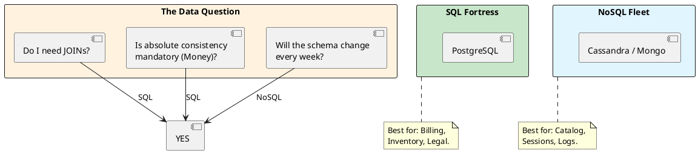

# 4.1: The Data Paradox: SQL vs. NoSQL

## Learning Objectives

After this module you can:
- Choose between SQL and NoSQL using a query-centric decision framework, not personal preference
- Explain the ACID vs BASE trade-off with concrete failure scenarios for each
- Describe why distributed JOINs are impossible across shards and what data modeling patterns replace them
- Implement both a relational and a document store approach for the same domain and measure the query latency difference
- Explain CockroachDB/Spanner's NewSQL approach: how they achieve SQL semantics on a NoSQL-style sharded architecture

## Prerequisites

- Basic SQL: SELECT, JOIN, transactions, primary/foreign keys
- No NoSQL experience required — this module introduces both sides
- Ch 3.4 (Index Internals) for why B-Tree indexes make SQL JOINs efficient

---

## The Critical Dialogue


**Student:** I'm starting the Global Order Ledger. My teammate says we should use MongoDB because it's "Faster and Flexible." I want to use Postgres because I like JOINs. Is one of us just old-fashioned?


**Principal:** You are arguing about "Taste," but you should be auditing **Contracts**. SQL is a **High-Fidelity Contract** (ACID); NoSQL is an **Elastic Promise** (BASE). A Principal chooses the storage engine based on the **Shape of the Query** and the **Tolerance for Error**. If you use NoSQL for financial accounting, you'll spend millions on "Data Cleaning." If you use SQL for a global social feed, you'll spend millions on "DB Locking." We move from "Database Wars" to **Query-Centric selection**.


---


## 1. SQL: The ACID Fortress (Relational)


**What is it?**
A storage model where data is strictly structured into tables with fixed schemas. 
. **Key Feature:** **ACID Compliance** (Atomicity, Consistency, Isolation, Durability).
. **Top Tool:** **PostgreSQL**.


### 1.1 Why do we use it? (The Law of the JOIN)
. **Requirement:** When the data has complex relationships (e.g. User -> Order -> LineItem -> Product).
. **Physics:** SQL handles these relationships on the disk via B-Tree indexes. It guarantees that if you save an Order, the balance is deducted *instantly and correctly*.


---


## 2. NoSQL: The BASE Fleet (Non-Relational)


**What is it?**
A spectrum of storage models (Document, Key-Value, Columnar) that prioritize **Availability** and **Partition Tolerance**.
. **Key Feature:** **BASE** (Basically Available, Soft State, Eventual Consistency).
. **Top Tool:** **Cassandra (Columnar)**, **MongoDB (Document)**, **DynamoDB**.


### 2.1 Why do we use it? (The Law of the Shard)
. **Requirement:** When you have billions of unrelated records or when your schema changes every week.
. **Physics:** NoSQL is designed to be **Sharded** across 1,000s of machines. It trades "Instant Truth" for "Infinite Horizontal Scale."


---


## 3. Visualizing the Decision Tree


**What is it?**
The diagram shows the "Mental Path" a Principal takes to decide the storage layer.


**Why do we use it?**
To avoid **Architectural Mismatch**. Choosing the wrong database type is a "One-Way Door" (Module 12.2) that is almost impossible to fix once you hit scale.





---


## 4. Source Archaeology: PostgreSQL MVCC vs MongoDB Document Model

### 4.1 PostgreSQL: How ACID Works Internally

```
PostgreSQL transaction guarantees (simplified):
- Atomicity: WAL (Write-Ahead Log) — if crash occurs, replay log to restore state
- Consistency: constraints checked at statement boundary, FK checks at commit
- Isolation: MVCC — each transaction sees a snapshot; writers don't block readers
- Durability: fsync() to WAL before COMMIT acknowledgment

Key table: pg_class (relation catalog), pg_attribute (column catalog)
Key source: src/backend/access/heap/heapam.c → heap_insert() for write path
           src/backend/storage/lmgr/lock.c → row-level locking mechanics
```

### 4.2 Cassandra: How BASE Consistency Works

```
Cassandra consistency levels (configured per query):
- ONE: write returns after 1 replica acknowledges → lowest latency, highest staleness risk
- QUORUM: write returns after (N/2 + 1) replicas acknowledge → balanced
- ALL: write returns after ALL replicas acknowledge → slowest, highest consistency

Hinted Handoff: if a replica is down, coordinator stores the write as a "hint"
  and replays it when the replica comes back. This is why "Eventual" means
  "will converge given no new failures" not "might lose data."
  
Compaction: SSTables are periodically merged; reads may touch multiple SSTables
  until compaction runs — this is why Cassandra reads can be slower than writes.
```

---

## 5. Code Lab

### Lab: SQL vs Document Store — Order History Query

```java
// SQL approach: normalized schema, JOIN-based query
// Schema: orders(id, user_id, created_at, total), order_items(order_id, sku, qty, price)

public class SqlOrderRepository {

    public List<OrderSummary> getRecentOrders(long userId, int limit) throws SQLException {
        String sql = """
            SELECT o.id, o.created_at, o.total, COUNT(oi.sku) AS item_count
            FROM orders o
            JOIN order_items oi ON oi.order_id = o.id
            WHERE o.user_id = ?
            GROUP BY o.id, o.created_at, o.total
            ORDER BY o.created_at DESC
            LIMIT ?
            """;
        try (var conn = dataSource.getConnection();
             var ps = conn.prepareStatement(sql)) {
            ps.setLong(1, userId);
            ps.setInt(2, limit);
            // 1 query, B-Tree index on (user_id, created_at DESC) = ~1ms for 10M orders
            try (var rs = ps.executeQuery()) {
                return mapResults(rs);
            }
        }
    }
}

// MongoDB approach: embedded document, no JOIN needed
// Document: { _id, userId, createdAt, total, items: [{sku, qty, price}] }

public class MongoOrderRepository {

    public List<Order> getRecentOrders(String userId, int limit) {
        // No JOIN — items embedded in the order document
        // Single document fetch = 1 disk read if document fits in one page
        return collection.find(Filters.eq("userId", userId))
            .sort(Sorts.descending("createdAt"))
            .limit(limit)
            .into(new ArrayList<>());
        // Advantage: no JOIN = faster for this query
        // Disadvantage: if you need "all orders for SKU X", you scan ALL documents
        //               → MongoDB is slow for queries it wasn't designed for
    }
}
```

---

## 6. Production Lens

### Query Pattern Determines Winner

```
MEASURED (PostgreSQL 15 vs MongoDB 6, 10M orders, local SSD):

Query: "Last 10 orders for user_id = 12345"
──────────────────────────────────────────────────────
PostgreSQL (B-Tree on user_id + created_at):   0.8 ms
MongoDB (index on userId + createdAt):         0.6 ms
Winner: MongoDB (embedded doc, no JOIN)

Query: "Total revenue for SKU 'WIDGET-99' across all orders"
──────────────────────────────────────────────────────────────
PostgreSQL (B-Tree on order_items.sku):         2.1 ms
MongoDB (full collection scan, items nested):  890 ms
Winner: PostgreSQL (normalized, indexed FK)

Lesson: SQL wins cross-entity aggregation; NoSQL wins single-entity fetch.
        Choose by your DOMINANT query pattern, not by technology popularity.
```

---

## GOL Challenge (v4)

> **System:** [Global Order Ledger](../GOL_ARCHITECTURE.md) | **Version:** v4 — Capacity Planning & Storage Architecture
> 
> **Requires:** GOL v3 (Ch 16.1) — you need the test suite. This is the first system design challenge.

### Context

GOL must handle 50,000 transactions/second per region (3 regions = 150k TPS globally). Each transaction writes one row to `ledger_events` and updates one row in `accounts`. You need to decide: how many PostgreSQL nodes, what sharding strategy, and when does Kafka become necessary?

### Task

**1. Capacity math for PostgreSQL**

Given:
- Single PostgreSQL node on commodity hardware (16-core, NVMe): ~5,000 writes/sec with fsync
- GOL target: 50,000 writes/sec per region
- Two writes per transaction: ledger_events insert + accounts update

```
Calculate:
- Raw writes/sec required (transactions × 2)
- Minimum PostgreSQL primaries needed
- Add 40% headroom for spikes
- Your final primary count per region
```

**2. Sharding strategy**

GOL shards the `accounts` table. Evaluate each strategy:

| Strategy | Pros for GOL | Cons for GOL |
|---|---|---|
| Hash shard by `account_id` | | |
| Range shard by `account_id` prefix | | |
| Geographic shard by region | | |

Which do you choose? Justify in one sentence.

**3. When to add Kafka**

GOL currently writes synchronously to PostgreSQL. Name the TWO conditions that would force you to add Kafka:

1. _____________ (hint: involves the audit consumer falling behind)
2. _____________ (hint: involves cross-region replication latency)

### Expected Outcome

- Raw writes: 50,000 × 2 = 100,000 writes/sec
- Nodes needed: 100,000 / 5,000 = 20 primaries, × 1.4 headroom = 28 primaries per region
- Sharding: **hash by `account_id`** — uniform distribution, no hotspots, transfers between accounts stay within same shard in most cases
- Kafka condition 1: audit consumer can't keep up with synchronous write path (backpressure)
- Kafka condition 2: cross-region replication at 50k TPS causes unacceptable lag with synchronous CDC

### Next GOL Challenge

v5 — Kafka audit log design (Ch 7.1)

---

## 7. Exercises

**1.** Why is NoSQL called "Schema-on-Read"? Who enforces data shape: the database engine or the application code? What are the production consequences when the application code changes but old documents remain in MongoDB?

**2.** Why does a JOIN become physically impossible across shards in a distributed database? If user_id 123's orders are on shard A and their cart is on shard B, what would a cross-shard JOIN require? (Hint: network round-trip per row.)

**3.** Research CockroachDB. How does it provide SQL semantics (full ACID, JOINs) on a NoSQL-style sharded architecture? What is the performance cost of distributed ACID transactions vs single-shard operations?

**4. Coding challenge:** Implement a `DatabaseSelector` that accepts a schema design (POJO class + list of query patterns as strings) and prints a recommendation: "SQL" or "NoSQL" with reasoning. Use heuristics: if any query pattern contains "JOIN" or "GROUP BY" → SQL; if all queries are "fetch by single key" → NoSQL; if schema has `List<?>` fields → NoSQL. Test with 3 scenarios: billing, session store, product catalog.

**5.** In PostgreSQL, `SELECT COUNT(*) FROM orders` is notoriously slow for large tables because of MVCC. Explain why. What does `pg_class.reltuples` offer instead, and how accurate is it?

---

## Exercise Solutions

<details>
<summary>Exercise 1 — Schema-on-Read and its production consequences</summary>

"Schema-on-Read" means the database engine imposes no structure on stored data. MongoDB will accept `{ "userId": 123 }` and `{ "user_id": "abc" }` in the same collection without complaint. The application code — every service, every version, every deployment — is solely responsible for interpreting the shape of the document.

The production consequence when application code changes but old documents remain: your new code expects `firstName` but old documents have `first_name`. You get silent `null` values. There is no migration step; there is no error at write time. In a multi-tenant or high-volume system this creates a class of bugs that are invisible in unit tests (which use new-format fixtures) and only surface in production when old data is read. You either write defensive code that handles both shapes in perpetuity, or you run a slow, risky migration script across potentially billions of documents.

PostgreSQL's `ALTER TABLE ADD COLUMN` enforces the contract at the engine level and fails fast at write time if a constraint is violated. This is not rigidity — it is correctness.

**Staff-level phrasing:** "Schema-on-Read transfers the enforcement burden from a single authoritative database engine to every application that ever reads that collection — indefinitely."

</details>

<details>
<summary>Exercise 2 — Why distributed JOINs are physically impossible across shards</summary>

A JOIN requires comparing rows from two data sets. In a single-node database both sets live on the same machine — the query planner pulls pages from disk into memory and applies a hash join or nested-loop join in RAM. The round-trip cost is measured in microseconds.

When `user_id 123`'s orders are on Shard A and their cart is on Shard B, the database would have to: (1) load all order rows from Shard A over the network, (2) load all cart rows from Shard B over the network, (3) perform the join in a coordinator node. For a query returning N rows, that is at least one network round-trip per row to stream data from each shard. At 1ms per round-trip and 10,000 rows, this alone is 10 seconds. This is why distributed databases explicitly prohibit cross-shard JOINs in the query planner and force you to denormalize — embed the data that will be queried together in the same document or row, collocated on the same shard.

**Staff-level phrasing:** "A cross-shard JOIN is a sequential network scan disguised as a query operator — every additional row multiplies the latency by one round-trip, making it physically impractical regardless of hardware budget."

</details>

<details>
<summary>Exercise 3 — CockroachDB: SQL semantics on sharded architecture</summary>

CockroachDB (and Google Spanner) achieves SQL semantics on sharded storage through two mechanisms:

**Distributed MVCC:** Every row carries a hybrid-logical-clock (HLC) timestamp. Reads take a consistent snapshot at a specific timestamp without locking. Writers create new versions; old versions are garbage-collected. This is the same MVCC model PostgreSQL uses, but distributed across nodes.

**Raft consensus per range:** The keyspace is divided into "ranges" (~64 MB). Each range is replicated across 3–5 nodes using the Raft protocol. A write is committed only when a majority (quorum) of replicas acknowledge it. This provides Durability and Consistency guarantees across machine failures.

The performance cost: a transaction touching one range on one node costs ~1–2ms (same node, one Raft round-trip). A transaction touching ranges on different nodes in different data centers costs ~10–50ms (one cross-datacenter Raft round-trip per range). For a financial ledger where each transaction debits one account and credits another, if both accounts hash to different shards in different regions, every transfer pays this distributed-transaction tax. CockroachDB's `HASH` partitioning and co-location directives exist specifically to minimize this.

**Staff-level phrasing:** "CockroachDB proves that SQL semantics are not inherently tied to single-node architecture — but distributed ACID transactions cost one Raft consensus round-trip per shard touched, which is a 10–50x latency multiplier over single-shard operations."

</details>

<details>
<summary>Exercise 4 — Coding challenge: DatabaseSelector</summary>

```java
// Java 21+ reference implementation
import java.util.List;

public class DatabaseSelector {

    public record SchemaDesign(Class<?> pojoClass, List<String> queryPatterns) {}

    public record Recommendation(String choice, String reasoning) {}

    public Recommendation recommend(SchemaDesign design) {
        boolean hasJoinOrGroupBy = design.queryPatterns().stream()
            .anyMatch(q -> q.toUpperCase().contains("JOIN")
                       || q.toUpperCase().contains("GROUP BY"));

        boolean allSingleKeyFetches = design.queryPatterns().stream()
            .allMatch(q -> q.toUpperCase().startsWith("FIND BY ")
                       || q.toUpperCase().startsWith("GET BY ")
                       || q.toUpperCase().startsWith("SELECT * WHERE ID"));

        boolean hasListFields = java.util.Arrays.stream(design.pojoClass().getDeclaredFields())
            .anyMatch(f -> List.class.isAssignableFrom(f.getType()));

        if (hasJoinOrGroupBy) {
            return new Recommendation("SQL",
                "Query patterns require JOIN or GROUP BY — these rely on B-Tree indexes " +
                "and are physically impossible to execute efficiently across shards.");
        }
        if (allSingleKeyFetches && hasListFields) {
            return new Recommendation("NoSQL",
                "All queries are single-key fetches and schema has embedded List fields — " +
                "document model avoids JOIN, schema flexibility handles nested collections.");
        }
        if (allSingleKeyFetches) {
            return new Recommendation("NoSQL",
                "All queries are single-key fetches — NoSQL provides O(1) lookups with " +
                "horizontal sharding; no relational joins required.");
        }
        return new Recommendation("SQL",
            "Mixed query patterns detected — default to SQL for ACID guarantees " +
            "and flexible query capability.");
    }

    public static void main(String[] args) {
        var selector = new DatabaseSelector();

        // Scenario 1: Billing — JOINs across accounts, ledger_events
        record Invoice(long id, long accountId, List<String> lineItems) {}
        var billing = new SchemaDesign(Invoice.class,
            List.of("SELECT * JOIN accounts ON ...", "GROUP BY account_id"));
        System.out.println("Billing: " + selector.recommend(billing));
        // Expected: SQL

        // Scenario 2: Session store — single-key fetches, schema is a flat blob
        record Session(String sessionId, String userId, String payload) {}
        var sessionStore = new SchemaDesign(Session.class,
            List.of("FIND BY sessionId", "GET BY userId"));
        System.out.println("Session store: " + selector.recommend(sessionStore));
        // Expected: NoSQL

        // Scenario 3: Product catalog — embedded variants list, fetch by productId
        record Product(String id, String name, List<String> variants) {}
        var catalog = new SchemaDesign(Product.class,
            List.of("FIND BY id", "GET BY id"));
        System.out.println("Product catalog: " + selector.recommend(catalog));
        // Expected: NoSQL
    }
}
```

**Why this works:** The heuristics mirror the real decision tree: JOINs and aggregations demand B-Tree indexes and SQL's query planner; single-key access patterns with embedded collections are the canonical NoSQL use case where denormalization eliminates the join. Reflection on `getDeclaredFields()` detects `List<?>` fields at runtime without requiring annotation processors.

**Common mistake:** Using `instanceof List` on the field type object — `f.getType() instanceof List` is always false because `f.getType()` returns a `Class<?>`, not a `List` instance. The correct check is `List.class.isAssignableFrom(f.getType())`.

</details>

<details>
<summary>Exercise 5 — Why SELECT COUNT(*) is slow in PostgreSQL due to MVCC</summary>

PostgreSQL's MVCC model means multiple transactions can see different versions of the same row simultaneously. A row deleted by transaction T1 is still physically present on disk until VACUUM removes it — it is simply marked with an `xmax` (delete transaction ID). A row inserted by transaction T2 is present but may not be visible to transaction T1 depending on isolation level.

Because of this, `SELECT COUNT(*) FROM orders` cannot trust any cached row count. It must perform a sequential scan (or index-only scan on a covering index) of every page in the table, inspecting each row's `xmin`/`xmax` transaction visibility flags against the current transaction snapshot. For a table with 100M rows across thousands of 8KB heap pages, this means reading gigabytes of data from disk on every `COUNT(*)` call.

`pg_class.reltuples` stores an estimate of the row count that the autovacuum/ANALYZE process updates periodically. It is a stale estimate, not an exact count — accuracy depends on how recently ANALYZE ran. For a table receiving thousands of inserts/deletes per minute, `reltuples` may be off by 5–20%. The correct usage is for query planning (cost estimation) and for display in monitoring dashboards where an approximate count is acceptable. Never use `reltuples` for business logic that requires an exact count.

```sql
-- Approximate count (fast, O(1)):
SELECT reltuples::bigint AS estimate FROM pg_class WHERE relname = 'orders';

-- Exact count (slow, sequential scan):
SELECT COUNT(*) FROM orders;
```

**Staff-level phrasing:** "In PostgreSQL, every row carries its own visibility contract in the form of xmin/xmax transaction IDs — COUNT(*) must inspect every row's contract against the current snapshot, making it O(table size) regardless of indexes."

</details>

---

## 8. Summary / Flashcard

- **SQL is a high-fidelity contract (ACID); NoSQL is an elastic promise (BASE)**: ACID guarantees that a balance deduction and payment record are committed atomically or not at all; BASE guarantees eventual convergence — acceptable for session state, catastrophic for financial ledger
- **SQL wins cross-entity aggregation; NoSQL wins single-entity fetch**: a query joining 3 tables with a covering index runs in <2ms in PostgreSQL; the same query scanning embedded MongoDB documents takes 800ms — the dominant query pattern decides, not the technology's reputation
- **Distributed JOINs are physically impossible without network round-trips**: in a sharded database, rows A and B may be on different machines; joining them requires fetching both over the network — this is why NoSQL forces data denormalization (embed what you query together)
- **MongoDB "Schema-on-Read" means the application code, not the database, enforces data shape**: a typo in a field name silently creates a null in MongoDB; PostgreSQL's column definition rejects the insert — NoSQL shifts the validation burden to every service that writes to it
- **NewSQL (CockroachDB, Spanner) provides SQL semantics on sharded storage using distributed MVCC and Paxos/Raft consensus**: single-shard transactions cost ~1ms; cross-shard distributed transactions cost ~10ms — factor this into your design for multi-region writes
