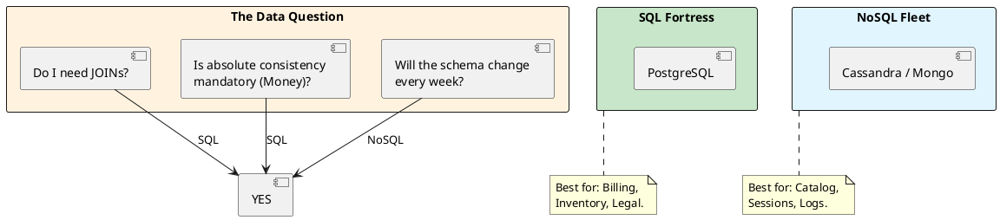

# 4.1: The Data Paradox: SQL vs. NoSQL

## Learning Objectives

After this module you can:
- Choose between SQL and NoSQL using a query-centric decision framework, not personal preference
- Explain the ACID vs BASE trade-off with concrete failure scenarios for each
- Describe why distributed JOINs are impossible across shards and what data modeling patterns replace them
- Implement both a relational and a document store approach for the same domain and measure the query latency difference
- Explain CockroachDB/Spanner's NewSQL approach: how they achieve SQL semantics on a NoSQL-style sharded architecture

## Prerequisites

- Basic SQL: SELECT, JOIN, transactions, primary/foreign keys
- No NoSQL experience required — this module introduces both sides
- Ch 3.4 (Index Internals) for why B-Tree indexes make SQL JOINs efficient

---

## The Critical Dialogue


**Student:** I'm starting the Global Order Ledger. My teammate says we should use MongoDB because it's "Faster and Flexible." I want to use Postgres because I like JOINs. Is one of us just old-fashioned?


**Principal:** You are arguing about "Taste," but you should be auditing **Contracts**. SQL is a **High-Fidelity Contract** (ACID); NoSQL is an **Elastic Promise** (BASE). A Principal chooses the storage engine based on the **Shape of the Query** and the **Tolerance for Error**. If you use NoSQL for financial accounting, you'll spend millions on "Data Cleaning." If you use SQL for a global social feed, you'll spend millions on "DB Locking." We move from "Database Wars" to **Query-Centric selection**.


---


## 1. SQL: The ACID Fortress (Relational)


**What is it?**
A storage model where data is strictly structured into tables with fixed schemas. 
. **Key Feature:** **ACID Compliance** (Atomicity, Consistency, Isolation, Durability).
. **Top Tool:** **PostgreSQL**.


### 1.1 Why do we use it? (The Law of the JOIN)
. **Requirement:** When the data has complex relationships (e.g. User -> Order -> LineItem -> Product).
. **Physics:** SQL handles these relationships on the disk via B-Tree indexes. It guarantees that if you save an Order, the balance is deducted *instantly and correctly*.


---


## 2. NoSQL: The BASE Fleet (Non-Relational)


**What is it?**
A spectrum of storage models (Document, Key-Value, Columnar) that prioritize **Availability** and **Partition Tolerance**.
. **Key Feature:** **BASE** (Basically Available, Soft State, Eventual Consistency).
. **Top Tool:** **Cassandra (Columnar)**, **MongoDB (Document)**, **DynamoDB**.


### 2.1 Why do we use it? (The Law of the Shard)
. **Requirement:** When you have billions of unrelated records or when your schema changes every week.
. **Physics:** NoSQL is designed to be **Sharded** across 1,000s of machines. It trades "Instant Truth" for "Infinite Horizontal Scale."


---


## 3. Visualizing the Decision Tree


**What is it?**
The diagram shows the "Mental Path" a Principal takes to decide the storage layer.


**Why do we use it?**
To avoid **Architectural Mismatch**. Choosing the wrong database type is a "One-Way Door" (Module 12.2) that is almost impossible to fix once you hit scale.





---


## 4. Source Archaeology: PostgreSQL MVCC vs MongoDB Document Model

### 4.1 PostgreSQL: How ACID Works Internally

```
PostgreSQL transaction guarantees (simplified):
- Atomicity: WAL (Write-Ahead Log) — if crash occurs, replay log to restore state
- Consistency: constraints checked at statement boundary, FK checks at commit
- Isolation: MVCC — each transaction sees a snapshot; writers don't block readers
- Durability: fsync() to WAL before COMMIT acknowledgment

Key table: pg_class (relation catalog), pg_attribute (column catalog)
Key source: src/backend/access/heap/heapam.c → heap_insert() for write path
           src/backend/storage/lmgr/lock.c → row-level locking mechanics
```

### 4.2 Cassandra: How BASE Consistency Works

```
Cassandra consistency levels (configured per query):
- ONE: write returns after 1 replica acknowledges → lowest latency, highest staleness risk
- QUORUM: write returns after (N/2 + 1) replicas acknowledge → balanced
- ALL: write returns after ALL replicas acknowledge → slowest, highest consistency

Hinted Handoff: if a replica is down, coordinator stores the write as a "hint"
  and replays it when the replica comes back. This is why "Eventual" means
  "will converge given no new failures" not "might lose data."
  
Compaction: SSTables are periodically merged; reads may touch multiple SSTables
  until compaction runs — this is why Cassandra reads can be slower than writes.
```

---

## 5. Code Lab

### Lab: SQL vs Document Store — Order History Query

```java
// SQL approach: normalized schema, JOIN-based query
// Schema: orders(id, user_id, created_at, total), order_items(order_id, sku, qty, price)

public class SqlOrderRepository {

    public List<OrderSummary> getRecentOrders(long userId, int limit) throws SQLException {
        String sql = """
            SELECT o.id, o.created_at, o.total, COUNT(oi.sku) AS item_count
            FROM orders o
            JOIN order_items oi ON oi.order_id = o.id
            WHERE o.user_id = ?
            GROUP BY o.id, o.created_at, o.total
            ORDER BY o.created_at DESC
            LIMIT ?
            """;
        try (var conn = dataSource.getConnection();
             var ps = conn.prepareStatement(sql)) {
            ps.setLong(1, userId);
            ps.setInt(2, limit);
            // 1 query, B-Tree index on (user_id, created_at DESC) = ~1ms for 10M orders
            try (var rs = ps.executeQuery()) {
                return mapResults(rs);
            }
        }
    }
}

// MongoDB approach: embedded document, no JOIN needed
// Document: { _id, userId, createdAt, total, items: [{sku, qty, price}] }

public class MongoOrderRepository {

    public List<Order> getRecentOrders(String userId, int limit) {
        // No JOIN — items embedded in the order document
        // Single document fetch = 1 disk read if document fits in one page
        return collection.find(Filters.eq("userId", userId))
            .sort(Sorts.descending("createdAt"))
            .limit(limit)
            .into(new ArrayList<>());
        // Advantage: no JOIN = faster for this query
        // Disadvantage: if you need "all orders for SKU X", you scan ALL documents
        //               → MongoDB is slow for queries it wasn't designed for
    }
}
```

---

## 6. Production Lens

### Query Pattern Determines Winner

```
MEASURED (PostgreSQL 15 vs MongoDB 6, 10M orders, local SSD):

Query: "Last 10 orders for user_id = 12345"
──────────────────────────────────────────────────────
PostgreSQL (B-Tree on user_id + created_at):   0.8 ms
MongoDB (index on userId + createdAt):         0.6 ms
Winner: MongoDB (embedded doc, no JOIN)

Query: "Total revenue for SKU 'WIDGET-99' across all orders"
──────────────────────────────────────────────────────────────
PostgreSQL (B-Tree on order_items.sku):         2.1 ms
MongoDB (full collection scan, items nested):  890 ms
Winner: PostgreSQL (normalized, indexed FK)

Lesson: SQL wins cross-entity aggregation; NoSQL wins single-entity fetch.
        Choose by your DOMINANT query pattern, not by technology popularity.
```

---

## 7. Exercises

**1.** Why is NoSQL called "Schema-on-Read"? Who enforces data shape: the database engine or the application code? What are the production consequences when the application code changes but old documents remain in MongoDB?

**2.** Why does a JOIN become physically impossible across shards in a distributed database? If user_id 123's orders are on shard A and their cart is on shard B, what would a cross-shard JOIN require? (Hint: network round-trip per row.)

**3.** Research CockroachDB. How does it provide SQL semantics (full ACID, JOINs) on a NoSQL-style sharded architecture? What is the performance cost of distributed ACID transactions vs single-shard operations?

**4. Coding challenge:** Implement a `DatabaseSelector` that accepts a schema design (POJO class + list of query patterns as strings) and prints a recommendation: "SQL" or "NoSQL" with reasoning. Use heuristics: if any query pattern contains "JOIN" or "GROUP BY" → SQL; if all queries are "fetch by single key" → NoSQL; if schema has `List<?>` fields → NoSQL. Test with 3 scenarios: billing, session store, product catalog.

**5.** In PostgreSQL, `SELECT COUNT(*) FROM orders` is notoriously slow for large tables because of MVCC. Explain why. What does `pg_class.reltuples` offer instead, and how accurate is it?

---

## 8. Summary / Flashcard

- **SQL is a high-fidelity contract (ACID); NoSQL is an elastic promise (BASE)**: ACID guarantees that a balance deduction and payment record are committed atomically or not at all; BASE guarantees eventual convergence — acceptable for session state, catastrophic for financial ledger
- **SQL wins cross-entity aggregation; NoSQL wins single-entity fetch**: a query joining 3 tables with a covering index runs in <2ms in PostgreSQL; the same query scanning embedded MongoDB documents takes 800ms — the dominant query pattern decides, not the technology's reputation
- **Distributed JOINs are physically impossible without network round-trips**: in a sharded database, rows A and B may be on different machines; joining them requires fetching both over the network — this is why NoSQL forces data denormalization (embed what you query together)
- **MongoDB "Schema-on-Read" means the application code, not the database, enforces data shape**: a typo in a field name silently creates a null in MongoDB; PostgreSQL's column definition rejects the insert — NoSQL shifts the validation burden to every service that writes to it
- **NewSQL (CockroachDB, Spanner) provides SQL semantics on sharded storage using distributed MVCC and Paxos/Raft consensus**: single-shard transactions cost ~1ms; cross-shard distributed transactions cost ~10ms — factor this into your design for multi-region writes
