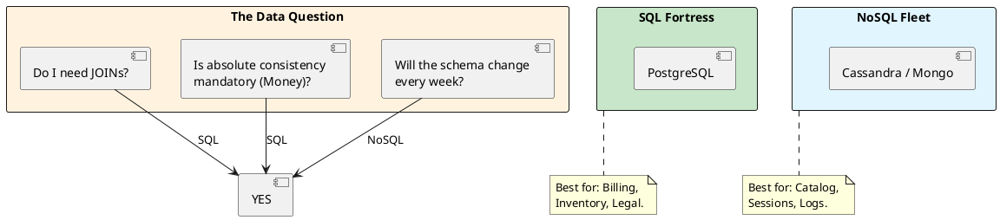

# 4.1: The Data Paradox: SQL vs. NoSQL

## The Critical Dialogue

**Student:** I'm starting the Global Order Ledger. My teammate says we should use MongoDB because it's "Faster and Flexible." I want to use Postgres because I like JOINs. Is one of us just old-fashioned?

**Principal:** You are arguing about "Taste," but you should be auditing **Contracts**. SQL is a **High-Fidelity Contract** (ACID); NoSQL is an **Elastic Promise** (BASE). A Principal chooses the storage engine based on the **Shape of the Query** and the **Tolerance for Error**. If you use NoSQL for financial accounting, you'll spend millions on "Data Cleaning." If you use SQL for a global social feed, you'll spend millions on "DB Locking." We move from "Database Wars" to **Query-Centric selection**.

---

## 1. SQL: The ACID Fortress (Relational)

**What is it?**
A storage model where data is strictly structured into tables with fixed schemas. 
. **Key Feature:** **ACID Compliance** (Atomicity, Consistency, Isolation, Durability).
. **Top Tool:** **PostgreSQL**.

### 1.1 Why do we use it? (The Law of the JOIN)
. **Requirement:** When the data has complex relationships (e.g. User -> Order -> LineItem -> Product).
. **Physics:** SQL handles these relationships on the disk via B-Tree indexes. It guarantees that if you save an Order, the balance is deducted *instantly and correctly*.

---

## 2. NoSQL: The BASE Fleet (Non-Relational)

**What is it?**
A spectrum of storage models (Document, Key-Value, Columnar) that prioritize **Availability** and **Partition Tolerance**.
. **Key Feature:** **BASE** (Basically Available, Soft State, Eventual Consistency).
. **Top Tool:** **Cassandra (Columnar)**, **MongoDB (Document)**, **DynamoDB**.

### 2.1 Why do we use it? (The Law of the Shard)
. **Requirement:** When you have billions of unrelated records or when your schema changes every week.
. **Physics:** NoSQL is designed to be **Sharded** across 1,000s of machines. It trades "Instant Truth" for "Infinite Horizontal Scale."

---

## 3. Visualizing the Decision Tree

**What is it?**
The diagram shows the "Mental Path" a Principal takes to decide the storage layer.

**Why do we use it?**
To avoid **Architectural Mismatch**. Choosing the wrong database type is a "One-Way Door" (Module 12.2) that is almost impossible to fix once you hit scale.

---

## 🧠 Principal's Inquiry

. **Schema-on-Read:** Why is NoSQL called "Schema-on-Read"? (Hint: Who enforces the rules, the Database or the Java Code?).

. **The N+1 Join:** Why does a "JOIN" become physically impossible in a distributed sharded database? (Hint: The **Network Round-trip** for every row).

. **NewSQL:** Research **CockroachDB**. How does it provide SQL semantics (JOINs/ACID) on a NoSQL-style sharded architecture?

**Principal Summary:** SQL vs. NoSQL is a **Contractual Decision**. We use SQL for "Truth" and NoSQL for "Volume," ensuring our Ledger's core is unshakeable while its metadata is infinitely scalable.
