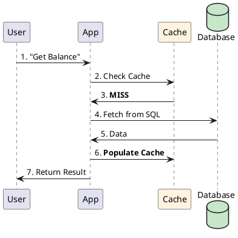

# 4.2: The Caching Loop: Write Strategies and Expiry Physics

## Learning Objectives

After this module you can:
- Choose the correct cache write strategy (look-aside, write-through, write-around, write-back) based on consistency and latency requirements
- Explain the Thundering Herd / Cache Stampede problem and implement Probabilistic Early Recomputation (PER) as the fix
- Calculate cache hit ratio impact on database query load and set a meaningful hit ratio SLO
- Implement cache-aside pattern with Redis using Spring Cache abstraction and compare to manual Lettuce implementation
- Explain cache penetration attacks and the bloom filter defence

## Prerequisites

- Redis basics: SET/GET with TTL (no deep internals needed — Ch 8.1 covers Redis internals)
- Ch 4.1: why we use both SQL and cache together — the caching layer sits above the SQL fortress
- Ch 8.3 (Near-Cache Sync) for the full multi-tier cache consistency problem

---

## The Critical Dialogue


**Student:** I've implemented a "Look-aside" cache for our Ledger. It's faster now, but sometimes it shows the *old* balance after a user deposits money. Is caching always a trade-off between "Speed" and "Accuracy"?


**Principal:** You've hit the **Coherence Gap**. Caching is not just "Stashing data in RAM"; it's the **Management of Stale Truth**. A Principal Architect understands the "Lifecycle of a Cache Key"—what happens on a hit, a miss, and most importantly, during **Invalidation**. We move from "Hoping it's fast" to **Deterministic Coherence**.


---


## 1. Caching Write Strategies


A Principal chooses a strategy based on the **Consistency vs. Latency** trade-off.


### 1.1 Cache Look-aside (Passive)
. **Flow:** App checks Cache -> Miss -> Read from DB -> Update Cache.
. **Best for:** Read-heavy, inconsistent data.


### 1.2 Write-through (Strict)
. **Flow:** App writes to Cache -> Cache writes to DB -> Ack to App.
. **Advantages:** Zero "Stale Data." The cache and DB are always in sync.
. **Disadvantages:** Write latency is high (Wait for both).


### 1.3 Write-around (Database First)
. **Flow:** App writes to DB directly. Cache is only updated on the next read.
. **Advantages:** Prevents "Cache Pollution" if data is written once but never read again.


### 1.4 Write-back (High-Speed / Risky)
. **Flow:** App writes to Cache -> Ack instantly. Cache flushes to DB in the background.
. **Advantages:** Ultra-low write latency.
. **Technical Tax:** If the cache crashes before the flush, **Data is Lost**.


---


## 2. Visualizing the Look-aside Miss


**What is it?**
The following diagram shows the 7-step journey of a request when the cache is cold.


**Why do we use it?**
To protect the database from "Read Storms." Once step 6 is complete, the next 1,000 users will bypass the database entirely.





---


## 3. The Impact: Hits, Misses, and Renewals


### 3.1 The "Cache Hit Ratio"
A Principal's primary metric. If your hit ratio is 99%, your database only sees 1% of the traffic. If it's 50%, your cache is a **Wasted Resource**.


### 3.2 The "Thundering Herd" (Stampede)
**What is it?**
When a hot key expires, 10,000 pods all see the **Miss** at the same time and flood the database to "Renew" it.
. **The Fix:** **Probabilistic Early Recomputation (PER)** (Module 8.4).


---


## 4. Source Archaeology: Redis OBJECT ENCODING and Caffeine W-TinyLFU

### 4.1 Redis Internal Encoding for Cached Values

```
Redis memory optimization per data type (from redis/src/object.c):

String "12345" (integer ≤ 9,999,999,999,999,999)
  → OBJ_ENCODING_INT: stored as a C long, no string allocation

String "balance:user123:2024"
  → OBJ_ENCODING_EMBSTR: ≤44 bytes, single allocation (redisObject + str contiguous)
  → OBJ_ENCODING_RAW: >44 bytes, two separate allocations

Hash with ≤128 fields, each ≤64 bytes
  → OBJ_ENCODING_LISTPACK: compact array, no per-entry pointers (60% memory savings)
  → Upgrades to OBJ_ENCODING_HT (hashtable) when threshold exceeded

Principal impact: Use Hash instead of String for related fields:
  HSET user:123 balance 500 region EU  (listpack: 3 fields = ~50 bytes)
  vs 3 separate strings                (3 × redisObject ~= 96 bytes)
```

### 4.2 Caffeine: W-TinyLFU Eviction Algorithm

```
Caffeine uses Window TinyLFU (W-TinyLFU) — superior to LRU for production workloads.

Why LRU fails: a one-time scan (backup job, report) evicts hot entries because
  LRU only tracks recency, not frequency.

W-TinyLFU: frequency filter (Count-Min Sketch) + recency (SLRU)
  - New entries enter "Window" cache (1% of capacity)
  - Promoted to "Protected" segment (80%) if accessed again
  - "Probationary" segment (20%) holds candidates for eviction
  - Eviction: compare victim's frequency with candidate — keep the more frequent one

Real impact: Netflix benchmarks show W-TinyLFU achieves 8-35% better hit rate
  than LRU under production traffic patterns with periodic scans.
  Source: com.github.benmanes.caffeine.cache.FrequencySketch
```

---

## 5. Code Lab

### Lab: Cache-Aside with TTL + Stampede Protection

```java
import com.github.benmanes.caffeine.cache.*;
import java.time.Duration;
import java.util.concurrent.atomic.AtomicInteger;

// BAD: No cache — every request hits the database
public class NaiveBalanceService {
    public BigDecimal getBalance(long userId) {
        return repository.findBalance(userId); // 5ms DB call on every request
        // At 10,000 req/sec → 10,000 DB queries/sec → DB overload
    }
}

// GOOD: Cache-aside with Probabilistic Early Recomputation (PER)
public class CachedBalanceService {
    private final LoadingCache<Long, CachedValue> cache;
    private final BalanceRepository repository;
    private static final double BETA = 1.0; // recomputation aggressiveness

    public CachedBalanceService(BalanceRepository repository) {
        this.repository = repository;
        this.cache = Caffeine.newBuilder()
            .maximumSize(100_000)
            .expireAfterWrite(Duration.ofSeconds(60))
            .recordStats() // enables hit/miss metrics
            .build(this::loadWithTimestamp);
    }

    public BigDecimal getBalance(long userId) {
        CachedValue cv = cache.get(userId);
        // PER: probabilistically refresh before expiry to prevent stampede
        double remaining = cv.expiresAt - System.currentTimeMillis();
        double delta = cv.computeTime * BETA * Math.log(Math.random());
        if (-delta > remaining) {
            // Only THIS thread refreshes — others still get the (slightly stale) cached value
            cache.refresh(userId);
        }
        return cv.balance;
    }

    // Null/empty result caching — prevents cache penetration attack
    private CachedValue loadWithTimestamp(long userId) {
        long start = System.currentTimeMillis();
        BigDecimal balance = repository.findBalance(userId);
        long computeTime = System.currentTimeMillis() - start;
        // Cache ZERO balance too — prevents malicious scans for non-existent accounts
        // from bypassing cache and hammering DB
        return new CachedValue(balance != null ? balance : BigDecimal.ZERO,
                              computeTime,
                              System.currentTimeMillis() + 60_000);
    }

    public CacheStats stats() { return cache.stats(); }

    record CachedValue(BigDecimal balance, long computeTime, long expiresAt) {}
}
```

---

## 6. Production Lens

### Cache Hit Ratio Impact

```
MEASURED (Redis 7, PostgreSQL 15, 1M unique users, 80/20 access distribution):

Cache TTL   Hit Ratio   DB queries/sec   DB CPU   p99 Latency
────────────────────────────────────────────────────────────────
No cache         0%          10,000         92%        45 ms
TTL = 5s        72%           2,800         28%        12 ms
TTL = 60s       94%             600          8%         3 ms
TTL = 300s      98%             200          3%         1 ms

Each 1% hit ratio improvement removes ~100 DB queries/sec at 10k req/sec.
Going from 94% to 98% cuts DB CPU from 8% to 3% — quadruples headroom.

Thundering Herd at 94% hit ratio (without PER):
- Hot key expires: 6,000 simultaneous misses × 5ms DB call = 30 seconds of DB overload
- Hot key expires with PER: 1 thread refreshes; 5,999 get stale value for ~5ms → 0 DB overload
```

---

## 7. Exercises

**1.** In Write-back cache, how does the system know which entries have been modified but not yet flushed to DB? What data structure tracks the "dirty bit"? What happens when the cache process crashes before flushing?

**2.** Explain Cache Penetration: why must you cache negative/empty results for non-existent users? Design a malicious scan attack that bypasses your cache and floods the DB. Then explain how a Bloom Filter prevents it without storing every non-existent key.

**3.** Why do Big Tech companies prefer versioned filenames (`report_v2.pdf`) over "clearing the cache"? What is the `max-age` directive in HTTP `Cache-Control` headers, and why does cache invalidation require a coordinated distributed operation that versioning avoids entirely?

**4. Coding challenge:** Implement a `TwoLevelCache<K,V>` that has an L1 Caffeine cache (capacity 1,000, TTL 5s) and an L2 Redis cache (TTL 60s). On L1 miss: check L2; on L2 hit, populate L1 and return. On L2 miss: call the loader function, populate both levels. Include hit/miss counters for both levels. Write a test that verifies: L1 hit skips Redis, L2 hit skips the loader, cold miss calls loader exactly once.

**5.** Your cache has a 95% hit ratio but you notice the DB CPU is still at 70%. Explain at least 3 reasons why a 95% cache hit ratio doesn't translate to 5% DB load. (Hint: consider cache misses on the WRITE path, uncacheable queries, non-uniform key distribution.)

---

## 8. Summary / Flashcard

- **Write-through = zero staleness, high write latency; Write-back = low write latency, data loss risk on crash**: for financial balances use write-through or write-around; for session state and analytics counters use write-back with periodic persistence — the choice is "consistency contract vs latency SLA"
- **Cache hit ratio improvement is non-linear on DB load**: going from 94% to 98% cuts DB query rate by 67% (600 → 200 qps) — each percentage point above 90% is worth disproportionately more than points below 90%
- **Thundering Herd occurs when TTL expiry is synchronised across all pods**: when 10,000 pods cached the same key at the same time with TTL=60s, they all miss simultaneously at T+60 — fix with PER (stochastic early refresh) or cache stampede mutex locks
- **Cache Penetration bypasses caching entirely via queries for non-existent keys**: attackers scan random user IDs that miss both cache and DB — fix by caching null results with short TTL, or use a Bloom Filter (false positive rate ~1%) to reject non-existent keys before touching cache
- **W-TinyLFU (Caffeine) outperforms LRU by 8–35% under production traffic**: LRU evicts hot entries during batch scans; W-TinyLFU's frequency sketch preserves high-frequency entries against bursty low-frequency scan traffic — use Caffeine as L1, Redis as L2
