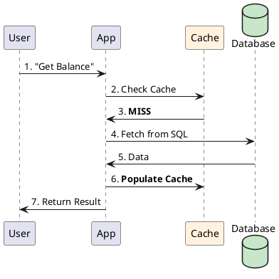

# 4.2: The Caching Loop: Write Strategies and Expiry Physics

## The Critical Dialogue

**Student:** I've implemented a "Look-aside" cache for our Ledger. It's faster now, but sometimes it shows the *old* balance after a user deposits money. Is caching always a trade-off between "Speed" and "Accuracy"?

**Principal:** You've hit the **Coherence Gap**. Caching is not just "Stashing data in RAM"; it's the **Management of Stale Truth**. A Principal Architect understands the "Lifecycle of a Cache Key"—what happens on a hit, a miss, and most importantly, during **Invalidation**. We move from "Hoping it's fast" to **Deterministic Coherence**.

---

## 1. Caching Write Strategies

A Principal chooses a strategy based on the **Consistency vs. Latency** trade-off.

### 1.1 Cache Look-aside (Passive)
. **Flow:** App checks Cache -> Miss -> Read from DB -> Update Cache.
. **Best for:** Read-heavy, inconsistent data.

### 1.2 Write-through (Strict)
. **Flow:** App writes to Cache -> Cache writes to DB -> Ack to App.
. **Advantages:** Zero "Stale Data." The cache and DB are always in sync.
. **Disadvantages:** Write latency is high (Wait for both).

### 1.3 Write-around (Database First)
. **Flow:** App writes to DB directly. Cache is only updated on the next read.
. **Advantages:** Prevents "Cache Pollution" if data is written once but never read again.

### 1.4 Write-back (High-Speed / Risky)
. **Flow:** App writes to Cache -> Ack instantly. Cache flushes to DB in the background.
. **Advantages:** Ultra-low write latency.
. **Technical Tax:** If the cache crashes before the flush, **Data is Lost**.

---

## 2. Visualizing the Look-aside Miss

**What is it?**
The following diagram shows the 7-step journey of a request when the cache is cold.

**Why do we use it?**
To protect the database from "Read Storms." Once step 6 is complete, the next 1,000 users will bypass the database entirely.

---

## 3. The Impact: Hits, Misses, and Renewals

### 3.1 The "Cache Hit Ratio"
A Principal's primary metric. If your hit ratio is 99%, your database only sees 1% of the traffic. If it's 50%, your cache is a **Wasted Resource**.

### 3.2 The "Thundering Herd" (Stampede)
**What is it?**
When a hot key expires, 10,000 pods all see the **Miss** at the same time and flood the database to "Renew" it.
. **The Fix:** **Probabilistic Early Recomputation (PER)** (Module 8.4).

---

## 🧠 Principal's Inquiry

. **The Dirty Bit:** In a Write-back cache, how does the system know which entries have been flushed to the DB?

. **Cache Penetration:** Why is it critical to cache "Empty Results" (Nulls) for non-existent users? (Hint: The **Malicious Scan** attack).

. **Invalidation vs Versioning:** Why do Big Tech companies prefer changing a filename (`report_v2.pdf`) over "Clearing the cache"?

**Principal Summary:** Caching is **Time-shifting**. We use RAM to bring the future result into the present, ensuring our Global Ledger can handle 10M users without every user needing a dedicated database connection.
