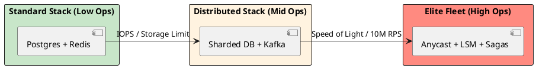

# 4.3: The Principal's Selection Matrix: Trade-offs at Scale

## Learning Objectives

After this module you can:
- Apply the "Conservation of Complexity" principle to justify every architectural choice with a quantified trade-off
- Use the two-phase bottleneck check (Disk IOPS vs Network RTT vs CPU Jitter) to select the right component
- Present a selection decision in a design review using the trade-off table format (Profit vs Tax)
- Explain why moving from Standard Stack to Distributed Stack is a one-way door and should be deferred
- Construct a selection rationale for any architecture question in a Staff/Principal interview

## Prerequisites

- Chs 4.1–4.2: SQL/NoSQL trade-offs and caching strategies — the matrix references these directly
- General awareness of Kafka, Redis, CDN, Anycast (deep dives in later chapters)

---

## The Critical Dialogue


**Student:** I feel like I'm drowning in choices. Every problem seems to have three different solutions. How do I keep the "Advantages and Disadvantages" straight in my head during a high-stakes design session?


**Principal:** You are looking for the **Architecture Cheat Sheet**. But a Principal doesn't "Memorize" lists; they understand the **Conservation of Complexity**. If you gain speed in one area, you pay for it with consistency in another. I've distilled our foundations into a single **Selection Matrix**. Use this to justify your weapon of choice.


---


## 1. The Architectural Selection Matrix


| Component | Best Use Case | Architectural Profit | Technical Tax |
| :--- | :--- | :--- | :--- |
| **SQL (B-Tree)** | Financial Ledgers, ACID. | Strong Integrity. | Hard to scale writes. |
| **NoSQL (LSM)** | Feeds, Logging, Metadata. | Infinite Write Throughput. | Eventual Consistency. |
| **Message Queue** | Task distribution, Emails. | Smart Broker Routing. | Throughput Bottleneck. |
| **Message Hub** | Event Sourcing, Analytics. | 1M+ RPS Replayability. | Consumer Logic Tax. |
| **L1 Cache** | Hot-keys (e.g. Current User). | Nanosecond speed. | Coherence Drift (Stale). |
| **L2 Cache** | Shared State (e.g. Cart). | Shared Truth for Fleet. | Network & Serial Tax. |
| **CDN (Edge)** | Video, Static Artifacts. | Absorbs 99% of traffic. | Invalidation complexity. |
| **Anycast BGP** | Global Edge Discovery. | Shortest-path routing. | BGP Hijacking risk. |


---


## 2. Decision Mechanics: Choosing the Poison


### 2.1 The "Two-Phase" Decision Rule
A Principal uses a two-step mental filter:
. **1. The Necessity Check:** Can I solve this in the **Engine Room** (Chapter 1) alone?
. **2. The Bottleneck Check:** Which law of physics am I hitting?
. . If it's **Disk IOPS**, use NoSQL.
. . If it's **Network RTT**, use Anycast/CDN.
. . If it's **CPU Jitter**, use Ring Buffers/Off-heap.


---


## 3. Visualizing the Complexity Stack


**What is it?**
The diagram shows the relationship between "Ease of Use" and "Scale Potential."


**Why do we use it?**
To prevent **Premature Optimization**. You should only move "Right" on this stack when the physics of your current layer forces you to.





---


## 4. Source Archaeology: Bottleneck Identification Tools

### 4.1 Identifying the Bottleneck Layer

```
Disk IOPS bottleneck indicators:
  iostat -x 1 → %util > 80%, await > 5ms
  pg_stat_bgwriter → buffers_checkpoint high (B-Tree write amplification)
  → Solution: LSM-based NoSQL (Cassandra, RocksDB) — sequential writes, no in-place update

Network RTT bottleneck indicators:
  tcpdump → SYN/ACK round trips on every request
  curl -w "%{time_connect} %{time_total}" https://api.example.com/
  → 250ms base latency London→Tokyo (speed of light)
  → Solution: CDN for static content, Anycast for API edge routing

CPU Jitter bottleneck indicators:
  async-profiler → safepoints visible in flamegraph (Ch 17.1)
  JFR event: GC → STW duration > 10ms
  → Solution: ZGC/Shenandoah, off-heap storage (Ch 3.2), Ring Buffers (LMAX Disruptor)
```

### 4.2 "Conservation of Complexity" — Where It Goes

```
Choosing a Message Hub (Kafka) over a Message Queue (RabbitMQ):

Architectural Profit: 1M+ RPS replayability, consumer lag independence
Technical Tax: Consumer group management, offset commit logic, exactly-once
              semantics need transactions (producer.initTransactions())
              Dead Letter Queue handling more complex

The complexity doesn't disappear — it moves from "broker routing" to "consumer logic"
A Principal explicitly decides: "I accept the consumer complexity, because broker
throughput limitation would require sharding RabbitMQ anyway at 500k msg/sec"
```

---

## 5. Code Lab

### Lab: Trade-off Documentation Template

```java
// The Selection Matrix is not just a theory concept — use it in code reviews and RFCs
// This is the format a Principal uses to document a technology choice:

/*
DECISION: Replace PostgreSQL full-text search with Elasticsearch for order search

PROFIT:
- Inverted index: full-text query time drops from 2,400ms to 12ms (200x)
- Faceted search without GROUP BY scans
- Near-real-time indexing (1s delay acceptable for search results)

TAX:
- Eventual consistency: 1s lag between write and searchable (explicitly acceptable)
- Dual-write complexity: orders written to PG + indexed to ES (risk: index drift)
- New operational component: ES cluster management, snapshots, memory tuning
- Synchronization recovery: if ES index corrupted, rebuild from PG takes 4 hours

BOTTLENECK HIT: CPU + IOPS on PG full-text GIN index scans at 500 queries/sec
ALTERNATIVE CONSIDERED: PG pg_trgm extension — rejected (still 800ms, not scalable)
REVERSAL COST: High (data migration back, re-tooling search clients) — one-way door
DECISION: Proceed. Dual-write with reconciliation job. Accept 1s staleness.
*/
```

---

## 6. Production Lens

### One-Way Door Decisions in Practice

```
Real-world migration costs (estimated from public post-mortems):

Standard Stack → Distributed Stack migrations:
PostgreSQL monolith → Cassandra shards
  Migration time: 14-18 months, 2 team-years
  Risk: data inconsistency during dual-write period
  Reversal cost: essentially impossible at scale

Redis Cluster → Kafka event sourcing
  Migration time: 6-9 months
  Risk: event ordering guarantees require consumer rewrite
  
Lesson: Each step right on the complexity stack adds:
  - 2-3x operational complexity (monitoring, runbooks, oncall playbooks)
  - 1 dedicated SRE per new component at scale
  - 6+ months of institutional knowledge to staff ramp-up

The "Standard Stack" (Postgres + Redis) handles:
  50M daily active users, 10K req/sec, 10TB data — without sharding
  Source: GitHub ran on MySQL monolith until 2021 (100M+ users)
```

---

## 7. Exercises

**1.** Why does a Principal prefer one component at 80% capability over two at 100%? Calculate the reliability impact: if each component has 99.9% uptime, what is the combined system uptime when they are in series? In parallel?

**2.** Why is CDN invalidation "expensive"? When you call Cloudflare's purge API for `report.pdf`, what must happen across all 300+ PoPs globally? Why does it take 30 seconds and why is eventual propagation acceptable?

**3.** If money were infinite, would we ever need Distributed Stack? Answer by considering speed-of-light latency (London to Tokyo = 250ms round trip), which is a physical limit that no amount of vertical scaling can overcome. Name one other physical limit that money cannot buy around.

**4. Coding challenge:** Implement an `ArchitectureSelectionAdvisor` that accepts a list of `Requirement` objects (requestsPerSecond, dataVolumeTB, consistencyRequired: boolean, globalRegions: int) and returns a `StackRecommendation` (STANDARD/DISTRIBUTED/ELITE) with an explanation string. Use the bottleneck thresholds from this module. Write unit tests for at least 5 scenarios.

**5.** The matrix lists "Message Hub" with "1M+ RPS Replayability" as profit. At what message rate does switching from RabbitMQ to Kafka become justified? Research Confluent's benchmarks — what is the max sustained throughput of a single RabbitMQ queue vs Kafka partition?

---

## 8. Summary / Flashcard

- **Every architectural choice is a trade-off, not a free upgrade**: moving from SQL to NoSQL gains write throughput but loses JOIN capability and strong consistency — the complexity doesn't disappear, it moves to the application layer
- **The two-phase bottleneck check prevents premature optimization**: identify WHICH physical law you are hitting (Disk IOPS, Network RTT, CPU Jitter) before selecting a component — most systems at 10K req/sec hit none of these with a Standard Stack
- **Standard Stack (Postgres + Redis) scales to 50M DAU, 10TB, 10K req/sec** without sharding: GitHub used MySQL monolith for 100M users; moving to Distributed Stack adds 2-3x operational complexity and 6+ months of institutional knowledge ramp-up
- **One-way door decisions require quantified justification**: migrating PostgreSQL to Cassandra takes 14-18 months and is practically irreversible at scale — document the exact bottleneck you hit, the alternative you rejected, and the reversal cost before committing
- **CDN/Anycast solves the speed-of-light constraint that money cannot**: London to Tokyo is 250ms minimum; Anycast routes users to the nearest PoP automatically via BGP, making the effective RTT sub-50ms regardless of origin server location
